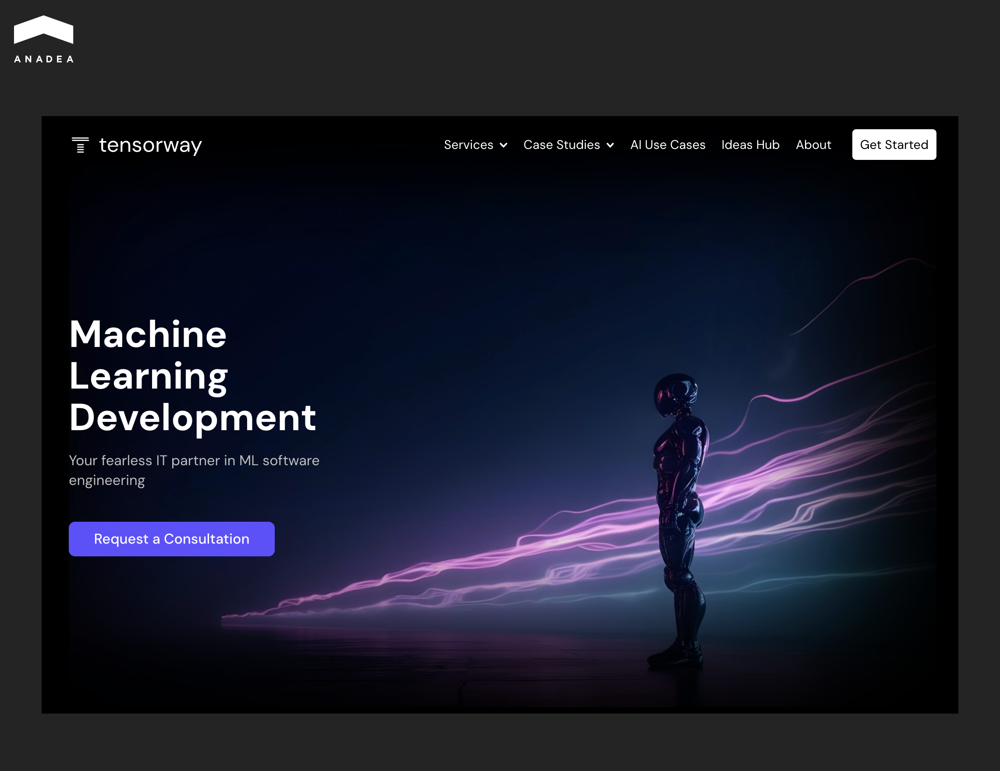
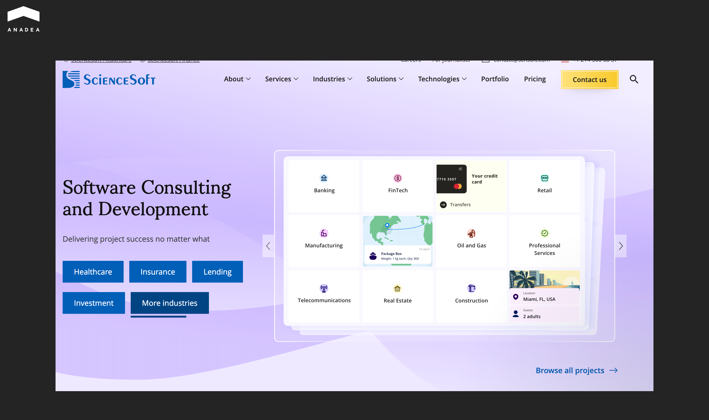
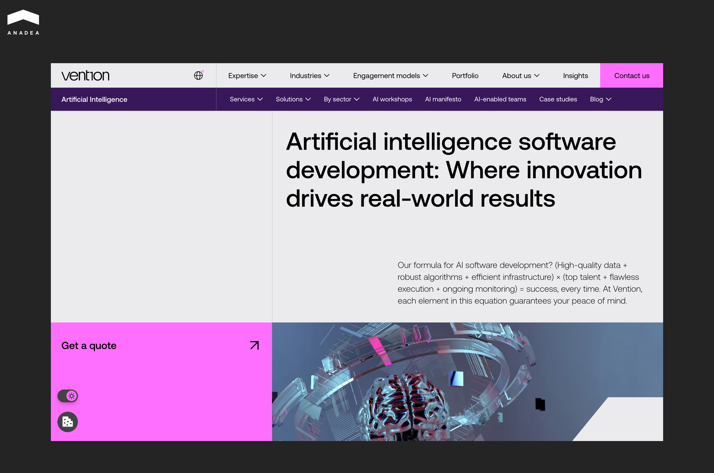
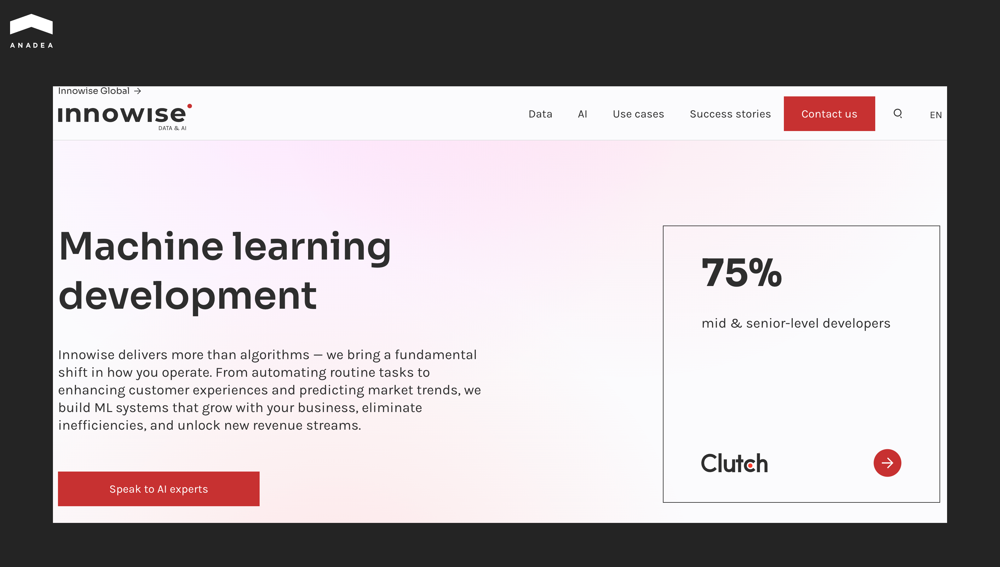
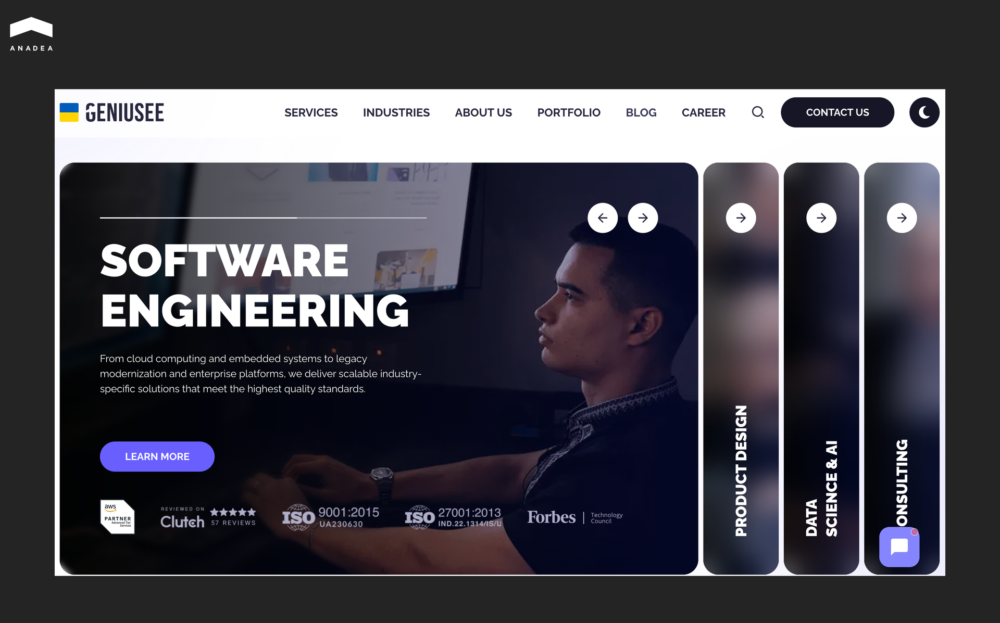
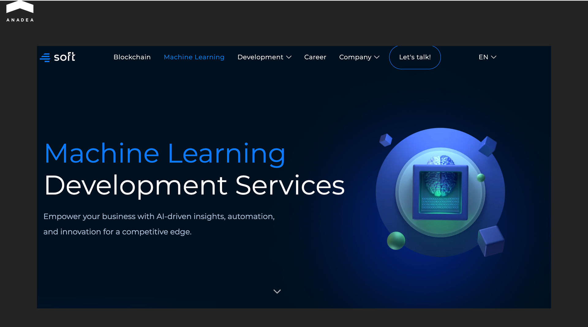
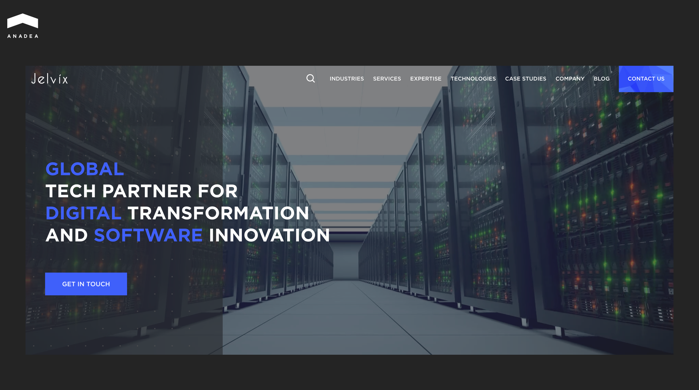

According to McKinsey, [88% of companies have already adopted AI](https://www.mckinsey.com/capabilities/quantumblack/our-insights/the-state-of-ai) in at least one business function in 2025. Yet only a third managed to move beyond pilot projects. The gap between experimentation and actual production is massive. And more often than not, it comes down to who builds the solution, not the technology itself.

We've selected agencies that consistently rank at the top of Clutch and GoodFirms, have public case studies with measurable outcomes, and bring full-cycle ML development experience to the table. The list includes both niche specialized teams and enterprise-level players. Whether you need a focused [machine learning software development](https://anadea.info/services/machine-learning-software-development) partner or a large-scale engineering team, you'll find options here.

## How We Built This Ranking

As of December 2025, [Clutch lists 8,858 companies](https://clutch.co/developers/artificial-intelligence/machine-learning) in the machine learning category. Add GoodFirms, TopDevelopers, and Gartner industry ratings, and you get tens of thousands of agencies, each claiming to be a market leader. Choosing a reliable machine learning agency without clear criteria is nearly impossible. To build our list, we evaluated each company against several parameters.

1. **Public case studies with measurable results.** We looked for specifics, not generic project descriptions. How much did they cut costs? What model accuracy did they achieve? How long did it take to reach production? We paid special attention to case studies featuring the client's public name. That signals the client was satisfied enough to associate their brand with the outcome. NDA-protected cases are legitimate (unique features, market specifics, industry sensitivity), but when a portfolio consists mostly of anonymous projects, it raises questions.
2. **Technical depth.** We assessed experience with MLOps, AutoML, computer vision, and NLP, as well as proficiency in key frameworks (PyTorch, TensorFlow, scikit-learn) and cloud platforms (AWS, GCP, Azure). We focused on companies that don't just build models but know how to scale and maintain them in production.
3. **Experience in regulated industries.** Healthcare, finance, and insurance come with specific requirements such as HIPAA, PCI DSS, and GDPR. We checked whether portfolios included projects from these sectors and whether companies demonstrated a clear understanding of compliance. A technically flawless solution that doesn't meet regulations has no real value.
4. **Full-cycle development capability.** From data audits and hypothesis formation to deployment, monitoring, and ongoing support. Many teams handle PoC well but struggle when it comes to pushing a model into a live environment. We selected those with proven full-cycle project experience.
5. **Client reputation.** We analyzed ratings on Clutch and GoodFirms, read through reviews, and noted repeat contracts. Companies that clients return to usually do their job well.

The final list includes agencies that meet most of these criteria. We intentionally included companies of different sizes, from boutique teams of 30 specialists to global players with thousands of engineers. The right machine learning development agency isn't always the biggest or most expensive. It's the one whose expertise matches your specific project.

## Anadea

* Founded: 2000 
* Headquarters: Alicante, Spain 
* Team: 150+ specialists
* Rate: $25-49/hr

The company has been around since 2000, but the AI direction started developing systematically in 2019. Today it's one of the key specializations alongside private equity, fintech, healthcare, and real estate. Beyond client projects, the team builds its own products. For example, Voco is a mobile app for voice translation and AI-powered notes built on OpenAI, [available on Google Play](https://play.google.com/store/apps/details?id=com.tensorway.voco&pli=1).

The machine learning agency focuses on long-term partnerships rather than one-off projects. The collaboration with [StreetEasy](https://anadea.info/projects/streeteasy), New York's leading real estate platform (now part of Zillow Group), has been going on for over 10 years. On Clutch, clients most often mention two things: the team understands business logic well rather than just coding to a spec, and knows how to handle projects with plenty of unknowns at the start.

[One of the company's recent ML projects](https://anadea.info/projects/agentic-ai-platform-private-equity) is a platform for a major European investment fund with over 10 billion euros in assets under management. Their analyst team was drowning in routine work: market monitoring consumed up to 60 hours per week, and preparing a single deal assessment could take a month. Anadea built a system of five AI agents, each handling a specific task, from automatic deal sourcing in Factiva and FactSet to company scoring across 36 parameters. The platform now processes 5,000 potential deals in a matter of hours, and the number of quality leads reaching the investment committee has tripled.

If you're exploring [how machine learning can unlock new business opportunities](https://anadea.info/blog/how-machine-learning-can-unlock-new-business-opportunities/), Anadea's approach to combining AI agents with domain expertise is worth a closer look.

## Tensorway

* Founded: 2019 
* Headquarters: Alicante, Spain 
* Team: 150+ specialists 
* Rate: $50-99/hr

Tensorway launched in 2019 and immediately bet on AI and machine learning as its core specialization. The company also provides full-cycle development, but the heart of its expertise remains the same: deep learning, NLP, computer vision, agentic AI. Over six years the team has delivered dozens of projects in fintech, edtech, legaltech, and e-commerce. Right now Tensorway is actively building out its AI agents practice, focused on automating complex business processes. 

The company's website features a [case study on building an AI agent for a law firm ](https://www.tensorway.com/projects/legal-ai-automation)in the United States. The client helps people with disabilities obtain the government benefits they're entitled to. The mission is social, but the processes were textbook bureaucracy: each case involves hundreds of pages of medical documents, requirements vary from state to state, and lawyers spent hours manually checking compliance. 

The machine learning development agency built an AI agent that scans PDF documents, extracts key data (diagnoses, examination dates, test results), cross-checks them against the specific state's requirements, and generates a ready-made report. What's completed, what's missing, what the next steps are. Case processing dropped to 5 minutes with 90% accuracy. Lawyers finally got to do what they were hired for instead of shuffling papers.

## ScienceSoft

* Founded: 1989 
* Headquarters: McKinney, Texas, USA 
* Team: 750+ specialists 
* Rate:$50-99/hr

ScienceSoft has been in the market for 35 years and has delivered around 4,000 projects for clients in over 70 countries. Their customer list includes IBM, eBay, Viber, Ford, and PerkinElmer. The company provides full-cycle IT services, from consulting through development, implementation, and ongoing support.

On the AI/ML side, ScienceSoft builds solutions across industries, from HIPAA-compliant voice agents in healthcare to trading automation and computer vision systems. Healthcare and financial services are where the company is strongest. In healthcare, the team works with providers, payers, MedTech companies, and develops CE-certified software. In finance, they serve banks, insurers, payment providers, and investment firms.

The company holds ISO 9001, ISO/IEC 27001, and ISO 13485 certifications. ScienceSoft appears in the IAOP Global Outsourcing 100, Financial Times' Americas' Fastest Growing Companies, and Inc. 5000. They also won a FinTech Futures Banking Tech Award in 2024.

## Netguru

* Founded: 2008 
* Headquarters: Poznań, Poland 
* Team: 400+ specialists 
* Rate: $50-99/hr

Netguru focuses on digital commerce, building marketplaces, B2B platforms, and omnichannel retail solutions. Over 17 years the company has delivered more than 2,500 projects for clients across the US, UK, DACH, and MENA regions. The client roster includes IKEA, Volkswagen, OLX, Żabka, Careem, and Vinted.

On the AI and machine learning front, Netguru is developing its GenAI practice, building AI agents, deploying ML models, and handling data engineering. The company offers end-to-end development, from ideation and prototyping through design and engineering to ongoing support and scaling.

Netguru holds B Corp certification, meeting rigorous social and environmental standards. The company is also a Microsoft, AWS, and Google Cloud partner.

## Vention

* Founded: 2002 
* Headquarters: New York, USA 
* Team: 3,000+ specialists 
* Rate: $50-99/hr

Vention has been in the market for over 20 years, building software for startups and large enterprises alike. Their client list includes PayPal, IBM, Mount Sinai, PwC, and Postman. The company operates offices across the US, UK, Germany, Austria, Poland, and Lithuania, which lets them assemble teams that align with any time zone.

Vention covers the full development cycle, from initial concept through final delivery and optimization. Core services include custom software development, AI solutions, web and mobile development, QA, Cloud and DevOps, blockchain, and AR/VR. On the AI front, the team handles projects of varying complexity, from integrating ML models to building full-scale AI-powered platforms.

The average client relationship runs longer than 36 months, with the longest engagement now at 16 years. Clients highlight the quality of engineers, flexibility in scaling teams, and the ability to adapt quickly when project requirements shift. Vention developers embed into client teams and operate as part of the in-house staff.

## Innowise

* Founded: 2007 
* Headquarters: Warsaw, Poland 
* Team: 3,000+ specialists 
* Rate: $50-99/hr

Innowise is an international machine learning software development agency and IT staff augmentation company.Over 18 years they have delivered more than 1,600 projects across finance, banking, insurance, healthcare, e-commerce, manufacturing, logistics, and education. The company has offices in eight countries: Poland, Germany, Belgium, Spain, France, Italy, and Lithuania.

Innowise positions itself as a one-stop tech shop, covering everything from staff augmentation and dedicated teams to full-cycle development, cloud migration, and IT consulting. Their technology practice spans AI/ML, Big Data & BI, RPA, blockchain, IoT, and AR/VR. The company holds official partnerships with AWS, Microsoft, Databricks, SAP, Odoo, and UiPath.

The company claims it can fill positions in 3 to 5 days. Their talent pool includes backend and frontend developers, mobile developers, ML engineers, DevOps, QA, business analysts, designers, and project managers. Innowise is certified under ISO 9001, ISO 13485, ISO 27001, ISO 27017, and ISO 27018, and meets SOC2, HIPAA, PCI-DSS, and GDPR requirements. For four consecutive years, the company has been listed in the IAOP Global Outsourcing 100.

## Geniusee

* Founded: 2017 
* Headquarters: Warsaw, Poland (engineering hubs in Kyiv and Lviv) 
* Team: 200+ specialists 
* Rate: $25-49/hr

Geniusee is a Ukrainian-American company focused on FinTech, EdTech, and MarTech. In AI/ML, the team specializes in NLP and data engineering. Among their public case studies is their work with Factmata: Geniusee scaled the platform to process 3 million records per company and optimized data pipelines and NLP models. For Forsyth Barnes, the team built Imagine AI, an AI-powered recruitment system with candidate matching and automated job description generation that reduced manual work by 85%.

Geniusee holds AWS Advanced Tier Services Partner status with AWS Lambda Service Delivery and AWS Education Services Competency certifications. The company is also certified under ISO 9001:2015 (quality management) and ISO 27001 (information security).

## Yalantis

* **Founded:** 2008 
* **Headquarters:** Dnipro, Ukraine (offices in Kyiv, Warsaw, Larnaca, Tallinn) 
* **Team:** 500+ specialists 
* **Rate:** $25-49/hr

Yalantis is a Ukrainian machine learning application development agency with 17 years of experience and deep expertise in IoT. In AI/ML, the team specializes in predictive analytics, NLP, generative AI, and edge AI solutions. Their clients include Toyota Tsusho, Bosch (Home Connect), KPMG, Zillow, and Google X. The company has developed proprietary accelerators: Predictive ML Model for rapid ML project deployment and AI Virtual Assistant built on GPT for automating customer support (reducing request processing time by 90%).

Their portfolio includes a big data analytics platform for 3PL logistics on Amazon SageMaker, an AI assistant for cosmetology clinics using a multimodal LLM, and an IoT-based energy consumption optimization system. Yalantis is certified under ISO 9001, ISO 27001, ISO 27701, and is an AWS Partner.

## 4soft

* Founded: 2013 
* Headquarters: Wrocław, Poland (office in Dubai) 
* Team: 75+ specialists 
* Rate: $50-99/hr

4soft is a Polish machine learning app development agency focused on blockchain and AI/ML solutions. In machine learning, the team specializes in NLP, chatbot development, and cognitive computing. Among their public case studies is the development of an NLP model for a Polish-language chatbot from scratch: the team trained the model on data from Polish Wikipedia, National Corpus, and parliamentary debates using Hugging Face, PyTorch, and PyTorch Lightning. For Alphamoon, an AI solutions company, 4soft built a blockchain ledger integrated with an AI-powered document digitization platform.

The company has delivered over 100 projects across 10 years, with clients raising $61M in VC funding collectively. Notable clients include Colony (a DeFi platform that raised $21M), Artclear, and Synergy Codes. In AI/ML, 4soft focuses on natural language processing for underserved languages, generative AI integration via ChatGPT API, and custom machine learning pipelines for data processing and automation.

## Jelvix

* Founded: 2011 
* Headquarters: Tallinn, Estonia 
* Team: 450+ specialists 
* Rate: $50-99/hr

Jelvix is a global technology company with 15 years of experience building enterprise solutions for Healthcare, FinTech, Real Estate, and Insurance. Their AI/ML practice covers machine learning models, NLP, computer vision, predictive analytics, and AI-driven automation. Clients include Samsung, KIA, IKEA, Auchan, Zeiss, Stihl, and Canon. The company was named a Rising Star in the IAOP Global Outsourcing 100 (2024) and made it onto The Healthcare Technology Report's Top 100 Healthcare Technology Companies list.

Notable projects include HIPAA-compliant remote patient monitoring software, EHR system implementations, a LiDAR-based 3D scanner app for retail, and compensation management platforms for financial services. Jelvix holds ISO 9001, ISO 13485 (medical devices), and ISO 27001 certifications. 84% of the team are mid-level and senior engineers.



## Conclusion

The ML development market is growing faster than most companies can keep up with. Thousands of agencies, similar portfolios, identical promises. But the difference between a successful and a failed ML project often comes down to choosing the right machine learning agency. The technology can be flawless, yet the outcome zero if the team doesn't understand your business context or lacks experience bringing models to production.

We built this ranking to shorten your path from idea to implementation. But the final decision is always yours. Check case studies, ask tough questions on discovery calls, compare approaches. And if you want to discuss your ML project with a team that has full-cycle development experience, [reach out to us](https://anadea.info/contacts). We'll analyze your task and tell you honestly whether we can help.
