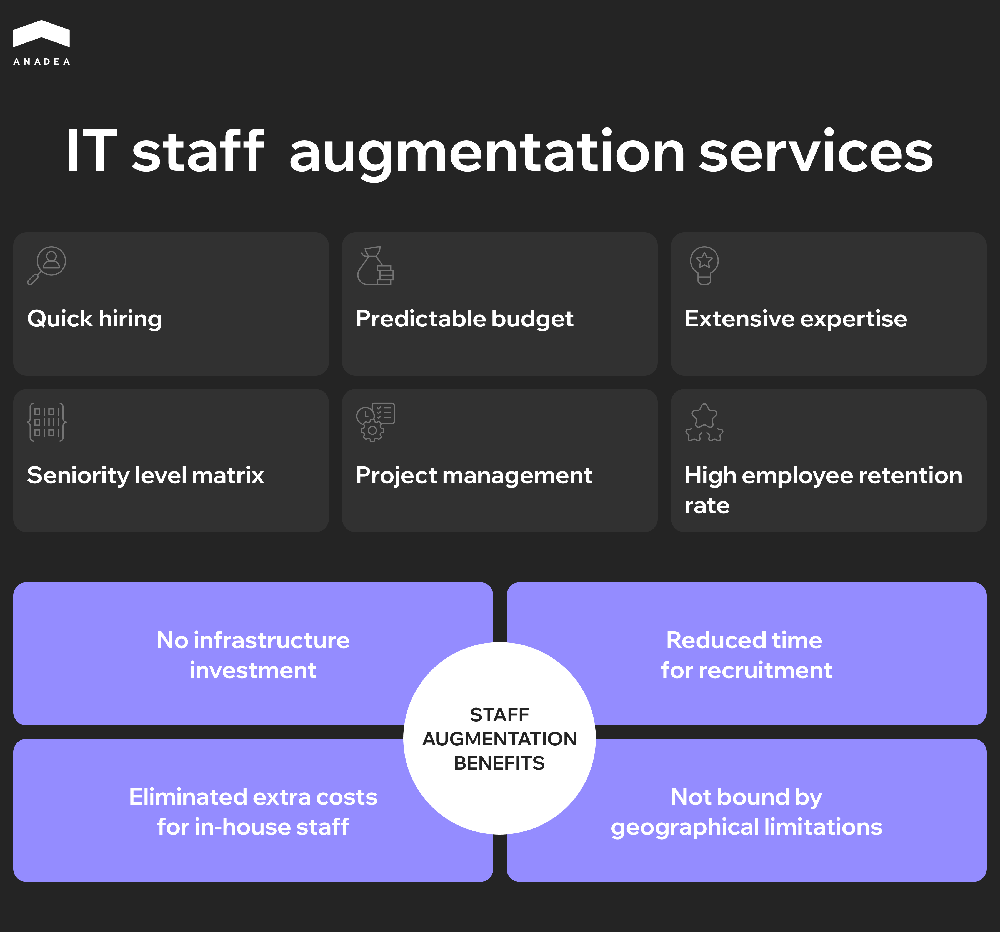
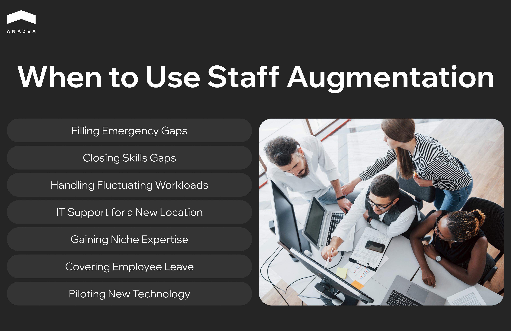

Hiring takes forever. Hiring costs a fortune. And even then, you still can't find the right people. [74% of employers worldwide](https://go.manpowergroup.com/talent-shortage?__hstc=75047245.cc2d71b30cf02a297e74a18c0ece52d6.1764923960715.1764923960715.1764923960715.1&__hssc=75047245.1.1764923960716&__hsfp=3086880439) report difficulty finding candidates with the skills they need. That's an all-time high, and it's held steady for four years running. A decade ago, that number was just 36%.

And it's not only about the shortage of qualified candidates. Technical roles take an average of [88 days to fill](https://www.ashbyhq.com/talent-trends-report/reports/2023-recruiter-productivity-trends-report). Nearly three months for a single position. But you probably know stories where the hiring process dragged on even longer.

Staff augmentation emerged as an answer to these in-house hiring challenges. It lets you get working hands within weeks. But the model itself guarantees nothing. We've seen companies use augmentation to deliver critical projects on time. And we've seen others pay for people who, six months in, still didn't understand the product.

What separates the first group from the second? That's what this article is about. We'll walk you through the IT staff augmentation best practices we've learned from 25 years of building and scaling development teams.

## What is Staff Augmentation

Staff augmentation is a team extension model where you bring in external specialists to work on your project. They work alongside your in-house developers, report to your management, and follow your processes. Legally and administratively, they stay on the provider's side. But in practice, they become part of your team.

Put simply, you get the people you need without the pain of traditional hiring.

How is this different from outsourcing? With outsourcing, you hand off a chunk of work to an external team and wait for the result. With augmentation, you integrate specific specialists into your workflow and manage them directly. Control, communication, and accountability stay with you.

If you want to dive deeper into how this model works, check out our[ detailed guide on IT staff augmentation](https://anadea.info/blog/what-is-it-staff-augmentation/).

### Why Do Companies Choose This Model

1. Speed. While your HR spends two or three months looking for a candidate, a provider can fill the position in weeks. They already have a pool of vetted specialists ready to start.
2. Flexibility. Need three developers for six months to ship a specific release? Done. Project wrapped up or scope changed? Scale the team up or down without layoffs or severance packages.
3. Access to expertise. You need a DevOps engineer with Kubernetes experience, but there are maybe five of them in your local market and all are taken. Augmentation removes geographical limits and opens up a global talent pool.
4. Predictable budget. You pay a fixed rate per specialist. No hidden costs for recruiting, onboarding, equipment, office space, or benefits.
5. Focus on the product. Your internal team doesn't waste time on interviews, onboarding newcomers, and administrative busywork. Instead, they do what they do best: build the product.

But here's an important caveat. Staff augmentation only works when you have someone to manage these people. If your team doesn't have a tech lead or a manager to handle coordination, you're better off looking at outsourcing or a dedicated team. Augmentation strengthens an existing team. It doesn't replace one.

And that's exactly where we'll start with our best practices for staff augmentation.

## Integrate, Don't Isolate

Staff augmentation, by definition, is team reinforcement. Not outsourcing. Not contractors off to the side. And reinforcement only works when new people become part of the whole.

In practice, it often goes differently. Augmented specialists are kept at a distance. A separate channel in the messenger where tasks get dropped. They have access to the repository, but nobody invites them to planning. They write code without knowing why the business needs this feature.

The result is predictable. Augmented specialists work in an information vacuum. They make decisions without context, which means they make wrong decisions. They don't feel like part of the team, so they don't act like part of the team. You're paying for senior expertise but getting junior output.

### What to Do About It?

Treat augmented specialists like your own developers. Invite them to all team activities. Standups, retros, groomings, demos. They should be there as participants, not observers.

Explain the "why," not just the "what." A developer who understands the business goal will suggest a better solution on their own. Or at least ask the right questions before writing code.

Don't create two classes of people. Nothing kills motivation faster than feeling like a second tier. If your in-house devs have access to product analytics, give augmented specialists the same access. If you celebrate releases, celebrate together.

### Why a Manager Is a Must-Have

Integration won't happen on its own. You need someone to make sure the new developer isn't stuck waiting three days for a code review. That they know who to go to with questions. That they're getting feedback, not just new tasks.

This could be a tech lead, team lead, or experienced senior. The point is that someone takes responsibility for onboarding and daily communication. If you don't have that person, consider whether augmentation is even right for you. A dedicated team with its own management or classic outsourcing might be a better fit.



## Quality Onboarding

One of the most overlooked IT staff augmentation best practices is proper onboarding. The first few days of an augmented specialist determine everything. They either get up to speed quickly or spend weeks spinning their wheels while burning through your budget.

You've probably heard stories like this: someone starts on Monday, gets repository access somewhere around Wednesday. CI/CD access comes a week later. Nobody can say exactly where the documentation lives. The tech lead is swamped and can't find time for a proper introduction. A week goes by and the developer hasn't committed a single line of code.

What needs to be ready before day one:

* All access. Repositories, CI/CD, staging, messengers, task tracker. Not within a week. Before they start.
* An assigned buddy from the team. Not a mentor who'll spend hours teaching. Just someone to help with everyday things. Without this, a newcomer either bugs everyone around them or sits quietly wasting time.
* A prepared first task. Small but real. Something they can finish in a day or two and see in production. This gives a quick win and introduces the codebase better than any documentation could.

The first week:

* Daily 15-minute syncs with the buddy or tech lead.
* Product introduction. Who your users are, what problem you're solving, what's the current priority. Half an hour with a product owner gives more context than a week of digging through code.
* Detailed code review on first PRs. Not just approving, but explaining why things are done a certain way. This is the fastest way to sync on standards.
* After two weeks, the augmented specialist should be closing tasks at roughly the same pace as your internal team. If not, something went wrong and you need to find the root cause.

Poor onboarding means direct losses. You're paying full rate for someone working at a third of their capacity because of missing onboarding that you were supposed to provide.

## Define the Real Need

We started with two things we consider fundamental when implementing best practices for staff augmentation. But quality augmentation begins before you sign any contract. The first question to ask yourself: is augmentation actually what you need?

Augmentation is not a universal tool. It works well in specific situations and poorly in others.

### When Augmentation Makes Sense

* A temporary spike in workload. You have a major release in three months, your team can't handle it, but after the release you won't need that capacity. Hiring full-time people only to figure out what to do with them next quarter makes no sense.
* You need expertise your team doesn't have. You need to integrate Kubernetes, but your DevOps people haven't worked with it. Hiring someone permanent takes too long and costs too much. Bringing in a specialist for a few months to set everything up and transfer knowledge to the team is far more practical.
* Uncertain duration. You don't know if the project will last six months or two years. Augmentation lets you scale in both directions without the pain of layoffs.

### When to Consider Other Options

* You have nobody to manage these people. Augmented specialists need a tech lead or manager on your side. Without one, you won't get team reinforcement. You'll get a group of people with no direction. In that case, a dedicated team with its own management is a better fit.
* You need a whole product, not extra hands. If you want to hand off a task and receive a result without deep involvement, that's classic outsourcing. Augmentation requires your participation in the process.
* The need is long-term and concerns a core function. If you need a backend developer for years and it's central to your business, invest time in hiring. Augmentation covers temporary needs well, but building your core team on it is risky.

Before choosing between augmentation and hiring freelancers, understand the key differences in management overhead, reliability, and integration. Our guide on [staff augmentation vs independent contractors](https://anadea.info/blog/staff-augmentation-vs-independent-contractor) breaks down which model fits different scenarios.

## Clear Candidate Requirements

A common mistake is sending the provider a job description with thirty bullet points where everything is a must have. React, Node, AWS, Kubernetes, GraphQL, microservices, high-load experience, fintech background... The provider looks at this and has no idea who you actually need. They send over anyone who vaguely fits. You waste time interviewing people who aren't right.

The problem isn't the provider. The problem is that you haven't figured out who you need.

### How to Define Requirements

1. Pick three to five technical skills the person can't work without from week one. Not every technology in your stack. The ones they'll actually use right away. Everything else is nice to have, and you need to separate that clearly.
2. Define the level of autonomy. Do you need someone who breaks down tasks on their own and makes architectural decisions? Or is it enough to have someone who's good at closing well-defined tickets? These are different people with different experience and different rates.
3. Give project context. A legacy PHP monolith that needs support and gradual refactoring is one story. A greenfield project on a modern stack from scratch is another. A specialist who thrives in the first scenario might struggle in the second. And vice versa.

### What Actually Helps the Provider

Describe a typical workday. Who this person will communicate with. How much time goes to writing code versus meetings and syncs. What the code review process looks like. How independently they'll need to make decisions.

Describe a typical task. A concrete example of what this person will do in their first month. This gives the provider more insight than a list of twenty technologies. The more precisely you describe who you're looking for, the faster the provider finds the right person. And the less time everyone wastes on interviews with candidates who aren't a fit.

## Don't Outsource All Screening to the Provider

Among the critical IT staff augmentation best practices is maintaining your own screening process. A good provider does serious vetting. We, for example, run over 400 technical interviews every quarter and only work with those who pass all stages. But even the most thorough screening on our side won't replace your own assessment.

The provider checks whether someone can write code. Whether they actually know the technologies on their resume. Whether they communicate adequately. But the provider doesn't know your project's specifics. Doesn't know how your team works. Doesn't know that your tech lead hates over-engineering and your product owner likes developers who ask lots of clarifying questions.

So the final call should be yours.

How to do this without too much pain:

* One technical interview, 60-90 minutes, with your tech lead. Not whiteboard algorithms, but a conversation about real experience. How the person solved hard problems. What architectural decisions they made and why. How they handled situations when things went wrong.
* Live coding or code review of actual code. Something close to your stack and typical tasks. This shows how someone thinks in a context similar to yours.
* A short conversation about soft skills. How they communicate. How they react to criticism. How they behave when they don't know the answer. You'll be working with this person every day, and no hard skills will compensate for toxic communication.

One more thing. Not all providers are equally motivated to find you the best candidate. For some, closing the position fast and moving on to the next one matters more. That's why your own assessment isn't just playing it safe. It's a necessity.

## Communication with Your Provider

Your provider knows things about your specialist that you don't. Because the specialist will tell them they're tired of overtime or that the manager never gives real feedback. They won't tell you because they don't want to damage the relationship. One day they'll just ask to be moved to a different project.

To prevent this, you need regular contact. At least half an hour every couple of months. What's working, what's not, what risks are on the horizon. This isn't bureaucracy. It's an early warning system.

The same goes for feedback. If a specialist isn't delivering, don't stay quiet for months. Give specific examples, agree on a timeframe for improvement, escalate if nothing changes. A good provider won't cling to someone who's underperforming. It's better for them to replace that person than to lose you as a client.

And keep your provider informed about your plans. Project ending in two months? Give them a heads up now. Want to add two more people next quarter? Tell them in advance. Providers need time to find the right candidates. If you give them a week's notice, don't be surprised when your options are limited.

## Knowledge Management

Augmented specialists will leave. The contract ends, the project wraps up, or the person decides to move on. The question isn't whether it'll happen, but what stays behind when it does.

Documentation should be a process, not a last-minute scramble before someone leaves!

Don't wait until the final week to ask someone to document their work. By then they've forgotten half the details and have zero motivation to write thorough explanations.

Build documentation into daily work. Made an architectural decision? Write down why. Did something non-obvious in the code? Leave a comment or update the README. Takes minutes, saves weeks later.

ADRs for all significant decisions. Architecture Decision Records are simple: what was the problem, what options you considered, what you chose and why. When someone asks a year from now why you're using this particular queue instead of another, the answer is in a document, not in the head of someone who left long ago.

## Security and Compliance

Augmented specialists get access to your code, infrastructure, sometimes client data. They work as part of the team but legally remain external people. This needs to be accounted for.

This isn't about paranoia or distrust. It's about basic hygiene that you set up once and then forget about.

What to do at the start:

* NDA before work begins. Usually this is handled at the contract level with the provider, but make sure the document covers your specific needs.
* Separate accounts for each specialist. No shared credentials. If something goes wrong, you need to see who had access and when.
* Principle of least privilege. Access only to what's needed for the job. If someone is working on the frontend, they don't need access to the production database.

While the person is working:

* If the project is sensitive (fintech, medical data, personal information) it might be worth restricting work from public networks. Or adding access logging for critical systems.
* Periodic access reviews. Someone worked on one module three months ago, now they're on another. They no longer need the old access.

When the contract ends, revoke all access on the last day. Ideally this should be automated so it doesn't depend on anyone remembering to do it.

## Metrics: How to Know If Augmentation Is Working

Without concrete numbers, you'll find out about problems when it's already too late. The specialist worked for three months, the team was unhappy, and money was spent. If you'd been tracking metrics, you would have spotted warning signs by week two. These metrics are essential for anyone following staff augmentation best practices.

<table>

<tbody>

<tr>

<td>

<strong>Metric</strong>

</td>

<td>

<strong>What it measures</strong>

</td>

<td>

<strong>Good</strong>

</td>

<td>

<strong>Bad</strong>

</td>

<td>

<strong>What to do if bad</strong>

</td>

</tr>

<tr>

<td>

Time to productivity

</td>

<td>

Days from start to first merged PR with a real task

</td>

<td>

5-7 days

</td>

<td>

14+ days

</td>

<td>

Check onboarding: access, documentation, buddy. Most likely the person got stuck on something basic

</td>

</tr>

<tr>

<td>

Velocity impact

</td>

<td>

How much team speed increased after adding the specialist

</td>

<td>

+40-50% per person

</td>

<td>

less than +20%

</td>

<td>

Look at blockers: maybe the person is waiting on code review, lacks context, or is getting tasks below or above their level

</td>

</tr>

<tr>

<td>

Retention

</td>

<td>

How long augmented specialists stay on the project

</td>

<td>

6+ months

</td>

<td>

leaving before 3 months

</td>

<td>

The problem is on your side: boring tasks, poor communication, feeling isolated. Talk to the specialist directly

</td>

</tr>

<tr>

<td>

Code quality

</td>

<td>

Number of bugs and PRs returned for rework

</td>

<td>

On par with the team

</td>

<td>

Significantly more than the team

</td>

<td>

Either a bad match or they lack context about your standards. Invest in more detailed code review

</td>

</tr>

<tr>

<td>

Team satisfaction

</td>

<td>

Anonymous rating from the internal team once a month

</td>

<td>

7+ out of 10

</td>

<td>

below 5

</td>

<td>

Find out why: communication, process differences, code review overload

</td>

</tr>

</tbody>

</table>

Don't overcomplicate it. You already see most of this, you just don't write it down. Collect this data from week one and share it with your provider. A good partner wants to know how their people are doing and will help you solve problems before they become critical.

## Conclusion

Staff augmentation solves a real problem: you get the people you need fast, without months of hiring and unnecessary costs. But the model itself doesn't guarantee success. The difference between a project that ships on time and one where you paid for three months with nothing to show for it comes down to execution. Integration over isolation, solid onboarding, clear requirements, vetting candidates yourself, regular communication, and tracking metrics – these staff augmentation best practices separate teams that make augmentation work from those that don't.

Throughout this article, we focused on developers because that's the most common use case for staff augmentation. But whether you need a QA engineer, a marketing specialist, or a DevOps person, the fundamentals stay the same. Team integration, proper onboarding, and clear communication work exactly the same way regardless of the role.

We'll help you fill positions in 2-3 weeks with thorough vetting, technical screening, and transparent communication every step of the way. [Get in touch](https://anadea.info/contacts) to discuss your project.
