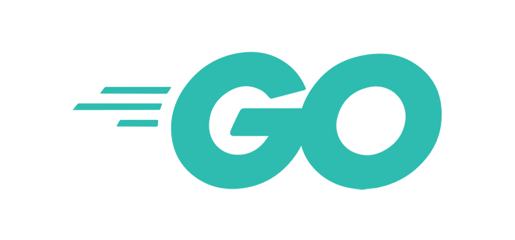
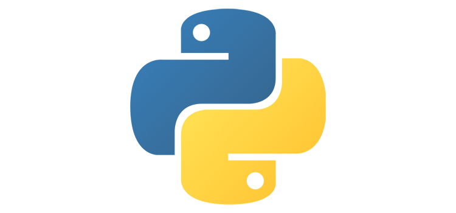

There is no doubt that the IT industry has taken over as one of the most productive industries. And more than half of the jobs in the IT field require good programming knowledge.

The demand for developers has skyrocketed recently as every company tends to rely on software tools. The increase in demand for developers has also lead to an increase in the online learning platforms. There are many online computer programming certificates available which are backed up by accredited institutions. If you are new to coding, it's not easy to choose which of them is the right for you.

Well, here we have brought you 9 best programming languages that you must add to your checklist in 2019. Read on!

## 1. Go

Go (also known as GOlang) is a programming language created by Google engineers: Robert Griesemer, Rob Pike, and Ken Thompson in 2009. It is specifically designed as a system language for large and highly-scalable network servers. Go is fast and modern to work with. Apart from its new popularity, its huge cloud infrastructure, simple maintenance, and high performance made it as good as C or any popular programming language. It supports multiple platforms and has great memory management, standard libraries and is, of course, backed up by Google.

## 2. Swift

Swift is mainly used in developing iOS apps. The language was developed by Apple in 2014, making it a fairly recent addition to the programming world. However, it quickly grew in popularity. It is one of the best programming languages to learn for a person who wishes to develop iOS apps.
iOS apps are statistically more profitable than Android. This is the reason why people decide to take this programming language as their first to learn. It is not highly complicated. The basics of C programming will help you a lot in learning how to use Swift.

Related read: [Swift vs Objective-С: There Will Be Blood](https://anadea.info/blog/swift-vs-objective-c-there-will-be-blood)

## 3. Elixir

Elixir, by Jose Valim, has seen a gentle rise in popularity since its creation in 2011. It is a dynamic and functional programming language run on Erlang Virtual Machine and is purposed for developing scalable applications. The basic understanding of computer terminologies will make you prepared to learn this language. Elixir supports the coding system and assists the developers to write programs more compact and maintainable. It is also used for web development and building embedded systems.

## 4. Rust

Rust is an open source programming language usually compared with C but is a bit easier to work with. This language mainly focusses on memory, speed, parallelism, and safety. It maintains high performance and was originally designed by Graydon Hoare with contributions from Brendan Eich, Dave Herman, and others. Rust is mainly designed for low–level operations but has also seen a growing recognition in the gaming industry. Though beginners may find it difficult, it is worth learning!

## 5. Ruby

Ruby is hands-down, one of the best programming languages to learn. It is a general-purpose language designed by Yukihiro Matsumoto in mid-1990. Compared to most other languages, it is user-friendly and requires less code for more actions done by the program. Most rubists reported that they have picked up this language fast and have made good progress with it in a short time. Ruby became popular with one of its most common framework, Ruby on Rails and still proves to be successful. The main drawback would be that it takes longer for a program wrote in Ruby to compile. However, this should not worry you as long as you do a good job, your program will be of great value.

Related read: [Why Ruby on Rails is So Popular?](https://anadea.info/blog/why-ruby-on-rails-is-so-popular)

## 6. C++

C++ is one of the old languages out there. It was designed by Dennis Ritchie back in 1985 and has since been able to survive in this ever-changing industry as one of the most popular programming languages for desktop applications development. It might not be the easiest programming language to learn when compared to Ruby but is sure to be one of the best. Progress is usually slow, but once you pick this language up, it will be easier for you to understand other programming languages as well.

## 7. Java

Java has one of the heaviest usages worldwide. The slogan "write once, run everywhere" is still live. James Gosling designed Java back in 1995 and it is mainly used in Android development. The language popularity comes from the ability of cross-platform compatibility. You just have to write your code once, and it can run on multiple platforms. Thanks to the Java Virtual Machine. To get started using Java, you will need plenty of time on your hands. It is a bit easier than C++, but its usage brought vast amounts of libraries and functions that need to be looked over. Once you get the hang of Java, finding a job is easy.

Related read: [What is JVM and Why it is Worth to Develop Apps on Java Platform](https://anadea.info/blog/what-is-jvm-and-why-develop-apps-on-java)

## 8. Python

Python is a high-level, general-purpose programming language released by Guido Van Rossum in 1991. It is easy to learn but hard to master. Beginners find themselves excited as they progress with this language learning pretty fast. However, to make good use of Python, you will need to play a lot with the language. It is diverse, being used in desktop software, web apps, and a lot in machine learning. You can do a lot of things with Python. You just need to put in the time.

## 9. C

C is one of the best programming languages ever. It came to life in 1872 and had inspired others to create new software, and new languages that derive from C. The syntax is a little bit pretentious, but if you get the hang of it, you will have an easier time with most other programming languages as well.

The popular programming languages that are derived from C are C++, C#, and Java. Programming in C is viable. The major disadvantage is that you require more lines of code to be written for executing a task. However, you will find that after you get good with C, you can get good with any other language fast and without much effort.

There goes the list of 9 best programming languages to learn in 2019. Though, many new languages are rising up, learning an old language is never a bad thing. C and Java have always supported the new programmers to perfect their frameworks. Choose wisely and master your programming skills.
