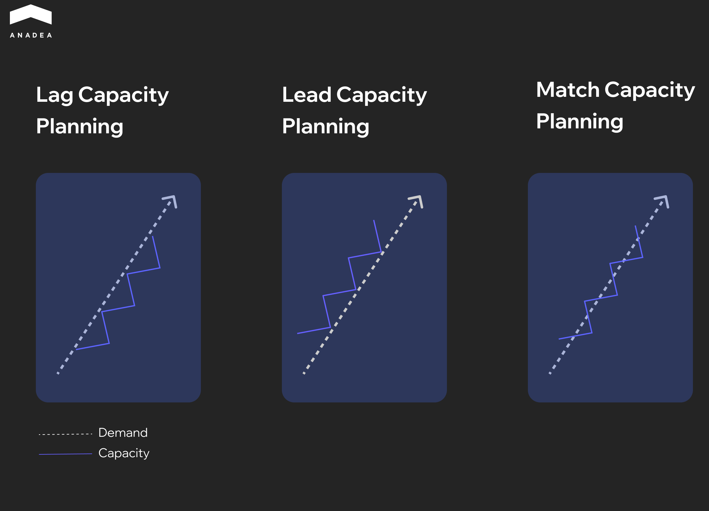

In pro cycling there's a metric called FTP, Functional Threshold Power. It's the power output a rider can sustain for roughly an hour before performance collapses. Push past it and you'll hold on for about five minutes at most. This is the number coaches build training plans around, because the theoretical peak tells you very little about what an athlete can actually deliver over a race.

Most engineering teams have no equivalent number for themselves. [Atlassian's State of Developer Experience Report 2024](https://www.atlassian.com/blog/developer/developer-experience-report-2024), conducted with DX and Wakefield Research across more than 2,100 respondents, found that 69% of developers lose at least 8 hours a week to inefficiency. Part of that is technical debt, part of it is time spent looking for documentation that should be easy to find. Effectively, a full working day per developer that no one factors into sprint planning. The team commits above its sustainable output, and carry-over compounds from one sprint to the next.

Engineering capacity planning is the practice of identifying that sustainable output and sizing commitments against it, rather than against headcount. The sections below cover where to start.

## What Engineering Capacity Planning Actually Means 

Capacity planning in software development is how an engineering manager lines up the workload for the next sprint or quarter against the actual productive hours the team can deliver. That word "actual" is the important part. Eight engineers on the org chart and eight engineers after you subtract vacations, meetings, on-call rotations, and code reviews are two very different numbers.

In practice the process comes down to two pieces.

**Capacity supply** is how many engineering hours are genuinely available. It covers team size, seniority levels (a senior and a junior close the same ticket at different speeds), the vacation calendar, the share of time that goes into support and maintenance, and how full everyone's calendar already is.

**Capacity demand** is the volume of work that has to be delivered. Feature backlog, tech debt, bug fixes, infrastructure tasks, security patches. All of it pulls on the same pool of engineering hours.

Team capacity planning is the point where supply and demand have to be reconciled. For most growing teams demand exceeds supply by default, and sprint capacity planning is what forces the trade-offs: what gets done this sprint, what moves to the next one, and where the team is structurally short on people.

## The Advantages of Capacity Planning

Capacity planning takes discipline. Regular data collection, ongoing review of team load, alignment with the product roadmap. Which raises a fair question: why spend time on this every sprint?

### Predictable Delivery

When a team knows its real throughput, sprint scope is built off the resource that's actually available. Carry-over between iterations drops, and product managers get dates they can trust when planning launches. Stakeholders stop padding their buffers with more buffer. For the business, that predictability is worth more than raw speed, because launch dates, marketing campaigns, and partner integrations can be planned against realistic timelines.

### Sustainable Pace

Capacity planning gives the manager a concrete utilization metric that can be tracked sprint over sprint. The team stays inside its productive range, and overload gets caught early instead of after the fact. Teams that hold a steady pace ship cleaner code, run into fewer production incidents, and have lower attrition.

### Defensible Scaling Decisions

A capacity plan reframes the conversation about hiring in terms a CFO can act on. Here's the roadmap for the quarter, here's available capacity, here's the gap. Decisions about new hires or contractors come from specific numbers, budget discussions move faster, and the outcome is easier to measure later.

### A Shared Language Between Engineering and the Business

Capacity planning gives every side a common reference point for scope and timeline conversations. Once stakeholders are looking at the same capacity dashboard, engineering can justify how it prioritizes, product can see the real cost of each new request, and the CEO gets a clearer view of what the engineering org is actually producing.

## The Most Common Challenges of Capacity Planning

Capacity planning brings clear benefits, but the process itself isn't easy. Most of the friction comes not from the math, but from people and the way organizations operate.

### Team Availability Is a Moving Target

Capacity planning works on live data. Someone takes sick leave, another engineer gets pulled onto an adjacent project for two weeks, a third loses half a sprint to a production incident no one saw coming. Numbers collected at the start of the quarter often look very different from reality a month in.

That's why capacity has to be recalculated on a regular cadence. A one-time snapshot at the start of the quarter, or even at the start of a sprint, usually isn't enough. The pattern we see in mature teams is a short check-in at every sprint planning, with availability and load data refreshed each time.

### Invisible Work That's Hard to Plan For

Every engineering team spends a meaningful share of its time on work that never lands in the sprint backlog. This is one of the blind spots in workload planning that turns a clean sprint forecast into a missed deadline. Code reviews, helping colleagues from other teams, sitting in on technical interviews, responding to ad-hoc requests from product or sales. Any one of these is small on its own, but together they can eat 20 to 30% of capacity.

The hard part is that this kind of work resists upfront estimation. One week there are zero ad-hoc requests, the next week there are three. The practical approach is to set a fixed buffer based on what the data from the last 3 to 4 sprints actually shows, instead of trying to predict each activity in advance.

### Capacity Planning Means Saying No

This is probably the hardest part of team capacity planning for teams used to agreeing to everything. A capacity plan makes it clear how much work fits into a sprint or a quarter. Anything that doesn't fit has to be either pushed back or declined.

For an engineering lead, that translates into regular conversations with stakeholders about priorities and trade-offs. Those conversations get uncomfortable, especially when the request comes from the CEO or a major client. A capacity plan makes them easier, because it gives everyone an objective basis for prioritization. It's a data-driven decision, which is easier to deliver and easier to accept.

### Team Estimates Aren't Always Accurate

Even with careful planning, the capacity model is only as good as the estimates the team itself provides. Highly motivated engineers tend to overestimate their throughput. Less experienced ones often underestimate task complexity. Both skew the accuracy of the plan.

What helps here is comparing planned estimates against actual results from previous sprints. This is exactly where sprint capacity planning earns its keep – each cycle gives you cleaner inputs for the next one. With each iteration the model gets more accurate, because it's being calibrated against real data instead of assumptions.

## How to Calculate Your Team's Real Capacity

Before getting into the math, it's worth saying that the choice of capacity planning tools matters less than most people assume. Spreadsheets work for teams of 15 to 20 engineers. Jira, Linear, and Asana cover the next tier with built-in capacity tracking. Beyond 50 engineers, dedicated capacity planning tools like Jellyfish or Faros start to pay off because they automate data collection from Git and CI/CD. The mistake to avoid is picking a tool before defining how you want to measure capacity in the first place.

Agile capacity planning breaks down into five sequential steps. Each one builds on the result of the previous, so skipping or reordering them isn't recommended.

### Step 1. Forecast Your Anticipated Demand

The first step is to put together a complete picture of the work the team is expected to deliver in the planning period. That means the feature backlog, tech debt items, bug fixes, infrastructure tasks, security patches, and support obligations. Pulling all of it into one place matters, because some of this work usually lives in the product manager's head, some sits in Jira, and some arrives ad-hoc from neighboring teams and is never recorded anywhere.

At this stage, every task gets an estimate in story points or hours. Estimates become more accurate when the team uses historical velocity from the previous 3 to 4 sprints as a reference point.

### Step 2. Determine Required Capacity

Once the full scope of work is collected and estimated, you can see how many engineering hours it takes to deliver. That number is the required capacity. In practice, it almost always exceeds what the team can actually provide. That's why the next step matters so much.

### Step 3. Calculate Your Team's Current Capacity

This is where you work out the hours that are genuinely available. The formula looks like this:

Available capacity = (number of engineers) × (working days in the sprint) × (hours per day) × (focus factor)

The focus factor accounts for time spent in meetings, code reviews, sprint ceremonies, 1:1s, and other recurring obligations. For most engineering teams it falls in the 0.6 to 0.8 range.

Planned absences are then subtracted from that number: vacations, sick days, public holidays, training.

Example for a team of 6 engineers on a two-week sprint:

<table>

<tbody>

<tr>

<td>

<strong>Parameter</strong>

</td>

<td>

<strong>Value</strong>

</td>

</tr>

<tr>

<td>

Number of engineers

</td>

<td>

6

</td>

</tr>

<tr>

<td>

Working days in the sprint

</td>

<td>

10

</td>

</tr>

<tr>

<td>

Hours per day

</td>

<td>

8

</td>

</tr>

<tr>

<td>

Total time pool

</td>

<td>

480 hrs

</td>

</tr>

<tr>

<td>

Planned absences (1 engineer on vacation for 5 days)

</td>

<td>

-40 hrs

</td>

</tr>

<tr>

<td>

Focus factor 0.7

</td>

<td>

×0.7

</td>

</tr>

<tr>

<td>

Available capacity

</td>

<td>

308 hrs

</td>

</tr>

</tbody>

</table>

308 hours out of an initial 480. The 36% gap is the share that disappears into meetings, context switching, and operational overhead.

Discuss your capacity gap

### Step 4. Measure the Capacity Gap

This step compares two numbers: required capacity (Step 2) and available capacity (Step 3). If required exceeds available, that's a capacity gap. If available is greater than required, the team has slack that can go into tech debt or R&D work.

It's useful to express the capacity gap in both absolute hours and percentages. A gap of 15%, for example, can usually be closed by reviewing scope. A gap of 40% signals a need for additional engineers.

### Step 5. Align Capacity with Demand

The last step in workload planning is to bring demand in line with available capacity. There are several options, and most teams use a combination of them.

* **Scope prioritization**. Work with the product owner to review the backlog and keep only what fits within available capacity. Lower-priority items move to the next iteration.
* **Workload redistribution**. If some engineers on the team have free capacity, part of the work can be rebalanced. Skill sets matter here, because a frontend engineer with 20 free hours won't close a backend ticket.
* **Team scaling**. If the capacity gap holds steady across several sprints or quarters, that's a signal to expand. Either through in-house hiring or by bringing in external engineers via staff augmentation.
* **Process optimization**. Sometimes the capacity gap can be reduced by cutting operational overhead. Automating the CI/CD pipeline, reducing the number or length of meetings, improving documentation so engineers spend less time looking for information. [AI automation](https://anadea.info/services/ai-automation) is the newer lever in this category – code generation for boilerplate, automated PR review, and anomaly detection in production routinely free up 15 to 25% of engineering time that used to disappear into repetitive work.

Once aligned, the capacity plan becomes a working document for the sprint or quarter, reviewed and updated with each iteration.



## Lead, Lag, or Match: Which Scaling Strategy Fits Your Team

Once the capacity gap is identified, the next question is how exactly to scale the team against growing demand. There are three baseline strategies, and each one balances the risk of overspending against the risk of running short on resources differently.

**Lag strategy** means adding capacity only after demand has already grown. The team scales reactively, in response to confirmed load. Costs stay low, because resources are added only when they are clearly needed. The downside is that 2 to 4 months pass between the moment the capacity gap becomes obvious and the moment new engineers reach full productivity. The team operates in overload that whole time.

**Lead strategy** works in the opposite direction. Capacity is built up in advance, before demand reaches the current ceiling. The team is ready to absorb new workload the moment it shows up. The approach works well in product companies with a predictable roadmap and stable funding. The risk here is financial: if demand grows more slowly than projected, part of that capacity sits idle.

**Match strategy** sits between the first two. Capacity is added in parallel with demand, in small increments. The core team handles baseline load, and additional engineers are brought in for peak periods or new initiatives through staff augmentation or short-term contracts. For most engineering organizations in the 15 to 50 person range, match strategy turns out to be the most pragmatic option, since it preserves flexibility without taking on significant financial risk.

The choice between strategies comes down to three factors: how predictable demand is, how much financial risk the company is willing to carry, and how quickly the organization can actually onboard new engineers.

## When Your Capacity Isn't Enough: Scaling Options

A capacity gap that shows up in a single sprint is usually solved by re-prioritizing the scope. A capacity gap that holds for a quarter or longer points to a structural problem. The team simply doesn't have enough people for the volume of work the business is generating. At that point there are a few paths forward.

### In-House Hiring

The most obvious option, and at the same time the slowest. Sourcing a senior engineer with the right stack takes 2 to 3 months. Onboarding to full productivity adds another 1 to 2 months. The capacity gap stays open the entire time, and the team keeps operating in overload.

Hiring works well for closing long-term needs, when the company is confident the role is required for years to come. For temporary capacity gaps or project peaks, it's too slow and too expensive a tool.

### Staff Augmentation

Staff augmentation lets you reinforce the team with external engineers who work under the client's processes and management. The key advantage is speed. An experienced provider lines up specialists with the right stack within days, and by the second week the engineer is closing tickets.

The model is especially effective for the match strategy described above and integrates cleanly into existing workload planning routines. The core team stays in-house and retains product knowledge, while external engineers close the capacity gap for specific initiatives or periods of higher load. Once the need is gone, the team scales back down without going through a layoff process.

Another important detail is that augmented engineers integrate into the existing team. They work in the same sprints, attend the same standups, and push code into the same repository. From a product owner or stakeholder perspective, the difference between an in-house and an augmented engineer is practically invisible.

### Outsourcing Individual Modules or Projects

When the capacity gap covers an entire workstream rather than individual tasks, it makes sense to carve it out as a separate project for an external team. Outsourcing works well for work with clearly defined scope: migrating a legacy system, building an MVP for a new product, integrating with a third-party platform.

The advantage over staff augmentation is that the external team takes on delivery end to end, including project management and QA. The internal team keeps its focus on the core product, while the external one moves a separate workstream in parallel.



### Which Option to Choose

In practice, mature engineering organizations combine these approaches depending on the nature of the capacity gap.

<table>

<tbody>

<tr>

<td>

<strong>Situation</strong>

</td>

<td>

<strong>Best fit</strong>

</td>

</tr>

<tr>

<td>

Long-term need for a specific role

</td>

<td>

In-house hiring

</td>

</tr>

<tr>

<td>

Temporary capacity gap of 2 to 6 months

</td>

<td>

Staff augmentation

</td>

</tr>

<tr>

<td>

A separate project with clear scope

</td>

<td>

Outsourcing

</td>

</tr>

<tr>

<td>

Peak period before a major release

</td>

<td>

Staff augmentation

</td>

</tr>

<tr>

<td>

Required competence isn't available in-house

</td>

<td>

Staff augmentation or outsourcing

</td>

</tr>

</tbody>

</table>

Companies that already have experience working with external engineering partners can scale within days. That fundamentally changes the approach to capacity planning, because the capacity gap stops being a problem you have to live with for months while waiting on a new hire.

## Conclusion

Capacity planning starts working when it becomes part of the team's operational rhythm, not a one-off exercise at the start of the quarter. Count the available hours, line them up against the volume of work, identify the gap, and act on it. Sprint by sprint, the practice gets calibrated against real data, and with every iteration it produces a more accurate picture of what the team is actually capable of.

When the gap between demand and supply turns out to be a steady one, the fastest way to close it is to reinforce the team with engineers who have the right stack and experience. Anadea has been doing exactly that for 25 years. 150+ engineers, specialists matched within days, full integration into the client's existing processes. If a capacity gap is slowing down your delivery, [book a consultation](https://calendly.com/irina_anadea/30min?back=1) to discuss your scaling options.
