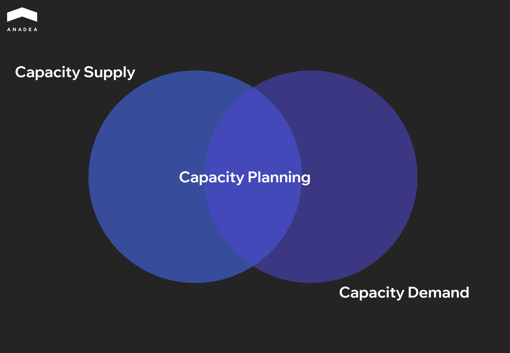
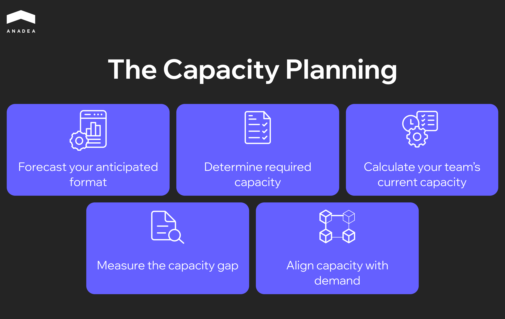

In pro cycling there's a metric called FTP, Functional Threshold Power. It's the power output a rider can sustain for roughly an hour before performance collapses. Push past it and you'll hold on for about five minutes at most. This is the number coaches build training plans around, because the theoretical peak tells you very little about what an athlete can actually deliver over a race.

Most engineering teams have no equivalent number for themselves. [Atlassian's State of Developer Experience Report 2024](https://www.atlassian.com/blog/developer/developer-experience-report-2024), conducted with DX and Wakefield Research across more than 2,100 respondents, found that 69% of developers lose at least 8 hours a week to inefficiency. Part of that is technical debt, part of it is time spent looking for documentation that should be easy to find. Effectively, a full working day per developer that no one factors into sprint planning. The team commits above its sustainable output, and carry-over compounds from one sprint to the next.

Engineering capacity planning is the practice of identifying that sustainable output and sizing commitments against it, rather than against headcount. The sections below cover where to start.

## What Engineering Capacity Planning Actually Means 

Capacity planning in software development is how an engineering manager lines up the workload for the next sprint or quarter against the actual productive hours the team can deliver. That word "actual" is the important part. Eight engineers on the org chart and eight engineers after you subtract vacations, meetings, on-call rotations, and code reviews are two very different numbers.

In practice the process comes down to two pieces.

**Capacity supply** is how many engineering hours are genuinely available. It covers team size, seniority levels (a senior and a junior close the same ticket at different speeds), the vacation calendar, the share of time that goes into support and maintenance, and how full everyone's calendar already is.

**Capacity demand** is the volume of work that has to be delivered. Feature backlog, tech debt, bug fixes, infrastructure tasks, security patches. All of it pulls on the same pool of engineering hours.

Team capacity planning is the point where supply and demand have to be reconciled. For most growing teams demand exceeds supply by default, and sprint capacity planning is what forces the trade-offs: what gets done this sprint, what moves to the next one, and where the team is structurally short on people.

## The Advantages of Capacity Planning

Capacity planning takes discipline. Regular data collection, ongoing review of team load, alignment with the product roadmap. Which raises a fair question: why spend time on this every sprint?

### Predictable Delivery

When a team knows its real throughput, sprint scope is built off the resource that's actually available. Carry-over between iterations drops, and product managers get dates they can trust when planning launches. Stakeholders stop padding their buffers with more buffer. For the business, that predictability is worth more than raw speed, because launch dates, marketing campaigns, and partner integrations can be planned against realistic timelines.

### Sustainable Pace

Capacity planning gives the manager a concrete utilization metric that can be tracked sprint over sprint. The team stays inside its productive range, and overload gets caught early instead of after the fact. Teams that hold a steady pace ship cleaner code, run into fewer production incidents, and have lower attrition.

### Defensible Scaling Decisions

A capacity plan reframes the conversation about hiring in terms a CFO can act on. Here's the roadmap for the quarter, here's available capacity, here's the gap. Decisions about new hires or contractors come from specific numbers, budget discussions move faster, and the outcome is easier to measure later.

### A Shared Language Between Engineering and the Business

Capacity planning gives every side a common reference point for scope and timeline conversations. Once stakeholders are looking at the same capacity dashboard, engineering can justify how it prioritizes, product can see the real cost of each new request, and the CEO gets a clearer view of what the engineering org is actually producing.

## The Most Common Challenges of Capacity Planning

Capacity planning brings clear benefits, but the process itself isn't easy. Most of the friction comes not from the math, but from people and the way organizations operate.

### Team Availability Is a Moving Target

Capacity planning works on live data. Someone takes sick leave, another engineer gets pulled onto an adjacent project for two weeks, a third loses half a sprint to a production incident no one saw coming. Numbers collected at the start of the quarter often look very different from reality a month in.

That's why capacity has to be recalculated on a regular cadence. A one-time snapshot at the start of the quarter, or even at the start of a sprint, usually isn't enough. The pattern we see in mature teams is a short check-in at every sprint planning, with availability and load data refreshed each time.

### Invisible Work That's Hard to Plan For

Every engineering team spends a meaningful share of its time on work that never lands in the sprint backlog. This is one of the blind spots in workload planning that turns a clean sprint forecast into a missed deadline. Code reviews, helping colleagues from other teams, sitting in on technical interviews, responding to ad-hoc requests from product or sales. Any one of these is small on its own, but together they can eat 20 to 30% of capacity.

The hard part is that this kind of work resists upfront estimation. One week there are zero ad-hoc requests, the next week there are three. The practical approach is to set a fixed buffer based on what the data from the last 3 to 4 sprints actually shows, instead of trying to predict each activity in advance.

### Capacity Planning Means Saying No

This is probably the hardest part of team capacity planning for teams used to agreeing to everything. A capacity plan makes it clear how much work fits into a sprint or a quarter. Anything that doesn't fit has to be either pushed back or declined.

For an engineering lead, that translates into regular conversations with stakeholders about priorities and trade-offs. Those conversations get uncomfortable, especially when the request comes from the CEO or a major client. A capacity plan makes them easier, because it gives everyone an objective basis for prioritization. It's a data-driven decision, which is easier to deliver and easier to accept.

### Team Estimates Aren't Always Accurate

Even with careful planning, the capacity model is only as good as the estimates the team itself provides. Highly motivated engineers tend to overestimate their throughput. Less experienced ones often underestimate task complexity. Both skew the accuracy of the plan.

What helps here is comparing planned estimates against actual results from previous sprints. This is exactly where sprint capacity planning earns its keep – each cycle gives you cleaner inputs for the next one. With each iteration the model gets more accurate, because it's being calibrated against real data instead of assumptions.

## How to Calculate Your Team's Real Capacity

Before getting into the math, it's worth saying that the choice of capacity planning tools matters less than most people assume. Spreadsheets work for teams of 15 to 20 engineers. Jira, Linear, and Asana cover the next tier with built-in capacity tracking. Beyond 50 engineers, dedicated capacity planning tools like Jellyfish or Faros start to pay off because they automate data collection from Git and CI/CD. The mistake to avoid is picking a tool before defining how you want to measure capacity in the first place.

Agile capacity planning breaks down into five sequential steps. Each one builds on the result of the previous, so skipping or reordering them isn't recommended.

### Step 1. Forecast Your Anticipated Demand

The first step is to put together a complete picture of the work the team is expected to deliver in the planning period. That means the feature backlog, tech debt items, bug fixes, infrastructure tasks, security patches, and support obligations. Pulling all of it into one place matters, because some of this work usually lives in the product manager's head, some sits in Jira, and some arrives ad-hoc from neighboring teams and is never recorded anywhere.

At this stage, every task gets an estimate in story points or hours. Estimates become more accurate when the team uses historical velocity from the previous 3 to 4 sprints as a reference point.

### Step 2. Determine Required Capacity

Once the full scope of work is collected and estimated, you can see how many engineering hours it takes to deliver. That number is the required capacity. In practice, it almost always exceeds what the team can actually provide. That's why the next step matters so much.

### Step 3. Calculate Your Team's Current Capacity

This is where you work out the hours that are genuinely available. The formula looks like this:

Available capacity = (number of engineers) × (working days in the sprint) × (hours per day) × (focus factor)

The focus factor accounts for time spent in meetings, code reviews, sprint ceremonies, 1:1s, and other recurring obligations. For most engineering teams it falls in the 0.6 to 0.8 range.

Planned absences are then subtracted from that number: vacations, sick days, public holidays, training.

Example for a team of 6 engineers on a two-week sprint:
