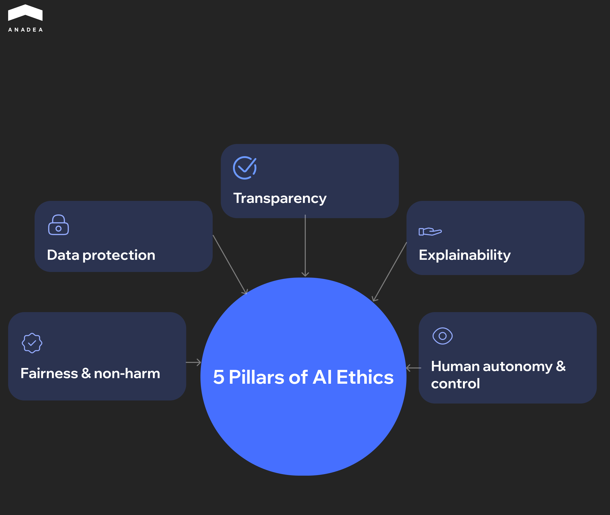
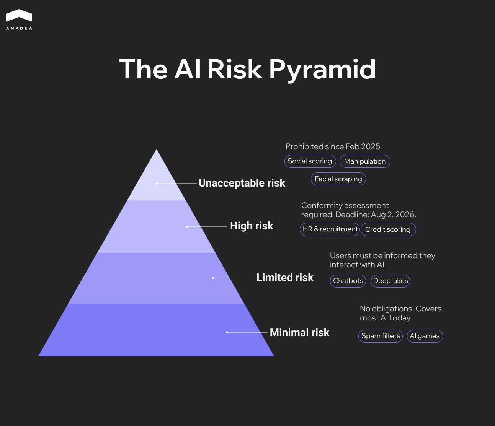
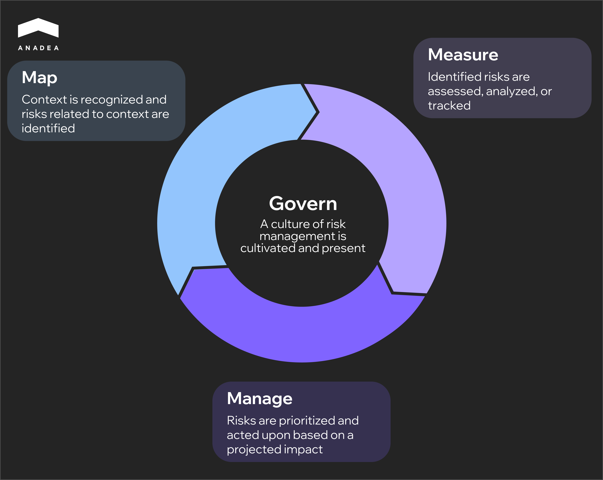

The[ EU AI Act's high-risk compliance deadline](https://anadea.info/blog/eu-ai-act-compliance-requirements/) hits in August 2026. Four months from now. Any company that sells or deploys AI in hiring, credit scoring, healthcare, or law enforcement within the EU needs risk management systems, technical documentation, and conformity assessments in place by then. Non-compliance carries penalties of up to 7% of global annual revenue.

Regulation aside, the past two years have produced enough AI bias lawsuits, nine-figure fines, and scrapped products to make the business case on its own. Ethical AI development is no longer a philosophical exercise. It is an engineering and governance problem with measurable financial consequences.

This article walks through where companies have already failed and what it cost them, which ethical AI frameworks hold up in practice, and what it actually looks like to build responsible AI at the code and process level.

## What Is AI Ethics and Why It Became a Business Problem

AI ethics is a set of ethical guidelines that govern how artificial intelligence systems are designed, deployed, and monitored. In practice, it rests on five pillars. Fairness and non-harm means the system does not discriminate against specific groups or cause unintended damage. Transparency means the organization is open about where and how AI is used. Explainability means stakeholders can understand the reasoning behind the system's outputs. Data protection means user data is collected and processed with consent and within legal boundaries. Human autonomy and control means a person can intervene, override, or shut the system down before it causes harm. For any team entering this space, understanding what is AI ethics in operational terms is the first step.

These principles existed in academic literature for years. Ethics in AI became a business problem when it moved from internal analytics into decisions that directly affect people. Loan approvals, hiring shortlists, insurance claims, diagnostic recommendations. Once an algorithm starts saying yes or no to real individuals, each of those five pillars turns into a concrete liability surface.

The risk compounds because AI bias doesn't come from one place. Harvard's Michael Impink[ identifies three distinct sources](https://professional.dce.harvard.edu/blog/ethics-in-ai-why-it-matters/) of bias in AI systems. It can come from the programmers building the system, from the algorithm's internal weighting, or from the training data itself. A biased dataset won't be fixed by a code review. A flawed algorithm won't improve with cleaner data. Each source demands its own mitigation strategy, which is why a single set of ethical guidelines rarely works.

This is also why[ UNESCO's Recommendation on the Ethics of AI](https://www.unesco.org/en/artificial-intelligence/recommendation-ethics), adopted by all 193 member states, calls for structured Ethical Impact Assessments before AI systems go into production. The expectation is straightforward. Organizations[ building AI software](https://anadea.info/services/ai-software-development) should be ableto demonstrate the ethical use of AI by evaluating risks across all five pillars before the product reaches end users.

## The Real Cost of Ignoring Artificial Intelligence Ethics

The consequences of skipping ethical AI development are no longer theoretical. The past three years have produced enough court rulings, regulatory fines, and product shutdowns to illustrate why artificial intelligence ethics demands organizational attention.

### Bias in Hiring That Reached the Courtroom

In Mobley v. Workday, a[ federal court in California reviewed claims](https://storage.courtlistener.com/recap/gov.uscourts.cand.408645/gov.uscourts.cand.408645.80.0.pdf) that Workday’s automated screening tools disadvantaged applicants over 40. The plaintiff said he had been rejected from more than 100 jobs through systems using the platform. In its decision on Workday’s motion to dismiss, the court allowed several discrimination claims to proceed, indicating that vendors of AI hiring tools may face legal scrutiny when their technology plays a role in employment decisions.

### Privacy Violations at Scale

Clearview AI built a facial recognition database of more than 30 billion images scraped from the internet without consent. [European regulators responded with a series of GDPR enforcement actions](https://techcrunch.com/2024/09/03/clearview-ai-hit-with-its-largest-gdpr-fine-yet-as-dutch-regulator-considers-holding-execs-personally-liable/), including a €30.5 million fine from the Dutch Data Protection Authority. Authorities in France, Italy, Greece, and the UK issued additional penalties, bringing the total close to €100 million. Clearview argued that it had no presence in the EU and therefore no obligation to comply with GDPR. Regulators rejected that argument, reinforcing the reach of European data protection law beyond its borders.

### When AI Breaks the Product Itself

Zillow’s home-buying program Zillow Offers used algorithms to predict property values and make instant purchase offers. When the housing market shifted in 2021, the models struggled to keep up with rapid price changes and the company ended up paying too much for many homes. [Zillow recorded hundreds of millions of dollars in losses](https://investors.zillowgroup.com/investors/news-and-events/news/news-details/2021/Zillow-Group-Reports-Third-Quarter-2021-Financial-Results--Shares-Plan-to-Wind-Down-Zillow-Offers-Operations/default.aspx?stream=business) on the inventory, shut down the entire division, and laid off about 2,000 employees. The episode showed how forecasting models can fail when market conditions change faster than the data they were trained on.

Each of these cases points to the same gap. The AI worked as designed. The problem was that nobody designed for the ethical use of AI or accounted for the operational risks that came with it.



## Ethical AI Frameworks That Actually Matter in 2026

Four frameworks have emerged as the practical reference points for companies building or deploying AI. They differ in scope, enforceability, and what they actually require from engineering teams. Not every organization needs all four, but understanding which applies to your context is the starting point for any serious ethical AI framework.

<table>

<thead>

<tr>

<th>

<strong>Framework</strong>

</th>

<th>

<strong>Type</strong>

</th>

<th>

<strong>Geographic Reach</strong>

</th>

<th>

<strong>Enforceability</strong>

</th>

<th>

<strong>Key Requirement</strong>

</th>

<th>

<strong>Status</strong>

</th>

</tr>

</thead>

<tbody>

<tr>

<td>

EU AI Act

</td>

<td>

Law

</td>

<td>

Extraterritorial (any company serving EU users)

</td>

<td>

Mandatory. Tiered penalties up to &euro;35M / 7% of global revenue

</td>

<td>

Risk classification, conformity assessments, technical documentation for high-risk AI

</td>

<td>

High-risk deadline August 2, 2026; embedded high-risk products August 2, 2027

</td>

</tr>

<tr>

<td>

NIST AI RMF

</td>

<td>

Standard

</td>

<td>

United States

</td>

<td>

Voluntary, though used as a reference by federal agencies

</td>

<td>

Four-function governance cycle (Govern, Map, Measure, Manage)

</td>

<td>

Version 1.0 released January 2023, GenAI Profile added July 2024

</td>

</tr>

<tr>

<td>

UNESCO Recommendation

</td>

<td>

International agreement

</td>

<td>

193 member states

</td>

<td>

Non-binding, but shapes national legislation

</td>

<td>

Ethical Impact Assessments before deployment

</td>

<td>

Adopted November 2021

</td>

</tr>

<tr>

<td>

OECD AI Principles

</td>

<td>

Intergovernmental standard

</td>

<td>

47 jurisdictions including the EU and US

</td>

<td>

Non-binding, but definitions embedded in EU AI Act

</td>

<td>

Five value-based principles covering fairness, transparency, safety, accountability

</td>

<td>

Adopted 2019, updated May 2024

</td>

</tr>

</tbody>

</table>

### The EU AI Act

This is the one that carries direct financial consequences. The EU AI Act classifies AI systems into four risk tiers. Unacceptable-risk applications like social scoring and manipulative AI have been[banned since February 2, 2025](https://eur-lex.europa.eu/legal-content/EN/TXT/?uri=CELEX%3A32024R1689). High-risk AI systems listed in Annex III, which covers standalone applications in hiring, credit scoring, biometrics, healthcare, education, and law enforcement, must meet full compliance requirements by August 2, 2026. High-risk systems embedded in regulated products under Annex II get an extended deadline of August 2, 2027.

Meeting these ethical guidelines for high-risk AI means implementing risk management systems, conformity assessments, CE marking, registration in the EU database, and ongoing post-market monitoring. The penalty structure is tiered. Violations of prohibited practices carry fines up to €35 million or 7% of global annual turnover. Non-compliance with high-risk obligations can reach €15 million or 3%. Supplying incorrect information to authorities carries fines up to €7.5 million or 1%. The extraterritorial scope mirrors GDPR, meaning any company selling into the EU market falls under its jurisdiction regardless of headquarters location. 



### NIST AI Risk Management Framework

For organizations that want a structured internal governance process, the[ NIST AI RMF](https://www.nist.gov/itl/ai-risk-management-framework) offers the most actionable voluntary starting point. It organizes AI risk management around four functions. Govern establishes risk culture, roles, and policies. Map identifies the context, stakeholders, and potential impacts of AI systems. Measure quantifies and tracks identified risks. Manage operationalizes the response through prioritization and resource allocation.

The framework is voluntary but carries practical weight. Its Generative AI Profile, released in July 2024, adds specific guidance on hallucination, data provenance, and intellectual property risks. NIST AI RMF also aligns with ISO/IEC 42001, making it a useful bridge for organizations navigating AI and ethics compliance across international certification alongside EU AI Act requirements.

### UNESCO and OECD as Global Anchors

The[ UNESCO Recommendation on the Ethics of AI](https://www.unesco.org/en/artificial-intelligence/recommendation-ethics), adopted by all 193 member states in November 2021, is the broadest international agreement on AI and ethics. Its most practical contribution is the Ethical Impact Assessment methodology, a structured process for identifying and mitigating AI risks before deployment. While non-binding, it is shaping national legislation and procurement standards across signatory countries.

The[ OECD AI Principles](https://oecd.ai/en/ai-principles), endorsed by 47 jurisdictions and[ updated in May 2024](https://www.oecd.org/en/about/news/press-releases/2024/05/oecd-updates-ai-principles-to-stay-abreast-of-rapid-technological-developments.html), serve a different but equally important function. Their definitions of AI systems and lifecycle concepts are directly embedded in the EU AI Act, US policy documents, and UN frameworks. For organizations operating across multiple markets, OECD alignment provides a common vocabulary that translates across regulatory regimes. The 2024 update added provisions for generative AI risks, misinformation, and environmental sustainability.

Neither UNESCO nor OECD will send you a fine. But both increasingly shape how the ethics of artificial intelligence are evaluated by regulators, enterprise procurement teams, and investors expecting responsible AI products.

## Key Principles for Ethical AI Development

Ethical AI principles only matter when they are embedded into how teams actually build, test, and ship software. A policy document that nobody references during sprint planning does not safeguard the ethical use of AI. It is decoration. Below is what the ethics of artificial intelligence look like at each stage of the development cycle, from initial scoping to production monitoring.

### Planning and Risk Assessment

Ethics in AI should enter the project before a single line of code is written. At the planning stage, the team needs to identify who will be affected by the system's decisions, what happens when the model gets it wrong, and whether any protected group could be disproportionately impacted.

The practical tool for this stage is an Ethical Impact Assessment. It maps potential harms across the five pillars described earlier in the article: fairness, transparency, explainability, data protection, and human control. Teams that skip this step tend to discover ethical problems much later, when fixing them is expensive and sometimes legally fraught.

### Data Collection and Preparation

The ethical use of AI depends heavily on data quality, because most bias originates in the data, not in the algorithm. If the training set underrepresents a demographic group or reflects historical discrimination, the model will reproduce those patterns at scale.

Ethical data practice at this stage means several things.

* Auditing training datasets for demographic representation gaps before training begins
* Documenting data provenance, collection consent, and known limitations using Datasheets for Datasets
* Removing or mitigating proxy variables that correlate with protected characteristics such as race, gender, or age
* Establishing clear data retention and deletion policies aligned with GDPR and the EU AI Act

### Development and Training

During model development, fairness needs to be treated as a design constraint, not an afterthought. Open-source libraries like IBM AI Fairness 360 and Microsoft Fairlearn allow teams to operationalize ethical guidelines by applying bias mitigation algorithms directly during the training process, whether through pre-processing the data, adjusting the learning algorithm, or post-processing the outputs.

This is also the stage where explainability should be built in by design. Choosing an inherently interpretable model where the use case allows it is the simplest path. When complex models are necessary, teams should integrate SHAP or LIME into their evaluation pipeline from the start rather than trying to reverse-engineer explainability after the model is already in production.

### Testing and Evaluation

Standard accuracy metrics are not enough. A model can score 95% overall and still fail badly for specific demographic groups. Evaluation needs to disaggregate performance across relevant populations and test for disparate impact.

* Run fairness metrics (demographic parity, equalized odds, predictive parity) alongside standard performance benchmarks
* Conduct adversarial testing to probe for edge cases where the model behaves unpredictably
* Integrate bias testing into the CI/CD pipeline so it blocks deployment when fairness thresholds are violated
* Prepare Model Cards that document intended use, disaggregated performance, known limitations, and AI ethical considerations

The most disciplined teams understand what is AI ethics in testing: they treat it the way they treat security testing. It runs automatically, results are logged, and failures are not optional to fix.

### Deployment and Human Oversight

Going to production introduces a new set of ethical obligations. Transparency requirements under the EU AI Act mean that users interacting with high-risk AI systems must be informed that they are dealing with an automated system. Technical documentation and conformity assessments need to be finalized before deployment, not assembled after the fact.

Human oversight is not optional for high-risk applications. The system must allow a qualified person to intervene, override, or shut it down if it begins producing harmful outcomes. This means building kill switches, escalation workflows, and clear accountability chains into the deployment architecture from the beginning.

### Monitoring and Continuous Auditing

Ethics in AI does not end at launch. A system that is fair on day one can drift into unfairness over time. Input data distributions shift, user behavior evolves, and the real world rarely stays aligned with training conditions. Continuous monitoring is what prevents a compliant system from becoming a liability.

* Track fairness metrics in production with the same rigor as latency and uptime
* Set up drift detection to flag when input distributions deviate significantly from training data
* Schedule regular re-audits, at minimum every six months, with independent third-party review for high-risk systems
* Maintain a feedback loop so that flagged issues route back to the[ machine learning](https://anadea.info/services/machine-learning-software-development) development team for retraining or model adjustment

### Governance Across All Stages

None of the above works without a governance mechanism that spans the entire lifecycle. There is an important difference between a framework and governance. Frameworks describe principles. Governance enforces them.

Governance with teeth starts with an ethics board or review committee that has actual authority to block or modify AI deployments. In practice, that means several things need to be in place.

* Cross-functional representation on the board, including engineering, legal, product, and domain experts
* Documented decisions with clear rationale, creating an audit trail if a deployment is later questioned
* Defined consequences for circumventing the review process
* A six-month policy update cycle at minimum, because AI moves too fast for annual reviews

The goal is not to slow down delivery. It is to make sure the things that ship don't become the next case study in a courtroom.

## Conclusion

August 2026 will arrive faster than most compliance roadmaps account for. If you are building AI products and need ethical governance wired into the architecture rather than patched on after launch,[ reach out to Anadea's AI team](https://anadea.info/free-project-estimate). We have been shipping production AI since 2019, with over 60 projects across regulated industries, and we would rather help you get this right now than after a regulator raises the question.
