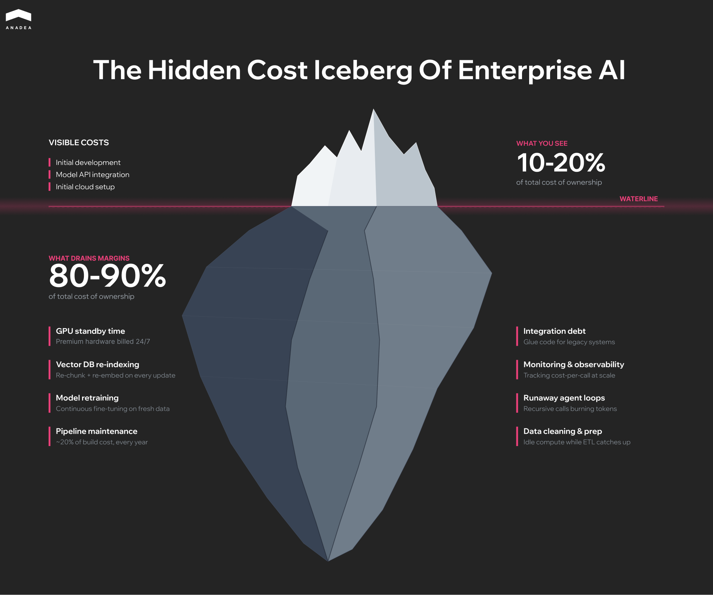
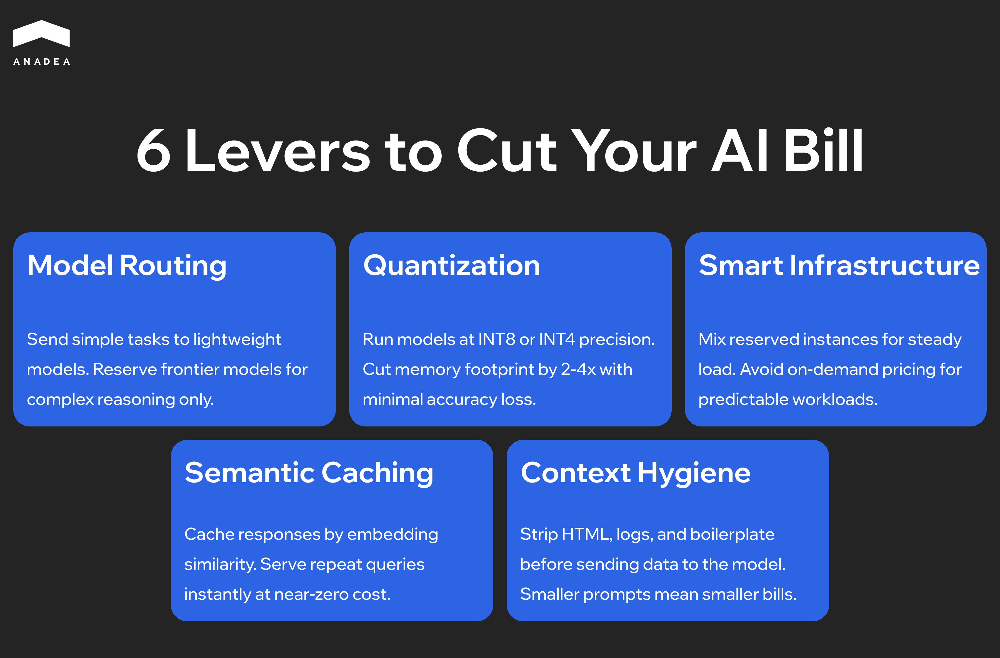

While 64% of business leaders report that AI is a powerful engine for innovation, the financial reality at the enterprise level is less optimistic. According to recent McKinsey research, “[The state of AI in 2025](https://www.mckinsey.com/capabilities/quantumblack/our-insights/the-state-of-ai)”, only 39% of organizations see a measurable impact on their EBIT at the enterprise level. This ROI gap is often the result of a lack of proper AI cost optimization strategies and a failure to plan for the hidden costs of scaling.

In this article, we will explain why AI costs spiral and how you can reclaim your margins. 

## Why AI Costs Grow in Enterprise Systems

Organizations often miscalculate budgets because they focus entirely on the initial build and ignore the compounding daily AI infrastructure cost required to keep the system running.

An AI-driven prototype does not scale neatly as you add more users. When you move to production, complex user requests trigger background processes that multiply your data usage unexpectedly. What looks like a predictable monthly expense spirals out of control without strict usage limits.

### Infrastructure: GPU Provisioning Trap

Running AI requires specialized accelerators (GPUs or TPUs) (like NVIDIA H100, H200, or the newer Blackwell-series GPUs). Keeping them active 24/7 is not feasible. If you rent premium cloud servers just to wait for user inputs, you are draining your budget on standby time.

That’s why it makes sense to stop using the most expensive systems for simple tasks. Instead, you can route basic workflows to smaller AI models. Heavy-duty processing should be used only when a task actually requires complex reasoning.

### Data Architecture and Vector Storage Burn

Large Language Models rely on Retrieval-Augmented Generation (RAG) to prevent hallucinations. RAG requires vector databases. These are not static cold-storage buckets. Vector databases are high-memory compute environments. Every time your internal document corpus updates, your system must re-chunk, re-embed, and re-index the data.

As your context window grows, your memory utilization scales. Data processing quickly eclipses the cost of the LLM itself.

### Pipeline Maintenance

[AI implementation](https://anadea.info/blog/how-to-implement-ai-in-business/) is only the beginning. The way your customers ask questions and the information they need will shift, which gradually makes your initial AI setup less accurate.

You can’t simply download a quick software patch to fix an outdated AI. You have to continuously retrain the system on new data. Expect to spend up to one third of your original build cost every year on maintenance to keep the system functional.



## Key Areas of AI Cost Management

High AI costs are usually a result of using too much power for simple tasks. It’s vital to understand that you don't need the world’s most powerful AI to summarize a basic email. Optimization is about matching the compute intensity to the difficulty of the job.

### Model Tiering: Using the Right Tool

The most common source of waste is using a genius-level AI for repetitive data entry. Using top-tier models like GPT-4 for basic sorting is an expensive mistake that drains your profit margins.

Based on our experience, we recommend implementing a router pattern. This approach, which is a key element of [AI orchestration](https://anadea.info/blog/what-is-ai-orchestration/), presupposes using a lightweight, high-speed model (like Groq-hosted Llama or Gemini Flash) for initial triage and formatting. Only pass the request to an expensive, high-powered model when the task is actually complex. This strategy can significantly cut your AI bill while keeping the quality of results exactly the same.

### Infrastructure: Buying Wholesale vs. Retail

Most companies pay full price for computer power they don't fully use. Running FP16 (16-bit) precision models in production is often unnecessary for enterprise logic. By applying 4-bit or 8-bit quantization, you can reduce the amount of memory it needs by half without losing accuracy.

This allows you to fit larger models on cheaper, consumer-grade hardware or smaller cloud instances. Furthermore, if your workload is non-synchronous (like batch processing data for a dashboard), move the compute to spot instances. You trade 100% uptime for a 70-90% discount on GPU hourly rates.

### Data Efficiency

Processing data is a hidden tax. If you don't have a system to remember past work, your AI will spend money re-learning the same information every time a user asks a question.

* **Smart caching.** If two people ask the same question ten minutes apart, the system should show the first answer instead of paying to generate a new one.
* **Data cleaning.** Stop sending raw HTML or system logs to the model. By cleaning the text before the AI reads it, you can reduce your costs immediately.

### Decreasing AI Deployment Cost: Auto-Scaling to Zero

Standard cloud instances charge you for the hour, regardless of whether you are running 1 prompt or 1,000.

To reduce your costs, you can shift to serverless GPU deployments or Kubernetes-based auto-scalers (KEDA). Your infrastructure should scale to zero during off-peak hours and spin up rapidly during enrollment spikes. If your servers are running 24/7 at low capacity, your setup is misconfigured.

## Core AI Cost Optimization Strategies

Cost reduction can’t be treated as a one-time audit. It is a structural alignment of your tech stack with your unit economics. If an AI feature costs more to run than the user pays for the seat, you have a financial liability.

### Performance vs. Cost

Stop using world-class AI models for routine data cleanup. You can use a massive, expensive model (such as Claude Opus 4.7) to train a smaller, specialized model (such as Mistral 7B) to do one specific task perfectly.

You retain 90% of the reasoning capability and cut your processing costs by up to 10x.

### Operational Automation

Manual monitoring is a bottleneck. You need to implement automated circuit breakers at the API key level. If an agent enters an infinite loop or a recursive logic error, your system must kill the process before it drains the budget.

For example, you can use monitoring tools to identify "Heavy Callers". These are specific users or features consuming 80% of your resources. Apply usage limits automatically to prevent a single bug from quickly consuming your monthly budget in just a few hours.

### Business Alignment

Every AI feature must be audited against its actual return on investment. If a feature is slow, expensive to run, and rarely used by customers, it is a financial burden.

Focus your budget on high-value, low-data workflows. Specialized tasks like automated scheduling or data extraction provide clear financial returns without the excessive token usage associated with open-ended chat features.

The table below contains a brief comparison of the mentioned strategies and their financial impact.

<table>

<thead>

<tr>

<th>

<strong>Strategy</strong>

</th>

<th>

<strong>Business Implementation</strong>

</th>

<th>

<strong>Financial Impact</strong>

</th>

</tr>

</thead>

<tbody>

<tr>

<td>

Specialized models

</td>

<td>

Use smaller models for simple, repetitive tasks

</td>

<td>

High (direct bill reduction)

</td>

</tr>

<tr>

<td>

Smart memory

</td>

<td>

Remember previous answers to avoid paying twice

</td>

<td>

Medium (faster performance)

</td>

</tr>

<tr>

<td>

Data cleaning

</td>

<td>

Remove digital clutter before the AI reads it

</td>

<td>

Medium (lower data costs)

</td>

</tr>

<tr>

<td>

Automatic scaling

</td>

<td>

Turn off the servers when nobody is using them

</td>

<td>

High (reduced rent costs)

</td>

</tr>

</tbody>

</table>

## Cost of AI Implementation

AI spend is not a one-time construction fee. Development and integration are merely entry costs. The long-term budget is consumed by the "Data-Compute-Maintenance" triad. These are the costs you should consider while planning your budget.

* **Integration debt.** Connecting unpredictable AI outputs to old, rigid software requires constant, expensive custom engineering to keep the systems talking.
* **Server rent.** You are paying for high-performance hardware and usage credits every time the AI processes a request.
* **Data pipeline.** Keeping the AI’s information current requires a continuous, paid flow of data processing and indexing.
* **Maintenance.** Anticipate annual maintenance and monitoring expenses that represent a substantial portion of your original development budget.



## AI Cost Optimization in Practice

Practical optimization is about eliminating waste, not features. In a production environment, this requires three specific shifts in how your system handles work.

### Workflow Automation

Manual data preparation is a primary cost driver because expensive servers often sit idle while humans clean or move files.

To avoid this bottleneck, we recommend replacing human-in-the-loop Extract, Transform, Load (ETL) with automated validation pipelines. With [AI automation](https://anadea.info/services/ai-automation), you can implement event-driven triggers to ensure that compute resources only spin up when data is ready for processing. This prevents idle-wait costs where GPUs sit active while upstream data is still being cleaned.

### Machine Learning Cost

Running a massive, general-purpose AI for every task is an expensive oversight. You can distill a giant model into a smaller, specialized version that performs the same specific task with 80% less memory. 

Using specialized inference engines, like vLLM or NVIDIA TensorRT, allows the system to process multiple requests at once. This maximizes the throughput of every GPU cycle and prevents hardware under-utilization.

### AI Infrastructure Optimization

Most companies overpay for generic computer power. For AI cost reduction, it makes more sense to shift from general-purpose compute to specialized inference hardware (for instance, AWS Inferentia or Google TPUs). 

If your workload is predictable, you can opt for reserved instances instead of on-demand retail pricing. This step can result in 40-60% AI cost savings.

For irregular spikes, use serverless systems. These systems terminate and stop charging you the moment the task is finished.

## Lifecycle Governance: Monitoring AI Cost Efficiency

Continuous monitoring prevents budget surprises. AI systems are dynamic. A prompt change in a single module can lead to a 200% increase in token consumption overnight. Without real-time tracking, you are managing by guesswork.

You need more than a monthly total. Effective dashboards must show exactly which features, customers, or departments are driving the bill.

To have access to this data, you need to introduce metadata tagging for every inference call. Instead of looking at total spend, track the cost per successful answer. If a specific feature starts costing more than the revenue it generates, your system should alert you immediately.

### Performance Metrics: How to Identify Compute Waste

Slow performance is usually a sign of wasted money. If it takes too long for your AI system to provide the expected output, it is likely processing unnecessary data. 

What parameters should you pay attention to?

* **Answer efficiency.** Are you paying to send 50 pages of background data just to get a one-sentence answer?
* **Memory success.** Check whether the system remembers past answers. If not, you pay for the regeneration of the same information every time.
* **Processing bloat.** Spikes in wait times often mean the AI is struggling with bloated or confusing instructions.

### Iterative Optimization in the Long-Term

The system you launch on day one is rarely the most efficient version. Long-term profitability requires a feedback loop that identifies expensive habits.

Use production logs to identify the 10% of prompts that consume 80% of your resources. Fine-tune a specialized Small Language Model (SLM) on those specific inputs.

Over time, you can replace expensive, general-purpose models with these highly efficient, specialized tools.

## How to Build Cost-Efficient AI Systems

Cost is not a metric to audit after deployment. You should consider this aspect as a primary architectural constraint. Trying to fix an expensive prototype after it has launched is an exercise in damage control.

Building for profit requires cost-aware design from day zero. This means choosing the right amount of computer power for every specific feature, rather than defaulting to the most capable AI model available.

### Innovation vs. Financial Reality

Enterprise innovation fails when the cost of running the service is higher than what the customer pays for it. To balance cutting-edge capability with cost control, you should adopt a modular reasoning engine approach.

Instead of a monolithic AI stack, decouple workflows into high-logic and low-logic segments. Use frontier models strictly for the 5% of tasks requiring complex planning or cross-domain synthesis. Route the remaining 95% to specialized, fine-tuned models hosted on-prem or via lower-tier endpoints.

### Sustainable Growth

Scaling a system that wastes data is a recipe for financial failure. A sustainable AI setup relies on three pillars:

* **Traffic control.** You should implement a gateway that automatically sends easy questions to cheap models and hard questions to expensive ones.
* **Flexible infrastructure.** It is recommended to move away from always-on servers toward systems that only turn on (and charge you) when a user is actually active.
* **Data lifecycle management.** Regularly cleaning out old or redundant data prevents your search systems from becoming bloated and expensive to maintain.

## Wrapping Up

To ensure your AI project is financially sustainable, you need a strategy that balances performance with price. True cost efficiency requires a layered AI cost management strategy. It covers different aspects and approaches, from automating data pipelines to using smaller models for simpler tasks. Thanks to such steps, you can significantly lower your monthly bill without sacrificing the quality of the results.

At Anadea, we’ve been focused on cost-efficient AI deployment and development since 2019. With our solid expertise in such services, we know how to make AI your high-performing asset instead of a growing expense.[ Contact us](https://anadea.info/contacts) to learn more about our experience.
