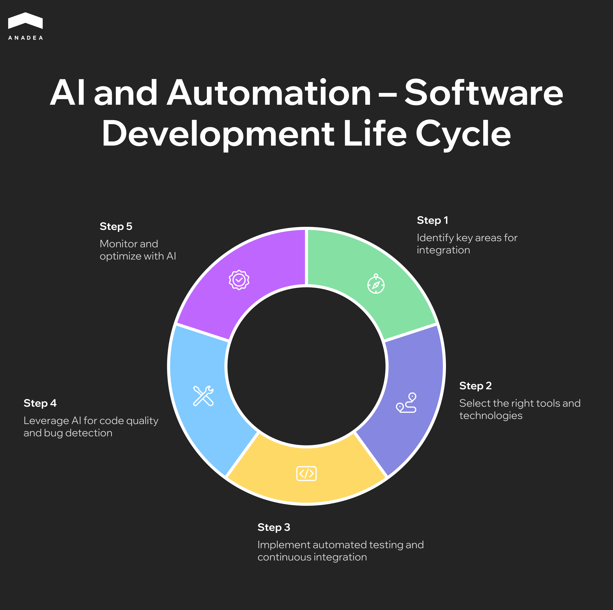
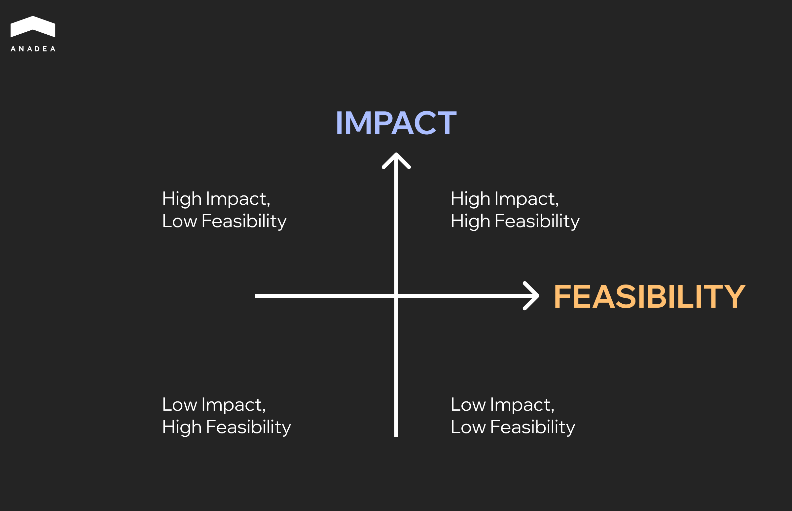

The[ JetBrains Developer Ecosystem Survey 2025](https://devecosystem-2025.jetbrains.com/) revealed that 85% of developers use AI tools on a regular basis. At the same time, 62% of the experts who participated in the survey stated that they rely on at least one AI-powered coding assistant or code editor. These statistics suggest that AI has already entered the mainstream of software engineering. Intelligent tools are reshaping the way software is written and tested. AI-driven development amplifies human creativity and speeds up the process of app creation. 

With AI systems, teams can overcome traditional issues such as repetitive coding and incomplete test coverage. Moreover, they help reduce bottlenecks in collaboration and code review, as well as accelerate release cycles without compromising quality. 

In our article, we will talk about the benefits of AI-driven product development and approaches to AI implementation.

## AI-Driven Software Development: What Is It?

AI-driven product development is the practice of using artificial intelligence tools and technologies (like code generation models, automated testing agents, predictive analytics, etc.) to optimize different stages of the software development lifecycle (SDLC).

In this approach to software creation, AI allows teams to move beyond simple automation. AI models learn from vast datasets and context extracted from ongoing projects. As a result, it can act as a co-developer and decision-support system and assist humans in design, coding, testing, documentation, and operations. 

Core principles of AI-driven development:

* **Human-in-the-loop**. AI provides recommendations, generates code, identifies risks, and accelerates delivery. But final decisions remain under human oversight. Developers must review, validate, and guide AI output.
* **Traceability**. Every AI-generated output, such as code or design, should be explainable and traceable back to inputs and human approvals.
* **Security-by-default**. AI tools must be built upon secure coding practices and data-protection controls.
* **Measurable outcomes.** To justify the use of AI in their daily workflows, teams should track measurable improvements in quality and velocity.

The rise of intelligent code generation is one of the main AI-driven software development trends. In 2025, several tech giants launched their AI coding models. For example, according to [Reuters](https://www.reuters.com/world/china/alibaba-launches-open-source-ai-coding-model-touted-its-most-advanced-date-2025-07-23/), in July 2025, Alibaba introduced its Qwen3-Coder. It is an open-source AI model for software development that is positioned as one of the most advanced coding tools at the moment. Meanwhile, in September 2025, [Anthropic](https://www.anthropic.com/news/claude-sonnet-4-5) presented Claude Sonnet 4.5. This strong model outpaces many of its competitors in reasoning and math, and is designed for creating complex agents. 

There are some areas where artificial intelligence has proven efficiency. Meanwhile, there are also development workflows where it makes no sense to implement this technology. Let’s briefly consider them.

### What AI Is Good at Now

* **Pattern completion**. AI can be successfully applied to extend existing patterns. For example, AI-powered tools can write code that will match a team’s style or predict missing functions.
* **Summarization**. Artificial intelligence can condense logs, documentation, or codebases into comprehensible overviews.
* **Repetitive coding and testing.** AI-driven development is an effective method for reducing the time required to create an app. AI can generate boilerplate and test cases, while human developers can work on strategic and more creative tasks.

### What AI Isn’t Good at Now

* **Novel architecture design**. AI currently lacks the capacity for original architectural thinking. It can’t create new paradigms or systems that break from known patterns. It always tends to reproduce what it has learned from the available data.
* **Ambiguous decisions**. At the moment, AI systems can’t reliably interpret all business goals or prioritize conflicting requirements. Moreover, they struggle to understand real user intent or context.
* **Strategic trade-offs**. When it comes to balancing cost, security, performance, and maintainability, human judgment and domain experience are still a must.

### AI-assisted vs AI-automated vs AI-augmented SDLC

AI can play various roles across the SDLC. To effectively integrate this technology into your workflows, you need to distinguish between augmentation, assistance, and AI-driven software development automation.

Each of them represents a different combination of human oversight and AI autonomy. The table below includes the key characteristics of each model so that you can define the appropriate option for your team.

<table>

<tbody>

<tr>

<td>

<strong>Parameters for Comparison</strong>

</td>

<td>

<strong>AI-assisted Development&nbsp;</strong>

</td>

<td>

<strong>AI Automation&nbsp;</strong>

</td>

<td>

<strong>AI-augmented Development</strong>

</td>

</tr>

<tr>

<td>

AI role

</td>

<td>

AI provides suggestions and completions.

</td>

<td>

AI performs entire tasks or workflows end-to-end with minimal human oversight.

</td>

<td>

AI enhances human reasoning with predictions and explanations.&nbsp;

</td>

</tr>

<tr>

<td>

Typical use cases

</td>

<td>

Code completion, test generation, documentation summarization.

</td>

<td>

Automated bug triage, dependency updates, low-risk script generation.

</td>

<td>

Architecture optimization, release planning, incident analysis.

</td>

</tr>

<tr>

<td>

Human role

</td>

<td>

Humans retain full control. They need to review, accept, or reject AI output.

</td>

<td>

Humans monitor outcomes or handle exceptions.

</td>

<td>

AI and humans collaborate dynamically. Humans set direction, while AI provides reasoning support.

</td>

</tr>

</tbody>

</table>

AI-driven Development: Quick Wins and Long Bets

AI-driven software development can provide a lot of new opportunities and benefits for teams, from resource and cost optimization to code quality enhancements. But it is also very important to keep in mind that not every use case delivers equal value.

When considering the implementation of AI into your workflows, you should prioritize high-ROI initiatives and start with those that deliver quick wins. And further, you can move to more complex use cases that can be viewed as longer-term bets.

### Quick Win Use Cases

Early AI adoption should focus on use cases that require minimal setup and deliver visible productivity boosts within weeks. These are tasks where AI can act as a coding co-pilot or workflow accelerator. But at the time, for its implementation, you do not need to disrupt core systems or somehow change developer habits.

* **Code completion and pair programming**. Tools like GitHub Copilot or Cody can speed up implementation and reduce boilerplate.
* **Unit test generation.** AI can automatically create and maintain tests.
* **Documentation updates**. You can introduce AI systems that will generate summaries or API references based on the existing codebases.
* **Backlog grooming and release notes,** AI can be helpful for ticket categorization, priority suggestions, and producing readable summaries for stakeholders.

### Mid-Term Opportunities

When you see that the first AI tools have started to bring you real value, you can proceed to experimenting with further AI implementation. Mid-term use cases include integrating AI deeper into development and operations.

Such initiatives often require process adaptation or a tighter connection with existing platforms.

* **Automated refactoring assistance.** AI agents can make suggestions or implement safe code restructuring to reduce technical debt.
* **Incident and runbook drafting.** AI can summarize incidents and update operational documentation.
* **Dependency and version upgrades.** You can rely on AI to automate routine maintenance with contextual risk assessment.

### Long Bets

These use cases explore emerging opportunities where AI could meaningfully transform how teams build and sustain software.

* **Spec-to-code pipelines.** Artificial intelligence can transform structured requirements directly into working prototypes or service templates.
* **Prompt-to-app scaffolding**. Tools with such functionality can generate entire application skeletons or infrastructure blueprints from natural language prompts.
* **Intelligent canary analysis**. AI models can evaluate release performance and detect anomalies. Apart from this, with their help, it is possible to automate rollback triggers.
* **Autonomous maintenance**. Artificial intelligence enables systems to self-diagnose and optimize without human intervention.

## How to Start AI Adoption

Without a clear roadmap and use case prioritization, even the best AI-driven software development services won’t bring the expected results and improvements. That’s why we have prepared this step-by-step plan that will help you avoid the most common mistakes in AI implementation.

The image below shows the steps that will help you strengthen your SDLC with AI tools.

### Map Opportunities with an Impact and Feasibility Matrix

Based on our experience in AI-driven SaaS development and building other solutions with the help of this technology, we recommend that you begin by identifying where AI can make the biggest difference in your SDLC. To do it, you need to collect opinions from your engineering, design, QA, and DevOps teams.

Then, each use case should be placed on an impact and feasibility matrix.

Here’s what this matrix traditionally looks like.

* **Impact**. What value could this create (for example, time saved, quality improved, risk reduced, etc.)?
* **Feasibility**. How easily can it be implemented with your current data and processes?

At the very beginning, you should focus your efforts on high-impact, high-feasibility options. These are your quick wins.

### Select 2-3 Pilot Initiatives

It won’t be feasible to invest your resources in many initiatives at once. Instead, choose two or three pilot projects that can deliver tangible results in the near future. 

For instance, you can start with:

* Automating unit test generation for a core service;
* Introducing AI-assisted code review summaries;
* Implement AI to draft release notes or refine backlog grooming.

### Establish Clear Baselines and Metrics

Each pilot should have defined success metrics and a feedback loop. You need to learn from your AI initiatives. This will allow you to continuously enhance them over time.

What you should focus on:

* Developer productivity (time needed for coding, reviewing, or fixing defects);
* Code quality (bug rates, test coverage, and rework percentages);
* Delivery performance (cycle time and deployment frequency).

### Build Feedback and Learning Loops

AI systems improve through iteration. It is vital to incorporate regular retrospectives to capture lessons learned from each pilot. Your team should document what data sources, tools, or human review processes were most effective. Such insights are highly valuable to refine future AI integrations.

#### Scale with Governance and Enablement

When you see that your pilot projects demonstrate measurable value, it is time to create the foundations for their scaling.

* **Governance**. You need to define standards for data usage and model transparency. Moreover, you should pay special attention to the security principles that your AI initiatives will follow.
* **Enablement**. It is crucial to provide training and guidelines for your teams so that they can adopt AI safely and efficiently.
* **Deployment**. Successful pilots should be integrated into existing CI/CD and code review pipelines.

These principles will allow your team to leverage AI and maximize productivity safely.

## Conclusion

AI-driven software development is gradually reshaping all the stages of SDLC. Today, artificial intelligence can be applied to accelerate coding and testing, enhance documentation and backlog management, as well as optimize release workflows. Thanks to AI implementation, teams can focus on high-value tasks without allocating too many resources for repetitive processes that don’t require human creativity or critical thinking. 

AI adoption requires a strategic approach. Steps like prioritizing use cases, maintaining human-in-the-loop oversight, ensuring traceability, and measuring outcomes are crucial for your AI initiatives.

If your team is planning to introduce AI in its development approach, you may need professional help in strategic planning or AI implementation. In this case, our AI experts are always ready to support you.[ Tell us about your ideas](https://anadea.info/free-project-estimate) and we will find the best solution for you!
