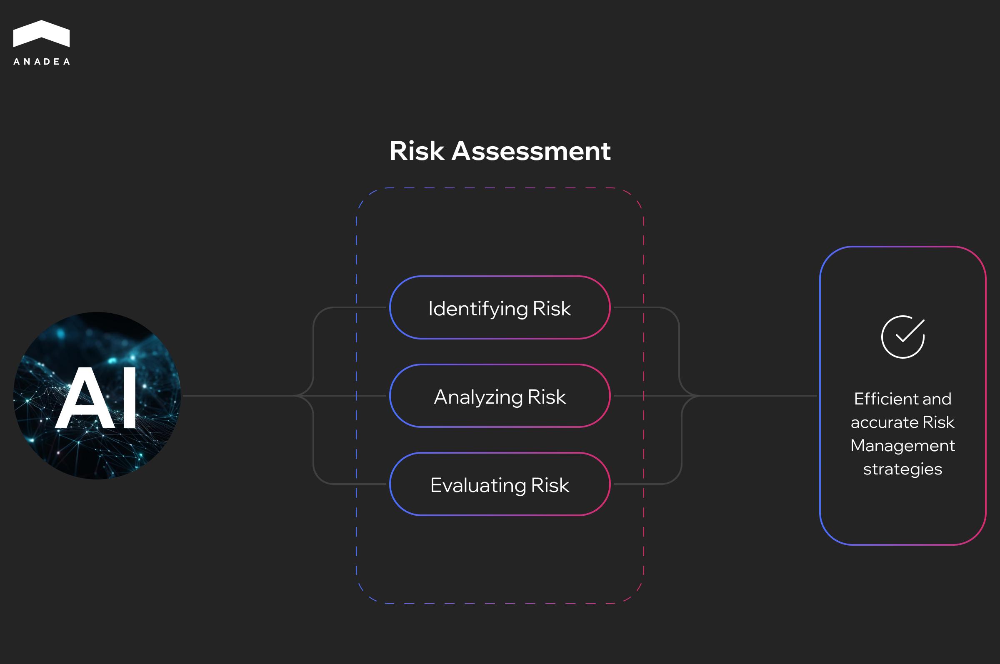

Blocked transactions, lengthy procedures, and slow risk assessments are among the most common pain points in traditional financial systems. Conventional methods rely heavily on manual reviews and repetitive compliance tasks, which are error-prone and time-consuming.

Artificial intelligence can address these issues by automating a lot of tasks and transforming the traditionally reactive risk management function into a proactive, strategic capability. 

The value of [AI in finance](https://anadea.info/blog/ai-in-fintech/) is clearly demonstrated by statistics. Currently, AI adoption across finance functions is rising quickly. The Gartner survey shows that in 2025, [59% of finance functions were using AI](https://www.gartner.com/en/newsroom/press-releases/2025-11-18-gartner-survey-shows-finance-ai-adoption-remains-steady-in-2025). In [2024](https://www.gartner.com/en/newsroom/press-releases/2024-09-11-gartner-survey-shows-58-percent-of-finance-functions-use-ai-in-2024), this share was 58% and, in 2023, around 37%.

In our article, we invite you to explore the role of AI in finance risk management and discover the new opportunities that this technology opens for businesses.

## What AI in Financial Risk Management Means

To better understand the value of AI in financial risk management, let’s take a closer look at the technologies and tools that can be applied in this field today.

* **Machine learning.** ML algorithms are typically trained on large volumes of historical data. This allows them to identify even the most complex patterns and forecast future outcomes. For example, such tools can predict the likelihood of an individual defaulting on a loan, or flag a transaction as high-risk for fraud before it is fully processed.
* **Graph analytics.** This approach relies on algorithms to analyze relationships between entities, including people, accounts, transactions, and devices. Graph analytics can help uncover networks of seemingly unrelated accounts that are all connected to a single malicious entity.
* **Natural language processing (NLP).** NLP enables computers to read, interpret, and process human language. In financial risk management, NLP tools are used to analyze unstructured data, including huge volumes of internal emails, contracts, regulatory documents, and news articles. This helps spot compliance violations, reputational risks, or contractual exposures.
* **Generative AI.** GenAI can be applied to generate new content. As a result, this technology can help automate the process of drafting regulatory reports and synthesizing complex risk summaries for executive briefings, as well as creating realistic synthetic data for testing new risk models.
* **RPA and intelligent automation.** AI is also highly valuable for automating repetitive, rules-based tasks. For instance, AI-powered systems can automatically collect data for compliance reports and initiate a hold on a suspicious transaction flagged by an ML model.

### Three Lines of Defense and the Role of AI

The classic three lines of defense model provides a clear framework for how AI is deployed and how it can improve effectiveness at every level.

<table>

<tbody>

<tr>

<td>

<strong>Line of Defense</strong>

</td>

<td>

<strong>Traditional Role</strong>

</td>

<td>

<strong>AI&rsquo;s Impact</strong>

</td>

</tr>

<tr>

<td>

1st line: Business/risk owners

</td>

<td>

Risk management in daily operations

</td>

<td>

AI can be embedded in day-to-day tools to prevent incidents in real time. ML-powered tools are used in credit scoring, real-time fraud alerts in payment systems, and automated control checks.

</td>

</tr>

<tr>

<td>

2nd line: Risk and compliance

</td>

<td>

Risk management overseeing, policy setting, and controls monitoring

</td>

<td>

AI shifts oversight from periodic checks to continuous monitoring. For example, NLP systems can track regulatory changes and map them to internal policies.

</td>

</tr>

<tr>

<td>

3rd line: Internal audit

</td>

<td>

Independent assurance on the effectiveness of the first two lines

</td>

<td>

AI enables the automation of the analysis of all transactions to identify anomalies. This leads to faster and more comprehensive audits.

</td>

</tr>

</tbody>

</table>

### Key Benefits of AI in Financial Risk Management

The introduction of AI systems in risk management has significant business outcomes.

* **Loss reduction.** AI helps significantly lower financial exposures from fraud, credit defaults, and operational errors as it can accurately predict high-risk events.
* **Fewer false positives.** Traditional systems often overload human investigators with irrelevant alerts. AI reduces the noise. As a result, risk professionals spend time only on genuine threats. This reduces investigation costs and improves customer experience as fewer legitimate transactions are blocked by mistake.
* **Faster investigations.** NLP and automation systems accelerate the due diligence process and cut investigation time from weeks to hours or minutes.
* **Boosted capital efficiency.** More precise risk modeling lowers required regulatory capital buffers. This single step releases substantial funds that institutions can deploy for growth and higher-return investments.
* **Compliance and audit readiness.** AI enables continuous monitoring of controls and compliance, which provides real-time visibility into the control environment.

## AI Applications in Financial Risk Management

If you are considering the implementation of AI in risk management at your organization, we strongly recommend starting with specific, high-impact use cases. You should focus on areas with strong data availability and clear business metrics. This will allow you to achieve rapid ROI and create a good base for further AI adoption.

### Credit Risk

Credit risk is a foundational area where predictive analytics delivers the most tangible results. The goal of applying AI in [loan solutions](https://anadea.info/solutions/fintech-software-development/p2p-lending) is to move beyond static scoring and create a dynamic view of a borrower’s future behavior. Advanced techniques like gradient boosting machines and specialized time-series forecasting ensure precise capital allocation and proactive intervention.

AI is used for:

* Predicting probability of default (the likelihood that a borrower will fail to meet debt obligations over a specific time horizon);
* identifying loss given default (the percentage of the exposure that the institution expects to lose after taking into account recovery efforts if a default occurs);
* calculating exposure at default (the predicted outstanding balance at the time of default);
* implementing highly effective early warning systems;
* optimizing collections prioritization workflows.

What types of data are used?

* Traditional bureau data;
* rich transactional history;
* dynamic behavioral data;
* alternative data sources, including utility payments and public sentiment.

Explainability is essential to ensure that adverse-action notices meet legal and regulatory standards. Achieving this requires strong reject-inference techniques to correct for sample bias and improve the representativeness of training data.

Many banks, like [Intesa Sanpaolo](https://group.intesasanpaolo.com/en/newsroom/press-releases/2023/05/intesa-sanpaolo--artificial-intelligence--and-banking-supervisio), have successfully implemented machine learning to calculate regulatory capital for credit risk and predict the probability of default. As Intesa Sanpaolo revealed in its press release, the Group Supervisory Strategic Steering Department created and launched Lisa (Linguistic Intelligence for Supervisory Awareness). It is an ML tool that efficiently processes large volumes of supervisory publications. It identifies semantic patterns and objective correlations and demonstrates strong predictive capabilities.

### Market and Liquidity Risk

Market conditions shift rapidly. That’s why businesses require models that can operate in near real-time and can simulate extreme scenarios.

AI use cases:

* Intraday value-at-risk forecasting (AI can predict the maximum expected loss over a specific period); 
* deep stress testing simulations (AI uses generative models and advanced correlation analysis to create thousands of highly realistic tail-risk scenarios);
* real-time limit monitoring (AI systems integrate directly with trading platforms to provide continuous calculation and visualization of current exposure against the existing limits);
* breach prediction (anomaly detection and short-term time-series forecasting models predict the probability that a specific limit will be breached within the next 30 minutes or hour).

What types of data are used?

* High-frequency tick data;
* yield curves;
* volatility surfaces;
* key macro-economic factors;
* firm-specific liquidity metrics.

### Operational Risk and Internal Controls

AI-powered risk management systems can be used to automate control testing and identify weaknesses before they become a real threat. For example, classification algorithms can predict incident type, while process mining tools can map control flows.

AI use case in operational risk and internal controls:

* Predicting incident occurrence frequency (ML classification models analyze vast amounts of internal data to predict the probability of an incident occurring over a given time frame);
* severity forecasting (regression models are used to estimate the potential financial and reputational impact if an incident occurs);
* enhancing risk and control self-assessments (LLMs can read and assess existing control narratives, while NLP models analyze unstructured documents to make the RCSA process more objective and accurate);
* automating control testing procedures (automated systems deploy AI agents that continuously audit 100% of all transactions, access logs, and configuration settings on a 24/7 basis).

What types of data are used?

* Historical incident records;
* key risk indicators
* system logs;
* Ticketing data;
* workflow data;
* internal audit findings.

To maintain the required accountability, it is crucial to introduce human-in-the-loop approvals for all material control changes and major predictive alerts.

Financial Crime (AML, Fraud, Sanctions)

Highly adaptive and fast AI systems are designed to detect evolving threats across vast networks of data.

How is AI used in detecting financial crimes?

* Transaction monitoring (ML models can analyze hundreds of features simultaneously, including geolocation, time of day, device fingerprinting, and the customer’s historical behavior);
* risk analysis for beneficial ownership (AI relies on Graph Embeddings and Graph Neural Networks to model corporate relationships, directors, shell companies, and account connections as a vast network);
* adverse media screening (NLP and LLMs use named entity recognition and sentiment analysis to differentiate between high-risk and low-risk cases); 
* automated case triage and scoring (ML models and LLMs help rapidly assess the risk level of new alerts based on all available data).

What types of data are used?

* Payment records;
* detailed KYC information;
* device fingerprinting;
* network relationship data;
* global sanctions lists;
* unstructured news feeds.

Mastercard employs its AI-driven [Decision Intelligence](https://b2b.mastercard.com/ai-and-security-solutions/fraud-and-decisioning/decision-intelligence) system to evaluate every transaction in real time. The system uses machine learning to assess historical spending patterns, customer behavior, and global fraud indicators. This approach has helped the company reduce false declines and increase fraud-detection accuracy by more than 40%. The platform processes over [160 billion transactions](https://ijsret.com/wp-content/uploads/IJSRET_V11_issue3_996.pdf) annually.

### Compliance and Conduct Risk

The regulatory landscape is constantly changing, and AI can help institutions deal with all the updates.

How businesses use AI-powered solutions in this sphere:

* Policy and regulatory Q&A copilots (these copilots use LLMs and RAG to provide grounded answers to complex compliance questions);
* comprehensive communications surveillance (advanced NLP tools can analyze the context and sentiment of employee communications across all channels, including email, messengers, voice call transcripts, etc.);
* automated regulatory mapping to internal controls (NLP and text embedding models can read and understand new or updated regulatory texts).

What types of data are used?

* Internal policies;
* external regulatory texts;
* employee emails and chats;
* voice transcripts;
* internal ticketing records.

To ensure the seamless and safe functioning of such solutions, strict hallucination controls and prompt security are required.

Today, a lot of banks are investing in AI-driven compliance management projects. For instance, Standard Chartered’s innovation arm, SC Ventures, is [working](https://scventures.io/sc-ventures-partners-with-astar-to-leverage-ai-for-smarter-regulatory-compliance/) with Singapore’s A*STAR on AI projects to improve regulatory compliance. One of the implemented projects was aimed at exploring the capabilities of AI and GenAI in automating mapping regulatory obligations.



## Challenges of AI in Financial Risk Management and How to Address Them

Though today we can observe significant progress in AI software development, even the most advanced models can fail due to organizational or data maturity issues. However, when you are aware of the potential challenges of AI in financial risk management, you can be ready to mitigate their consequences. 

At Anadea, we have more than 6 years of experience in building AI tools, which allows us to accumulate a deep understanding of potential pitfalls and the ways to overcome them.

### Poor Ground Truth

AI models can learn from incorrect or incomplete labels. This leads to inaccurate predictions and can degrade model performance over time.

To address this issue, you should implement explicit labeling strategies and active learning programs. It means that you should systematically review high-uncertainty data points and use expert feedback to maintain a high-quality training dataset.

### Over-Automation

Completely removing the human element can lead to significant failure, especially in high-stakes scenarios, like sanction alerts or customer rejection.

That’s why we recommend maintaining human checkpoints for high-risk decisions. While AI can provide a recommendation and context, the human is responsible for the final sign-off.

### Misaligned Incentives

If data science teams are only rewarded for technical accuracy, not for the risk-adjusted business outcome, model design may be optimized for the wrong metrics.

To avoid this, you need to tie KPIs directly to the risk-adjusted business impact (for example, net recovery uplift or reduction in actual losses). 

### Latency and Throughput Mismatch

Even a highly accurate model deployed with slow infrastructure will be useless for real-time applications.

It’s necessary to architect ML systems for high volume and low-latency from the outset. Apart from this, it is vital to use fast data stores and deploy models with scalable compute resources.

### Documentation Debt and Explainability

As risk models are heavily regulated, documentation is mandatory. Moreover, the decisions made by models should be explainable.

Businesses should implement tools for the automatic generation of model cards and validation summaries. The use of Explainable AI (XAI) techniques like SHAP is also crucial for every high-risk model decision.

## AI in Financial Risk Management Future Trends	

The following [fintech software development trends](https://anadea.info/solutions/fintech-software-development) highlight how AI will redefine the future of financial risk management in the near future.

* **Generative AI for stress testing and synthetic data.** LLMs and GenAI help create realistic synthetic datasets and dynamic stress-test scenarios. This allows firms to simulate novel market crises and evolving fraud patterns that have not yet occurred in historical data.
* **Privacy-preserving AI.** It is expected that AI models will be trained on decentralized data across different business units or separate institutions without sharing the raw data itself to meet stringent privacy regulations.
* **AI agents for autonomous risk workflows.** Agentic AI systems will be able to execute multi-step risk workflows autonomously. For example, an AI agent can detect an anomaly, automatically pull relevant compliance policies, consult an internal knowledge base, and draft the initial investigation report. A human analyst will make a final review.
* **Embedded ethics and responsible AI frameworks**. To address ethical issues of AI in financial risk management, it’s necessary to introduce proper measures. Future risk frameworks will include quantitative tools for measuring and mitigating algorithmic bias. This will ensure fairness from the earliest stages of model design through deployment.

## Wrapping Up

The benefits of implementing AI in financial risk management are tangible. AI-driven systems offer unparalleled speed and accuracy in processing massive datasets. All this allows institutions to detect subtle patterns indicative of fraud or credit default that are often invisible to traditional models.

Thanks to the introduction of AI systems, financial organizations can mitigate losses and unlock new opportunities for optimized capital allocation. Given all this, AI is gradually becoming the backbone upon which the next generation of financial risk management will be built.

If you already have an idea for an AI-driven solution or you are just considering the feasibility of an AI initiative to address your needs, at Anadea, we are always ready to support you. Our experts will attentively study your requirements and business processes to offer the most efficient approach to AI deployment. [Contact us](https://anadea.info/free-project-estimate) to learn more about our expertise and offers.
