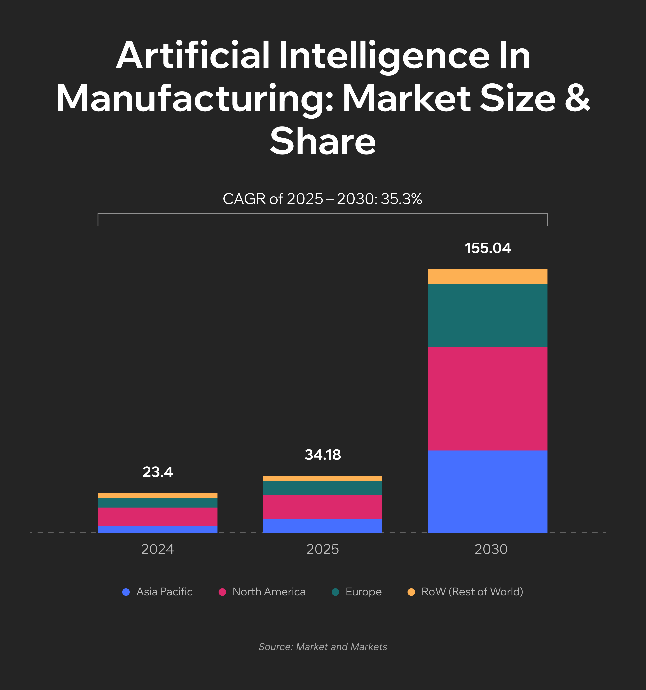
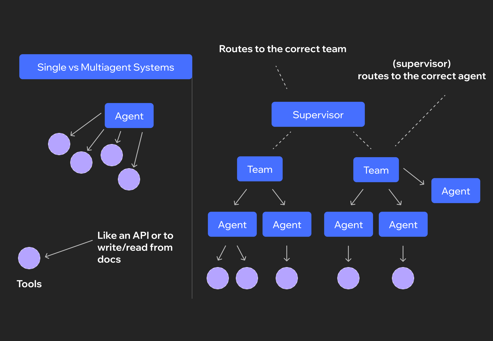

The factory whistle still blows at 6 AM, but something fundamental has shifted. Machines now predict their own failures three days in advance. Vision systems catch microscopic defects that human eyes would miss. Production schedules rewrite themselves when a supplier shipment runs late. This isn't a glimpse into the future. Walk into any automotive, electronics, or heavy manufacturing plant today, and this is what you'll see on a regular Thursday.

The global AI in manufacturing market is projected to grow[ from USD 34.18 billion in 2025 to USD 155.04 billion by 2030](https://www.marketsandmarkets.com/ResearchInsight/artificial-intelligence-manufacturing-market-size.asp), representing a compound annual growth rate of 45.6%. It reflects the stark reality that manufacturers who master these technologies operate in a fundamentally different economic reality than those who don't.

In this article, we will explore real, practice-tested AI in manufacturing examples. We will break down in detail where your company should start, how to select a high-ROI pilot project, and how to avoid common pitfalls during implementation.

## What is AI in Manufacturing

Artificial intelligence in manufacturing refers to technologies that analyze data from equipment and make decisions without rigidly prescribed algorithms. The foundation consists of three technologies: machine learning, computer vision, and natural language processing.

* [Machine learning](https://anadea.info/services/machine-learning-software-development) processes data from sensors, breakdown history, and downtime statistics to identify patterns that cannot be described by simple rules.
* Computer vision analyzes images from cameras – detecting defects, controlling part positioning, and tracking movement in warehouses.
* Natural language processing converts technical documentation, incident reports, and voice commands into structured data for the system.

The key difference from traditional automation is autonomous learning from data. Classical automation executes programmed commands: if a sensor reads X, do Y. AI applications in manufacturing build models based on historical data and adapt to new situations. When conditions change, the system adjusts its behavior without reprogramming.

In manufacturing, AI is applied in three directions.

1. Predictive analytics: systems forecast equipment failures, assess demand, and calculate optimal material inventory levels.
2. Real-time quality control: neural networks inspect products on conveyor belts at speeds unattainable by humans.
3. Autonomous process management: systems independently adjust production parameters, distribute tasks among robots, and optimize energy consumption.

Maximum effect is achieved through integration of all three directions. The system predicts increased demand, automatically adjusts the production plan, orders components, and redistributes tasks across production lines. Simultaneously, it monitors equipment condition and schedules maintenance during periods of minimal load. Managers oversee the process, but the system makes routine decisions autonomously.

## ​​Key Benefits of AI in Manufacturing

### Increasing Productivity and Efficiency

AI systems analyze production line operations in real time and identify bottlenecks that slow down the process. Algorithms optimize the sequence of operations, minimize equipment changeover time, and synchronize work across different sections. The result is increased output on the same capacity without additional investment in equipment. Systems also automate shift planning, task distribution, and queue management, eliminating downtime due to organizational errors.

### Reducing Operating Costs

Predictive analytics enables a shift from scheduled maintenance to condition-based maintenance. Instead of replacing parts according to a schedule, the system determines when a specific component actually needs attention. This reduces spare parts costs and decreases the number of unplanned downtimes. AI optimizes electricity consumption by adjusting equipment power based on load. Systems also identify material waste – tracking scrap, optimizing cutting patterns, and adjusting process parameters to reduce defects.

### Predicting and Preventing Failures

Sensors collect data on vibration, temperature, pressure, and other equipment parameters. Machine learning algorithms detect anomalies that signal an impending failure – weeks or even months in advance. The system alerts the maintenance team and suggests the optimal time for intervention. This allows replacing a part during a scheduled shutdown rather than in the middle of a production cycle. Predictive analytics also determines which spare parts should be kept in stock based on the actual condition of the equipment fleet.

### Supply Chain Optimization

AI forecasts product demand, taking into account seasonality, market trends, economic indicators, and dozens of other factors. Based on forecasts, the system automatically adjusts raw material procurement volumes and production schedules. Algorithms optimize logistics – calculating optimal delivery routes, managing warehouse inventory, and balancing storage costs against shortage risks. Systems also monitor suppliers, assessing delay risks, and suggest alternatives when problems are detected. [Mobile applications are also revolutionizing manufacturing](https://anadea.info/blog/how-mobile-apps-are-revolutionizing-the-manufacturing-industry/) by providing real-time visibility into supply chain operations.

### Workplace Safety

Computer vision monitors compliance with safety protocols in production – whether workers are wearing protective equipment, whether they're maintaining safe distances from equipment. Systems warn of hazardous situations before an accident occurs. AI analyzes incident history and identifies patterns that lead to injuries – certain shifts, areas, or types of operations. Based on the analysis, companies review procedures and strengthen control at critical points.



Whether you're exploring your first AI pilot or scaling proven solutions across multiple facilities, we can help you navigate the implementation process.[ Explore our AI software development services](https://anadea.info/services/ai-software-development) or[ see how we've solved complex manufacturing challenges](https://anadea.info/projects/mpm-iii-erp-for-blast-curtain-manufacturing) for companies like yours.

## Agentic AI in Manufacturing

We see the true power of artificial intelligence for manufacturing precisely in AI agents.

AI agents are software systems that perform complex tasks without constant human supervision. Unlike regular algorithms, agents make decisions independently, interact with other systems, and adapt to changes in the environment.

In manufacturing, agents work as digital specialists, each responsible for a specific area. An inventory management agent monitors material levels and automatically generates orders to suppliers. A quality control agent processes data from inspection systems and initiates corrective actions. A maintenance agent tracks equipment condition and schedules technical service interventions.

The true power of agents lies in their interaction. When a demand forecasting agent sees an increase in orders, it passes information to the production planning agent. That agent adjusts the schedule and informs the procurement agent about material needs. The logistics agent reserves transport. The maintenance agent reschedules planned work to less busy periods. All coordination happens automatically.

Multi-agent systems are particularly effective in large enterprises with distributed facilities. Each plant has its own set of agents for local processes, while central agents coordinate the entire network – distributing orders, balancing workloads, and optimizing logistics between plants.

### Real Example

Siemens has developed the Industrial AI multi-agent system, which combines digital and physical agents, including mobile robots. The agents interact with each other and with third-party solutions, creating a high level of compatibility. According to Rainer Brehm, CEO of Factory Automation at Siemens Digital Industries, [the company anticipates productivity increases of up to 50%](https://press.siemens.com/global/en/pressrelease/siemens-introduces-ai-agents-industrial-automation) through automation itself. The system has already shown results at the Siemens plant in Bad Neustadt, where Industrial Copilot transformed disparate data into actionable insights for production.

## Real-World AI Applications in Manufacturing

Theory is good, but real results speak louder than any promises. Next, we'll examine specific AI in manufacturing examples with cases from companies that have already implemented these technologies and achieved measurable results. Each case is confirmed by official sources and demonstrates exactly how AI in manufacturing industry transforms industrial processes.

### AI for Predictive Maintenance in Manufacturing

A Nexus Controls report indicates that unexpected equipment failures cost manufacturers an average of [$260,000 per hour of downtime](https://www.bakerhughes.com/sites/bakerhughes/files/2023-02/bhcs34645_nc_oncore_launch_power_simplif_wp_r5.pdf). Predictive maintenance helps avoid these catastrophic costs by having AI analyze sensor data and predict problems weeks or months in advance.

Sensors monitor equipment vibration, temperature, pressure, and energy consumption. Machine learning algorithms detect anomalies that signal an impending failure. The system alerts the maintenance team and suggests the optimal time for intervention – during a scheduled shutdown rather than in the middle of a production cycle.

For example, [Siemens uses AI to monitor gas turbines](https://scispace.com/pdf/how-semantic-technologies-can-enhance-data-access-at-siemens-qti5w8va4w.pdf) through a cloud platform that collects data from thousands of sensors. 

Toyota's Indiana plant uses the [IBM Maximo Application Suite](https://www.ibm.com/products/maximo/case-studies) – a cloud-based asset management system with artificial intelligence capabilities. This system enables the team to monitor the condition of equipment and components in real-time, detect anomalous activities, and apply predictive solutions to shift from reactive to proactive maintenance.

### Quality Control Through Computer Vision

Inspectors can check 5-10 parts out of 50 passing on a conveyor belt every second. Computer vision checks all 50 without fatigue, detecting various defects.

Neural networks analyze images from cameras on the conveyor belt, recognizing dozens of defect types simultaneously. Systems learn from hundreds of real images, including perfect parts, components with dust, dirt, and actual defects.

For instance, BMW at the press shop of its Dingolfing plant uses AI in automotive manufacturing to inspect body parts. Previous systems mistakenly flagged dust or oil residue as defects. [The new AI system learns from 100 real images ](https://www.press.bmwgroup.com/global/article/detail/T0298650EN/fast-efficient-reliable:-artificial-intelligence-in-bmw-group-production?language=en)of each characteristic – this eliminates false defects and increases control accuracy.

BMW developed the [AIQX (Artificial Intelligence Quality Next) platform](https://www.bmwgroup.com/en/news/general/2023/BMWGroupIT.html) – a system that uses artificial intelligence and multiple cameras to automate quality control processes across its plants. AI in car manufacturing like this employs numerous cameras positioned along the production line to capture real-time images of vehicles, enabling defect detection and improving product quality.

### Robotic Process Automation

AI-powered robots perform complex operations, adapt to new tasks, and work alongside humans. The technology has evolved from simple repetitive movements to systems that see and sense their surroundings.

In recent news, Amazon developed the [Vulcan robot](https://www.aboutamazon.eu/news/company-news/introducing-vulcan-amazons-first-robot-with-a-sense-of-touch) – the company's first robot that combines vision and touch. The system uses force sensors, vision systems, and machine learning to operate in tight, diverse environments. Vulcan can handle approximately 75% of product types in Amazon warehouses at speeds comparable to humans. Today, Amazon has over 750,000 robots working alongside employees.

### Workplace Safety

Computer vision monitors compliance with safety protocols – whether workers are wearing protective equipment, whether they maintain safe distances from equipment. AI analyzes incident history, identifies patterns, and warns of hazardous situations before an accident occurs.

At Amazon warehouses, robots are involved in various stages of order fulfillment. According to Tye Brady, Chief Technology Officer of Amazon Robotics, [the company aims to improve workplace safety](https://www.geekwire.com/2023/amazons-robots-and-its-larger-vision-for-work-a-conversation-with-robotics-tech-leader-tye-brady) by reducing the need for employees to lift heavy boxes, bend down, or reach overhead. Robotic systems perform these tasks instead of people, helping to decrease workplace injuries.

## How to Start Implementing AI

If you've decided AI might solve real problems at your facility, here's how to approach implementation without wasting money on failed experiments.

### Assessment of Current Processes

Walk your production floor with a simple question: where do we bleed money?

Check maintenance logs for equipment failures. Review quality reports for recurring defects. Ask operators what slows them down. Look at your last month's unplanned downtime and calculate the cost.

Pick one specific problem. Not "improve efficiency" – that's meaningless. Instead: "Reduce bearing failures on Line 3" or "Catch surface defects before final assembly."

### Pilot Projects

<table>

<tbody>

<tr>

<td>

<strong>Use Case</strong>

</td>

<td>

<strong>Timeline</strong>

</td>

<td>

<strong>Typical Investment</strong>

</td>

<td>

<strong>Key Metric</strong>

</td>

</tr>

<tr>

<td>

Predictive maintenance for critical equipment

</td>

<td>

3-4 months

</td>

<td>

$75k-150k

</td>

<td>

Downtime reduction

</td>

</tr>

<tr>

<td>

Visual quality inspection on one line

</td>

<td>

2-3 months

</td>

<td>

$50k-100k

</td>

<td>

Defect detection rate

</td>

</tr>

<tr>

<td>

Production scheduling optimization

</td>

<td>

4-6 months

</td>

<td>

$100k-200k

</td>

<td>

Throughput increase

</td>

</tr>

<tr>

<td>

Energy consumption monitoring

</td>

<td>

2-3 months

</td>

<td>

$30k-80k

</td>

<td>

Cost per unit

</td>

</tr>

</tbody>

</table>

BMW started with AI vision in one press shop. Toyota tested predictive maintenance at one Indiana plant. Both proved ROI before expanding.

Set a clear success threshold: "Reduce unplanned downtime by 15%" or "Catch 95% of defects that currently reach customers."

### Choosing Partners and Technologies

Ask vendors for client references in your industry. Generic AI companies don't understand manufacturing constraints – temperature variations, vibration, dust, network reliability.

Critical questions:

* Does it work without constant internet? Cloud-only systems fail when connectivity drops.
* Can it integrate with existing equipment? You're not replacing your entire infrastructure.
* Who maintains it? Some vendors disappear after installation.

### Training Personnel

Your maintenance team needs to understand what the AI is telling them and why. Operators must know when to trust the system and when to override it.

Run a two-day workshop before launch. Use real data from your pilot. Show actual examples.

The biggest resistance comes from experienced workers who've relied on intuition for years. Involve them early. When Toyota implemented Maximo, they had senior technicians help validate the AI's predictions.

### Scaling Successful Solutions

After your pilot works, map similar processes across your facility. Document exactly what made it successful – data sources, integration points, team structure.

Plan infrastructure upgrades. One AI system runs on local servers. Five systems need proper data architecture.

Set up a monitoring process. AI models drift over time. Most companies pilot successfully but fail at scale because they treat each deployment as a new project instead of building reusable infrastructure.

## Conclusion

AI in manufacturing has moved from experimental technology to essential infrastructure. The evidence is clear across predictive maintenance, computer vision quality control, robotic automation, and supply chain optimization. Companies that start with focused pilot projects, set measurable success criteria, and build scalable infrastructure gain competitive advantages their rivals can't easily replicate.

The manufacturers succeeding today started with one specific problem, proved ROI in months, then expanded systematically. Waiting for perfect conditions or complete clarity means falling behind competitors who are already capturing the benefits. The technology works, the business case is proven, and the implementation path is well-documented.

Ready to implement AI in your manufacturing facility? [Contact our team](https://anadea.info/free-project-estimate) for a free assessment of your production processes and identification of high-ROI AI opportunities specific to your operations.
