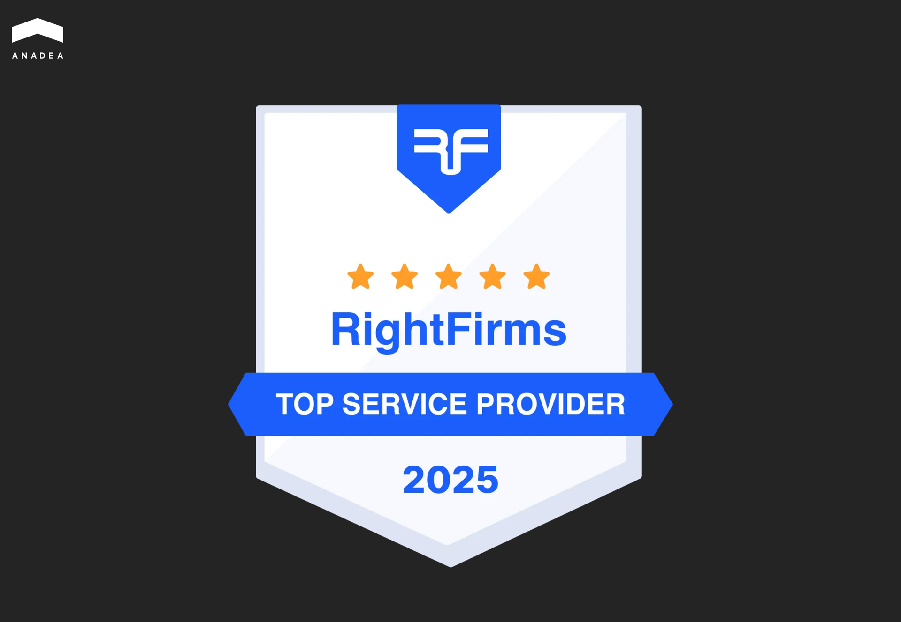

Our team has recently added another pleasant achievement to its list. Anadea is now officially listed on the international B2B platform [RightFirms](https://www.rightfirms.co/) and has received the "Top Service Provider" badge.

For those unfamiliar with this resource, RightFirms is essentially a large catalog of technology companies from around the world. The platform has gathered over 30,000 verified IT companies and agencies, helping businesses choose partners for their projects. The main advantage lies in real client reviews and detailed information about each company, allowing for informed decisions before starting a collaboration.

The "Top Service Provider" badge is awarded to companies with a strong portfolio and a solid reputation among clients. For us, this is especially gratifying since we have more than 25 years of experience behind us. During this time, we have worked on dozens of products in real estate, finance, education, and e-commerce.

By the way, some of our partnerships have lasted for years. For example, we have been working with [StreetEasy](https://staging.anadea.info/projects/streeteasy) for over a decade now. It is currently the largest real estate service in New York, part of Zillow Group, attracting over 180 million visits annually. Or [Visdeal](https://staging.anadea.info/projects/visdeal), a platform that has become one of the leaders in its segment. Such long-term relationships are the best indicator of quality for us, which is why over 80% of new clients come through referrals.

Recently, we have been actively developing our artificial intelligence capabilities. This year we introduced [VOCO](https://play.google.com/store/apps/details?id=com.tensorway.voco&hl=en), an AI assistant built entirely by our team. At the same time, we are completing ISO/IEC 27002 certification to meet the highest security standards for enterprise clients.

If you want to learn more about our projects or are considering a collaboration, visit our [profile on RightFirms](https://www.rightfirms.co/company/anadea). There you will find all the information about our experience, team, and completed cases.
