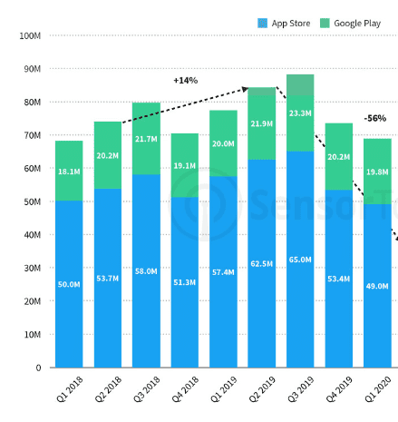
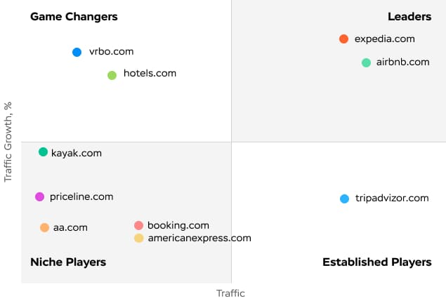
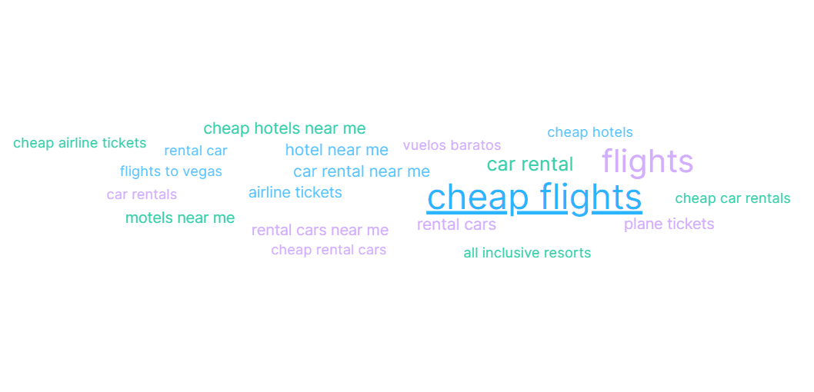
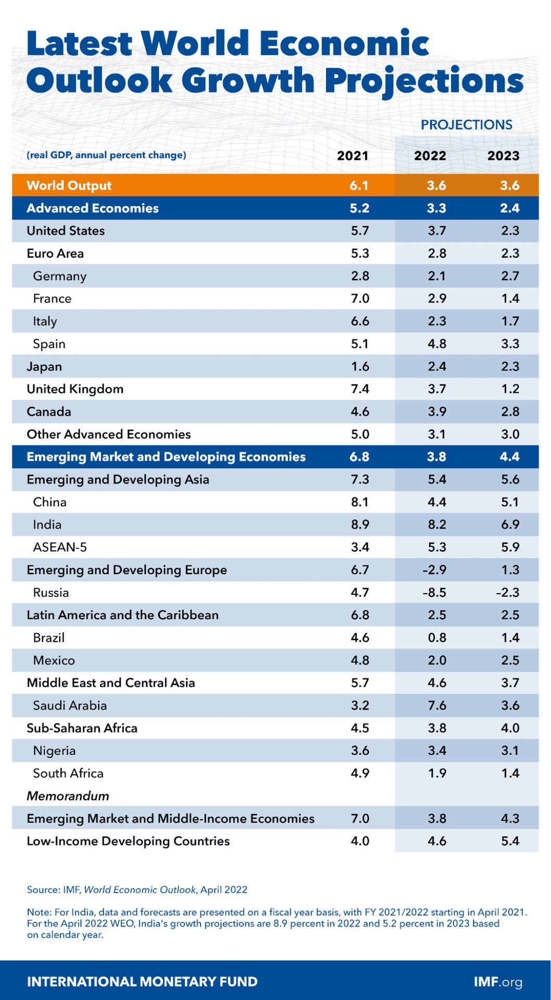

The travel and tourism industry is starting to recover from a COVID-19 outbreak, quarantine, and movement restrictions. The travel sector recovered over 50% of its gross revenue by the end of 2021 when compared to the pre-coronavirus numbers. This recovery is projected to reach 85% by the end of 2022, by Travelport.

Many countries opened borders to recover the state of affairs and catch waves of tourists heading on vacation. Or, as they say in the tourism industry - mid-season (March, April, May, October) and high season (June, July, August, September). Traditionally, **Q3 is the most fertile quarter**, which is also well seen on the bar chart below that reflects the number of downloads of top Travel category apps in Google Play and App Store in the USA by Sensortower.

So if you start to think about seeking help from a <a href="https://anadea.info/solutions/travel-app-development">travel app development company</a> to implement your idea, **it’s best to release it not later than 5-7 weeks before these peak seasons to return investments as soon as possible.**

## What do travelers need in your travel app or travel app ideas

By the way, do you know how long ahead most people plan their trips? About a half of surveyed US employees (2,076) **plan their vacation less than 6 weeks out** despite the fact that the best summer fares from the U.S. to Europe can be found **five or six months ahead**, according to CheapAir.com. And, as you know, one of the most popular destinations for Americans is Europe. So, this is quite a curious thing for you to know.

Also, there is always space for maneuver to **improve your end-user experience, be it travel agencies or tourists**. For instance, the lion's share of travel agents claims buying and selling travel plans can be simplified. They want modernization of the user experience to boost online travel sales because currently, comparing too many options is challenging and becomes a roadblock, according to Travelport.

Obviously, there is a real potential to bring value and develop a travel app that covers end-users unmet needs. For example, a third of families think that searching for the best flights and making hotel room reservations is extremely time-consuming and 23% of them don’t enjoy booking trips (Travelport). Think of it - on average, travelers visit about 38 sites to decide on travel plans. So, **the core value of your travel app can be to ease the decision-making process**.

What else can we suggest to consider while developing a travel app? Let’s take a look at the user’s cloud of search queries and web services that cover their needs.

<small style="font-size: 14px">Source: Semrush</small>

You can see that these services are leaders in the search in the Travel & Tourism category in the USA: Tripadvisor, Airbnb, Expedia, Booking, Hotels, Vrbo, Kayak, Priceline. But many of the services are part of big company families, so we see that **the market is influenced by a limited number of market players despite the fact that users may think that there’s a great choice between options**.

<table>
 <tr>
  <th><b>Web service</b></th>
  <th><b>Group of companies</b></th>
 </tr>
 <tr>
  <td>Tripadvisor</td>
  <td>Tripadvisor, Inc</td>
 </tr>
 <tr>
  <td>Airbnb</td>
  <td>Airbnb, Inc</td>
 </tr>
 <tr>
  <td>Expedia</td>
  <td>Expedia Group</td>
 </tr>
 <tr>
  <td>Vrbo</td>
  <td>Expedia Group</td>
 </tr>
  <tr>
  <td>Hotels</td>
  <td>Expedia Group</td>
 </tr>
  <tr>
  <td>Booking</td>
  <td>Booking Holdings</td>
 </tr>
  <tr>
  <td>Kayak</td>
  <td>Booking Holdings</td>
 </tr>
  <tr>
  <td>Priceline</td>
  <td>Booking Holdings</td>
 </tr>
</table>

Now let's see what users search.

<small style="font-size: 14px">Source: Semrush</small>

As you see, there are many 'near me' requests, so it’s a great idea to add a **geolocation feature** and connect the search to it to give value to your target audience. There’s also a demand for **car rental apps** and different types of **sharing apps**, bike sharing apps, electric scooters, etc.

What else can you consider while creating your own travel app in terms of the audience and value?
First of all, it’s good to know what countries are the biggest spenders in the tourism industry and where they go for vacation. Traditionally, the **2 top spenders are China and USA**, among others we can name Germany, the United Kingdom, France, Australia, Russia, and Canada. While the top 10 destinations receive 40% of worldwide arrivals. These countries are France, Spain, the United States of America, China, Italy, Turkey, Mexico, Germany, Thailthe, and the United Kingdom (data of 2018). This gives us a hint that it’s better to target these markets and develop digital possibilities for these directions mostly to maximize the revenue.

### Don't compete, find untapped needs

With Expedia Group and Booking Holdings controlling most of the market, building yet another hotel aggregator is an uphill battle. A smarter approach is to solve travel problems that these giants overlook.

Getting to a destination is often the most stressful part of any trip, yet very few apps address the journey itself. LoungeBuddy carved out a niche by giving travelers access to over 300 airport lounges, something most people wouldn't think to look for but immediately value once they discover it. A sun exposure app that calculates safe time in the sun based on skin type and local UV index is another example. It's a small, unexpected tool that earns loyalty by showing genuine care for travelers.

This "think beyond the obvious" strategy also ties into the data we'll see below. Instead of fighting for broad queries like "cheap hotels," a niche app can own more specific searches such as "pet-friendly beaches near me" or "airport lounges near me," where competition is lower and user intent is much clearer. As the search data shows, there's real demand for these kinds of specialized services.

## Travel and tourism industry trends

It’s not a secret that the growth of the world’s economy drives the growth of the Travel and Tourism industry. 2022 faced the negative influence of the events in Ukraine that slowed down the growth of the Gross Domestic Product all over the world. Still, at a smaller pace, it is still predicted to grow.

The growth of the economy and welfare, pent-up demand for travel after Сovid restrictions, and accumulated funds will certainly play their part. However, they may be also leveled out by inflation of the world’s currencies.

As we already said, the growth of the world’s economy opens new opportunities and people start to satisfy more sophisticated needs.



### Traveling with pets

In 2018, 37% of pet owners take their animals on their trips, compared to 19 percent about 10 years ago. Source: U.S. Travel Association. The most popular pets to travel with are dogs, and they make up 58% of pets traveling worldwide. 52% of surveyed owners said that they only stay at pet-friendly properties. 78% of owners and their four-legged friends are driving and flying together more now than ever before (2020-2021 statistics).

Still, there are gaps in the market facilities, many pet owners want traveling with pets to be easy. 27% of people said that they want to see more dog-friendly hotels and holiday parks. 16% would also like to see this in pubs.
15% would like to see more dog-friendly beaches, while 14% want more dog-friendly restaurants.

It means, this is a great niche to try. To *ease traveling with pets is the core value you can provide*.

### Domestic traveling

With global travel restrictions continuing, many travelers are looking for getaway destinations closer to home, and that’s unlikely to change anytime soon. Intent to travel domestically continues to rise, especially in Germany, Italy, Poland, Spain, Turkey, and the U.K.

On the plus side, all that homegrown business is helping to sustain many tourist destinations, and will continue to be a key recovery driver in the short to medium-term (source: thinkwithgoogle). What does it give? You can focus on **developing an app providing information about local facilities**.

### Mindful traveling

In the end of 2021 Booking unveiled the Mindful Travel badge. It allows users around the world to choose more sustainable housing options and get the information they want about the sustainable development approaches. It is adapted to the local characteristics of accommodation facilities. The purpose of the badge's launch is help users choose eco-friendly
accommodation options anywhere in the world.

Let's discuss your travel app idea

## Travel app types and features

Let’s take a look at what travel app types can be interesting for development.

**Travel journal.** Users keep a journal of their travels - for themselves and to share the experience with others. Core features include multimedia and social sharing.

* **Find a travel buddy.** Users connect with each other to travel together, plan and discuss their future trips. Core features include users profile, search, messages, calendar.
* **Plan a route and find cheap tickets.** Without repeating the value, let’s say that core features are aggregation of cheap tickets of all kinds, map, and aggregation of cheap accommodation facilities.
* **Eco traveling.** Help users travel eco-minded. Core features can be a map with goals to help ecology, eco-friendly shops, and community.

**Smart personalization with predictive analytics**

Remember the statistic that travelers visit about 38 sites before making a decision? Predictive analytics can drastically cut that number. By analyzing past purchasing tendencies, search history, and spending patterns, travel apps can offer highly relevant recommendations — from hotels and destinations to flight times that match the user's unique lifestyle and budget.

This approach has already proven its worth in e-commerce. For instance, product recommendation engines are known to drive significant sales increases for major online retailers. The same logic applies to travel: instead of overwhelming users with endless options (which, as we mentioned, is a major roadblock according to Travelport), a smart travel app narrows the choice down to what actually fits.

The technology works particularly well for the app types we described above. A route planning app can suggest destinations based on where a user has traveled before. A travel buddy app can match people with similar travel styles. Even an eco-traveling app can recommend sustainable options that align with the user's previous preferences.

However, there's an important caveat. With growing global attention to data privacy regulations, travel app developers must be transparent about how they collect and use personal data. Building trust through clear privacy policies and giving users control over their data is not just a legal requirement — it's a competitive advantage. Users are more willing to share preferences when they understand the value they get in return.

## Instead of conclusions

Let us remind you that it takes about **1-2 months to develop an MVP** for a travel app. The cost can start **from 12-15K in dollars**. It’s a great idea to use such techniques as market research and <a href="https://anadea.info/guides">user persona</a> before starting development. We also recommend visiting the <a href="https://anadea.info/for-clients"">client section</a> as well to get business insights, great tips from entrepreneurs, and inspiration.
