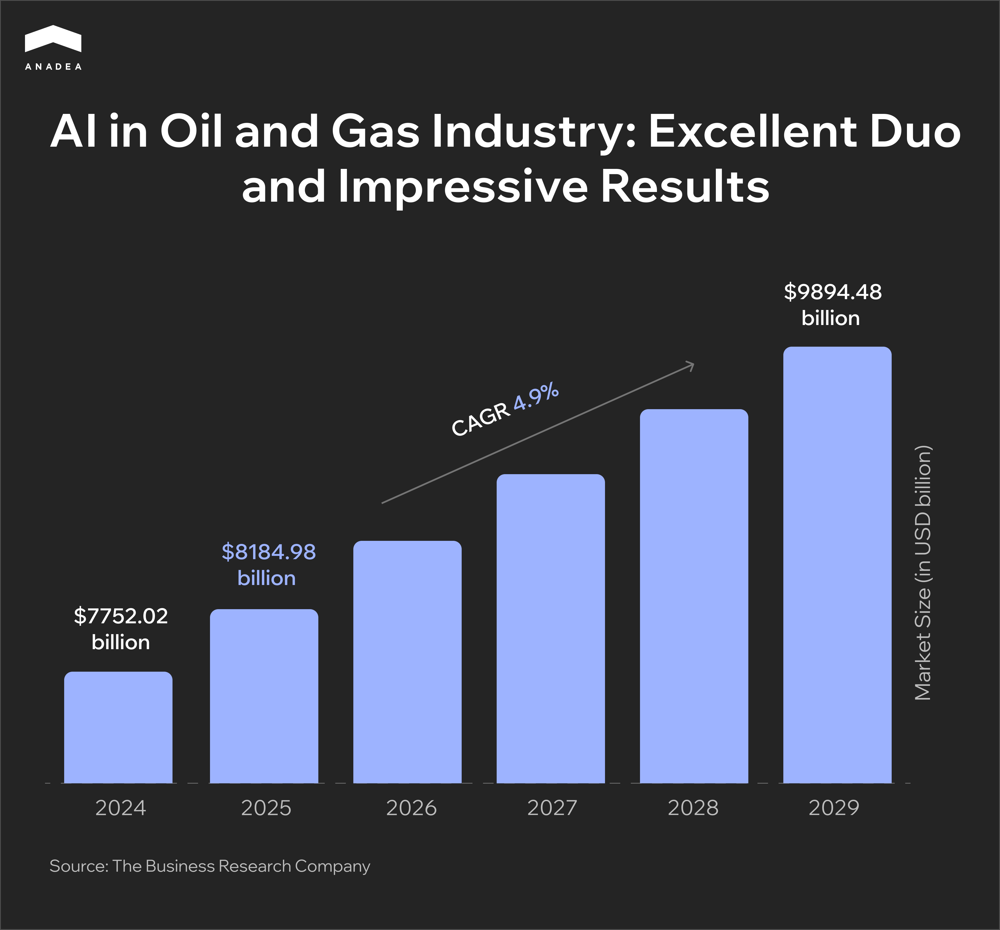
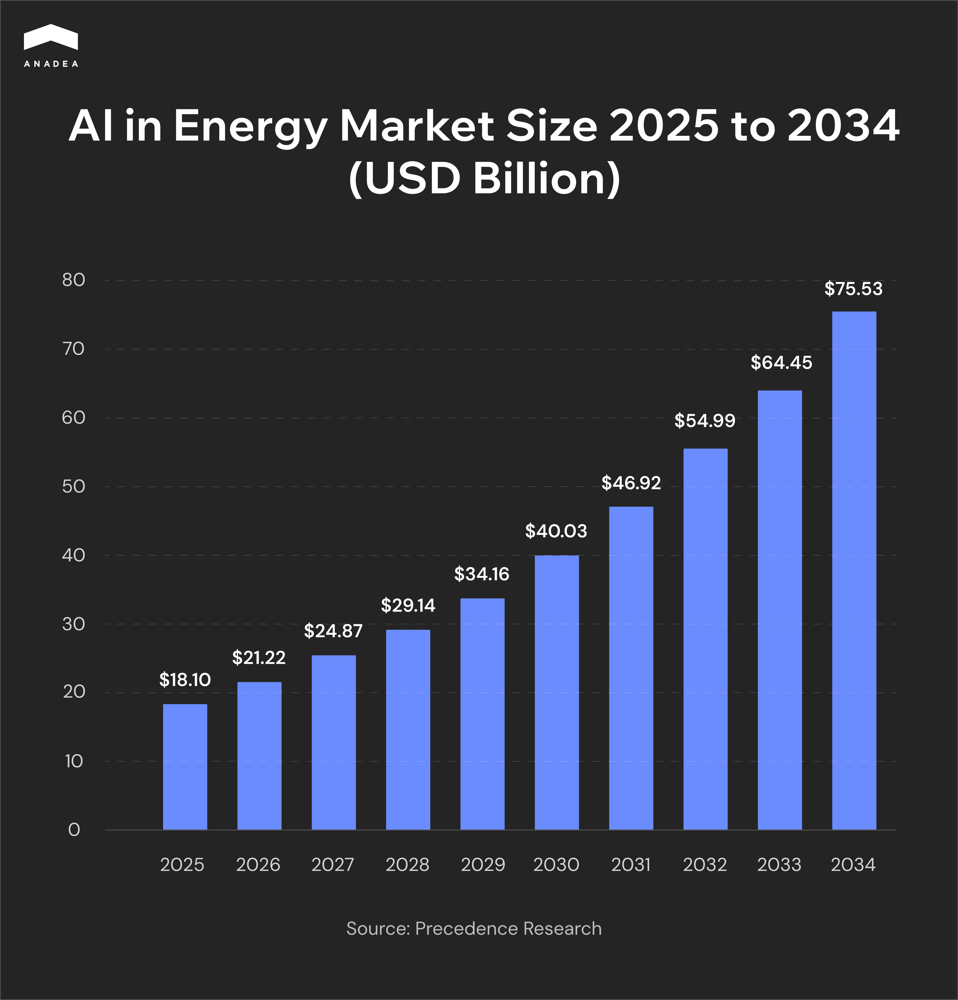

While AI is one of the trendiest and most innovative technologies today, the oil and gas industry is considered one of the most traditional markets, typically resistant to change. However, reality differs from common perception. In 2025, [emerging technologies](https://getglobalgroup.com/current-trends-shaping-the-upstream-oil-gas-industry-in-2025/), including AI, are being actively adopted by upstream companies. Around [70% of companies](https://wifitalents.com/ai-in-the-gas-industry-statistics/) in the oil and gas market use AI-powered tools for their exploration activities.

In this article, we invite you to explore the role of AI in the oil and gas industry, its real-life use cases, benefits, and the most promising future trends.

## Digitalization of the Oil and Gas Industry

Let's take a look at the growth trajectory of the global oil and gas market. In 2024, the market was valued at $7,752.02 billion. Now, experts believe that by 2029, the global gas and oil market will be able to grow up to [$9,894.48 billion](https://www.thebusinessresearchcompany.com/report/oil-and-gas-global-market-report), reflecting a steady 4.9% annual growth rate. These figures not only demonstrate the industry’s resilience in the global energy landscape but also reveal its potential to continue its investments in innovation to meet evolving market demands.

As well as many other spheres, the oil and gas industry is going through a stage of digital transformation. However, a lot of oil and gas companies still rely on obsolete operational models. This makes it pretty challenging for them to stay strong amid the current volatility of demand and prices.

In their digital transformation, [oil and gas companies](https://www.verifiedmarketreports.com/product/digital-transformation-in-the-oil-and-gas-market/) typically rely on cloud computing, the Internet of Things, Big Data, and, of course, artificial intelligence.

## AI in Oil and Gas: Industry Drivers & Market Trends

According to recent reports, [80% of executives ](https://gitnux.org/ai-in-the-oil-gas-industry-statistics/)at oil and gas companies view AI as the main technology in their digital transformation journeys. Around 65% of the organizations in this industry rely on artificial intelligence to strengthen their production and exploration. By getting access to real-time insights and powerful automation tools, they can increase efficiency and productivity.

Meanwhile, 68% of oil and gas businesses are investing in AI-powered initiatives for assessing the environmental impact of their activities. AI is becoming an essential in helping companies pursue net-zero and carbon neutrality goals. This technology enables real-time emissions tracking, carbon accounting, and predictive analytics for energy efficiency. As a result, it helps the industry in realization of its broader sustainability and green transformation efforts. 

All these new possibilities greatly boost the interest of oil and gas companies in the implementation of AI technologies.

As the oil and gas market is a part of a wider energy market, it’s worth having a look at the adoption of AI in this industry. It is expected that AI in the energy market will hit the mark of [$75.53 billion](https://www.precedenceresearch.com/ai-in-energy-market) by 2034, while in 2025, it equals $18.10 billion.

## AI for Oil and Gas: Its Role and Significance

Oil and gas companies all over the world are struggling to optimize and increase the efficiency of their exploration and production processes. And here is exactly what AI can provide. AI-powered business applications can be used for keeping digital records, automating the process of analyzing geological maps and data, as well as defining risks and potential problems like excessive or insufficient equipment use.

When it comes to [AI and machine learning services](https://anadea.info/services/machine-learning-software-development), the possibilities for businesses are practically limitless. The main task will be to choose an appropriate approach to addressing each issue or task with powerful and stably functioning software tools.

Thanks to AI in [oil and gas software development](https://anadea.info/solutions/oil-and-gas-software), companies can get access to valuable insights that were not available to them earlier. Based on the received data processed and generated by AI tools, oil and gas companies are able to make better-informed decisions and develop business strategies that will stay efficient in the long run.

Multimodal AI systems can process and interpret text, image, video, audio, and sensor data simultaneously. For example, such models can integrate seismic images, sensor logs, and engineer notes to give real-time asset health overviews.

Generative AI tools can be useful for streamlining the process of preparing technical documentation and compliance reports.

Another commonly applied type of solution is AI agents. These AI systems can act independently and automate multi-step workflows in logistics planning, drilling optimization, and facility inspections.

Moreover, AI plays a significant role in reducing maintenance costs of machines and equipment and avoiding (or minimizing) downtimes. All this is possible thanks to predictive maintenance software.

Today, in the gas and oil industry, AI and ML technologies can be applied to overcome a wide range of challenges that currently exist, including but not limited to:

* The necessity to process huge volumes of data;
* Increasing operational costs;
* Risks of equipment failure;
* Negative environmental footprint;
* Lowering efficiency of operations;
* Growing competition;
* Numerous administrative routine tasks;
* Unstable demand.

Of course, it is important to understand that just one app powered by AI for oil and gas industry can’t address all the existing issues. It should be a comprehensive system that will be built with the use of different advanced technologies and that will include various tools. Nevertheless, the significance of AI in the oil and gas market shouldn’t be underestimated as well as the potential of this technology.


