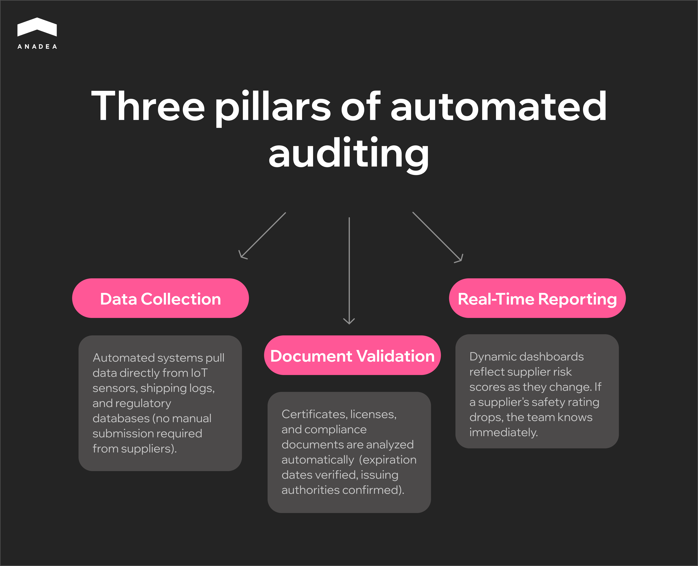
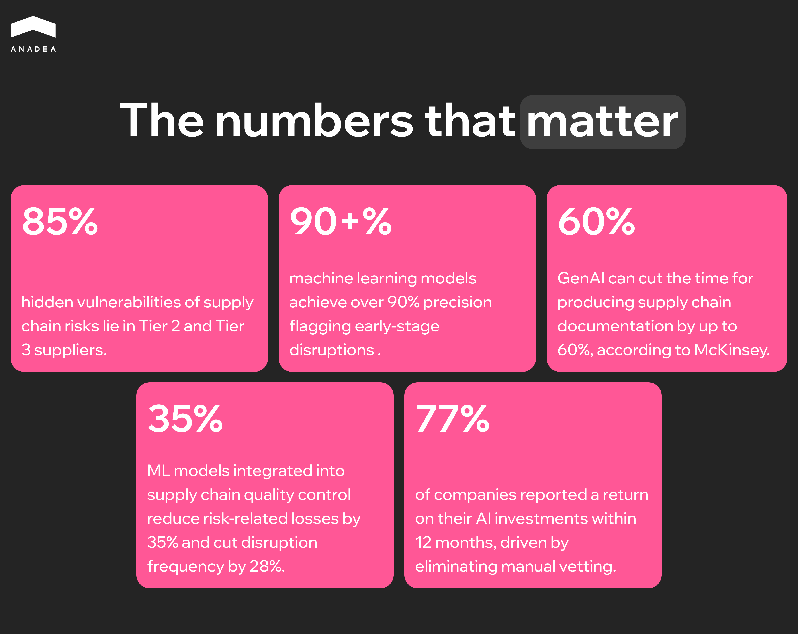

Industry data shows that up to [85% of supply chain vulnerabilities](https://veridion.com/blog-posts/supplier-tiers/) lie hidden deep within Tier 2 and Tier 3 suppliers, which fall outside the reach of manual audits. Audit automation changes the game.

It transforms supplier auditing from a reactive chore into a continuous, predictive engine that catches early warning signals before they become costly disruptions.

In this article, we will explore how AI audit automation is reshaping traditional workflows and explain why many organizations are integrating it into their supply chain risk management strategies.

## What Are Supplier Audit Services and Why Do They Matter?

Supplier audit services are the systematic, data-driven evaluations of a provider’s ability to deliver goods or services that meet quality, safety, and ethical standards. 

Maintaining a compliant and efficient supply chain requires a multi-layered approach to accountability:

* **Vendor audit services**. These audits are typically managed directly by the procurement team and focus on operational KPIs (meeting delivery timelines, product quality, etc.).
* **Third-party audit services.** To ensure compliance with international standards (like ISO) or sensitive [ESG goals](https://anadea.info/blog/how-ai-powers-environmental-social-governance-investments/), companies often bring in objective third parties. These auditors provide a neutral overview and verify that a supplier is actually operating in an ethical way.

### Risks of Manual Processes

Despite the high stakes, many organizations still manage these critical checks using legacy methods. Relying on manual audit processes creates several points of failure.

* **Human error.** When auditors manually input data from multiple factories, the risk of human error increases significantly. A single missed detail can lead to a massive product recall or reputational damage.
* **Fragmented documentation.** When data is scattered across different databases and departments, silos are created. This lack of a single source of truth means leadership cannot see potential risks until they have already escalated.
* **Actionability lag.** In a manual setup, by the time an audit report is finalized, the data is often weeks old. As a result, its relevance becomes questionable.



## Role of Audit Automation in Modern Compliance

Audit automation includes the use of technology (ML algorithms, [AI software development](https://anadea.info/services/ai-software-development), and integrated data streams) to perform repetitive audit tasks without constant human intervention.

By automating the audit process, companies can move away from a reactive approach and toward a proactive stance.

Today, automation is mainly applied to streamline the following three pillars:

* **Data collection**. Instead of relying on suppliers to submit documentation manually, automated systems pull data directly from IoT sensors on the factory floor, shipping logs, and external regulatory databases.
* **Document validation.** Automation tools can analyze certificates of insurance, ISO certifications, and business licenses to validate expiration dates and verify the legitimacy of the issuing authority.
* **Real-time reporting.** Automation generates dynamic dashboards. If a supplier’s safety rating drops, the dashboard reflects it in real time. 

## Audit AI and Intelligent Risk Assessment

The introduction of AI in automation systems helps move them from simple task completion to intelligent oversight. Through machine learning and predictive analytics, organizations can now identify risks before they lead to costly disruptions.

Let’s take a closer look at the most common use cases of AI audit automation.

### Predictive Risk Detection and Anomaly Identification

AI solutions rely on predictive modeling to forecast future failures. They can analyze full datasets rather than small samples.

ML-based anomaly detection models can achieve over [90% precision](https://www.researchgate.net/publication/393053425_Building_Robust_AI_and_Machine_Learning_Models_for_Supplier_Risk_Management_A_Data-_Driven_Strategy_for_Enhancing_Supply_Chain_Resilience_in_the_USA) in flagging early-stage disruptions (like atypical price spikes or shifts in news sentiment) before they escalate.

### AI Vendor Risk Management (VRM) 

Modern VRM platforms like Bitsight and OneTrust use autonomous AI agents to provide 24/7 monitoring of supplier networks. These tools can track global news, legal filings, and cybersecurity posture in real time. 

If any legislative changes or expired certifications are detected, they automatically alert teams. This can reduce the average risk assessment timeline from several months down to just a couple of weeks.

### ML for Compliance Gaps and Performance Risks

[Machine learning in supply chains](https://anadea.info/blog/machine-learning-in-supply-chain) is now used to quantify vendor performance risks with high mathematical rigor. These models analyze historical delivery data, financial ratios, and market indices to predict the likelihood of a supplier failing to meet contractual obligations.

The integration of ML models into supply chain quality control can lead to a [35% reduction](https://francis-press.com/papers/19753) in risk-related losses and a 28% decrease in disruption frequency.

### Automated Risk Scoring

AI eliminates the subjectivity of manual scorecards by assigning data-driven risk scores to every vendor. These scores are updated continuously as new data flows in.

Deep neural networks applied to procurement data can achieve fraud detection rates [above 98%](https://www.mordorintelligence.com/industry-reports/neural-network-software-market). This ensures that your risk scoring remains objective and untainted by human bias.



## Main Advantages of Supplier Audit Services AI Automation

Some organizations question the necessity to invest in [supply chain software development](https://anadea.info/solutions/supply-chain-software-development). Meanwhile, there are clear business benefits of automating your supplier audit services. Let’s consider the most important of them.

### Improved Operational Efficiency and Faster Audit Cycles

Traditional audits are time-consuming. Typically, they require teams to manually analyze hundreds of pages of certifications, financial statements, and compliance reports. AI-powered automation tools can ingest, read, and cross-reference these documents in seconds. 

By automating the data collection and preliminary analysis phases, audit cycles are shortened from weeks to days. This allows your auditing team to step away from monotonous data entry and focus their expertise on high-value tasks, like resolving complex edge cases and strengthening supplier relationships.

According to [McKinsey](https://www.mckinsey.com/capabilities/operations/our-insights/beyond-automation-how-gen-ai-is-reshaping-supply-chains), generative AI can reduce the lead time for producing and consolidating supply chain documentation by up to 60%.

### Enhanced AI Vendor Risk Management and Regulatory Compliance

The global regulatory environment continues to tighten, with new mandates around ESG, labor rights, and data protection reshaping compliance obligations. AI systems can continuously monitor external data sources, including global news, legal databases, and financial indices. Thanks to this, they can flag emerging vendor risks in real-time. 

With audit automation, businesses don’t need to wait for an annual audit to uncover compliance gaps or risks. AI can provide dynamic scoring. 

### Greater Transparency Across Supply Chains

AI automation helps connect the dots across siloed data systems to map out these intricate networks. 

By extracting actionable data from unstructured contracts and communications, AI provides a unified dashboard of your entire supply chain. This deep visibility helps organizations identify hidden dependencies and potential bottlenecks that traditional audits might miss.

### Cost Savings 

At its core, automation drives down operational costs. By minimizing the hours spent on manual document review and administrative follow-ups, companies significantly reduce the labor costs associated with vendor management. 

Beyond direct labor savings, AI prevents the costly effects of audit delays. Faster onboarding means quicker time-to-market for new products. Meanwhile, early risk detection prevents costly supply chain disruptions, product recalls, or hefty non-compliance fines.

## The Future of Supplier Audit Services and AI Automation

Technological advancements will allow audit automation software solutions to be more efficiently integrated with broader supply chain processes. Here are the key trends we can expect to observe in the coming years.

### Evolution Toward Predictive Audits

The most significant shift in the industry is the transition from reactive verification to continuous digital audit twins. Organizations are now maintaining virtual replicas of their compliance and risk posture that update in real time as data flows in from global sources.

As a result, instead of waiting for a static report, companies use streaming compliance where AI agents monitor 24/7.

With the [EU AI Act](https://anadea.info/blog/eu-ai-act-compliance-requirements/) becoming fully applicable in August 2026, these systems are essential for providing the explainability and transparency that modern regulators demand.

### New Approach to Supplier Performance Management

The field of the supply chain is moving from insight to autonomous action. AI-driven marketplaces are beginning to replace traditional requests for proposal. They use historical performance data to match buyers with the most reliable vendors instantly.

According to Prologis' 2026 Supply Chain Outlook Report, executives from different countries noted a [77% return](https://prologis.getbynder.com/m/3c536c3fa86fd662/original/Prologis-Supply-Chain-Outlook-Report-2026.pdf) on their AI investments within just 12 months. Such results are driven largely by the elimination of manual vetting and the prevention of supplier-related risks.

### Importance of Audit AI for Long-Term Operational Resilience

In 2026, global financial regulators placed intensified focus on digital resilience. This makes third-party oversight a board-level issue. Under frameworks like the Digital Operational Resilience Act ([DORA](https://www.eiopa.europa.eu/digital-operational-resilience-act-dora_en)), continuous oversight is now a legal obligation for many sectors.

Organizations that successfully integrate AI will have a great competitive advantage. AI tools will allow them to navigate global disruptions, including geopolitical, environmental, and economic ones, much more quickly than other market players.

## Conclusion

Today, the use of AI in supplier auditing isn’t only about cutting administrative overhead. Supplier compliance automation also ensures broader risk coverage, deeper visibility into supply chains, and a significant reduction in audit cycle times.

The transition from manual checks to continuous, automated monitoring is one of the most powerful methods to protect your business from vendor-related risks.

And if you are looking for a reliable tech partner to integrate AI into your supplier audit processes, at Anadea, we are always ready to assist you. Our team has more than 7 years of experience in AI transformation projects across industries. This allowed us to accumulate unique knowledge and practical skills that translate into scalable AI solutions tailored to your supply chain needs. [Contact us](https://anadea.info/contacts) to learn more.
