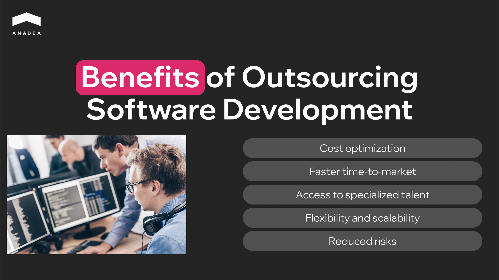

Building an in-house engineering team today can be expensive and increasingly risky. A global talent shortage and the increasing demand for AI innovation can become challenges for your company’s growth. As a response to such trends, strategic outsourcing has evolved from a cost-saving tactic into a blueprint for a more resilient modern organization.

In our article, we will talk about the benefits of [outsourcing software development](https://anadea.info/services/custom-software-development) and share practical tips for choosing the right engagement model for your project.

## Outsourcing or Keeping It Internal?

To leverage the outsourcing software development benefits, you should know for which cases this model is the best-suited.

### When Outsourcing Works Best

Outsourcing delivers the most value in scenarios where speed or specialized expertise are priorities. Here are the key cases in which you should consider outsourcing:

* Tight timelines;
* limited in-house expertise;
* need for rapid scaling without hiring full-time staff;
* 24/7 coverage by global teams;
* MVP development;
* legacy modernization (especially when you don’t have in-house specialists who have worked with this code earlier);
* cloud migration.

###  When to Keep Work In-House

Such work requires close control and deep knowledge of internal systems. This makes external engagement impractical. Below are examples of work better suited for internal teams:

* Work with core IP or proprietary algorithms;
* heavy compliance requirements;
* early-stage discovery with unclear scope (such projects require rapid iteration and high collaboration);
* highly collaborative R&D.

## Benefits of Outsourcing Software Development

When this engagement model is applied to the right project type, businesses can get a significant competitive edge. Let’s take a closer look at the outsourcing software development benefits that you can bank on.

### Cost Optimization

Outsourcing lets you move from a fixed-cost model (full-time salaries and office space) to a variable-cost model (paying for output). It is the quickest way to optimize your investments in software development projects. 

As it is stated in the Accelerance [Global Software Outsourcing Rates Guide 2025](https://www.accelerance.com/2025-global-software-outsourcing-rates-and-trends-guide), partnering with external engineering teams can reduce total operational costs by up to 40%. 

### Faster Time-to-Market

The tech world is highly dynamic, while the competition is fierce. That’s why speed can become your primary currency. Strategic partners bring established playbooks and the ability to leverage time zone acceleration, as global teams can give you a 24-hour development cycle.

### Access to Specialized Talent

The global talent shortage has only intensified over recent years. Trying to find a specialized AI/ML architect or a niche DevOps engineer in a local market can be extremely difficult. As a result, one of the biggest benefits of software development outsourcing is the possibility of hiring experts from any region.

For example, according to [Forbes](https://www.forbes.com/councils/forbestechcouncil/2025/10/15/top-tech-skills-still-thriving-in-a-down-job-market/), AI-related tech skills are among the most highly-demanded at the moment.



### Flexibility and Scalability

Engineering needs are not linear. You might need to scale your team for a product launch and then pivot to lean maintenance some months later. Strategic partnerships allow you to ramp teams up or down without the legal or emotional weight of layoffs.

### Reduced Risks

Experienced outsourcing partners bring standardized security and compliance practices (like SOC2 or NIS2 compliance) that counter risks inherent in complex software projects. 

Moreover, a lot of reliable vendors today use AI tools to protect your software and data. According to [IBM's 2024 Cost of a Data Breach Report](https://www.ibm.com/reports/data-breach), organizations using AI and automation in their security operations experienced breach costs that were $1.88 million lower on average than those without such tools.

Want to find out how to minimize security and compliance risks while working with a tech partner? Read our comprehensive [IT vendor management guide](https://anadea.info/blog/it-vendor-management-guide/#risk-management-and-compliance).

### Focus on Core Business

Outsourcing allows internal teams to concentrate on what matters most, including product strategy, customer success, go‑to‑market execution, and business growth. When you delegate execution to trusted external teams, you can redirect internal resources to strategic priorities. This approach can significantly boost overall business performance.

## Outsourcing Models and How to Choose the Right Option

The choice of the right engagement model is often as important as the choice of the partner itself. For example, if you pick [staff augmentation](https://anadea.info/services/staff-augmentation) when you actually need end-to-end delivery, you will end up micromanaging a project you don’t have time for. In order not to make such mistakes, you need to have a good understanding of the peculiarities of each option.

The table below covers the core engagement models.

<table>

<tbody>

<tr>

<td>

<strong>Comparison Criteria</strong>

</td>

<td>

<strong>Staff Augmentation</strong>

</td>

<td>

<strong>Dedicated Team</strong>

</td>

<td>

<strong>End-to-End Project Delivery</strong>

</td>

<td>

<strong>Build-Operate-</strong>

<strong>Transfer (BOT)</strong>

</td>

</tr>

<tr>

<td>

Key idea

</td>

<td>

You are hiring extra hands for your existing team.

</td>

<td>

You are hiring a pod that comes with its own lead.

</td>

<td>

The partner handles everything from initial discovery and design to final launch.

</td>

<td>

The provider sets up a local entity and team for you, runs it for a period, and then transfers full ownership to you.

</td>

</tr>

<tr>

<td>

When to use

</td>

<td>

You have a strong internal engineering manager and just need to fill specific skill gaps.

</td>

<td>

You have a clear product roadmap, but don't want to manage the day-to-day tickets.

</td>

<td>

You can use it for well-defined, standalone projects or MVPs.

</td>

<td>

You want to establish a permanent global footprint but lack the local legal and HR expertise to do it from scratch.

</td>

</tr>

<tr>

<td>

Pros

</td>

<td>

High control and easy integration

</td>

<td>

Significant reduction in management burden

</td>

<td>

Fixed or predictable pricing and minimal time investment required from your internal team

</td>

<td>

Lower risk for international expansion

</td>

</tr>

<tr>

<td>

Cons

</td>

<td>

You bear all the management overhead and project risk

</td>

<td>

Less granular control over individual daily tasks compared to staff augmentation

</td>

<td>

Changes often require formal contract renegotiations

</td>

<td>

Higher upfront commitment and a longer exit timeline (usually 2-3 years)

</td>

</tr>

<tr>

<td>

Governance

</td>

<td>

Low.

Hired experts follow your requirements and your HR policies.

</td>

<td>

Shared responsibility. Governance is typically driven by SLAs and KPIs.

</td>

<td>

Milestone-based.

Success is defined by the delivery of pre-agreed artifacts.

</td>

<td>

Managed by the partner during the Build/Operate phases, transitioning to your internal HR and Ops during the Transfer.

</td>

</tr>

</tbody>

</table>

### Where to Hire External Specialists?

You also need to choose the right geographical region to partner with an outsourcing company.

#### Onshore

This model involves partnering with a team located in your own country.

You often pay the highest market rates, but you gain zero time zone friction. Onshore outsourcing ensures absolute compliance with local labor laws and data privacy regulations (like CCPA or GDPR).

**Best for:** Projects that require high-level security clearances or the ability to meet in person with developers on short notice.

#### Nearshore

Nearshoring involves working with teams in neighboring countries. Usually, it presupposes a 1-3 hour time zone difference.

In this case, you can get a cost reduction and still maintain a full workday of overlap.

**Best for**: Fast-moving Agile teams that rely on online communication in real time.

#### Offshore

This is the classic model that includes partnering with talent in distant hubs like India, Southeast Asia, or Eastern Europe.

This offers the lowest possible cost and access to the largest talent pools in the world. But the time zone difference can significantly hinder project delivery.

**Best for**: Well-defined projects, 24/7 maintenance/support, or follow-the-sun development.

#### Hybrid

This is a modern approach where you have a local lead (onshore) who acts as a bridge to a larger delivery team (nearshore or offshore).

Such an option typically has a higher cost than pure offshore, but it eliminates a lot of operational risks.

**Best for:** Companies that want to leverage the savings of global talent but don't want to manage the logistical headache of different time zones and cultural nuances themselves.

### Decision Guide

To enjoy all the benefits of software development outsourcing, you should find a model that won’t break your specific workflow.

Based on our practical experience in IT outsourcing, we prepared the following questions that you should ask yourself about your project.

* **Scope clarity**. How well-defined are your requirements? Are you ready to hand over a 30-page spec? Or are you still A/B testing the core feature set?
* **Control level**. Do you need to manage the working process (daily standups, code reviews, architectural choices)? Or do you only care about the results delivered on time?
* **Compliance and security**. Are you dealing with sensitive health data, financial records, or government contracts that require specific geographic footprints?
* **Speed to market.** Do you need a developer starting next Monday? Or are you building a strategic offshore center that needs to last for a decade?

Here is a model alignment matrix that will help you detect the best option in accordance with your priorities.

<table>

<tbody>

<tr>

<td>

<strong>Your Priority</strong>

</td>

<td>

<strong>Model to Choose</strong>

</td>

</tr>

<tr>

<td>

Immediate speed

</td>

<td>

Staff augmentation

</td>

</tr>

<tr>

<td>

Maximum control

</td>

<td>

Staff augmentation

</td>

</tr>

<tr>

<td>

Scope flexibility

</td>

<td>

Dedicated team

</td>

</tr>

<tr>

<td>

Risk transfer

</td>

<td>

End-to-end delivery

</td>

</tr>

<tr>

<td>

Strict compliance

</td>

<td>

Dedicated team (Onshore/Nearshore)

</td>

</tr>

<tr>

<td>

Long-term IP ownership

</td>

<td>

Build-Operate-Transfer

</td>

</tr>

</tbody>

</table>

## Software Development Outsourcing Trends in 2026

Over the recent years, we have observed a transformation of software development outsourcing from a pure cost-arbitrage model to a partnership. Clients look for niche expertise, integrated AI capabilities, shared risk, and faster outcomes.

Let’s consider the key trends that are shaping software outsourcing in 2026 under the influence of changing requirements.

### AI-Assisted Development and Quality Assurance

Artificial Intelligence can’t fully replace human developers. But it can become a supportive tool that augments and expands human skills.

AI can efficiently deal with boilerplate code and basic refactoring. In addition to this, generative AI can be used to write test cases.

As a result, the demand for junior roles is flattening. Instead, clients more often hire smaller teams of senior engineers who can orchestrate AI tools to do the work of a team twice their size.

### Outcome-Based Contracts (Results-as-a-Service)

The traditional time and materials model is gradually losing ground to outcome-based pricing. In such cases, contracts are increasingly tied to KPIs like feature adoption rate or deployment frequency. 

### Nearshoring Momentum

Offshore outsourcing is still highly popular in 2026. It often ensures significant cost savings while preserving the desired quality of outcomes. Nevertheless, nearshoring (for example, LATAM for the US or Eastern Europe for Western European countries) is also gaining momentum.

As development speed increases, waiting 12 hours for a response, which is typical for offshore models, is no longer acceptable. Overlapping hours allow for synchronous collaboration. This can be critical for complex, AI-driven architectural decisions.

Moreover, aligning with partners in similar regulatory environments simplifies the compliance burden.

### Security-by-Design

In 2026, security is a requirement embedded in the delivery pipeline. Outsourcing partners must be able to prove that data is encrypted and privacy controls are continuously enforced.

Today, quite often, AI agents access databases and APIs autonomously. It means that vendors must implement rigorous protocols to prevent authorized AI agents from leaking data.

### Sustainability

Sustainability reporting is not a rare clause in outsourcing contracts in 2026, which is driven by corporate ESG goals and EU regulations.

Following these requirements, developers must write green code (efficient algorithms that consume less compute power).

Meanwhile, vendors need to select cloud regions based on low carbon intensity and implement serverless architectures. Such architectures can scale down to zero energy usage when idle.

## Final Word: Why Anadea Can Become Your Reliable Outsourcing Partner

Today, the range of web, mobile, AI, or SaaS software development outsourcing benefits includes much more than just cost savings. This cooperation model provides you with access to specialized expertise, faster time-to-market, operational flexibility, and the ability to scale on demand. At the same time, your internal teams can stay focused on strategic priorities.

If you are looking for a professional external team that you can entrust your project with at any stage, you can consider Anadea.

Anadea has been building software for over 25 years. Our portfolio includes more than 800 projects. Among them are solutions built for prominent clients, like Zillow-owned marketplace StreetEasy.

We have a 97% client retention rate. Our clients stay with us for an average of 4+ years, which proves our expertise in both building and sustaining software products.

We offer different outsourcing models and always stay flexible when it comes to changing requirements. To learn more about cooperation with us, [book a free consultation](https://anadea.info/contacts)!
