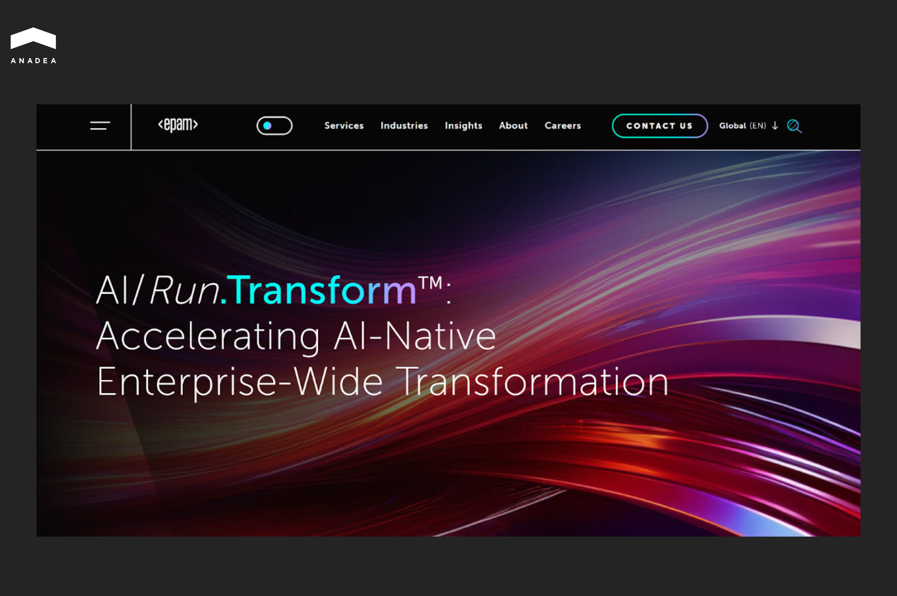
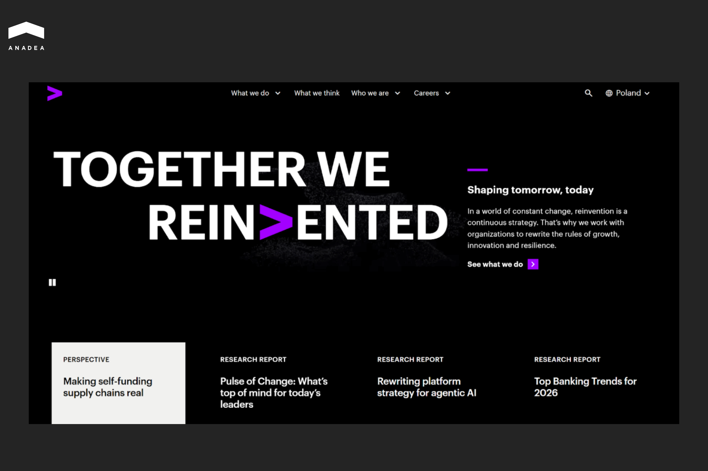
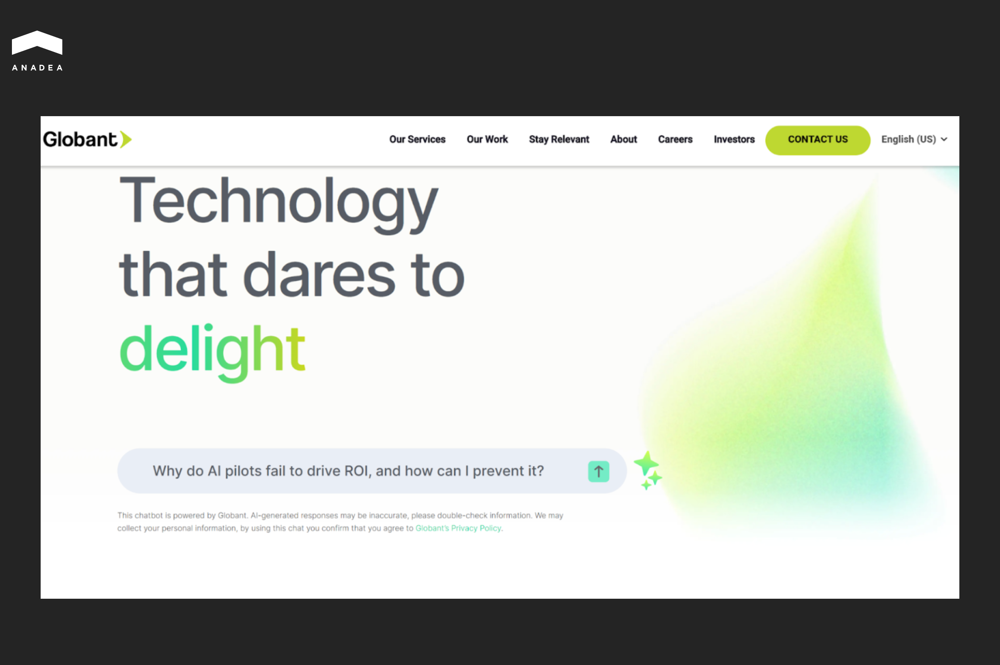
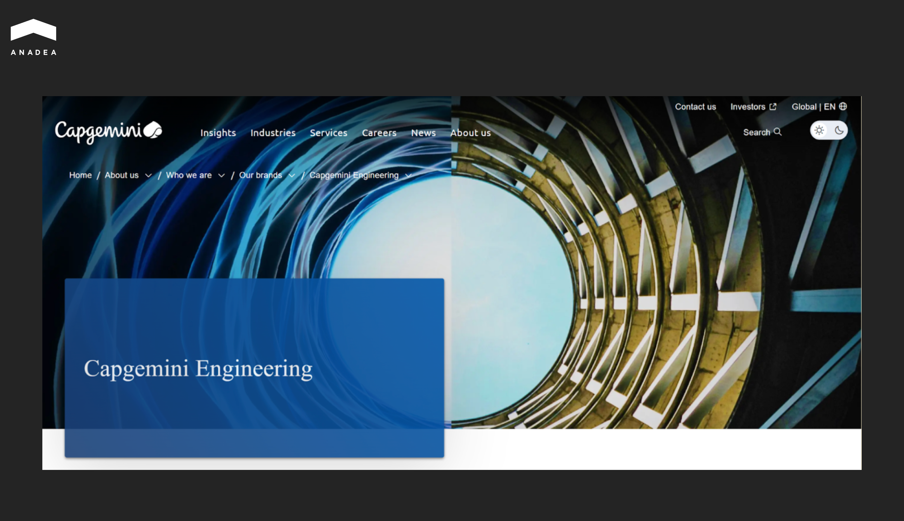
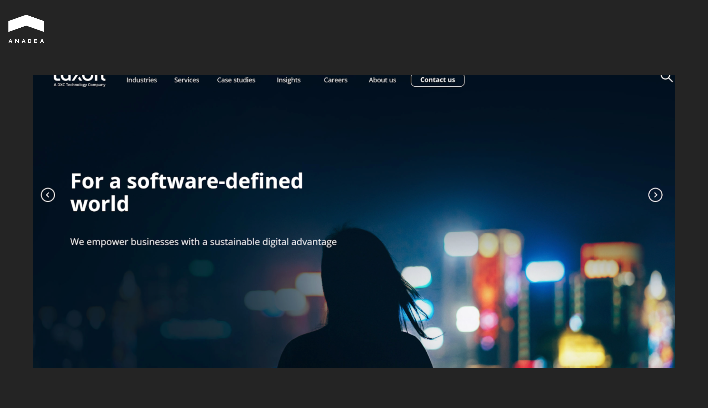
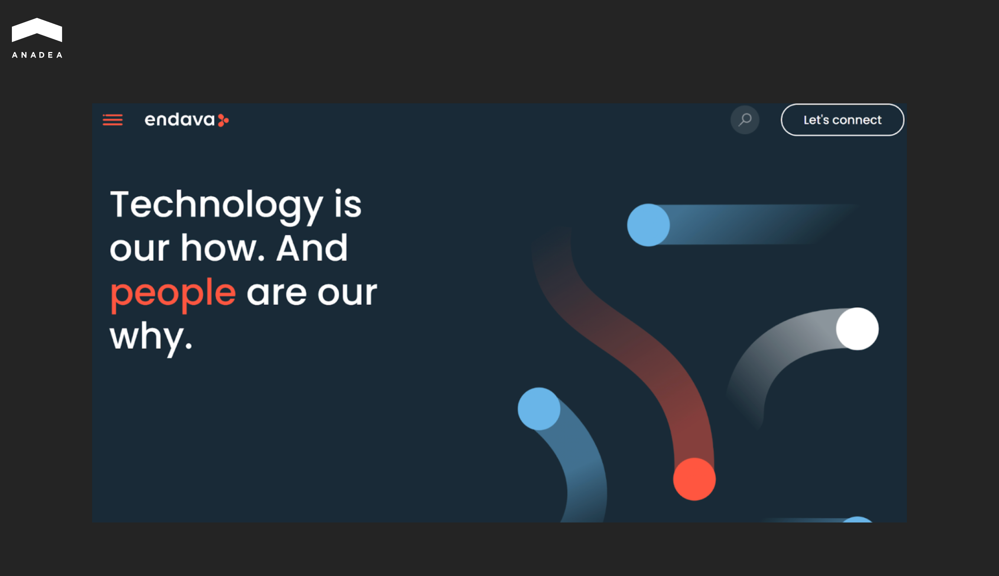
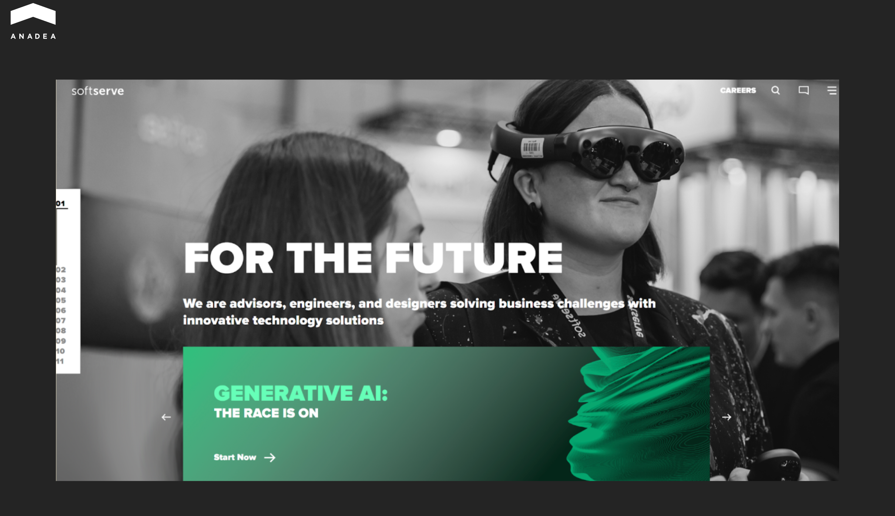
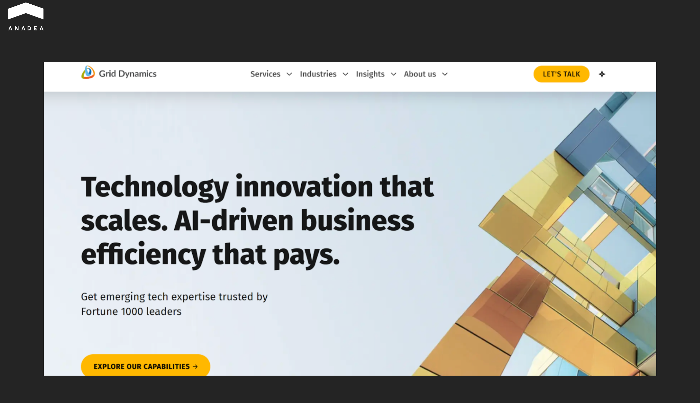

According to the study “Building Future-Forward Tech Teams” published by Robert Half Inc, despite record investments in digital transformation, [87% of organizations](https://www.roberthalf.com/content/dam/roberthalf/documents/us/en/indexed/insights/futureforwardtech-report-0425-us-en-secured.pdf) still reported significant IT skills gaps in 2025. On average, hiring for tech roles takes [49 days](https://www.icims.com/wp-content/uploads/2022/08/iCIMS-2023-Workforce-Report-FINAL.pdf). Given this, many companies prefer [outsourcing to in-house hiring](https://anadea.info/blog/software-development-do-it-inhouse-or-outsource/). Thanks to cooperation with software development firms, businesses get access to specific skills and domain expertise, which could be difficult to find in local markets. 

Giants like Cognizant have long been the default choice for many enterprise-scale IT projects. However, it doesn’t mean that cooperation with such partners is a one-size-fits-all option. In this article, we will explore other outsourcing companies that can become reliable Cognizant alternatives for your next tech initiatives.

## Why Companies Look for Cognizant Alternatives

Cognizant is one of the leaders in the global IT services market. It was founded in 1994, and today it specializes in digital transformation, consulting, and business process outsourcing. The company’s headquarters is located in Teaneck, New Jersey. But Cognizant operates worldwide and serves a broad range of industries, including, but not limited to, healthcare, banking, media, and life sciences. 

Today, it has over 349,000 employees. For almost 20 years, it has operated 20 delivery centers in Europe. This structure enables Cognizant to offer a strong global delivery model that combines onshore, nearshore, and offshore capabilities.

As of June 2025, it was ranked 605 on the Forbes Global 2000 list.

With a wide range of services and diversified expertise and skills, Cognizant can become a well-suited partner for businesses with different needs. However, due to various factors, many companies need to look for alternatives to Cognizant software development services.

Here’s why businesses explore other options.

* **Specialization**. Very often, сompanies look for Cognizant alternatives when they need niche expertise in emerging technologies (like development of computer vision tools or boutique blockchain applications). 
* **Speed**. Cooperation with giants like Cognizant comes with extra layers of governance. This ensures great stability, but it can negatively affect speed. Startups and fast-moving businesses often prefer smaller companies that can work and adapt faster.
* **Flexibility in engagement**. Big development firms typically have rigid engagement models that are mainly suited for enterprise budgets. Mid-market companies with limited budgets often require more flexible and modular engagement structures.

## Top Cognizant Alternatives to Consider in 2026

Cognizant has an outstanding reputation as a highly reliable and professional software development partner. However, the provided terms of cooperation and engagement models are not universal. That’s why, if you see that cooperation with this leading company is not the most appropriate choice for your [software development](https://anadea.info/services/custom-software-development) project, we recommend you consider our list of the best Cognizant alternatives in 2026.

The table below contains a brief comparison of these vendors.

<table>

<tbody>

<tr>

<td>

<strong>Company</strong>

</td>

<td>

<strong>Key Specialization</strong>

</td>

<td>

<strong>Best For</strong>

</td>

</tr>

<tr>

<td>

Anadea

</td>

<td>

Custom software (web, mobile, SaaS) with a strategic focus on AI/MLOps and intelligent automation tools

</td>

<td>

Tailored solutions for fintech, real estate, healthcare, and e-commerce;

Custom AI agent development;

Projects requiring a fast start (teams ready in 2-3 weeks)

</td>

</tr>

<tr>

<td>

EPAM Systems

</td>

<td>

Complex product engineering and cloud transformation

</td>

<td>

Modernization of legacy systems;

Advanced data and AI platform development

</td>

</tr>

<tr>

<td>

Accenture Technology

</td>

<td>

Application transformation services, strategy, and consulting (cloud, AI, cybersecurity, systems integration)

</td>

<td>

Cross-functional enterprise reinvention programs;

Large-scale systems integration

</td>

</tr>

<tr>

<td>

Globant

</td>

<td>

Re-inventing business models through technology and experience design

</td>

<td>

Customer-facing apps;

UX/UI-heavy digital products;

Brand-critical digital journeys

</td>

</tr>

<tr>

<td>

Capgemini Engineering

</td>

<td>

Engineering and R&amp;D services that bridge the gap between IT and physical engineering

</td>

<td>

Engineering-heavy development and R&amp;D outsourcing;

Automotive, aerospace, and telecom projects;

Long-term product lifecycle programs

</td>

</tr>

<tr>

<td>

Luxoft

</td>

<td>

Industry-specific solutions and custom software with pre-built accelerators

</td>

<td>

Long-term product engineering partnerships;

Projects for automotive and financial companies

</td>

</tr>

<tr>

<td>

Endava

</td>

<td>

AI-native software development using nearshore/hybrid delivery models&nbsp;

</td>

<td>

Mid-to-large digital product builds;

Core modernization and automation

</td>

</tr>

<tr>

<td>

SoftServe

</td>

<td>

Consulting-led engineering with a specific focus on cloud-native solutions and Microsoft technologies

</td>

<td>

Modernization of legacy systems;

Strengthening cloud security using Microsoft tech

</td>

</tr>

<tr>

<td>

Thoughtworks

</td>

<td>

Tech consulting centered on distributed Agile and continuous delivery

</td>

<td>

Projects requiring rapid adaptation to changing requirements;

Complex custom software delivery

</td>

</tr>

<tr>

<td>

Grid Dynamics

</td>

<td>

Data-intensive solutions and scaling complex cloud-native platforms

</td>

<td>

Data-intensive projects;

Digital system scaling;

Platform modernization

</td>

</tr>

</tbody>

</table>

### Anadea

Anadea was founded in 2000. Since that time, it has offered a broad portfolio of end-to-end software development services centered on custom product engineering and long-term [IT outsourcing](https://anadea.info/services/it-outsourcing) across industries such as fintech, real estate, healthcare, and e-commerce. With some of its clients, the Anadea team has been successfully working for more than 10 years.

The company’s core capabilities include:

* Custom software development;
* web application development;
* mobile app development;
* SaaS product development;
* UI/UX design;
* QA and testing;
* Software maintenance;
* IT consulting.

For the last 6 years, a major strategic focus of Anadea has been artificial intelligence and advanced data-driven solutions. Its AI services cover AI consulting, model training and deployment, AI-powered application development, and full MLOps support.

The company also develops custom AI agents and intelligent automation tools. These solutions are designed to streamline complex processes and improve operational efficiency.

Anadea has delivered 800+ projects for startups and enterprises worldwide, including notable clients and platforms such as [StreetEasy](https://anadea.info/projects/streeteasy) (today part of Zillow Group).



### EPAM Systems

EPAM is one of Cognizant's closest direct competitors. The company was established in 1993, and since then, it has grown into one of the leading software development companies in Europe. Its achievements have been recognized by multiple professional awards. In 2026, Whitelane Research named it a Top IT Vendor in Europe for the 3rd consecutive year.

As of Q3 2025, the company has 62,350 specialists and 340+ clients from the Forbes Global 2000 list.

EPAM is often chosen for complex product engineering and cloud transformation initiatives that require deep technical expertise.

Best for:

* Projects of large enterprises;
* modernization of legacy systems;
* advanced data and AI platform development.

### Accenture Technology

The history of this company began in 1989. At that time, it was known as Andersen Consulting, and it was rebranded to Accenture in 2001. Today, the company operates with a global workforce of 784,000 employees and serves 9,000+ clients across 120+ countries.

Accenture provides technology, strategy, and consulting services that cover:

* cloud transformation;
* AI and data;
* cybersecurity;
* enterprise platforms;
* large-scale systems integration.

Organizations select Accenture when they need high-level strategic consulting combined with technology execution. Accenture often becomes an alternative to Cognizant software services for cross-functional enterprise reinvention programs that require advisory, design, and engineering from a single vendor.

### Globant

Established in 2003, Globant helps organizations reinvent their business models through technology and design. The company places a strong emphasis on building modern digital products and platforms rather than only maintaining legacy systems.

Its core services center on:

* Digital transformation;
* software engineering;
* cloud;
* AI;
* experience design.

The company integrates artificial intelligence across the entire software development lifecycle through proprietary platforms and AI agents. Among its clients are Santander, FIFA, Danone, J&J, Coca-Cola, HSBC, and Google.

Globant is an appropriate partner for:

* customer-facing applications;
* UX/UI-heavy digital products;
* brand-critical digital journeys.

### Capgemini Engineering

The history of Capgemini Engineering began in 1982. Originally, it was known as Altran Technologies. Capgemini acquired it in 2019 and renamed it 2 years later. Now, it is the engineering and R&D arm of Capgemini. It bridges the gap between physical engineering (OT) and IT.

The unit is focused on advanced product engineering, embedded systems, digital manufacturing, and intelligent industry solutions. 

Best for:

* Large enterprises looking for engineering-heavy development and R&D outsourcing;
* automotive, aerospace, telecom, manufacturing, and life sciences companies;
* long-term digital engineering and product lifecycle programs;
* multi-year engagements.

### Luxoft 

This digital strategy and software engineering firm specializes in industry-specific solutions for sectors such as automotive, financial services, healthcare, telecom, and travel. Today, Luxoft has over 17000 employees and 425 international clients. It operates 61 offices in 28 countries.

Its teams deliver:

* Custom software;
* cloud solutions;
* data analytics;
* UX/UI;
* intelligent automation.

The company creates pre-built accelerators and frameworks that reduce time-to-market. With over 20 years of experience, Luxoft operates distributed Agile teams. This approach enables seamless collaboration and long-term product engineering partnerships.

### Endava

Endava is a technology services and digital transformation company that was founded in 2000 in the United Kingdom. It is known for its nearshore and hybrid engagement models. Its teams operate from delivery centers across Central and Eastern Europe, Latin America, and other regions. This provides geographic proximity and overlapping time zones to enhance collaboration with clients. 

The company positions itself as AI-native, as it integrates AI tools into every step of the SDLC to reduce costs and boost efficiency. Endava has introduced 300 custom GPTs and provided nearly 9000 employees with direct access to AI capabilities. 

Best for:

* Mid‑to‑large digital product builds;
* core modernization, automation;
* AI‑native transformation initiatives. 

Compared to larger providers, Endava often offers closer client engagement and adaptive team scaling for projects.

### SoftServe

Since its foundation in 1993, this consulting-led engineering firm has delivered over 20,000 projects. Today, it has 10,000 experts who work in 49 offices across 15 countries. 

SoftServe helps organizations accelerate digital transformation through:

* Cloud‑native solutions;
* data and analytics;
* AI and machine learning;
* cybersecurity;
* experience design.

SoftServe is deepening its long‑standing strategic collaboration with Microsoft. In late 2025, the company launched a dedicated Microsoft Partner Business Unit. This unit is aimed at helping clients deploy scalable AI platforms, modernize legacy systems faster, and strengthen cloud security using Microsoft technologies. 

In early 2026, SoftServe achieved two advanced Microsoft specializations: AI Platform on Azure and Cloud Security. 

### Thoughtworks

Thoughtworks has 30+ years of technology consulting. It helped pioneer distributed Agile and contributed to the invention of many practices used today. Its teams emphasize continuous delivery, rapid feedback loops, and close client collaboration to adapt quickly as requirements change.

Thoughtworks has 47 offices that are located in 17 countries. The company has more than 10,000 tech experts.

Its engagement model is based on iterative engagements with dedicated cross‑disciplinary teams embedded with clients.

Thoughtworks works with clients from a wide range of industries:

* Automotive;
* media and publishing;
* energy;
* healthcare and life sciences;
* nonprofit;
* retail and e-commerce;
* travel.

### Grid Dynamics

Grid Dynamics is a digital engineering company that was founded in 2006. It is known for its strong expertise in data-intensive solutions and platform engineering. 

The company specializes in:

* Building and scaling complex cloud-native platforms;
* AI and machine learning systems;
* digital products for enterprises that rely on large volumes of data and advanced analytics.

Grid Dynamics offers flexible collaboration models (project-based delivery, dedicated engineering teams, and long-term partnerships). This approach makes it best suited for large and mid-to-large enterprises that have complex digital systems or are undergoing platform modernization. 

## How to Choose the Right Cognizant Alternative: Practical Tips

Choosing the most relevant alternative to Cognizant requires more than just a pricing comparison or brand recognition. Here’s what we recommend starting with.

* **Define your business goals and scope.** Clarify whether you need legacy system maintenance, modernization, or a brand-new solution. Also, it is necessary to identify your budget range and timeline expectations.
* **Audit your real needs first.** Are you looking for a long-term outsourcing partner or a product engineering team? Based on your answer to this question, you will be able to align vendor capabilities with your priorities.
* **Create a relevant vendor shortlist.** Select vendors with proven experience in your industry and similar project types. Consider their case studies to have a better understanding of their approaches and skills.
* **Assess communication style.** It’s crucial to have a partner who will ensure comfortable cooperation. Pay attention to the communication tool they use, their responsiveness, and time-zone overlap.
* **Run a pilot.** Start with a 2-3 month discovery phase or MVP development instead of a multi-year contract. This stage will help you validate delivery quality and processes.

## Wrapping Up

Success in tech outsourcing is greatly defined by operational fit. Even if you know that some companies are fully satisfied with their tech partner, it doesn’t mean that this option will be the most appropriate for your project. You should look beyond the brand name. It is crucial to evaluate whether the vendor’s structure and specialization align with your immediate and long-term goals.

When you can fully rely on the hired team, your internal specialists can focus on core business strategy. That’s why the right choice of a tech partner can become your growth engine.

If you want to verify whether Anadea can become a suitable option for your next project, [contact us](https://anadea.info/contacts)! Our experts will tell you more about our experience and services.
