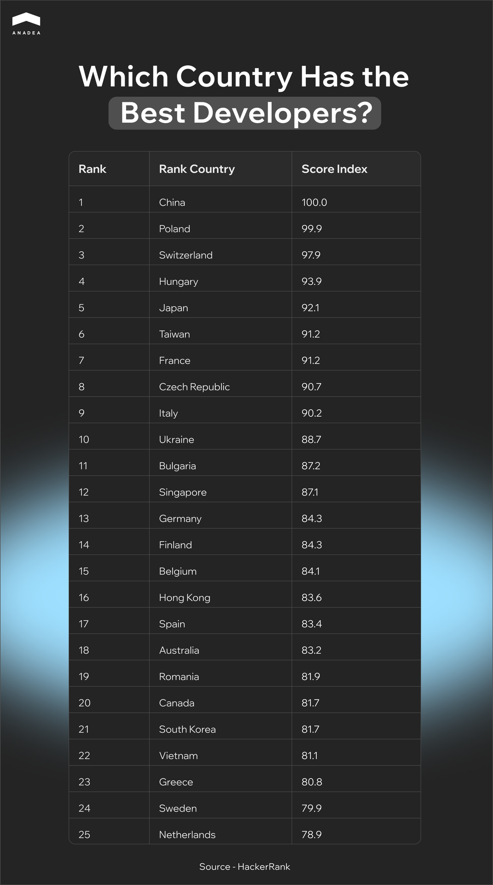

The original idea behind [software development outsourcing](https://anadea.info/services/custom-software-development) has changed. This model of working with developers can significantly reduce time-to-market and enhance your project scalability without compromising quality.

Choosing a location to hire developers is a critical first step that you should make before you start to consider different companies. The right choice will provide you with easy access to specialized talent and ensure your data compliance.

In this article, we will explore why outsourcing works and where to find the right partners in 2026.

## Why Businesses Choose to Outsource Software Development

Grand View Research projects that the global [IT outsourcing](https://anadea.info/services/it-outsourcing) market will hit [$1,219.31 billion](https://www.grandviewresearch.com/industry-analysis/it-services-outsourcing-market) by 2030. Here are the main reasons why businesses prefer this cooperation approach.

### Cost Efficiency

While the primary motivation for software development outsourcing has evolved, cost still remains a primary driver. However, the focus has moved from simple hourly rate comparisons to Total Cost of Ownership (TCO). 

Building an in-house team involves significant expenses. They include recruitment fees, onboarding training, employee benefits, and others. With outsourcing, you can pay only for the services you consume. 

### Access to Global Talent

In many countries, the demand for specialized skills (like GenAI, blockchain, and cybersecurity) is much higher than the supply. The only option is to look for the desired talents in the international markets.

Outsourcing removes geographical limitations. As a result, businesses get access to a vast pool of engineers and domain experts.

### Faster Delivery and Scalability 

Internal hiring processes can take months. According to the [iCIMS Workforce Report,](https://cdn31.icims.com/wp-content/uploads/2025/10/14153911/2025_Insights_Oct_FINAL.pdf) on average, it takes around 40 days to fill roles across industries. For tech roles, this average time period can be [49 days](https://www.icims.com/wp-content/uploads/2022/08/iCIMS-2023-Workforce-Report-FINAL.pdf). At the same time, outsourcing partners often maintain a pool of ready-to-deploy developers. This allows businesses to scale teams up or down rapidly based on project lifecycles.

### Focus on Core Business Activities

For non-tech companies, managing a large software engineering department can be a distraction. By outsourcing software development, leaders can redirect their energy and internal resources toward their core competencies.

It enables the internal team to focus on the needs of their business. Meanwhile, the outsourcing partner delivers technical solutions.

## Key Factors to Consider When Choosing the Best Countries for Outsourcing Software Development

When you start looking for the right destination for software outsourcing, it’s important to understand that there can’t be one universal option. The best country to outsource software development for one business may not be an optimal choice for another. Decisions should be data-driven. You should always consider the following critical factors to ensure that a partnership is designed for long-term value.

### Talent Quality and Technical Expertise 

The size of a talent pool matters less than its quality and specialization. Businesses must evaluate a country’s education system (specifically its output of STEM graduates).

According to [Coursera’s Global Skills Report](https://thetalentplace.s3.us-east-2.amazonaws.com/public/2022-09/Coursera-Global-Skills-Report-2022.pdf), some European countries, like Germany, are renowned for their mathematical and algorithmic rigor. As a result, they are excellent locations for finding experts for AI and data science projects. Meanwhile, others (such as those in Latin America, the Caribbean, and Asia Pacific) are good at UI/UX and mobile development.



### Development Costs 

Lower rates are always attractive. But this factor is not enough to make a decision. You need to assess the value-to-cost ratio.

A developer in one country might charge 20% more per hour than another. But the written code will be cleaner and it will be ready 30% faster. 

Furthermore, consider the economic stability of the country. High inflation causes unpredictable spikes in your vendor’s pricing over time.

### Time Zone and Communication 

The time zone overlap is vital for Agile projects. 

A 12-hour time difference allows for continuous 24-hour development. Nevertheless, it will be a barrier to real-time problem-solving. Businesses must decide if they prefer synchronous communication or asynchronous workflows.

### Cultural Proximity and Language Skills

English proficiency is the baseline requirement. However, you should think about the mentality as well.

* Does the outsourcing destination share a similar work ethic? 
* Are developers culturally encouraged to offer better solutions if they see them?
* Or do they strictly follow orders even if they have detected an issue? 

A strong cultural fit ensures that requirements are understood in the right business and technical context. This significantly reduces miscommunication and improves collaboration.

### Data Security and IP Protection

Consider the legal framework of the outsourcing country. Carefully analyze intellectual property laws? and data privacy regulations that should be compatible with your own.

When you choose a country with weak enforcement mechanisms, the risks of data breaches and IP theft are high.

## Best Countries to Outsource Software Development in 2026

To fully leverage the [benefits of software outsourcing](https://anadea.info/blog/outsourcing-software-development-benefits/), you need to find the right region to hire developers. 

Nowadays, the global outsourcing market is defined by specialization. India remains the volume leader. Meanwhile, Eastern Europe has established its status as the hub for high-complexity engineering. Latin America has become a common nearshore choice for US companies.

Here are the top software outsourcing countries in 2026.

### Poland

Historically, Poland used to be known as a support hub. By 2026, it evolved into Europe’s leading R&D laboratory. With the ICT market value projected to reach nearly [$56 billion](https://www.mordorintelligence.com/industry-reports/poland-ict-market) by 2031, Poland is a promising destination for tech projects and businesses. 

#### Key Strengths:

* **Education.** Polish developers consistently rank in the top 3 globally on platforms like [HackerRank](https://pages.hackerrank.com/blog/which-country-would-win-in-the-programming-olympics), particularly in algorithms and Java.
* **Security.** As an EU member, it offers high data security standards (GDPR).
* **AI specialization.** Warsaw and Krakow have become hubs for Deep Tech and AI research and attracted R&D centers from Google and Microsoft.

#### Typical Use Cases:

* Fintech and banking systems;
* AI/ML algorithms;
* cloud migrations.

**Average rates**: $45-$70+ per hour

### India

According to the report by Gartner, spending in the Indian IT sector is expected to exceed [$176 billion](https://www.gartner.com/en/newsroom/press-releases/2025-11-18-gartner-forecasts-india-it-spending-to-exceed-176-billion-us-dollars-in-2026) in 2026. It will be a more than 10% increase compared to 2025.

In the 2024/2025 financial year, the country's IT market employed over [5.8 million](https://www.meity.gov.in/ministry/our-groups/details/software-industry-promotion-gN1EDOtQWa) tech professionals. In recent years, the country has shifted its focus from legacy support to GenAI and digital transformation. That’s why today, Indian experts are often hired for the most innovative projects in different countries around the world.

In addition to this, India is among the top 5 most technologically advanced countries in the world, according to the rankings published by [CEOWORLD Magazine](https://ceoworld.biz/2025/07/21/ranked-most-technologically-advanced-countries-in-the-world-2025/).

#### Key Strengths:

* **Scalability.** Indian companies are known for their ability to scale teams from just a couple of specialists to hundreds of developers in weeks.
* **English proficiency.** India has the world’s second-largest English-speaking population, which ensures smooth communication.
* **24/7 cycle.** The time zone difference (9.5–12.5 hours from the US) is well-suited for follow-the-sun development models.

### Typical Use Cases:

* Large-scale enterprise software maintenance;
* back-office automation;
* GenAI pilots.

**Average rates**: $20-$40 per hour

### Mexico

Mexico is a leader in nearshoring for North American companies. With over [800,000](https://alcor.com/employer-of-record-in-mexico-guide/) tech professionals, Mexico offers the perfect combination of cost efficiency and geographical proximity to the US.

#### Key Strengths:

* **Real-time collaboration.** As the time difference with the US is minimal, Mexican teams can participate in synchronous Agile sprints.
* **Talent pool.** The country has over 124,000 STEM graduates annually (it is more than many European countries have).
* **USMCA alignment.** Mexican companies can guarantee strong intellectual property protections under the US-Mexico-Canada Agreement.

#### Typical Use Cases:

* Staff augmentation for US-based startups;
* real-time DevOps;
* e-commerce and retail tech.

**Average rates**: $30-$55 per hour

### Ukraine

Ukraine’s IT sector demonstrates high resilience. Over 11 months in 2025, the country exported  [$5.97 billion](https://opendatabot.ua/en/analytics/it-export-25) in IT services. Ukrainian developers are known for their solid expertise in both traditional and emerging technologies. Apart from this, they show strong cultural alignment with Western business practices.

#### Key Strengths:

* **Talent pool.** Ukraine has a high density of senior and lead engineers who specialize in heavy-lift backend architecture.
* **Quality-cost ratio.** The country’s developers deliver the best engineering quality per dollar in the European region.
* **Dual-use technology**. Ukrainian development teams demonstrate solid expertise in engineering technology that serves both civilian and high-security sectors.

#### Typical Use Cases:

* Cybersecurity and defense tech;
* blockchain and Web3 development;
* projects requiring senior talent.

**Average rates:** $30-$60 per hour

### Vietnam

Vietnam is often called the new India and is viewed as the best country to outsource software development. Today, it is one of the fastest-growing digital economies in Southeast Asia. This tendency is fueled by a demographic where over 60% of the population is under 35. This population group represents a workforce that is natively tech-savvy and highly adaptable to new frameworks.

#### Key Strengths:

* **Talent retention.** Though job hopping is common in the software development industry, Vietnam offers significantly lower churn rates than many other countries. This can ensure that your project team stays together for years.
* **Cost.** Vietnam offers significantly cheaper services than India or Eastern Europe. This makes it a common choice among startups.
* **Stability.** The country demonstrates high political stability and leverages generous government incentives for the tech sector.

#### Typical Use Cases:

* Mobile app development;
* MVP development;
* software testing and QA.

**Average rates**: $20-$40 per hour

## Software Development Outsourcing Trends in 2026

The best countries for outsourcing on our list can address the needs of completely different projects. They offer different skills and pricing models. Nevertheless, the tech industry worldwide is moving in one direction. Let’s take a closer look at the trends that are currently shaping the software development outsourcing market.

* **AI-augmented delivery.** Leading vendors are often integrating AI coding assistants to boost velocity by up to 40%.
* **Security and compliance first.** With software supply chain attacks on the rise, security is now vetted as rigorously as code quality before a contract is signed.
* **Long-term partnership.** Companies prioritize working with teams that retain domain knowledge to eliminate the re-training tax of constantly changing vendors.
* **Outcome-based pricing**. Hourly billing is often replaced with outcome-based contracts. In this case, vendors share the risk and are rewarded for hitting specific performance metrics or delivery milestones.

## Wrapping Up

Software development outsourcing can become a powerful driver for your business innovation. But the success lies in your choice of partner and location for outsourcing.

The key idea is to align your project with a region that offers the right mix of technical depth and regulatory compliance based on your requirements.

At Anadea, we specialize in building high-performance software tailored to your unique requirements and goals. And we back it with proven results. Since its foundation in 2000, our company has delivered solutions for clients in 47 countries. Some of our long-term partnerships have lasted over 10 years.

We combine deep domain expertise with the newest development approaches and strict security standards. Want to learn more? [Contact us](https://anadea.info/contacts)! Let’s discuss what we can do for you.
