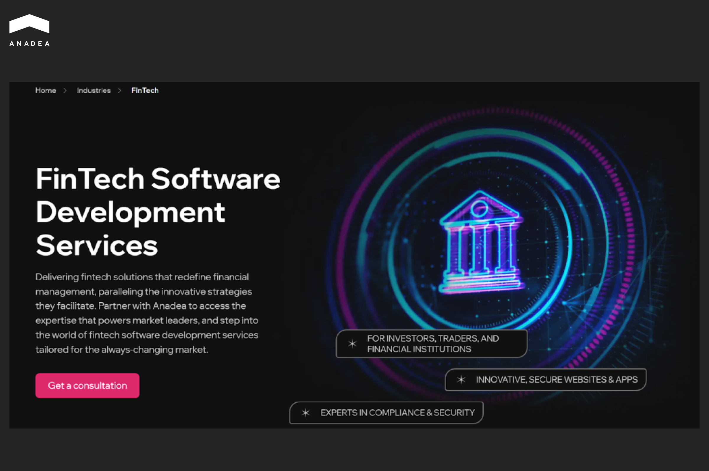
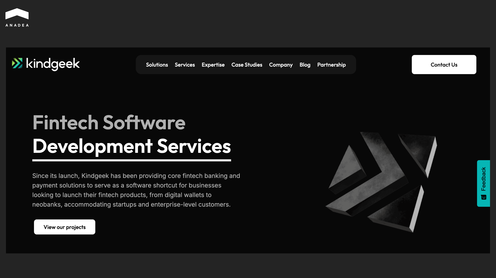
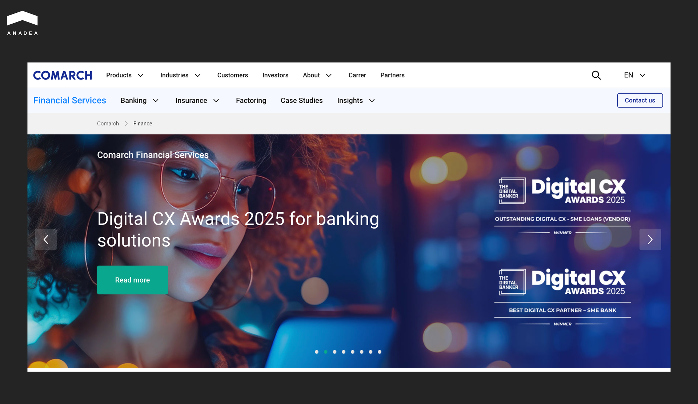
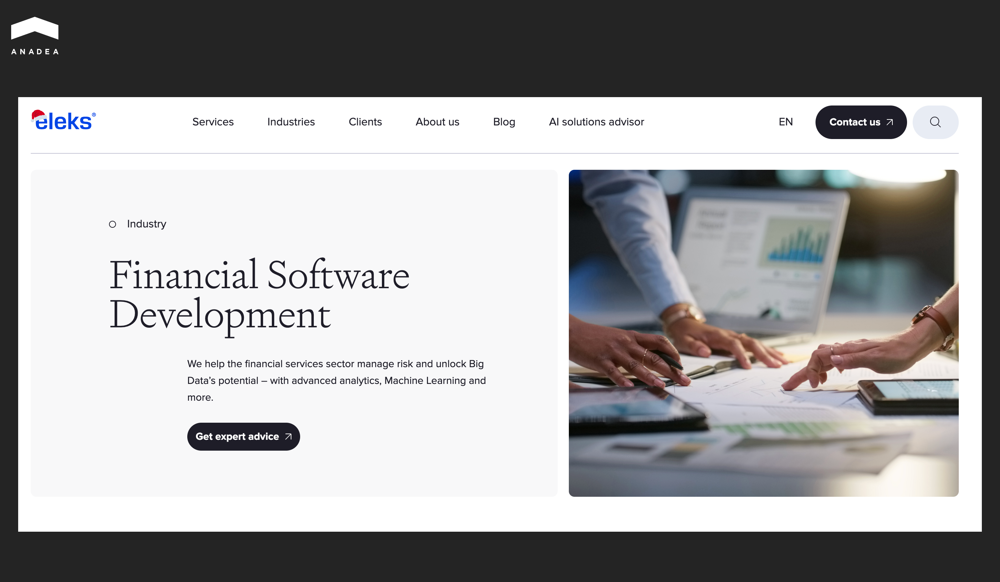
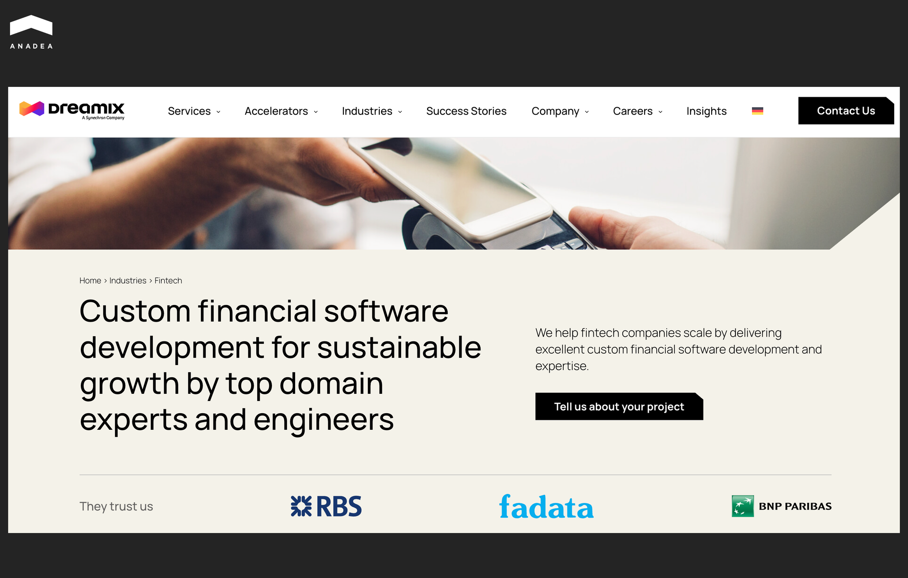
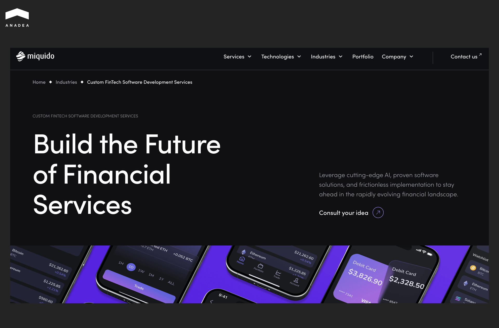

Digital adoption of fintech solutions and user penetration remain high. As [Statista](https://www.statista.com/statistics/893954/number-fintech-startups-by-region/?srsltid=AfmBOopTvy7ZMVlH6E4syk6wnKMJAVBnWaa4FlBoGeiRZ6prQ3Nc5pE3) revealed, in 2024, there were more than 31,000 fintech startups worldwide. According to the [BusinessDojo report](https://dojobusiness.com/blogs/news/financial-technology-statistics), more than 2.5 billion users engage with fintech services. With the growing popularity of such tools among consumers and high interest in offering them from the side of businesses, it is natural that the demand for fintech software development services is increasing as well. 

The quality and long-term success of fintech solutions depend on multiple factors, including the underlying concept, market positioning, go-to-market strategy, technology stack, and execution discipline. Among these, one of the most critical determinants is the right choice of the team responsible for delivering custom fintech software development services. The right partner can bring technical expertise, domain knowledge, and regulatory awareness. All this is essential for product stability and security.

With a continuously growing number of companies offering software development for fintech, the selection process can be time-consuming and challenging. To facilitate this task for you, we have conducted our own market research to find the best fintech software development companies that you can rely on for building your next solution.

## How to Identify the Top Fintech Software Development Companies: Parameters to Consider

Fintech products operate in a highly regulated, security-sensitive environment. Any technical missteps can result in compliance failures, reputational damage, or financial loss. That’s why your evaluation of teams and their custom fintech software development services requires a well-structured approach.

* **Proven fintech domain expertise.** Top fintech software development companies should demonstrate a sustained focus on financial technology. This should include rich experience with payment systems, digital banking platforms, lending solutions, wealth management tools, and blockchain-based applications. Given this, we recommend you attentively consider the portfolios of your potential development partners. Case studies provide concrete evidence of technical capabilities and delivery quality.
* **Compliance readiness.** Leading firms are always familiar with frameworks such as PCI DSS, SOC 2, ISO 27001, GDPR, and regional financial regulations. They integrate compliance requirements into system architecture from the earliest stages to avoid regulatory issues in the future.
* **Security-first approach**. The best companies always apply secure-by-design principles, conduct regular code audits, and support penetration testing. They also have documented incident response procedures and experience in working with sensitive financial and personal data.
* **Integration skills**. Fintech solutions rarely operate in isolation. Reliable development partners have a proven track record of integrating fintech software with core banking systems, payment gateways, third-party APIs, and legacy financial infrastructure.
* **Market reputation**. Client references, repeat engagements, and independent reviews offer valuable insight into a company’s performance. The best fintech software development companies can demonstrate long-term partnerships and high client satisfaction scores.

These parameters will help you reduce vendor risk and select partners with the relevant skills and experience required to build scalable financial solutions.

## Top 10 Fintech Software Development Companies

After careful analysis of the strongest [fintech software development](https://anadea.info/solutions/fintech-software-development) market players, we have chosen the top 10 firms that deserve your attention. They all focus on building advanced fintech solutions. But their approaches, strengths, and experience differ, which will allow you to find a team that aligns with your goals better than others.

### Anadea

Anadea is a global software development firm that delivers custom solutions for businesses from dozens of countries. 

This [outsourcing company](https://anadea.info/blog/fintech-outsourcing/) was founded in 2000, and today, it combines engineering expertise, time-proven delivery approaches, and advanced technologies.

While its overall industry focus is broad, fintech is one of the key verticals within its portfolio of services. The team has delivered more than a hundred of fintech-related projects.

Its offerings cover the development of:

* digital payment systems;
* open banking and API platforms;
* risk management and compliance tools;
* personal finance and investment apps;
* KYC/AML compliance modules.

The team also specializes in building innovative [AI-driven functionality for fintech products](https://anadea.info/blog/ai-in-financial-risk-management/), including predictive analytics, personalized financial advice bots, automated trading, custom behavior analysis, fraud detection, and others.

One of the projects that proves the company’s expertise in software development for fintech is [Admirals](https://anadea.info/projects/admirals). It is the Admiral Markets mobile trading app that provides users with secure access to 5,000 markets, including Forex, indices, metals, stocks, and funds on mobile devices. The app supports demo and live trading accounts, fast execution on multiple asset classes, real-time charts, monitoring, as well as risk management tools like take-profit and stop-loss settings. Other features include integrated payment workflows, credit card/document scanning, and live customer support chat. The app has achieved 500,000+ downloads on Google Play, which reflects its broad adoption.



### Tensorway

Tensorway is a software development company that was established in 2019. It focuses on artificial intelligence to help businesses, including those in financial technology, design, build, and scale intelligent digital products tailored to real-world needs. 

The company’s services address the growing demand for smart fintech applications that improve operational efficiency, enable automation, and support digital transformation. 

Tensorway offers:

* custom software and AI development services; 
* end-to-end machine learning and deep learning model development, training, and deployment;
* generative AI solutions;
* natural language processing (NLP) tools;
* computer vision systems;
* AI chatbots and autonomous agents;
* LLM integration;
* AI consulting and strategy.

Tensorway works with 20+ companies, including midmarket and enterprise clients. Among the products successfully built by the team are an AI agent for deal sourcing automation, an image-to-text conversion tool, an AI agent for predictive trading insights, and many others.

### Curotec

This digital product engineering company was founded in 2010. With more than 15 years in the market, it creates custom software solutions for technology-led organizations, including fintech businesses. 

The company offers a broad suite of services tailored to fintech and related domains:

* blockchain and cryptocurrency solutions;
* mobile banking and payment solutions;
* fintech SaaS platforms;
* AI and ML financial analytics;
* digital wallets and payment gateway development;
* trade and investment management systems.

Curotec provides custom pricing based on project scope, technology stack, and team involvement. Typical engagement models include staff augmentation, project-based outsourcing, and retainer services (ongoing maintenance and support contracts). These flexible options can address the needs of emerging fintech ventures as well as large institutional clients.

### Kindgeek

Kindgeek is one of the top fintech software development companies. Since its establishment in 2015, it has built extensive expertise in delivering various types of financial technology solutions, including digital wallets, neobanks, and payment systems. More than 80% of the company’s project portfolio is in the financial sector, which demonstrates its strong fintech focus.

Here’s what the Kindgeek team can offer to its customers:

* full-cycle fintech software development;
* AI and ML integration for predictive analytics and personalization;
* blockchain, crypto, and smart contract solutions;
* DeFi platforms and NFT marketplaces;
* cloud computing and cybersecurity for fintech systems;
* white-label solutions.

Kindgeek prioritizes regulatory compliance and security in fintech development. The company always implements robust cybersecurity measures, as well as quality management and information security standards across its products. This approach helps ensure high protection of sensitive financial data.

### Scalo

Scalo is an EU-based software development company that entered the market in 2011. Since that time, it has completed over 750 projects across 13 countries. While the company’s offerings cover software development for different domains, custom fintech software development is its key vertical.

Scalo provides a comprehensive set of fintech development services, including: 

* custom credit scoring systems and lending platforms;
* fraud prevention and AML/KYC solutions;
* wealth management systems;
* digital banking systems;
* digital wallets;
* payment platforms;
* modernization and migration of software tailored to financial operations.

The company follows robust security frameworks and introduces compliance support in accordance with industry standards like PSD2 and GDPR, as well as the EU’s DORA requirements. Apart from this, Scalo holds ISO 27001 certification and Microsoft Gold Partner status.

### Comarch

Comarch is a financial software and digital services company. For more than 30 years, it has served global financial institutions with enterprise-grade technology. It delivers banking, insurance, asset management, and broader fintech solutions to over 100 businesses worldwide. Its client base includes leading banks and financial groups. 

Comarch’s fintech portfolio covers a wide range of financial software and services, such as: 

* Comarch Open Platform (a modular environment for building digital finance and banking services);
* Comarch corporate and SME banking;
* loan origination systems;
* wealth and asset management tools;
* trade finance platforms;
* factoring systems;
  custody and securities settlement tools;
* mobile banking;
* cybersecurity and transaction protection.

Comarch has hands-on experience in delivering solutions for mission-critical financial systems where compliance and reliability are the top priorities.

### ELEKS

With over three decades of experience in delivering tailored digital solutions, today, ELEKS is one of the best fintech software development companies. The firm has a workforce of approximately 2,000+ specialists and operations across North America, Europe, the Middle East, and Asia. It cooperates with enterprise clients, large financial institutions, and fintech innovators.

The company’s finance domain expertise covers:

* investment management and brokerage;
* banking solutions;
* accounting;
* cards and payments;
* hedge funds and asset management;
* security management and trading.

In addition to development, ELEKS provides its customers with consulting and advisory services. Its experts have a deep understanding of all the ongoing market trends and needs and help businesses choose the right fintech strategy and architecture.

### N‑iX 

Founded in 2002, N‑iX today acts as a fintech technology partner for businesses from all over the world. The company has 300+ experts with deep domain knowledge. The team has successfully delivered 250+ fintech and financial software projects, including custom banking, payment, lending, and capital markets solutions.

In the fintech domain, the company provides the following services:

* integration of cutting-edge technologies, such as generative AI, to enhance existing solutions;
* development of new systems;
* optimization of customer lifecycle management processes;
* modernization of compliance-related technology workflows;
* development of strategies for legacy products and systems (consolidation, decommissioning, and performance optimization);
* digital transformation.

N-iX adheres to international standards (PCI DSS, ISO 27001:2013, ISO 9001:2015, GDPR, and FSQS), which support the development of secure and compliant systems.

### Dreamix

Dreamix is a custom fintech software development company founded in 2006. For nearly two decades, Dreamix has delivered tailored software solutions across sectors, including but not limited to fintech, RegTech, aviation, and healthcare. Among its clients from the finance and banking industry are prominent institutions, like BNP Paribas and Royal Bank of Scotland.

Today, the team focuses on:

* custom financial software development;
* web banking and financial reporting platforms;
* third‑party integrations;
* legacy system modernization;
* cloud computing;
* AI and ML applications;
* technology consulting.

With multiple awards for service excellence and a 95% employee retention rate, Dreamix is one of the strongest players in the fintech development market today.

### Miquido

Miquido is a custom fintech development company that was established in 2010. Over this time, it has delivered more than 250+ projects across fintech, entertainment, and other industries. It supports global clients such as NextBank, Skyscanner, and Warner Music.

Today, the company builds scalable financial applications with a focus on AI functionality and cloud‑native solutions.

Miquido’s fintech capabilities include: 

* fintech product strategy and discovery;
* mobile and web banking apps; 
* AI‑powered financial solutions;
* scalable backend systems;
* legacy system modernization;
* API integration with existing financial infrastructure;
* compliance and regulatory consulting.

With its wide range of services and client-oriented engagement models, Miquido can become a good tech partner for startups, financial service providers, as well as businesses offering both regulated and non‑regulated fintech software.

## Final Word: How to Choose the Best Fintech Software Development Services

When you are planning a fintech development project, always choose a partner that combines technical skill with industry insight. 

Though a company’s reputation plays an important role in decision-making, you shouldn’t rely solely on it. We recommend conducting practical assessments as well. Review the team’s code samples, prototype solutions, and integration capabilities. Make sure that its experts can adapt to your tech stack and maintain robust compliance standards.

If Anadea’s expertise and approaches to software development align with your business goals, let’s [schedule a consultation](https://anadea.info/contacts). We are always open to new ideas and are ready to transform them into fully functional solutions.
