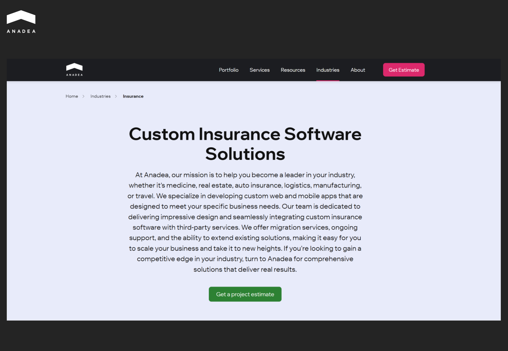
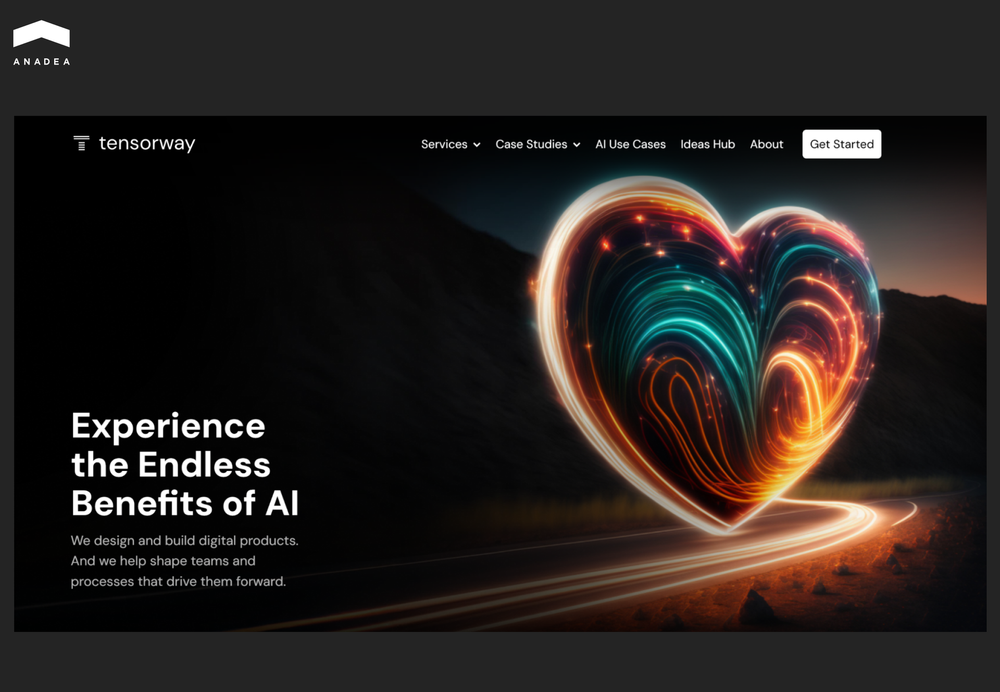
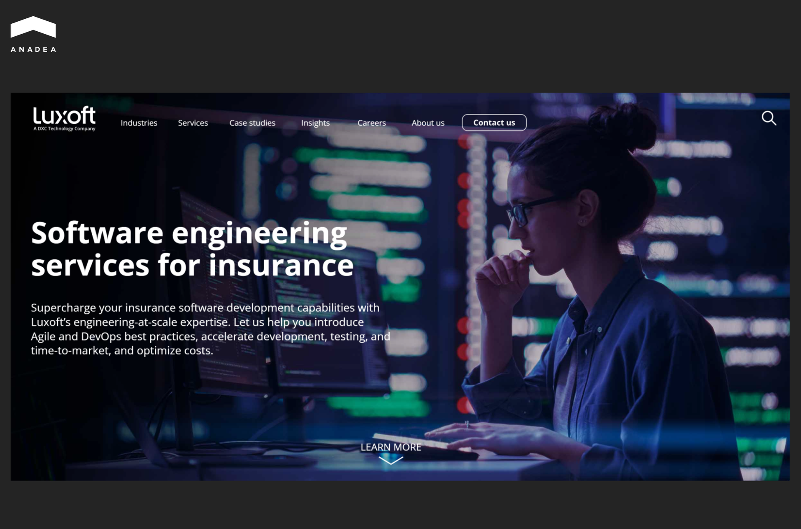
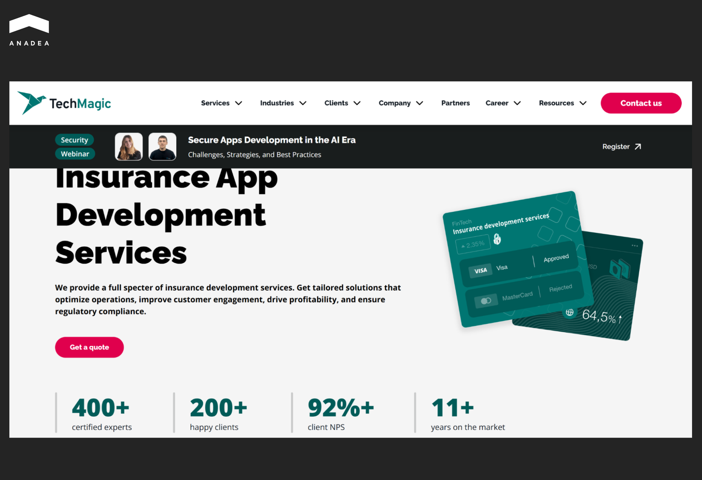
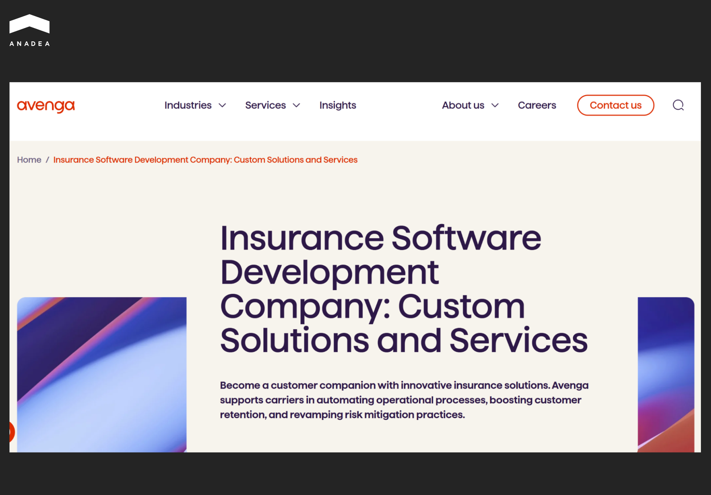
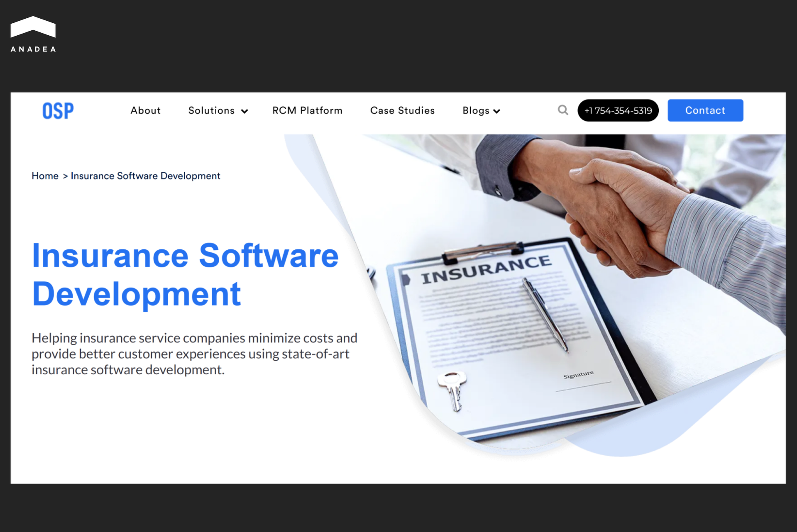
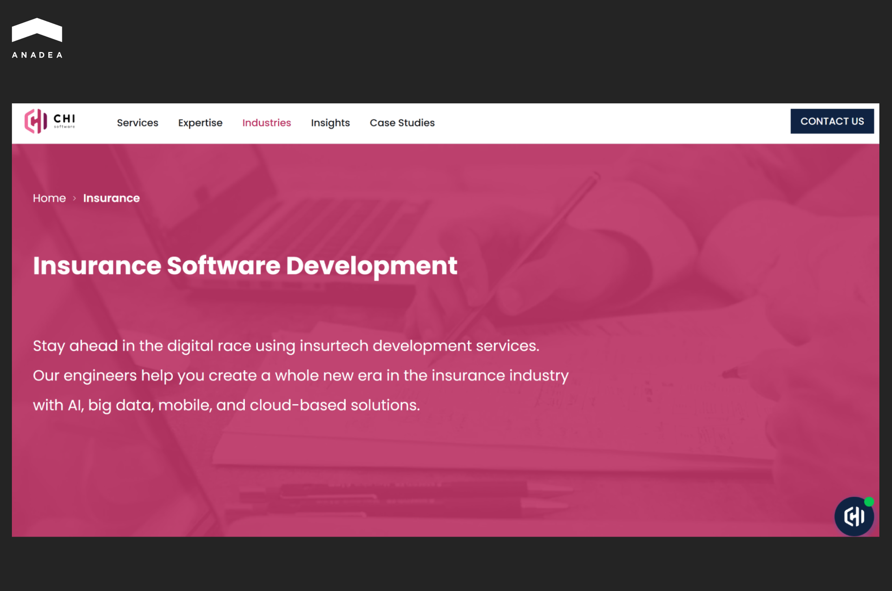
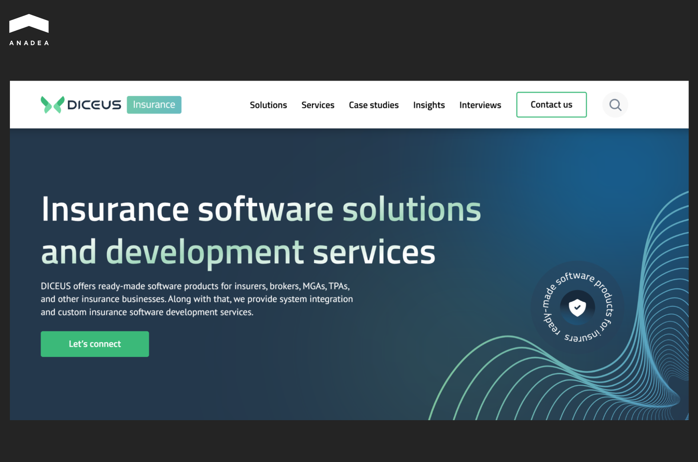
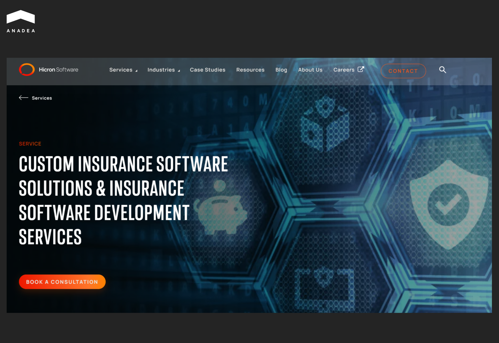
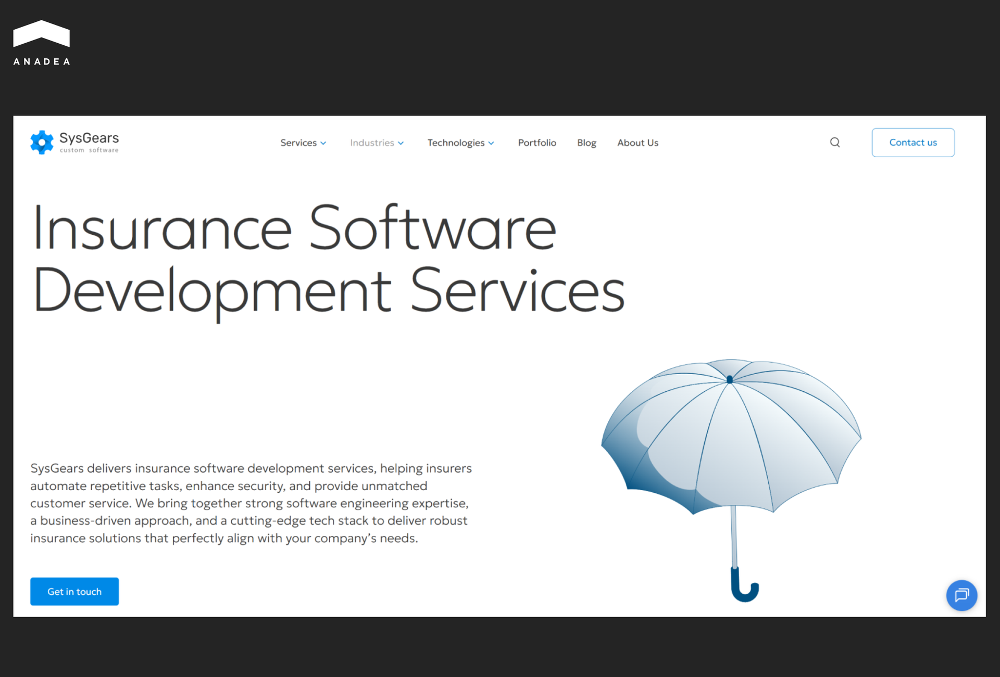

According to the Gitnux report, [70% of insurance executives](https://gitnux.org/digital-transformation-in-the-insurance-industry-statistics/) say that digital transformation has a strong positive impact on customer experience. More than 80% of insurance companies notice an increase in customer loyalty thanks to the introduction of digital solutions. Such trends are among the reasons behind the growing interest of insurers in implementing software tools in their business processes. As not every insurance company has an in-house software development team, the demand for relevant outsourcing services is increasing as well. But how to find a reliable tech partner for an insurance agency? That’s one of the key questions that we will answer.

In this article, we invite you to take a closer look at the best insurance software development companies that can help turn complex insurance workflows into smooth digital experiences.

## How to Choose a Custom Insurance Software Development Company: Must-Have Evaluation Criteria

The success of your project and the efficiency of your custom solution greatly depend on the team that will provide you with insurance software development services. A reliable tech partner should combine deep domain knowledge with proven technical and regulatory capabilities. Below you can find a list of the key criteria that you should evaluate before establishing cooperation with a development agency.

### Domain Expertise

Insurance is a highly specialized industry. That’s why your technology partner should be familiar with the peculiarities of your sector and workflows. You should look for companies with proven experience across property & casualty, life & annuities, health, specialty, and reinsurance domains. Each of them has distinct business processes, rating structures, and compliance requirements. The better your partner is aware of all the peculiarities, the more accurate the solution design you can expect.

### Compliance and Security Stack

Insurance software handles different types of sensitive data. Given this, your software development partner must adhere to top-tier security and compliance frameworks. The range of essential certifications includes SOC 2, ISO 27001, HIPAA (for health insurance software development), GDPR, CCPA, etc.

### Integration Expertise

A professional insurance software development team should have a strong background in integrating custom tools with third-party business systems and services, including data providers (LexisNexis, Verisk/ISO, MVR/DMV sources, etc.), geospatial and satellite platforms, as well as payment gateways. These integrations minimize manual input and enable real-time decision-making.

### Architecture and Technology Stack

Modern insurance solutions require flexibility and resilience. The best insurance software development companies build cloud-native, microservices-based, event-driven, and API-first architectures. Strong DevOps practices and automated testing are also key to maintaining performance and reliability in complex environments.

### Proven Track Record

We recommend that you review case studies. Pay attention to measurable results like improved quote turnaround, reduced claims cycle times, or enhanced customer satisfaction. It would be a good idea to ask for client references and analyze their reviews and comments on external platforms like Clutch or GoodFirms. 

### Engagement Model and Team Composition

Vital components of a successful partnership are processes and people’s expertise. You need to assess whether the company offers optimal cooperation for you (like team augmentation, dedicated teams, or project-based outsourcing) and the required seniority levels of its experts. 

### Transparency and Governance

Make sure that your potential partner is open about code ownership, intellectual property rights, subcontracting practices, and overall security posture. With a transparent, governance-driven approach, it is possible to minimize operational risks and foster long-term trust.

## Top Insurance Software Development Companies to Hire for Your Project

When you decide to launch your own custom solution, it is crucial to look for a company with an outstanding reputation in software development for insurance business	. We recommend that you conduct your own research and find an offer that will align with your goals and priorities. But to streamline and facilitate this process for you, we have prepared a shortlist of the best teams to cooperate with when you want to build a solution for your workflows.

### Anadea

This software development team was founded in 2000, and since that time, it has successfully delivered over 600 projects to hundreds of customers. Today, Anadea’s portfolio covers various sectors such as fintech, healthcare, education, real estate, e-commerce, etc. And [insurance](https://anadea.info/solutions/insurance-software-development) is one of the domains where the team has accumulated the strongest expertise. In this sphere, the team can successfully deliver custom tools for policy administration, claims management platforms, agent portals, chatbots, insurance calculators, analytics, and enterprise risk-management solutions. 

The company’s developers work with modern technologies and frameworks, such as Ruby on Rails, Java, Scala, React, Vue, and have solid experience in building highly-demanded types of solutions, including SaaS platforms and mobile apps.

Anadea can help insurers to implement AI/ML for their specific use-cases, like input automation, claims assessment, and fraud detection. Such technologies will help insurers move from simple digitalization to intelligent automation

In addition to custom development, Anadea also offers other related services, like legacy system migration, modernization, and integration with APIs and external data sources.



### Tensorway

With over 6 years of experience, this AI development company can efficiently address the needs of insurers seeking smart digital solutions. Tensorway’s team has rich expertise in building software products enriched by machine learning (ML), deep learning (DL), NLP (natural language processing), and computer vision features. Such functionality allows insurance firms to automate business workflows, extract actionable data, improve decision-making, and enhance the experiences for their employees and customers.

For insurers, it is crucial to ensure that the architecture of their solutions supports scale, security, integration with core systems, and future-proofing. And that’s exactly what Tensorway can offer. Its experts have strong practical skills in using Python, JavaScript/TypeScript, major ML frameworks (TensorFlow, PyTorch), cloud platforms (AWS, Azure, GCP), as well as container and orchestration tooling.

In the team’s portfolio, you can find examples of tools that can be successfully used in insurance workflows, like an ML-powered document understanding solution or an AI agent that automates the claim submission process.

### Luxoft

Luxoft leverages over two decades of experience to help insurers modernize legacy systems and enhance operational efficiency. Apart from technical solutions, Luxoft provides strategic advisory services and supports insurers in their digital transformation. The company develops customer-centric products, optimizes distribution strategies, and ensures compliance with evolving regulatory requirements.

With the growing demand for automation, the Luxoft team has shifted its focus to AI technologies for insurers. One of the projects for the insurance industry included the implementation of generative AI to accelerate data extraction from documents.

### TechMagic

TechMagic is a custom software development company specializing in delivering tailored solutions for the insurance industry. With over 11 years of experience and a team of more than 400 professionals, TechMagic has successfully cooperated with over 200 clients. 

TechMagic offers a full spectrum of insurance software development services, including insurtech MVP development, legacy code modernization, web and mobile app creation, as well as APIs development and integration.

Among the types of insurtech software that it can build are insurance document management systems, risk management software, insurance quoting software and analysis algorithms, claims and policy management software, etc.

As of today, TechMagic has entered an official partnership with prominent tech giants, like AWS, Salesforce, and Serverless.

### Avenga

Avenga is among the best insurance software development companies that deliver solutions designed to enhance risk assessment, improve customer engagement, and ensure compliance with industry regulations. The company has been working in the market for more than 30 years. Its team includes 6,000+ experts, who work with customers from over 50 locations around the globe.

The team is proficient in a wide range of technologies, such as Python, Django, Vue, Swift, Kotlin, React Native, Flutter, Kubernetes, Docker, AWS, Azure, and others. The rich stack enables the development of robust and scalable insurance applications.

Avenga’s expertise in the insurance sector is demonstrated through a range of successful projects. One of them is the Firmen Digital initiative with HDI. Avenga’s team digitized the contracting process for commercial insurance and made it more accessible and efficient for businesses. 

### OSP Labs

This US-based custom software development company specialises in tailored solutions for the healthcare and insurance domains.

OSP Labs can build a wide range of custom software products, including data analytics platforms, health insurance apps, payer administration tools, as well as insurance management, risk management, policy management, and insurance CRM software. The team rigorously tests every application to ensure compliance with security and regulatory standards. It leverages AI, automation, and cloud technologies to optimize workflows and drive innovation with its advanced solutions tailored to customers’ needs.

Over 16 years of working in the software development industry, OSP has cooperated with more than 57 global clients and delivered 700+ projects. Today, the team comprises 200+ professionals.

### CHI Software

With a team of over 800 specialists, CHI Software operates globally and provides quality software solutions across various industries, including insurance. The company is ISO 27001 and ISO 9001 certified, which ensures adherence to international standards for information security and quality management.

It offers a comprehensive suite of services tailored to the insurance industry. In its rich portfolio, you can find a lot of custom solutions for this domain, such as policy management, claims processing, and customer portals, mobile apps, travel insurance platforms, and healthcare insurance applications.

To enhance insurance operations, CHI Software integrates advanced technologies, such as AI, ML, the Internet of Things, cloud computing, big data, and analytics.

### DICEUS

DICEUS is an insurance product development software partner that provides both custom software creation services and ready-to-use solutions. Since its inception in 2011, the company has been empowering insurers and brokers with advanced tools to digitize workflows and automate critical processes. Today, its client base includes well-known names like UNIQA, VIG, and Fairfax Group.

The company’s team can build insurance software of different types and complexity based on the needs of each customer. But those insurers that are not ready to invest in custom development can choose from the available off-the-shelf options. One of them is Super App. It is a customer-facing mobile application that can support various insurance lines (health, life, unit-linked, auto, travel insurance, etc.).

### Hicron Software

Hicron offers a comprehensive suite of services tailored to the unique needs of the insurance industry. The company operates internationally, with offices in Poland, Germany, Australia, and Spain, and can provide cost-effective nearshoring solutions to clients from different corners of the world. It has a proven track record of delivering complex SAP projects for global brands, including Volvo and Peugeot.

The implementation of the custom solutions built by the Hicron team brings insurance companies tangible results. For example, the introduction of the claims automation software helped decrease claim resolution times by 40%. This also ensured a 25% reduction in operational costs.

### SysGears

This custom software development company works with different domains. And insurance is one of them. It focuses on automating key insurance processes, like underwriting, claims management, policy administration, and others. It leverages advanced technologies (AI, big data, and IoT) to make its solutions efficient and future-proof.

With rich expertise in the industry, SysGears provides auto, travel, disability, homeowner, P&C, and health insurance software development services.

It has cooperated with 350+ clients worldwide, including startups, small and medium-sized businesses, and large enterprises. The SysGears team offers offshore and nearshore outsourcing models, which ensures timely delivery and adherence to budget constraints.

## Wrapping Up

Digitalization is not just a trend in the insurance industry. It’s a must for those companies that want to ensure relevant customer experiences and stay strong amid the growing market competition. While off-the-shelf solutions can’t fully address all the specific needs of each firm, insurers turn to custom development services. And here, the selection of the right tech partner is one of the most important decisions to be made.

This choice will depend on your organization’s goals, scale, and technical requirements. If you see that Anadea’s approach and expertise align with your needs and vision, don’t hesitate to contact us. Share your ideas with us and [book a call](https://anadea.info/free-project-estimate). Our experts will be ready to answer all your questions and provide more detailed information about our services and experience.
