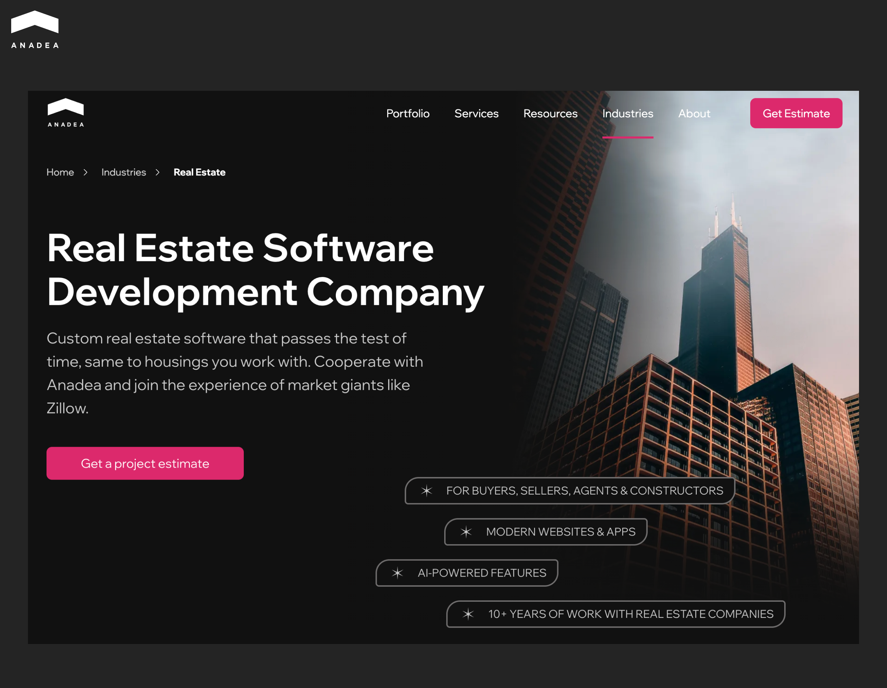
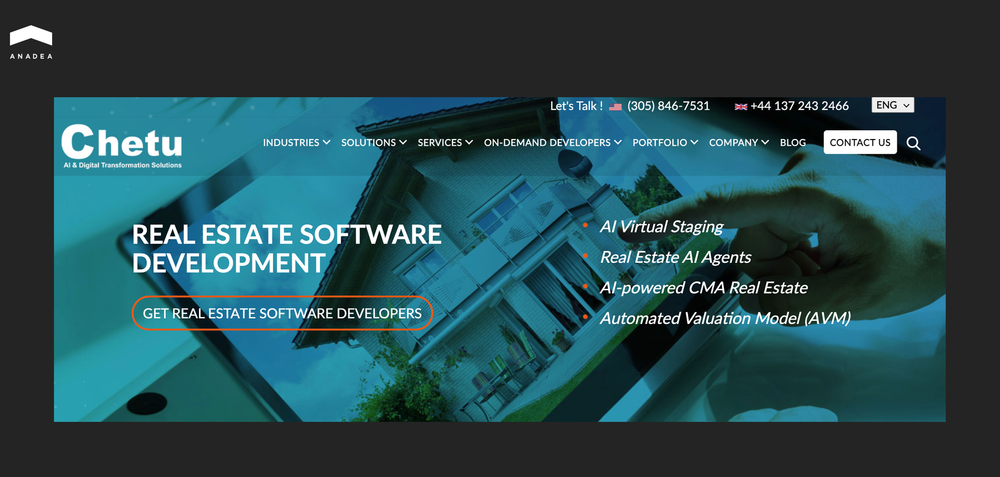
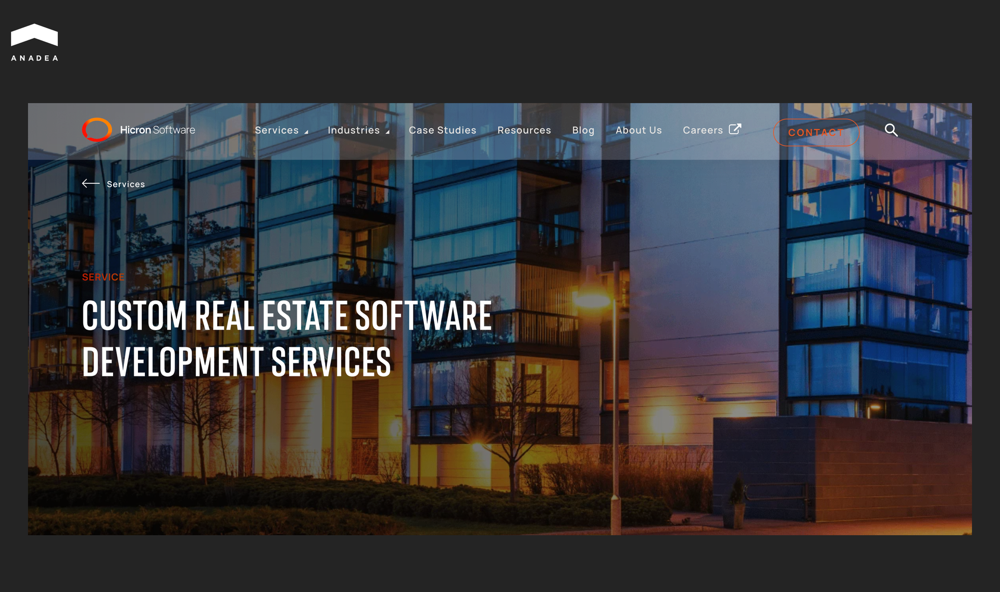
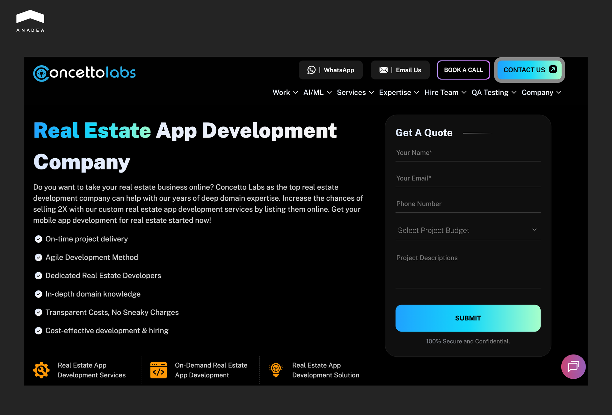
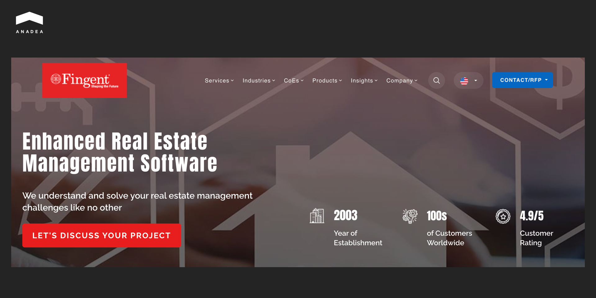
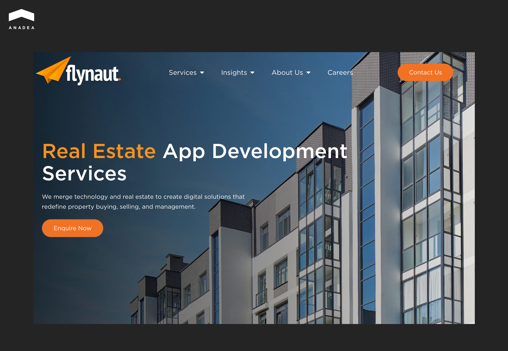
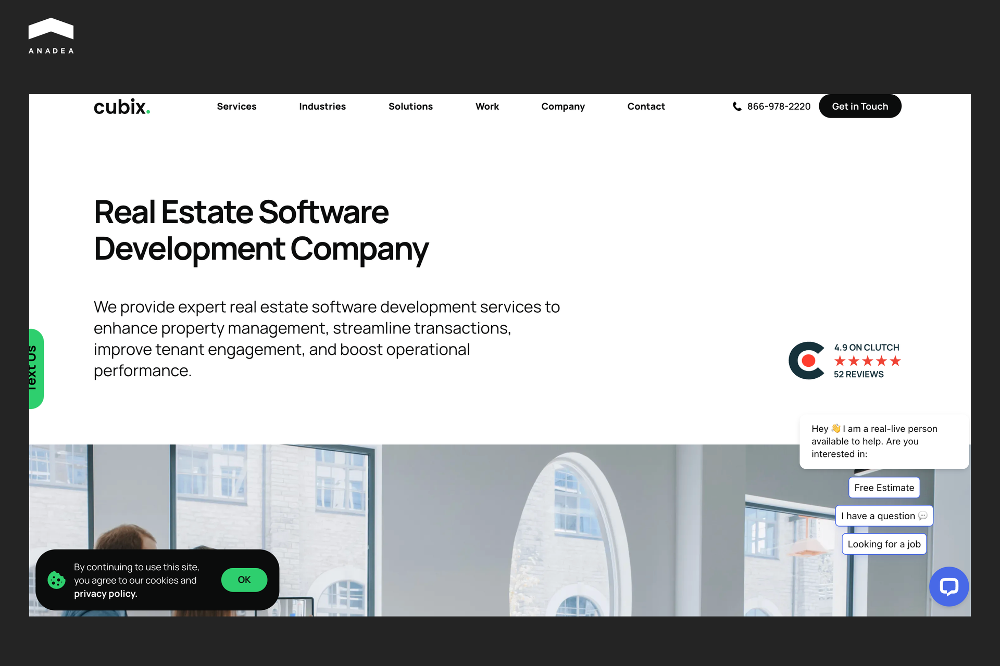
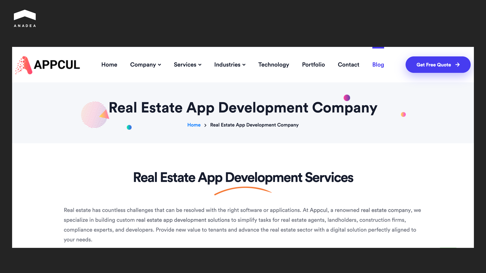
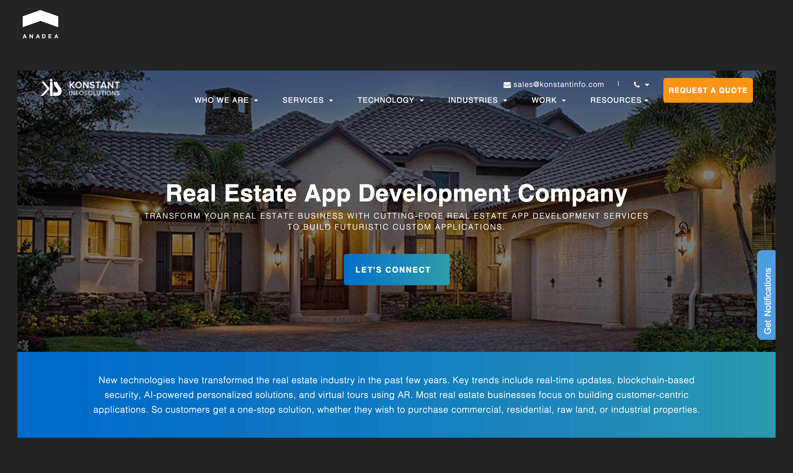
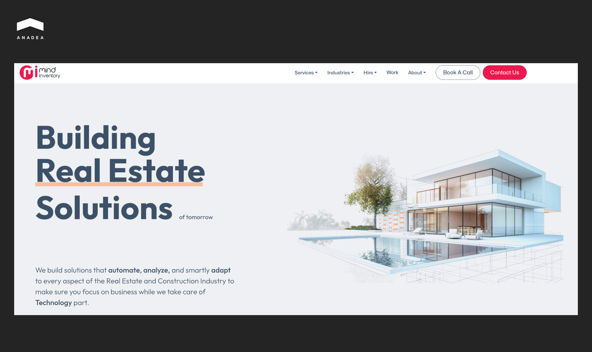

As the [report by Coherent Market Insights](https://finance.yahoo.com/news/real-estate-software-market-hit-091300203.html) revealed, in 2025, the real estate software market was valued at $13.65 billion. By 2032, it is expected to reach $34.1 billion. This growth demonstrates the increasing adoption of property technology and supports the demand for real estate software development services. 

In 2026, real estate businesses are actively launching new systems for their needs. Others enhance their existing solutions and equip them with advanced[ AI functionality](https://anadea.info/blog/ai-in-real-estate/), like copilots for agents and investors, analytics, computer vision tools, etc. For such projects, they often need specialized tech skills that they can access through partnerships with custom real estate software development companies.

If you search for providers of [real estate software development services](https://anadea.info/solutions/real-estate-software), you will get thousands of offers. Even though they may look quite similar, in reality, different teams can’t ensure the same quality. They all may focus on different technology stacks and types of products. This means that before choosing a partner for your next project, you need to conduct good market research.

## Top Real Estate Software Development Companies for Your Next Project

To make this process faster and easier for you, we have prepared a shortlist of the best real estate software development companies with a strong reputation. We included only those teams that have proven delivery maturity and real estate case studies. All of them have their specific strengths that can become a decisive factor in your choice.

### Anadea

Anadea is a well-established custom software development company that entered the market in 2000. Since that time, its team has partnered with clients from different industries, but real estate is one of those where Anadea’s developers have the strongest expertise. Over more than 10 years of working in the real estate domain, Anadea has built dozens of successfully launched web and mobile solutions.

What software can the Anadea team create for you?

* MLS platforms;
* property listing tools;
* search engines;
* property and investment management systems;
* CRM and ERP integrations;
* valuation tools, etc.

Apart from standard functionality, Anadea’s custom software for real estate can also be powered by advanced features like predictive analytics, AI-driven search and recommendations, GIS mapping, and others.

Anadea stands out for successful long-term partnerships with major players like Zillow, which proves the company’s ability to support evolving product needs. One of the examples is the [StreetEasy](https://anadea.info/projects/streeteasy) project. This collaboration started more than 12 years ago.

Zillow-owned StreetEasy is one of the most visited real estate platforms in the US. However, its aging monolithic architecture was a serious barrier to the platform’s growth. The task for Anadea was to modernize StreetEasy and adapt it to the needs of its growing audiences.

The team transitioned the platform to a microservices architecture, as well as introduced Kubernetes orchestration and real‑time monitoring. Apart from this, developers integrated advanced features like interactive maps, 3D tours, and personalized search tools. 

These updates significantly improved performance and engagement. StreetEasy achieved a 115 % increase in sales leads and now can ensure 33x faster page load times. This allows the platform to support high traffic and complex workflows, handling over 180 million annual visits annually



### Chetu

Founded in 2000, Chetu is an outsourcing company that offers software development for real estate and other domains. Its practice covers a full spectrum of the industry's needs. The company’s developers build tailored solutions that can automate workflows, streamline operations, and support complex data flows.

Among the custom solutions that Chetu delivers are:

* MLS/IDX/RETS platforms;
* property and portfolio management systems;
* real estate accounting and transaction software;
* AI‑enabled predictive analytics;
* advanced integrations with third‑party systems, and others.

Chetu’s portfolio includes solutions for real estate associations such as the REALTORS® Association of Edmonton. For this project, it created automated auditing and infraction tracking applications for MLS data. 

The company works on a custom engagement model and can adjust its team composition and pricing to specific project requirements.

### Hicron

Founded in 2006, Hicron has built deep expertise across several domains, including software development for real estate, manufacturing, insurance, and automotive. The team’s custom solutions aim to eliminate inefficient workflows and provide competitive differentiation for clients with specific business needs.

The company’s expertise covers:

* custom property and portfolio management software;
* brokerage and agent management platforms;
* MLS/IDX integrations;
* lead management systems;
* web and mobile applications for buyers and agents.

Thanks to integrating emerging technologies such as AI, IoT, and AR/VR into real estate software, Hicron creates future‑ready solutions. For instance, its portfolio includes immersive property tours and intelligent automation.

### Concetto Labs

The history of Concetto Labs began in 2014 with the opening of its first office in India. It has become a truly global company with presence in 6 countries (India, the USA, the UK, Canada, Norway, and Australia). Its team includes more than 100 tech experts. They have successfully delivered over 550 web and mobile apps created for businesses from different industries, including real estate.

Concetto Labs’ offering for real estate businesses:

* Custom real estate web and mobile app development;
* property listings and user dashboards;
* seller and buyer interaction features (inquiries, messaging, favorites);
* admin panels with analytics and content control;
* specialized solutions (property booking, valuation tools, investment apps, etc.).

Concetto Labs offers flexible pricing tiers, from sub-$10K to enterprise-grade projects. The team supports clients through the entire development cycle, which also covers testing, deployment, and post-launch maintenance. Engagement options range from fixed-scope projects to ongoing support and iterative enhancements.

### Fingent

Fingent is a custom software development firm founded in 2003. For over two decades, its team has built technology solutions across industries, including real estate and proptech. It delivers tailored real estate software that helps businesses streamline operations and enhance customer engagement.

Fingent develops a wide range of real estate solutions:

* Property management systems;
* MLS/IDX and RETS integrations;
* CRM platforms;
* marketing automation, rent and lease management tools;
* mobile apps for agents, tenants, and property managers.

To support residential, commercial, industrial, and brokerage software needs, the company creates features that automate leasing, maintenance, valuations, and lead management.

Fingent has built its reputation as a strong partner for enterprises and mid-sized real estate firms. But also, it can efficiently address the needs of growth-stage companies that are looking to replace legacy systems or build feature-rich proptech platforms from scratch.

### Flynaut

This software development company entered the market in 2004. Since then, Flynaut has successfully delivered over 200 projects. The company offers end-to-end support from strategy and UX/UI design to development and deployment.

In its custom software development for real estate, the company focuses on immersive features like virtual tours and real-time market insights to enhance user experience.

Flynaut builds tailored real estate applications, such as:

* Property listing platforms;
* agent-client communication tools;
* CRM and investment dashboards;
* virtual tours with AR integration;
* smart property management systems.

Flynaut offers flexible engagement models, including project-based development and full product cycles through agile iterations. Project pricing is customized based on scope and complexity.

Among Flynaut’s customers are U.S. Bank and the University of Kansas.

### Cubix

Cubix is a full-cycle custom software development company founded in 2008. Since its founding, it has established a global footprint and accumulated rich experience in building tailored digital solutions across a range of industries, including real estate. Its team comprises more than 350 software professionals.

The company specializes in developing:

* Real estate CRM systems;
* investment platforms;
* smart property listings;
* virtual property tours;
* property valuation tools;
* neighborhood insight functionality;
* real estate marketplace apps;
* rental ops systems, etc.

Cubix offers different cooperation formats, such as full product development, dedicated engineering teams, and long-term technical support. Pricing is defined by various factors, like scope, architecture complexity, and integration requirements.

### Appcul

Appcul is an India-based mobile and web app development company established in 2021. It specializes in custom digital solutions for e-commerce, healthcare, and real estate. The company is known for its expertise in iOS, Android, hybrid, Flutter, and React Native development.

Appcul builds real estate apps designed to support:

* Property listing;
* property search;
* lead generation;
* agent interaction;
* tenant management. 

The company’s solutions often include highly-demanded features such as geolocation mapping, interactive property galleries, messaging, and analytics. Such functionality helps real estate businesses improve engagement and conversions.

Appcul positions itself as a reliable partner for startups and small-to-mid-sized real estate firms. And it helps businesses launch their own mobile-first property platforms, listing apps, and tenant engagement tools. 

### Konstant Infosolutions

Konstant Infosolutions was established in 2003, and from a small team it has grown into a big company with more than 180 employees. Today, its client base includes more than 2500 satisfied customers across different domains. Among the focus industries that the company works with are real estate and property, food and restaurants, banking and finance, education and e-learning, as well as travel and hospitality.

Functionality that Konstant Infosolutions builds for its clients:

* in-app GPS system;
* personalized user profile;
* property profiles;
* AI-powered recommendations;
* mortgage calculator;
* direct messaging and in-app calling; 
* push notifications;
* advanced analytics, and others.

In its custom real estate app projects, the team can also apply a range of emerging tools and technologies, like AI, ML, IoT, blockchain, and AR. 

### MindInventory 

Established in 2011, MindInventory is a custom software development company with a strong focus on digital transformation across domains. MindInventory partners with businesses of different types and kinds, including the most well-known companies from all around the world, such as Booking.com, KFC, Google, Maersk, Panasonic, and Tinder. Real estate is one of the industries that MindInventory successfully serves.

MindInventory’s real estate software development services cover:

* Custom real estate apps and platforms for leasing and marketplace operations;
* property and portfolio management systems with tenant and maintenance workflows;
* CRM and brokerage management systems;
* mobile and web apps with geolocation, interactive search, and real-time updates;
* third-party integrations;
* software modernization and managed services for existing platforms.

In its solutions, the team prioritizes user-centric design approaches and high security and compliance standards.

## Final word

The success of your custom real estate software development project greatly depends on the team that you will hire to build your solution. That’s why one of the first things that you should do when you are planning to launch or modernize your software is to find a company that will deliver real estate software development services to you. To do it, you should attentively study the available options to understand which partner best aligns with your business goals and technical requirements.

Look beyond pricing alone. Always evaluate each company’s real estate domain expertise, delivery track record, and security approach. Informed choice will help you reduce risks and avoid costly rework.

If Anadea looks like a good option for your company and you want to learn more about our services, [contact us](https://anadea.info/contacts)! Our experts will provide you with all the information that is required for a well-grounded decision.
