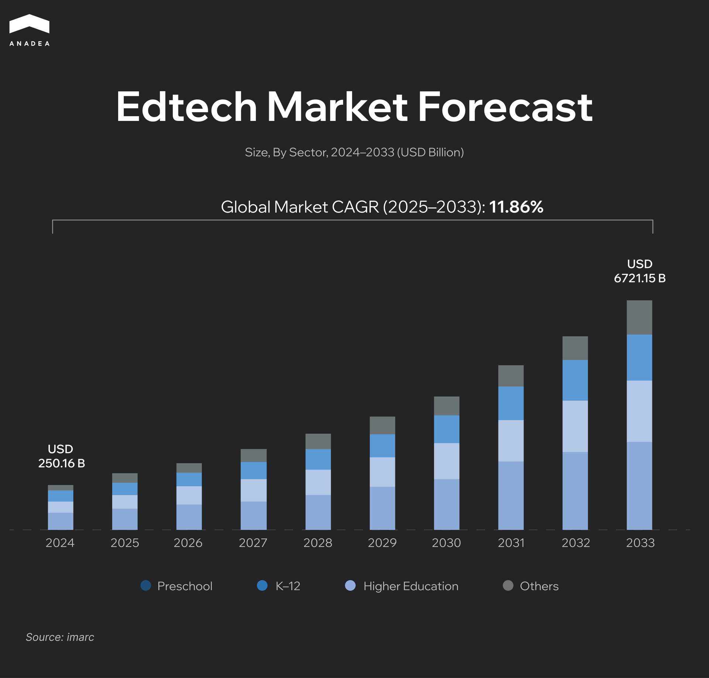
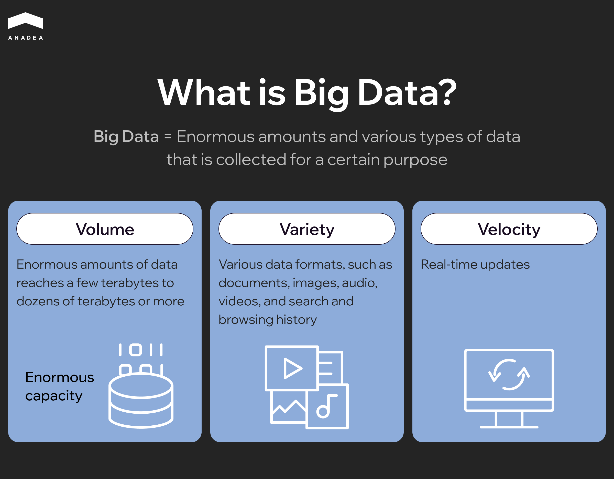

In 2024, the global edtech market size reached $250.16 billion. Now, experts predict that by 2033, this figure will increase to [$721.15 billion](https://www.imarcgroup.com/edtech-market), which reflects a CAGR of 11.86% during the forecast period (2025-2033). The market growth is driven by the continuously increasing demand for enhanced digital learning experiences, personalized tutoring solutions, and adaptive assessments.

Based on our practical experience in [e-learning software development](https://anadea.info/solutions/e-learning-software-development) and our deep understanding of the ongoing market trends, we see the increasing role of data in this field. The large-scale collection and intelligent analysis of diverse student and institutional data are a cornerstone of modern edtech systems. That’s why the demand for big data tools, supported by AI and other emerging technologies, that help perform such tasks is higher than ever.

In this article, we are going to talk about the use of big data in education, its benefits, real-life applications, and future trends.

## What Is Big Data in Education?

Big data in education is the collection, analysis, and application of vast volumes of educational data to enhance teaching, learning, and institutional decision-making. It helps teachers and administrators gain actionable insights into student interactions and academic records.

The key characteristics of big data in education include:

* **Volume**. There are huge amounts of data from different sources. Such data is continuously generated daily by students, teachers, and platforms.
* **Variety**. Data comes in various formats, including sensor data, test scores, forum posts, etc.
* **Velocity**. Today, new data is generated at high speed and should be processed in real time.
* **Veracity**. It is vital to estimate data quality and accuracy.
* **Value**. The key goal is to get actionable insights that will be further used to enhance the teaching and learning processes.

There are several types of big data analysis widely applied in education.

* **Descriptive analytics**. It answers the question “What happened?”. It summarizes historical data to provide insights into trends and patterns. For example, tools of this type help track students’ grades over time.
* **Diagnostic analytics**. The main question is “Why did it happen?”. With such systems, educational institutions can identify causes or correlations. For instance, they can analyze why some students perform better or worse in specific modules.
* **Predictive analytics**. Such tools are designed to answer the question “What may happen?”. Based on historical data and ML models, predictive analytics tools forecast future outcomes, like possible grades or course completion rates.
* **Prescriptive analytics**. With tools of this type, educational institutions can find answers to the question “What should we do about it?”. Such solutions provide actionable strategies and recommendations. They can be used for offering personalized study plans or for notifying tutors when students need targeted support.

### What Data Sources Are Used?

* **Learning management systems (LMS)**. Systems like Canvas LMS, Google Classroom, or custom solutions enable educators to monitor student activity, time on task, grades, and content engagement.
* **Student information systems (SIS)**. These systems typically store demographics, attendance, disciplinary records, course enrollments, and academic history.
* **Assessment and testing platforms**. These solutions cover standardized test results, formative/summative assessments, and other testing data.
* **Behavioral and engagement metrics**. Big data can also accumulate info from various e-learning apps, including but not limited to time spent per topic, peer collaboration, forum participation, etc.
* **IoT devices**. Today, smart classrooms can be equipped with biometric devices, classroom cameras, sensors, smart blackboards, and other connected devices. They can track presence, emotional engagement, or physical activity.
* **Surveys and feedback forms**. Educational institutions can also collect feedback directly from students to analyze their satisfaction and motivation levels.

Traditional vs Data-driven Education
