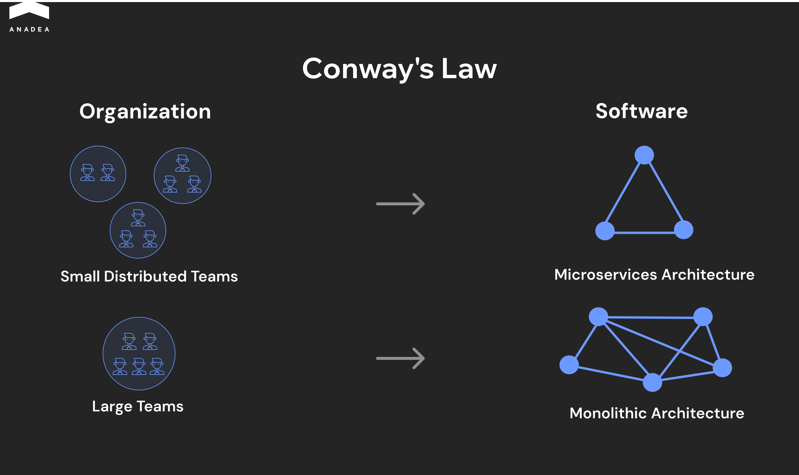

Conway’s Law states that your software architecture will inevitably mirror your communication structures. Centralized teams naturally produce tightly coupled, monolithic architectures because every technical decision requires mass consensus. If your team requires a 10-person sync to launch a minor feature, your codebase will reflect that operational bottleneck. 

To scale your team efficiently, you must minimize the need for your developers to talk to each other in real time and depend on each other’s decisions. When you structure your organization into autonomous distributed teams, you can naturally get a decoupled microservices architecture.

In this article, we will show you how to transition from synchronous delays to asynchronous engineering and drive continuous deployment without micromanagement.

## Distributed Engineering Teams: When It Makes Sense and How to Build One

Restricting your engineering talent pool to a 30-mile radius of a physical office is a self-imposed bottleneck.

When you consider building distributed engineering teams, your motivation should not be a desire to offer remote work as a popular perk for employees. Go distributed because it brings resilience and velocity. 

The distributed team model allows for follow-the-sun development cycles. For instance, when your West Coast team logs off, your Eastern European team reviews the pull requests, and your APAC team handles the deployment.

### The Shift Toward Hybrid Development Teams

The industry is pivoting back to hybrid models, but most organizations get the execution wrong. They define hybrid as a mandatory three days in the office. This simply recreates synchronous dependencies.

A working hybrid model treats the physical office as a tool. The office is reserved for whiteboarding complex system architecture or high-bandwidth design discussions.

Remote time should be dedicated to deep-work coding. If your engineers are commuting an hour just to sit on Zoom calls with remote contractors, your hybrid model doesn’t work properly.

### Why Engineering Team Structure Dictates Scalability

For managing distributed teams efficiently, you must mitigate cross-timezone dependencies. Based on our 26+ years of experience in [IT outsourcing](https://anadea.info/services/it-outsourcing) and [staff augmentation](https://anadea.info/services/staff-augmentation), we can advise you to:

* **Create autonomous pods.** Assign small groups to work on specific microservices end-to-end.
* **Define interaction contracts.** Onshore and offshore development teams should communicate via clear documentation and API contracts.
* **Isolate the blast radius.** When teams are functionally decoupled, a broken pipeline in one region doesn't halt the entire global release.

You scale distributed teams by minimizing the need for them to talk to each other.

## Distributed vs. Hybrid Models

Quite often, businesses use terms like "distributed" and "hybrid" interchangeably. However, this is a mistake. Misclassifying your engineering team structure can lead to coordination issues and misunderstandings of organizational questions. 

### How They Differ

Distributed engineering teams operate as a decentralized network. Every process, from sprint planning to CI/CD pipelines, is documented and asynchronous by default. Success here depends on high documentation standards and autonomous decision-making.

Hybrid development teams maintain a physical hub while allowing for remote flexibility. The risk is proximity bias. It means that the in-office group can make a technical decision over lunch. But the remote engineers will find out some updates hours later when the code is already committed.

The table below contains the key differences between these two models.

<table>

<tbody>

<tr>

<td>

<strong>Feature</strong>

</td>

<td>

<strong>Distributed Team</strong>

</td>

<td>

<strong>Hybrid Team</strong>

</td>

</tr>

<tr>

<td>

Primary communication

</td>

<td>

Asynchronous, written

</td>

<td>

Synchronous, verbal

</td>

</tr>

<tr>

<td>

Core advantage&nbsp;

</td>

<td>

Global talent access &amp; 24/7 velocity

</td>

<td>

High-bandwidth social bonding

</td>

</tr>

<tr>

<td>

Biggest risk

</td>

<td>

Isolation and documentation debt

</td>

<td>

Two-tier culture (in-office and remote)

</td>

</tr>

<tr>

<td>

Tools

</td>

<td>

GitOps, Notion, Loom, Jira

</td>

<td>

Whiteboards, Zoom, Slack

</td>

</tr>

</tbody>

</table>

### Selection Logic: When to Deploy Each Structure

Pick your model based on what the work actually requires – architectural modularity, operational tempo, and team seniority.

#### Deploy distributed teams when:

* The system is modular. You are building microservices where pods can own specific domains without constant cross-talk.
* You need follow-the-sun support. Critical infrastructure that requires 24/7 monitoring and rapid hotfixes.
* The product is in a scaling phase. You need specialized senior talent (like Rust or Kubernetes experts) that doesn't exist in your local geography.

#### Deploy hybrid development teams when:

* The project is in R&D. High-ambiguity projects where the architecture is shifting daily require high-speed brainstorming. For this, you may need a room with a physical whiteboard.
* You are onboarding junior talent. Junior engineers learn much faster through continuous communication. Mentorship velocity is often 2x higher when they can shadow a senior developer in person.

### Friction Points: Visibility and Alignment

The biggest threat to a team that works remotely is invisible effort. In a physical office, you see the engineer struggling with a bug for four hours. In a distributed setting, the duration of such work may stay unnoticed.

Most teams try to solve the visibility gap with more meetings. This is a failure.

In reality, it makes more sense to move to result-oriented engineering. Instead of tracking hours or green status on Slack, track throughput metrics: pull request cycle time, deployment frequency, and mean time to recovery.

To maintain alignment without micromanagement, you should adopt standard operating procedures (SOPs) that act as the team's source of truth.

1. **Introduce RFCs (request for comments).** Every major architectural change must be written as an RFC. This allows remote and in-office engineers to weigh in asynchronously.
2. **Implement automated governance.** Use linting, automated testing, and strict pull request templates. If the code doesn't meet the contract, the system rejects it before a human sees it.
3. **Stop forcing Zoom socials**. True collaboration in engineering comes from shared technical wins. Foster alignment by hosting deep-dive workshops where a developer presents a solution to a difficult technical bottleneck.



## How to Build an Effective Team Structure

The maintenance of effective software team collaboration is a system architecture challenge.

If your team is geographically distributed but your communication relies on synchronous meetings, your deployment pipeline will be broken due to cross-timezone dependencies. You cannot scale engineering throughput by forcing global pods to operate like they share a single physical office. 

Here are our key practical recommendations that will help you organize the successful work of a distributed team.

* **Align model with architecture.** Choose your model based on system architecture. If you run a monolithic codebase, a fully distributed team will drown in merge conflicts. If you deploy microservices, assign autonomous pods to specific domains.
* **Fix hybrid bottlenecks.** To prevent proximity bias, treat the office as a tool for high-bandwidth alignment, not daily operations. Mandate that all architectural decisions happen in written RFCs. If it isn't documented asynchronously, it didn't happen.
* **Define domain ownership.** Every pod requires a Directly Responsible Individual (DRI) for deployment and a strict API contract detailing how their service interacts with the rest of the system.
* **Scale through decoupling.** You cannot increase throughput if your engineers wait 12 hours for cross-timezone approvals. Tightly coupled human teams produce tightly coupled, brittle code. To scale, you must decouple the developers. When a pod can write, test, and deploy without cross-regional permission, your organization scales gracefully.

## How to Manage Distributed Engineering Teams in Practice

If you rely on checking in to see if work is getting done, you’ve already lost the battle for productivity. High-velocity distributed teams replace social pressure with technical guardrails.

### Communication and Transparency Protocols

Stop treating Slack as a task manager. In a distributed environment, Slack is for high-latency social interaction. Documentation is for execution. Shift to an asynchronous-first culture. This eliminates the information silo effect where remote developers are left guessing about architectural changes discussed during a Zoom call.

### Tools over Talk

Your tech stack must enforce transparency. Use GitOps to make progress visible through code.

* Jira/Linear can be utilized for granular task tracking and dependency mapping.
* Loom is helpful for asynchronous code walkthroughs to replace 30-minute meetings.
* Service catalogs are used to define who owns which microservice.

### Performance without Micromanagement

Accountability in engineering isn't about active hours. It’s about DORA (DevOps Research and Assessment) metrics.

1. **Deployment frequency:** How often is code reaching production?
2. **Lead time for changes:** How long from commit to deploy?
3. **Change failure rate:** Is speed compromising quality?

By tracking these objective outputs, you create a culture of accountability where the code speaks for itself. 



## How to Scale Engineering Throughput 

Every new engineer added to your distributed team can increase the number of potential communication pathways. If your organizational structure doesn't evolve alongside your headcount, you will find that expanding your team size actually cuts your deployment velocity.

### Fast Scaling Fallacy

Adding more staff to a project that is already behind doesn't accelerate the timeline. It often becomes a brake. When you force a fast scale without the right infrastructure, this leads to onboarding debt.

If your technical setup isn't automated, every new hire becomes a drain on your team. Your senior engineers will stop building features to act as full-time IT support for the new recruits.

When your highest-paid developers spend 30% of their week troubleshooting setup errors for others, your scaling strategy results in stagnation. 

To scale without losing momentum, you must decouple the hiring process from your senior team's schedule. An efficient solution is automated onboarding.

By using pre-configured digital environments (like Dev Containers), you reduce "time to first commit" from several days to under an hour.

### Strategic Offshore Integration

If you hire an [offshore outsourcing team](https://anadea.info/blog/best-countries-to-outsource-software-development/) to simply throw them random tasks to save money, you will inevitably pay a coordination tax.

When offshore developers only handle overflow work, your expensive in-house team stops being productive. They are forced to spend their day approving every minor change and answering constant questions.

Instead of hiring individuals to help with the to-do list, hire a specialized unit and give them Total Ownership of a specific area (such as a specific app feature, a database migration, or a back-end service).

The offshore development teams should be responsible for the entire lifecycle (building the feature, testing it for errors, and launching it). By removing the middleman, you remove the delay.

### Maintaining Quality

Hiring a larger team of manual testers to find errors is a losing strategy as you scale. It is slow and expensive. To grow without your software breaking, you should implement the right methods to enforce quality from the very beginning.

For example, you can introduce:

* **Unified digital blueprints.** Every developer, regardless of their location, must use the exact same digital toolset and coding rules. 
* **Automated security gates.** Instead of a manager manually checking code, use automated gates. If the code is missing a security scan or fails a basic quality test, the system blocks it automatically.
* **The LEGO-kit strategy.** Create a shared library of pre-approved components. This ensures your brand looks consistent and your team moves twice as fast by reusing what already works.

### Eliminating Overreliance on CTO Approval

In small startups, the CTO or a lead manager often approves every change. In a larger organization, this approach doesn’t work. If your teams have to wait for a manual sign-off to launch a minor update, you can’t grow efficiently.

Successful scaling happens when you move from permission-based management to guardrail-based management. In this case, you don’t need to wait for a personal approval from a CTO. You can launch your updates whenever they are ready, provided the code passes our automated safety checks.

## Conclusion

If your organizational structure is tangled and highly dependent, your codebase will be too. When managing distributed teams, you must decouple your pods, enforce unified digital blueprints, and rely on automated pipelines to maintain quality at scale.

At Anadea, we architect the workflows that allow global teams to ship code without bottlenecks. With over 26 years of experience in IT outsourcing, we organize and manage distributed engineering teams that operate with high autonomy and zero friction. [Contact us](https://anadea.info/contacts) to learn more!
