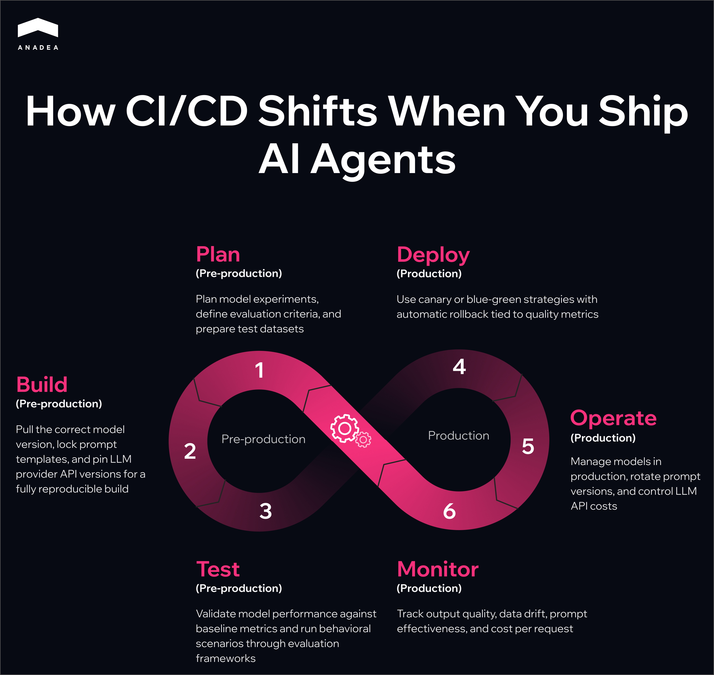
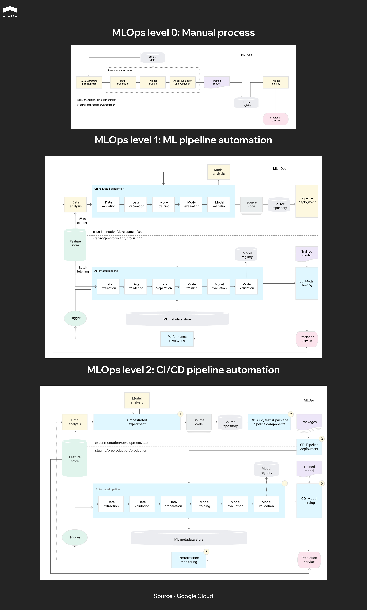

In a [LangChain survey of over 1,300 professionals](https://www.langchain.com/state-of-agent-engineering), 32% named output quality as the biggest barrier to getting AI agents into production. These are concrete problems with output. The agent hallucinates, gives different answers to the same request, and violates internal policies. More often than not, teams only find out after deployment, when users start complaining.

With conventional software, these things get caught early, at the CI/CD stage. Automated tests verify behavior before changes reach production. This is what CI/CD pipelines are designed to do. The approach works because software behavior is determined by code, and code can be tested. AI agents are different. Their behavior is shaped by models, prompts, and data, and each of these components can change independently of the codebase. Someone updates a system prompt, someone retrains a model, the distribution of incoming data shifts. Any of these changes can break agent behavior, and a standard CI/CD pipeline doesn't track any of them.

That means the CI/CD pipeline workflow needs to be adapted. It needs additional stages that account for how AI agents actually work.  That's what this article is about. We'll walk through what CI/CD pipelines for AI agent development look like, what stages get added and where MLOps fits in.

## Why CI/CD Pipelines for AI Agent Are Different from Standard CI/CD

A standard CI/CD pipeline workflow follows a familiar infinite loop: Plan, Code, Build, Test, Release, Deploy, Operate, Monitor. With AI agents, each of these stages picks up something new.

1. **Plan.** In a typical project, planning revolves around features and tech debt. For AI agents, the pipeline CI/CD also includes planning model experiments, defining evaluation criteria, and preparing test datasets.
2. **Build.** On top of assembling the application runtime, the pipeline needs to pull the correct model version from the registry and lock down specific prompt template versions. For LLM-based agents, this also means pinning API versions from model providers. The build artifact needs to be fully reproducible.
3. **Test.** For conventional software, unit and integration tests with clear assertions are enough. AI agents need additional layers. Model validation checks that the model meets baseline performance metrics before deployment. Behavioral tests run a set of scenarios and assess response quality through evaluation frameworks.
4. **Deploy.** Canary and blue-green strategies become especially important. A prompt or model change can shift agent behavior unpredictably, and a full rollout to all traffic at once is too risky. An AI model deployment pipeline should include automatic rollback tied to specific quality metrics.
5. **Operate.** For AI agents, operation goes beyond infrastructure maintenance. It adds model management in production, prompt version rotation, and cost control for API calls to LLM providers.
6. **Monitor.** Standard monitoring tracks uptime, latency, and error rates. For AI agents, pipelines CI CD also need to track output quality, data drift, prompt effectiveness, and cost per request.



Every stage of the familiar CI/CD loop expands when AI agents are involved. That's why CI/CD pipelines for AI agent development need to be built deliberately, rather than hoping the existing process will hold up on its own.

## Core Stages of a CI/CD Pipeline for AI Agent

The previous section covered what changes at each CI/CD stage for AI agents. Now let's look at how to implement CI/CD pipelines in practice.

### Source Control and Versioning

Everything that affects agent behavior should live in version control. An AI agent repository looks different from a typical backend service, and pipelines CI CD need to reflect that. Beyond application code, it includes directories for prompt templates, tool configurations, evaluation datasets, and references to models in a registry. A typical structure looks something like this:

<code>/src</code> application code <code>/prompts</code> versioned prompt templates <code>/tools</code> configurations for external tools the agent calls <code>/evals</code> evaluation datasets and expected results <code>/models</code> not the models themselves, but metadata and references to specific versions in a model registry

Evaluation datasets deserve special attention. They need to be versioned independently from training data. When test data gets mixed with training data, the pipeline stops catching real regressions and starts reflecting overfitting instead.

### Build and Dependency Resolution

The build stage for an AI agent requires the pipeline CI/CD to produce a single reproducible artifact. Beyond assembling the code, the pipeline locks down a specific model version from the registry (MLflow, Weights & Biases, Vertex AI Model Registry), a specific version of prompt templates from the repository, and specific API versions from LLM providers if the agent uses external models.

A simple reproducibility test: take a build artifact from a week ago and deploy it. The agent should behave exactly the way it did a week ago. If that's not guaranteed, debugging production incidents turns into guesswork.



### Automated Testing

Testing AI agents works in multiple layers. Each one catches a different type of problem, and skipping any of them leaves a blind spot in the pipeline.

<table>

<tbody>

<tr>

<td></td>

<td>

<p><span style="font-weight: 400;">What it checks</span></p>

</td>

<td>

<p><span style="font-weight: 400;">Example checks</span></p>

</td>

<td>

<p><span style="font-weight: 400;">When to run</span></p>

</td>

<td>

<p><span style="font-weight: 400;">How to evaluate results</span></p>

</td>

</tr>

<tr>

<td>

<p><span style="font-weight: 400;">Unit tests</span></p>

</td>

<td>

<p><span style="font-weight: 400;">Deterministic agent logic</span></p>

</td>

<td>

<p><span style="font-weight: 400;">Tool routing, response parsing, input validation, state management</span></p>

</td>

<td>

<p><span style="font-weight: 400;">On every commit</span></p>

</td>

<td>

<p><span style="font-weight: 400;">Pass/fail assertions</span></p>

</td>

</tr>

<tr>

<td>

<p><span style="font-weight: 400;">Model validation</span></p>

</td>

<td>

<p><span style="font-weight: 400;">Whether the model meets minimum requirements</span></p>

</td>

<td>

<p><span style="font-weight: 400;">Accuracy, latency, output format, model size</span></p>

</td>

<td>

<p><span style="font-weight: 400;">On every new model version</span></p>

</td>

<td>

<p><span style="font-weight: 400;">Threshold per metric. Fails any one of them and the pipeline stops</span></p>

</td>

</tr>

<tr>

<td>

<p><span style="font-weight: 400;">Integration tests</span></p>

</td>

<td>

<p><span style="font-weight: 400;">Agent interaction with external services</span></p>

</td>

<td>

<p><span style="font-weight: 400;">API calls, vector store queries, database operations, timeout handling and response format changes</span></p>

</td>

<td>

<p><span style="font-weight: 400;">Before every release</span></p>

</td>

<td>

<p><span style="font-weight: 400;">Pass/fail with response format and status code checks</span></p>

</td>

</tr>

<tr>

<td>

<p><span style="font-weight: 400;">Behavioral tests</span></p>

</td>

<td>

<p><span style="font-weight: 400;">Quality of agent responses on real scenarios</span></p>

</td>

<td>

<p><span style="font-weight: 400;">Evaluation prompts with expected outcomes, tone of voice and policy guideline compliance</span></p>

</td>

<td>

<p><span style="font-weight: 400;">Before every release and on a regular basis in production</span></p>

</td>

<td>

<p><span style="font-weight: 400;">LLM-as-judge, human review, or a combination</span></p>

</td>

</tr>

</tbody>

</table>

A common mistake: teams start with unit tests and assume that's enough. Unit tests only cover what works the same way every time. The real complexity of AI agents lives in the behavioral layer, where output varies from run to run. If behavioral tests aren't part of the CI/CD pipeline workflow from day one, quality issues only surface in production.

### Staging and Evaluation

Before production, the agent goes through a staging environment that mirrors production as closely as possible. This is where end-to-end evaluations run on realistic inputs, tracking response accuracy, latency, error rate, and cost per request.

Staging also makes it possible to compare the new agent version against the current one on the same set of requests. This is A/B testing before production, catching degradation before it reaches real users.

### Deployment

For AI agents, canary deployment becomes standard practice. The new version receives a small percentage of traffic, and the pipeline automatically compares its metrics against the current version. If response quality drops or latency exceeds acceptable limits, the pipeline rolls back the changes without human intervention.

The example below shows what a machine learning model deployment pipeline looks like using Flagger, a progressive delivery tool for Kubernetes. The pipeline gradually increases traffic to the new agent version and checks both infrastructure and agent-specific metrics at each step.

```yaml
apiVersion: flagger.app/v1beta1
kind: Canary
metadata:
  name: ai-agent
  namespace: production
spec:
  targetRef:
    apiVersion: apps/v1
    kind: Deployment
    name: ai-agent
  progressDeadlineSeconds: 600
  analysis:
    interval: 1m
    threshold: 5
    maxWeight: 50
    stepWeight: 10
    metrics:
      - name: request-success-rate
        thresholdRange:
          min: 99
        interval: 1m
      - name: request-duration
        thresholdRange:
          max: 2000
        interval: 1m
      - name: response-quality-score
        thresholdRange:
          min: 0.85
        interval: 2m
      - name: hallucination-rate
        thresholdRange:
          max: 0.05
        interval: 2m
      - name: policy-violation-rate
        thresholdRange:
          max: 0.01
        interval: 2m
    webhooks:
      - name: agent-quality-check
        type: rollout
        url: http://agent-eval-service.monitoring/evaluate
        timeout: 30s
```

Here's how the configuration works. Flagger starts by routing 10% of traffic to the canary and adds another 10% every minute until it reaches 50%. Metrics are checked at each step. The first two (request-success-rate, request-duration) are standard for any service. The next three (response-quality-score, hallucination-rate, policy-violation-rate) are specific to AI agents. They come from a separate evaluation service via a webhook that samples canary responses and scores their quality.

If five consecutive checks show a violation of any threshold, Flagger automatically rolls back the canary. The progressDeadlineSeconds field sets the maximum time for the entire rollout. If the canary hasn't passed all stages within 10 minutes, it gets rolled back as well.

Without agent-specific metrics, the pipeline can show a green status while the agent is producing incorrect responses. These metrics are what set an ai model deployment pipeline apart from a conventional deployment.

## Integrating MLOps Pipeline into Your CI/CD

Not every AI agent needs a full MLOps pipeline. The scope depends on what model the agent uses as its reasoning engine. An agent built on top of an external LLM via API and an agent running on a custom model trained on proprietary company data require fundamentally different pipelines. In the first case, you don't control the model and work with whatever the provider gives you. In the second, you own the entire ML lifecycle. Below we'll cover both scenarios, the point where they connect to CI/CD, and where to start.

### Agents Using External LLMs via API

This covers OpenAI, Anthropic, Google, and similar providers. There is no training pipeline and no proprietary models. MLOps pipeline in the traditional sense doesn't apply. But other challenges take its place: tracking provider API versions, monitoring changes in base model behavior after provider updates, and controlling token spend. A provider can update their model and your agent starts responding differently without a single change on your end. The pipeline needs to account for that.

### Agents Using Custom-Trained Models

This is where the full ML lifecycle comes in: data collection, preprocessing, training, evaluation, model registry, serving. All of it needs to be wired into CI/CD so that a new model automatically goes through the pipeline before reaching production.

### Model Registry as the Connection Point

The connection point between MLOps and CI/CD in the second scenario is the model registry. Training produces a new model version, it goes through evaluation, and lands in the registry (MLflow, Weights & Biases, Vertex AI Model Registry). The CI/CD pipeline pulls it from there as a dependency, runs it through integration and behavioral tests, and deploys it. Without a registry, the machine learning model deployment pipeline relies on manual steps that will eventually break.

### What Triggers the ML Pipeline

There are three common triggers. First, new data. The training dataset gets updated and the model needs to be retrained. Second, metric degradation in production. Monitoring shows that model quality has dropped below a threshold and the pipeline automatically initiates retraining. Third, scheduled retraining on a fixed cadence, even when there are no visible problems, to keep the model from falling behind changes in the data.

In each of these cases, the output of the ML pipeline becomes the input for CI/CD. The new model goes through the same machine learning CI/CD pipeline stages as any other change.

### Where to Start

Google describes three MLOps maturity levels in their[ MLOps framework](https://cloud.google.com/architecture/mlops-continuous-delivery-and-automation-pipelines-in-machine-learning). Level 0 is a fully manual process where training, evaluation, and deployment all happen by hand. Level 1 automates training but deploying a new model still requires manual approval. Level 2 automates the entire cycle from data to production. Most teams today sit somewhere between Level 0 and Level 1 when it comes to CI/CD for machine learning. If you're just getting started, the first practical step is adopting a model registry and automating model validation in the CI/CD pipeline. The rest can be added incrementally.



Building a full ML pipeline from scratch can take months. Teams looking to shorten that path work with partners who have already been through it.[ Anadea specializes in ML development](https://anadea.info/services/machine-learning-software-development) and can help at any stage.



## [](https://anadea.info/blog/top-ai-agent-development-companies/)Common Mistakes Teams Make with AI Agent Pipelines

Most mistakes we see in AI agent CI/CD pipelines have nothing to do with tool selection or technical complexity.  They come from teams carrying over habits from conventional CI/CD without adapting the process to how agents actually work.

1. **One pipeline for everything.** Code, models, and prompts have different change cycles. Code gets updated multiple times a day, models are retrained weekly or less often, prompts change on an ad hoc basis. When everything goes through a single linear pipeline CI/CD, a prompt change waits for a full model validation run. It's worth building separate pipeline paths for different artifact types that converge at the integration testing stage.
2. **No record of what's running in production.** Teams version artifacts in the repository but don't maintain a record of what's actually live in production right now. When something breaks, figuring out which prompt version is active should take seconds, not a dig through CI/CD logs.
3. **Skipping staging for prompt changes.** The change looks minor, so the team deploys directly. But in LLM-based agents, a single word in a system prompt can shift behavior disproportionately. Any change that affects agent output should go through staging and behavioral tests.
4. **Ignoring cost as a pipeline metric.** A prompt change can double the token count. A new model might be more accurate but three times more expensive. Without tracking cost as a pipeline metric, the team risks burning through a month's API budget in a week.
5. **No timeout for evaluation stages.** Behavioral tests using LLM-as-judge can run slowly on large eval datasets. Without a timeout, a single stuck eval blocks the entire release process for an hour. A timeout on the evaluation stage plus fallback logic solves this in a few lines of config.

***<CTA Block>***

Title - Have the product vision but need the engineers?

Subtitle - Anadea builds AI agents with CI/CD, behavioral testing, and production monitoring set up from the first sprint. 

Button - Talk to us



## Practical Recommendations for Engineering Teams

Everything described in this article can look like a lot of work. But building CI/CD pipelines for AI agent development doesn't mean starting from scratch. Most teams already have a working CI/CD pipeline. The goal is not to replace it but to extend it incrementally. Here's a CI/CD pipeline workflow sequence that works in practice.

1. **Start with versioning.** Prompts, tool configurations, and evaluation datasets need to move into the repository. As long as they live in Notion, Google Docs, or hardcoded strings, no pipeline can track them. This is the foundation that everything else depends on.
2. **Add behavioral tests.** Don't wait for a perfect eval dataset. Start with 20 to 30 key scenarios that cover the agent's critical paths. Run them on every PR that touches a prompt or configuration. Grow the eval dataset from production issues: every bug found by users becomes a new test case.
3. **Bring agent-specific metrics into deployment and monitoring.** Response quality, hallucination rate, policy violations, cost per request. Without them, the pipeline shows green while the agent is producing incorrect responses. You can start with a single evaluation webhook in the deployment configuration.
4. **Split pipeline paths.** Once the process stabilizes, it becomes clear that changes to code, models, and prompts move at different speeds and need different validation. At that point, it's worth splitting them into separate paths that converge at integration testing.
5. **Connect a model registry if the agent uses custom models.** This is where CI/CD for machine learning connects to the rest of your deployment process. Without it, model updates remain a manual process that will eventually break.

Each of these steps can be implemented independently, without rebuilding the entire process. The first results show up as soon as behavioral tests are in place: the number of production incidents related to agent quality starts dropping.

If you're building AI agents and want the pipeline set up properly from the start,[ Anadea builds custom AI agents](https://anadea.info/services/custom-ai-agent-development) with production-grade CI/CD.

## Conclusion

The pipeline practices described in this article are not new. Engineering teams have been versioning, testing, and automating deployments for years with conventional software. The only difference is that CI/CD pipelines for AI agent development have more moving parts, and each one needs its own place in the pipeline. Start with versioning and behavioral tests, add agent-specific metrics, expand from there. If you need a team that builds AI agents with this kind of engineering discipline baked in from day one,[ reach out to Anadea](https://anadea.info/services/custom-ai-agent-development).
