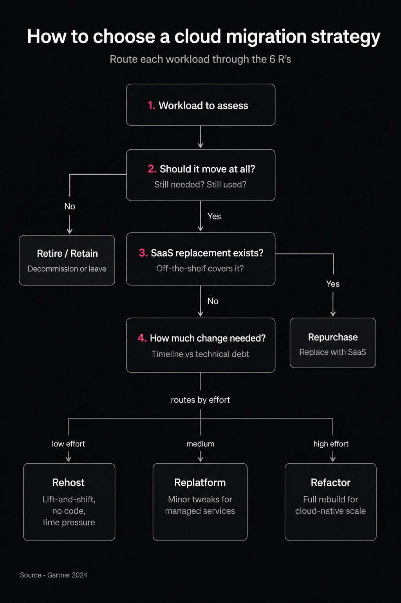

## TL;DR

* Migration type depends on how much you change the app, not just where it runs. AWS's 6 R's range from rehost (lift-and-shift, no code changes) to refactor (full cloud-native rebuild), plus retire and retain for apps that shouldn't move.
* Cost hides in three places: the skipped assessment phase (understanding dependencies is the top migration barrier — 54% of orgs, Flexera 2026), the dual-running window where infrastructure cost roughly doubles, and post-migration waste (29% of cloud spend wasted in 2026, Flexera).
* Near-zero downtime is real, not a big-bang switch. Run old and new in parallel, keep them in sync with database replication, and cut traffic over gradually — AWS documents blue/green switchover downtime as typically under one minute.
* The biggest risks are organizational, not technical: skills gaps, unclear ownership, and a rushed discovery phase cause more failures than the tooling does.
* Execution discipline beats strategy choice. A phased cutover with an open rollback path is what actually prevents downtime and overruns.

Cloud migration is no longer a one-time infrastructure project. As of 2026, [73% of organizations run hybrid cloud estates](https://www.flexera.com/about-us/press-center/flexera-finds-cloud-value-is-rising-while-ai-waste-grows) and treat migration as an ongoing process rather than an event with a finish date.

There is a tension built into this. Migration promises lower costs and more agility, but a poorly planned cutover turns into downtime, data loss, and budget overruns. Tellingly, wasted cloud spend is rising, not falling: as of 2026, [29% of cloud infrastructure spend goes to waste](https://www.flexera.com/about-us/press-center/flexera-finds-cloud-value-is-rising-while-ai-waste-grows) — the first increase in five years.

This article covers three things: the main types of cloud migration and when to use each, what actually drives cloud migration cost, and how to plan a cutover that doesn't take the business offline.

## What Are the Different Types of Cloud Migration?

The type of migration you choose depends on how much you change the application, not just where it runs — from a straight lift-and-shift to a full cloud-native rebuild.

AWS formalized this into a framework known as the [6 R's](https://aws.amazon.com/blogs/enterprise-strategy/6-strategies-for-migrating-applications-to-the-cloud/). Rehost (“lift-and-shift”) moves an app with no code changes. Replatform (“lift-tinker-and-shift”) moves it with minor tweaks to use managed services. Repurchase replaces the app with a SaaS product. Refactor / re-architect rebuilds it cloud-native. And two strategies exist for what shouldn't move: retire (decommission) and retain (leave in place).

Choosing a cloud migration strategy is a decision about effort versus payoff, not a technical preference. Rehost is fast but leaves cloud advantages on the table. Refactor unlocks scale but costs the most and takes the longest. This is also where application migration to cloud gets planned per workload rather than as one blanket move.

**The 6 R's migration strategies**

<table>

<thead>

<tr>

<th>

<strong>Strategy</strong>

</th>

<th>

<strong>Effort & Time</strong>

</th>

<th>

<strong>Code Changes</strong>

</th>

<th>

<strong>Best Fit</strong>

</th>

</tr>

</thead>

<tbody>

<tr>

<td>

Rehost (lift-and-shift)

</td>

<td>

Low

</td>

<td>

None

</td>

<td>

Legacy apps under time pressure

</td>

</tr>

<tr>

<td>

Replatform

</td>

<td>

Medium

</td>

<td>

Minor

</td>

<td>

Apps that benefit from managed services

</td>

</tr>

<tr>

<td>

Repurchase

</td>

<td>

Low&ndash;Medium

</td>

<td>

None

</td>

<td>

Apps replaceable with SaaS

</td>

</tr>

<tr>

<td>

Refactor / Re-architect

</td>

<td>

High

</td>

<td>

Full rewrite

</td>

<td>

Apps needing cloud-native scale

</td>

</tr>

<tr>

<td>

Retire / Retain

</td>

<td>

None

</td>

<td>

N/A

</td>

<td>

Apps that shouldn't move at all

</td>

</tr>

</tbody>

</table>

## How Much Does Cloud Migration Cost?

Cloud migration cost is shaped by a few drivers, and the biggest surprises hide where teams don't look for them.

The most expensive mistake starts before the first workload moves — at assessment and planning. Auditing the existing app portfolio, its dependencies, and data volume is the step most often skipped, and skipping it is the single biggest cause of underestimated budgets. Flexera's data backs this: understanding application dependencies is the top migration barrier, [cited by 54% of organizations](https://www.flexera.com/about-us/press-center/flexera-finds-cloud-value-is-rising-while-ai-waste-grows). [Practitioners describe the same pain](https://medium.com/@repobaby/three-lessons-i-learned-the-hard-way-moving-from-sccm-to-aws-systems-manager-0245b48a0e1c) more concretely: automated discovery scans miss undocumented connections, and an app breaks in production over a hard-coded IP to an on-prem database that “wasn't on the diagram”.

The second driver is migration execution and dual-running. During cutover, the old and new environments run in parallel for a window, and infrastructure cost roughly doubles for that period. Teams that don't budget for this window get surprised mid-project. Sizing it correctly is a core part of any realistic cloud migration plan.

The third is post-migration waste. Cloud doesn't stop being a line item once the migration is done. As of 2026, an estimated [29% of cloud infrastructure spend](https://www.flexera.com/about-us/press-center/flexera-finds-cloud-value-is-rising-while-ai-waste-grows) goes to waste on oversized instances and unused resources. Without optimization discipline, the savings that justified the migration erode quickly. 

For SMBs weighing the numbers, our [cloud cost comparison for SMBs](https://anadea.info/blog/cloud-comparison-cost-saving-smbs/) breaks the trade-offs down further.

**Cloud provider comparison**

<table>

<thead>

<tr>

<th>

<strong>Provider</strong>

</th>

<th>

<strong>Position (</strong><a href="https://www.flexera.com/about-us/press-center/flexera-finds-cloud-value-is-rising-while-ai-waste-grows"><strong>Flexera, 2026 State of the Cloud</strong></a><strong>)</strong>

</th>

<th>

<strong>Typical Use Case</strong>

</th>

</tr>

</thead>

<tbody>

<tr>

<td>

AWS

</td>

<td>

83% enterprise usage

</td>

<td>

Broadest service catalog

</td>

</tr>

<tr>

<td>

Azure

</td>

<td>

79% enterprise usage

</td>

<td>

Enterprise / Microsoft-stack shops

</td>

</tr>

<tr>

<td>

Google Cloud

</td>

<td>

Distant third

</td>

<td>

Data / AI-heavy workloads

</td>

</tr>

<tr>

<td>

DigitalOcean

</td>

<td>

Niche (not ranked)

</td>

<td>

Startups / SMBs

</td>

</tr>

</tbody>

</table>

## What Does a Cloud Migration Process Look Like Step by Step?

The cloud migration process breaks into three sequential phases, and order matters more than speed here.

Discovery and assessment. First, inventory applications and map dependencies. Classify each workload by criticality and technical debt, and only then assign it a strategy from the 6 R's. Skip this step and you are planning blind.

Pilot migration. Next, move one low-risk workload to validate tooling, timelines, and rollback steps before committing the full portfolio. If the in-house team lacks cloud-native experience, this is the point to bring in an [IT infrastructure outsourcing](https://anadea.info/services/it-outsourcing) partner rather than learning on production.

Migration in waves and cutover. Group the remaining applications into waves ordered by dependency and risk, then execute cutover during the lowest-traffic window. Waves give you what a big-bang switch can't: each group is validated on its own, and a problem rolls back one batch instead of the whole project. Teams running a SaaS product will recognize this pattern from [SaaS architecture](https://anadea.info/blog/saas-architecture/) decisions, where the same wave-and-validate discipline applies.



## How Do You Migrate to the Cloud Without Downtime?

Near-zero downtime comes from running the old and new environments in parallel and cutting over gradually, not from a single big-bang switch. This is what a zero downtime migration actually looks like in practice.

The mechanics rest on a few techniques. Blue-green deployment keeps two identical environments: “blue” (current) serves traffic while “green” (new) is prepared and tested. Database replication keeps both in sync — changes from the live database flow continuously to the new one, so data doesn't diverge at the moment of the switch. Cutover happens gradually, through DNS or a traffic balancer, not a hard flip. And a fast rollback path stays open the whole time: if green fails, traffic returns to blue in seconds.

How short a downtime this delivers in practice is clear from AWS's own documentation: during a blue/green switchover, downtime is typically under one minute, and the switchover window can be bounded by a timeout starting at 30 seconds ([AWS RDS Blue/Green Deployments](https://docs.aws.amazon.com/AmazonRDS/latest/UserGuide/blue-green-deployments.html)). The key condition is keeping replica lag near zero before switching; if the new environment hasn't caught up, the switchover shouldn't start.

**Cutover approach comparison**

<table>

<thead>

<tr>

<th>

<strong>Approach</strong>

</th>

<th>

<strong>Downtime</strong>

</th>

<th>

<strong>Rollback Speed</strong>

</th>

<th>

<strong>Relative Cost</strong>

</th>

</tr>

</thead>

<tbody>

<tr>

<td>

Big-bang cutover

</td>

<td>

Hours

</td>

<td>

Slow

</td>

<td>

Lowest

</td>

</tr>

<tr>

<td>

Phased / wave migration

</td>

<td>

Minutes per wave

</td>

<td>

Moderate

</td>

<td>

Medium

</td>

</tr>

<tr>

<td>

Blue-green with replication

</td>

<td>

Near-zero (&lt;1 min switchover)

</td>

<td>

Seconds via traffic switch

</td>

<td>

Highest during cutover window

</td>

</tr>

</tbody>

</table>

## What Are the Most Common Cloud Migration Risks — and How Do You Avoid Them?

Migration risks are rarely purely technical, and the most expensive ones are organizational. A few cloud migration best practices address each.

Data loss and integrity issues. Mitigate with full backups and validation checkpoints before every cutover step, not just at the end. Check integrity only after a full move, and you discover the divergence when rolling it back is already expensive.

Security misconfiguration. Cloud environments default to a different security model than on-prem, and misconfigured storage and access controls are a leading cause of post-migration incidents. Practitioners describe this as the flip side of speed: a team “moved fast and overlooked some fundamental security configurations,” which turned into stressful emergency remediation ([real case, 2025](https://medium.com/@repobaby/three-lessons-i-learned-the-hard-way-moving-from-sccm-to-aws-systems-manager-0245b48a0e1c)). Cloud migration security is a requirement for every wave, not a final step.

Vendor lock-in. Repurchase and refactor strategies tie the business tightly to one provider's tooling. That isn't always wrong, but the rigidity is worth weighing deliberately against the flexibility that rehost and replatform preserve.

Underestimating organizational readiness. Migrations fail from skills gaps and unclear ownership as often as from technical issues. When the in-house team lacks cloud-native experience, bringing in a specialist partner is cheaper than paying for the education in production incidents.

Choosing the right cloud migration tools for discovery, replication, and monitoring supports all four — but tools don't replace the disciplined sequence above.

## Conclusion

The right strategy and a realistic budget both matter, but the phased cutover is what actually keeps the business online and the budget intact. Choose a strategy per workload, plan for the dual-running window and the optimization that follows, and move in waves with a rollback path kept open. The technology for near-zero downtime already exists, so the outcome comes down to execution discipline. If you're weighing a move to the cloud and want a clear read on which workloads to migrate first and how to cut over safely,[ get in touch with our team](https://anadea.info/contacts/) — we'll map it out with you before you commit to anything bigger.
