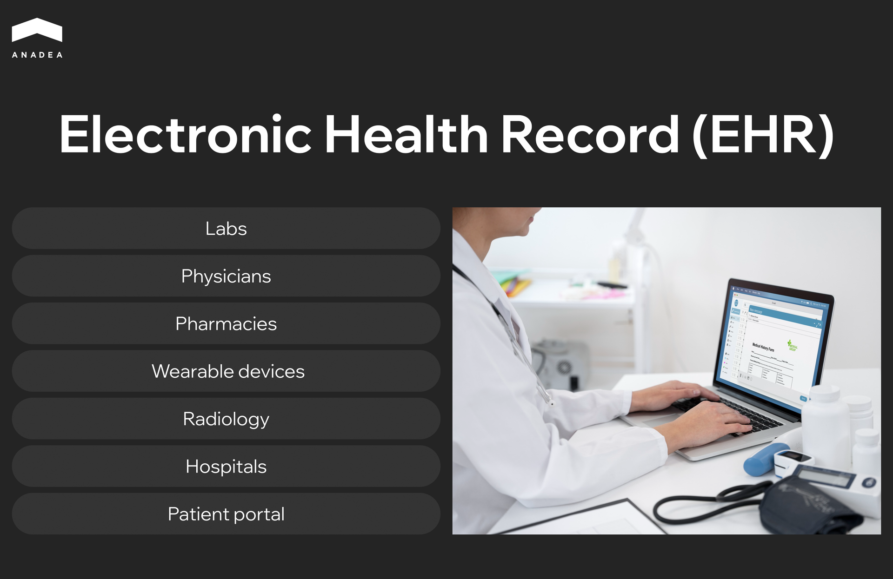
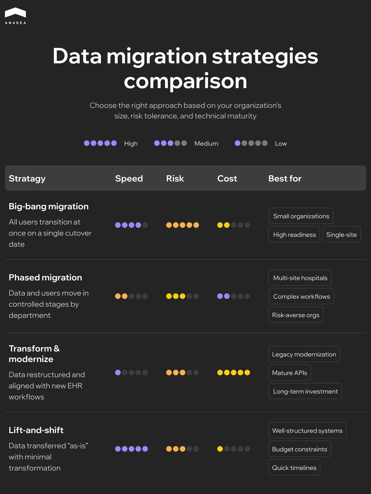

Disruption of care continuity, non-compliance risks, and even direct harm to patients are only a few of the problems that can result from inefficient data management in healthcare. Thanks to secure digital storage and modern [electronic health record (EHR)](https://anadea.info/solutions/healthcare-software-development/emr-ehr-development) systems, organizations can access and exchange clinical information in a timely and reliable manner. According to [Business Research Insights](https://www.businessresearchinsights.com/market-reports/electronic-health-records-ehr-market-119794), over 85% of hospitals globally use EHR systems today, which proves the real practical value of such solutions for medical organizations.

When implemented and maintained properly, EHRs support safer clinical decisions and ensure long-term data integrity.

However, healthcare environments are not static, and the requirements of organizations evolve over time. For example, a hospital may need to change a vendor, modernize its existing solution, or implement a new custom EHR platform. Patient data can’t be just deleted or archived. In the majority of cases, it must be transferred to a new system. Here’s when EHR data migration becomes essential. 

In our article, we will talk about the peculiarities of this process and share our practical tips on how to approach it in order to mitigate the most common legacy EHR data migration challenges.

## What Is EHR Data Migration?

Apart from moving files from one system to another, EHR data migration includes a range of other important tasks.

Electronic health record systems traditionally accumulate big volumes of data from various sources such as labs, physicians, wearable devices, hospitals, patients portals, and others.

Given this, the data migration should start with a clear definition of what is included and excluded to ensure continuity of care, compliance, and operational efficiency.

Typically, migration covers:

* structured clinical data (patient demographics, lab results, medication lists, vital signs, and clinical notes);
* unstructured documents (PDFs, scanned forms, and reports);
* images and diagnostic scans (X-rays, MRIs, and other medical images);
* audit and provenance records.

At the stage of migration planning, it is critical to prioritize active clinical data. Distinguish the data needed for ongoing patient care, from historical, financial, or secondary information. 

What data is usually excluded? It is data that is not applied in active clinical care and can be accessed via archives, such as:

* non-clinical historical data (old administrative records that do not affect patient care);
* financial and billing data (invoices, claims, and payment records);
* outdated documents (duplicate PDFs, expired forms, or legacy reports);
* certain audit data (some detailed data can be archived instead of being fully migrated);
* peripheral system data (data from lab instruments, imaging systems, or devices that aren’t integrated with the main EHR).

When preparing for data migration for EHR,	you need to establish a minimum clinically necessary dataset that should be immediately available in the new system and define data that can be archived or accessed on demand.

This approach to EHR data migration reduces complexity and lowers costs. Moreover, thanks to this, clinicians will have timely access to essential patient information.

## EHR Data Migration Services: Do You Need Them Now?	

A successful EHR data migration should begin with understanding why the transition is required and whether your organization is fully prepared for it. 

There are some clear triggers or signs indicating that it’s time for you to migrate data to an EHR.

### When Is It Time to Initiate EHR Data Migration?

* **System upgrade or replacement**. When you are planning to switch to a new EHR platform or move from a legacy system, a comprehensive data migration from one EHR to another is required to preserve clinical continuity.
* **Health system consolidation.** Software mergers require the unification of patient records, provider data, and workflows across multiple facilities.
* **Cloud transformation**. Data should be migrated when you are moving from on-premise servers to cloud-based EHRs.
* **System end-of-life**. Deprecated platforms pose security and business continuity risks. In such a situation, data migration is unavoidable.
* **New regulatory or compliance requirements**. New rules related to security or reporting (such as FHIR-based initiatives) can result in a necessity to transfer data to modern systems. 

### Are You Ready for EHR Data Migration?

At Anadea, we have years of experience in delivering reliable [healthcare software development](https://anadea.info/blog/top-healthcare-software-development-companies/) and EHR data migration services. Based on it, we have prepared a checklist that will help you understand whether you can start transferring your data.

* **Governance model**. You need to define executive sponsors, decision-making bodies, and escalation paths. This will help you keep the project aligned and accountable.
* **Budget and timeline.** Confirm and allocate budget for data mapping, validation, vendor services, archiving, testing, training, and parallel support periods.
* **Data inventory.** You should catalog all structured data, documents, images, ancillary systems, and data sources. Apart from this, identify ownership and retention obligations.
* **Risk register**. Document potential risks, including data loss, downtime, staffing shortages, or regulatory gaps. Prepare detailed mitigation plans before migration begins.
* **Available resources**. Confirm availability of clinical subject matter experts, data analysts, IT support, security leads, and project management resources. 



## The Best Model of EHR Data Migration

Organizations have different needs that shape their migration approaches. Nevertheless, the hybrid phased model is often viewed as the optimal choice. It ensures strong governance and well-defined metrics.

This model combines targeted migration of critical structured data with a long-term archive for the rest. As a result, it prevents data overload, reduces complexity, and shortens timelines.

When you choose this model, it is necessary to:

* migrate what clinicians actively rely on (data that covers current medications, allergies, problem lists, recent labs, care plans, and other high-value structured elements);
* archive everything else (legacy documents, imaging, financial records, and ancillary system data).

We strongly recommend setting clear success metrics from the very start. They will guide decision-making and create objective checkpoints throughout the migration lifecycle.

Key success metrics typically include:

* **Data quality thresholds**. Establish minimum acceptable levels of accuracy, completeness, and consistency for each data type.
* **Error rate targets.** Define acceptable extraction, transformation, and load error rates. This will help you catch issues before they reach the go-live environment.
* **Validation timelines.** Set deadlines for clinical validation, structured data review, and signoff from governance committees. It is necessary to keep the migration on schedule.
* **Downtime windows**. Specify maximum allowable downtime and limits on service interruptions during final cutover. 
* **Regulatory and compliance checkpoints**. Include verification milestones for HIPAA, audit logs, provenance requirements, and security controls.

## Data Migration Strategies for EHR Transition

After you define your general approach to migration, it is also necessary to select the right strategy. It will greatly influence project timelines, risk exposure, clinician experience, and overall cost. Let’s consider the most widely applied strategies suitable for healthcare organizations.

### Big-Bang Migration

In this case, all users transition to the new EHR at once. And all migrated data becomes active on a single cutover date.

This strategy ensures a faster time to full adoption. However, it brings a high risk of downtime or disruption. And still requires significant organizational readiness and training. To achieve a smooth migration, you will need to prepare structured clinical data in advance. Without this step, even minor mapping errors can affect the whole system on day one and increase the risk of downtime and clinician confusion.

### Phased Migration

Data and user groups move in controlled stages (often by department or specialty).

Operational risk is lower than in the case of the big-bang migration. Apart from this, it allows iterative learning and refinement.

At the same time, multiple cutovers increase complexity and lead to a longer period of dual-system workflows.

### Transform-and-Modernize Migration

Data is not only migrated but also structured and aligned with the new EHR’s workflows and data models.

It is a good option for organizations that are modernizing their outdated systems. However, it is rather time- and resource-intensive.

### Lift-and-Shift Migration

Data is transferred “as is” with minimal transformation. As a result, the entire process is faster and cheaper than in the case of the transform-and-modernize model.

It is suitable for well-structured legacy systems but may result in technical debt or poor data quality.

### What Factors Influence Strategy Selection?

Before making up your mind, you should take into account the following factors:

* **System size and scale.** Multi-site systems and health networks often require phased or hybrid approaches. At the same time, smaller organizations can successfully execute a big-bang cutover.
* **Workflow complexity.** To reduce clinical risk, hospitals with high-acuity specialties and complex systems should avoid big-bang migrations.
* **Risk tolerance.** Organizations with low risk tolerance or limited ability to absorb downtime shouldn’t consider big-bang approaches.
* **Interoperability maturity.** If you rely on a platform with strong EHR data migration software tools, terminology mapping, and APIs, the transform-and-modernize model can be feasible for you. Legacy systems with limited export capability may require hybrid or lift-and-shift approaches.

## EHR Data Migration Challenges and Mitigation Plan

EHR data migration involves significant operational, technical, and clinical risks. And to avoid negative consequences, you should anticipate them early. A structured mitigation plan protects patient safety and reduces downtime. Moreover, it keeps the project on schedule and within budget.

Let’s take a closer look at the key risks that you may face.

* **Data loss or corruption.** It is one of the most common legacy EHR data migration challenges. Migration processes can fail and lead to missing labs, medications, allergies, or clinical notes. Even small gaps can create downstream safety risks.
* **Patient safety events.** Incorrect mappings, duplicated records, or missing clinical history may result in situations when clinicians act on incomplete or inaccurate information.
* **Excessive downtime.** Poorly executed cutovers or insufficient testing can disrupt clinical operations.
* **Vendor delays and dependency risk.** Vendors of legacy systems may be slow to provide data extracts. Vendors of new systems may miss interface or mapping deadlines.
* **Scope creep.** Uncontrolled expansion of a project’s objectives beyond its original plan occurs when teams try to migrate all data they have (even information without clinical value). This increases cost, timeline, and adds extra complexities.

### Early Warning Indicators

When we transfer data, we continuously monitor the migration process to detect and address issues as soon as possible. Here are the signs that you should always pay attention to:

* data quality anomalies (unexpected volume drops, missing encounter types, or failed mappings);
* validation bottlenecks (for example, if clinicians are unable to complete chart checks on schedule);
* repeated failures in data transfers;
* cutover readiness gaps (incomplete testing or low clinician readiness scores).

Are you planning to launch your own EHR? It will also be helpful for you to read our guide on [EHR implementation challenges](https://anadea.info/blog/ehr-implementation-challenges/).

### Ways to Address EHR Data Migration Challenges

Below you can find the recommended approaches to manage each of the most common EHR data migration risks.

#### How to Mitigate Data Loss or Corruption

* Use validated ETL (Extract, Transform, Load) pipelines with automated error detection and reconciliation.
* Perform record-level and volume-level checks.
* Implement dual validation by both technical and clinical teams.
* Maintain a full audit trail of transformations.

#### How to Reduce Risks Related to Patient Safety Events

* Involve clinicians early in mapping medications, allergies, and problem lists.
* Use standardized terminologies to prevent semantic errors.
* Run parallel systems during a testing period.
* Prioritize safety-critical data.

#### How to Limit Excessive Downtime

* Perform mock cutovers to predict downtime windows and refine procedures.
* Prepare fallback plans.
* Engage clinical, technical, and support experts to resolve issues in real time.

#### How to Manage Vendor Delays and Dependency Risks

* Clearly define in contracts delivery dates, extract formats, quality requirements, and escalation paths.
* Use transparent governance with weekly cross-vendor checkpoints and shared issue logs.
* Plan for partial or incremental extracts if full datasets cannot be delivered on schedule.

#### How to Prevent Uncontrolled Requirements Expansion

* Define a minimum clinically necessary dataset.
* Separate migration and archival data (non-essential historical data can be retained but not fully migrated).
* Establish a formal change-control process for any new data elements.

## Wrapping Up

EHR data migration is a highly responsible task as it directly impacts patient safety and care quality. Successful migrations require clear scope definition and strong governance. Healthcare organizations have to carefully categorize their data, set priorities for its migration, and ensure that critical clinical information remains accurate and accessible throughout the transition.

For more than 25 years, our team has successfully supported our clients across the full EHR lifecycle, from system design and deployment to secure data migration. Thanks to our rich experience across multiple EHR platforms, we have accumulated a deep understanding of interoperability standards and regulatory environments. And today, we help ensure that data migrations are executed safely and efficiently, with minimal disruptions. If you are planning to build a new EHR or want to modernize your existing solution, we are ready to support you at every stage. [Contact us](https://anadea.info/free-project-estimate) to learn more!
