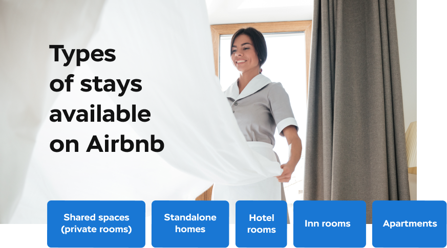
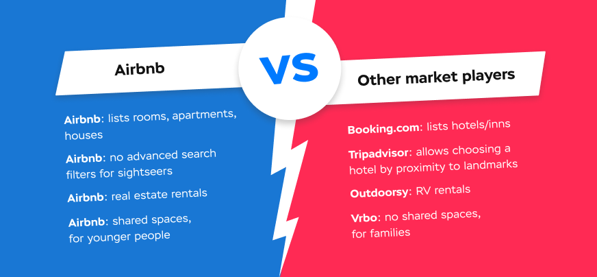
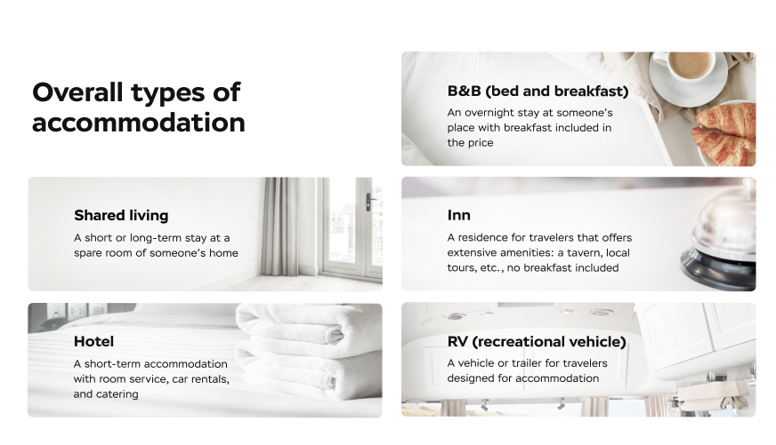

Homeowners rent out their property for guests to make reservations directly. Such a simple concept has become a breakthrough back in 2008 when the first version of the Airbnb website was launched. In 2012, when the website got a mobile app for Android, things went even better, and for a decade already, the demand for Airbnb-like apps is still present. A <a href="https://anadea.info/solutions/travel-app-development" target="_blank">travel app development company</a>, we'll reveal the specifics the market if you want to build your own travel booking app.

<h2>Table of Contents</h2>

<ol>
<li><a href="#what-is">What Is the Airbnb Application?</a></li>
<li><a href="#how-work">How Does Airbnb Work?</a>
<ul>
<li><a href="#works-guests">How Airbnb Works for Guests</a></li>
<li><a href="#works-hosts">How Airbnb Works for Hosts</a></li>
</ul></li>
<li><a href="#competitors">Who Are Airbnb's Competitors?</a>
<ul>
<li><a href="#booking.com">Booking.com</a></li>
<li><a href="#tripadvisor">Tripadvisor</a></li>
<li><a href="#outdoorsy">Outdoorsy</a></li>
<li><a href="#vrbo">Vrbo</a></li>
</ul></li>
<li><a href="#features">Feature List to Build an App Like Airbnb</a>
<ul>
<li><a href="#features-guests">Features for Guests</a></li>
<li><a href="#features-hosts">Features for Hosts</a></li>
</ul></li>
<li><a href="#extra">Extra Features to Improve App Usability</a></li>
<li><a href="#team-tech">How to Build an App Like Airbnb: Team and Technologies</a>
<ul>
<li><a href="#cost">Cost to Build an App Like Airbnb</a></li>
</ul></li>
<li><a href="#marketing">How to Market a Travel Startup Like Airbnb?</a>
<ul>
<li><a href="#seo-aso">SEO & ASO</a></li>
<li><a href="#smm">Social Media Marketing</a></li>
<li><a href="#ppc">Pay-per-click Advertising</a></li>
</ul></li>
<li><a href="#revenue">Revenue Model for Your Travel Booking App</a></li>
</ol>

## What Is the Airbnb Application?
To start with, there was no Airbnb as we know it in the early days. Instead, the website for renting and renting out short-term accommodation or shared spaces was called Airbedandbreakfast.com, a bulky but ultimately meaningful name. Bed and breakfast is a type of overnight stay which price includes breakfast in the morning. ‘Air’ in the beginning makes for an airbed, the most affordable place to sleep on, underlying that the website has options to suit every pocket. This may suggest the audience of the Airbnb app consists mainly of young people, highly mobile and unpretentious.

In a nutshell, thanks to the Airbnb website and later the application, those in need of an ‘airbed’ for a night can share space with those having one. It is the simplicity of a peer-to-peer connection between hosts and guests that made Airbnb so popular. To date, it lists the following types of stay:

* Shared spaces (private rooms);
* Apartments;
* Standalone homes;
* Hotel rooms;
* Inn rooms.

Overall, Airbnb lists nearly 8 million properties for over 150 million travelers to book. In 2021, Airbnb's revenue amounted to $6 billion.

## How Does Airbnb Work?
Here, you will find an overview of the Airbnb booking flow. On the Airbnb business model and how to make a profit with an app like Airbnb, read further in the article.

Although the proportion of service providers and consumers in services like Airbnb is far from equal - there will never be as many property owners as travelers - the functionality of such apps is rich for all sides. If you have never used Airbnb or only used it as either host or guest, see how to use the Airbnb app in both scenarios.

### How Airbnb Works for Guests
* Guests authorize with their phone number/Email address/Apple ID/Facebook and confirm registration via Email. Then, fill in personal details.

* Set the target location (city, country) and the objective: find a place to stay for a short period, find a monthly stay or an experience at the target location.

* Set the exact or approximate dates of stay. The latter is enabled thanks to the opportunity to set dates ± several days which allows for extending the result range.

* Set the number of guests: adults, children aged 2–12, infants under 2 years old, and pets if any.

* See the map displaying the available places with price tags, and below, a list of accommodations with price per night and price for the whole stay.

* By clicking on a property, see its detailed description and address, host’s name and contact info, pictures of the interior, and reviews from previous guests. At this point, the guest can start a conversation with the host and ask them any questions before confirming the stay.

* After getting confirmation, the guest pays for their booking with a card, PayPal, Google Pay, Apple Pay, WeChat Pay, or other payment methods.

* Bingo! If everything goes well, the guest only needs to arrive at the time agreed, enjoy the trip, and leave a review after.

### How Airbnb Works for Hosts
* Again, authorize with phone number/Email address/Apple ID/Facebook and confirm registration via Email.

* After filling in personal information, in the Profile tab, the user can list their space to rent out and thus become a host.

* Then, the host needs to provide all applicable information on the space: type (house, apartment, bed and breakfast, hotel, etc.), location, the number of rooms, beds, and bathrooms, list amenities and safety items, and upload at least 5 up-to-date photos. And the most interesting part – set the price per night.

* Airbnb allows hosts to operate as a business if renting out it is the host’s primary source of income or as a private individual if it is not. In either case, there are different conditions and features for placing at Airbnb targeted at compliance with guidelines applicable to the European Economic Area (EEA).

* When the offer is online, the host’s task is to monitor the activity on it, respond to messages ASAP, and accept or reject guests’ requests.

* The host gets paid 24 hours after the guest’s check-in and does their best to get a brilliant rating.

* Hosts’ properties are protected with AirCover which includes $1 million in liability insurance and $1 million in damage protection - always applicable and free of charge.

## Who Are Airbnb's Competitors?
Over the years, the travel booking market has grown and more companies like Airbnb emerged. Every traveler knows Booking.com and Tripadvisor. See why users prefer certain platforms over others and what are their distinguishing features.

### Booking.com
The main Airbnb competitor that is as large provides millions of hosts with a platform to advertise and as many tourists with accommodation. Still, there is a significant difference between these platforms. While Airbnb’s target market is homeowners with spare bedrooms or owners of private homes, Booking.com mainly lists hotels. Put crudely, Airbnb is more personal while Booking.com is quite formal: on Airbnb, usually, guests and hosts chat before check-in while Booking.com users get to know hosts for the first time having their baggage in both hands.

### Tripadvisor
Travelers use Tripadvisor to find people’s opinions on restaurants, bars, museums, sightseeing, and other places to visit on a trip. Any establishment would appreciate positive reviews on Tripadvisor, and many have a sticker asking guests to rate them on their front door. More than that, the platform comes in handy for finding an overnight and booking a hotel or bed and breakfast near popular landmarks, train stations, and other parameters. When it comes to booking accommodation, Tripadvisor redirects users to side services: Booking.com, Agoda, or the hotel’s official website. This makes Tripadvisor a platform of choice for travelers who prefer to take the utmost from their trip and decide on where to stay depending on proximity to various places of interest.

### Outdoorsy
The so-called ‘Airbnb for RV’ is the largest platform for recreational vehicle rent which explains where its name comes from. It is hard to call Outdoorsy a direct Airbnb competitor due to different target audiences: Outdoorsy reminds more of a car rental rather than a real estate website. Although it is quite different from other apps like Airbnb, we can not but mention it since in terms of functionality, Outdoorsy exploits the Airbnb core principle of peer-to-peer connection between travelers and RV owners.

### Vrbo
Vacation Rentals by Owner, shortened to Vrbo, offers travelers a wide range of spaces to stay during their vacation. The holiday rentals marketplace suggests short-term rentals of villas, apartments, and other types of standalone stays. Vrbo does not allow for sharing spaces – these can only be found on Airbnb, suggesting that the audiences of the two apps are a bit different. While Airbnb is mostly appreciated by the younger generation, couples, and singles, Vrbo is a better fit for large families with kids and elder people.

As you can see, none of the above is an absolute Airbnb clone app – each has something unique to offer. You too have better odds to succeed if you find a zest that will make your travel startup stand out rather than a clone of a popular solution.

## Feature List to Build an App Like Airbnb
While registering and signing in are essential regardless of user roles, certain functionality of rental apps like Airbnb is designed exclusively for either of the two. See the Airbnb app features to pay special attention to.

### Features for Guests
__Search.__ One simply can not name all of the filters that an app like Airbnb can possibly have. Users will appreciate the opportunity to choose accommodation regarding proximity to metro stations or the city center; select only pet-friendly hosts; toggle-filter properties by cost and space; range-filter cost; and set the desired number of rooms and bathrooms.

__Chat.__ Potential guests have to get in touch with hosts somehow, which is provided by chat. For better communication, integrate or ask the development team to build a chat that supports image sharing in case guests need additional pictures.

__Favorites (Saved).__ Enable users to ‘star’ (‘bookmark’) properties they find appealing at the start of research to get back to the list later and choose from the most relevant options.

__Notifications.__ Do not let users miss new messages in the chat or changes in the price of properties in the Favorites list. Also, with notifications, the app can remind users to finish the booking in case they stop halfway.

### Features for Hosts
__Adding property.__ Provide hosts with as many fields to fill in about their housing: detailed description, images, and facilities on site.

__Request management.__ Hosts will need to see the list of all users interested in moving in, respond to their messages, and accept or decline requests.

__Notifications.__ New messages from users, changes in booking, and fresh reviews from guests - enable hosts to get notified about everything for them to run their business smoothly.

## Extra Features to Improve App Usability
These advanced features are not mandatory for users to have a pleasant experience with your Airbnb-like app, especially if you start with a minimum viable product, but will certainly make it more comprehensive.
* Admin panel will allow you as the app owner to see every user’s account, every request, and every transaction. No separate admin board will need to be created for every platform the app is built for: it is a single-access point for every adaptation of your travel booking app.

* Mark local police stations and emergency rooms on the map and make them noticeable so that travelers know where to go in case of an emergency.

* Enable hosts to offer not only spaces but also experiences: on Airbnb, there are thousands of cooking classes, city tours, and all kinds of adventures guests can go to at a new place.

* Allow hosts to give a discount for the first guests to get booked faster. Plus, this can be a great opportunity to promote your business.

* Build in a weather forecasting module to allow travelers to plan their activities in advance without using third-party services.

* Integrate translation services in your travel app to simplify tourists’ experiences in foreign countries.

* Connect taxi booking services to the app for the convenience of the newly arrived in the country.

## How to Build an App Like Airbnb: Team and Technologies
To build an app similar to Airbnb, we suggest you hire a dedicated team of developers. The proposed team composition is:

* Part-time UX/UI designer;
* <a href="https://anadea.info/services/web-development/front-end" target="_blank">Frontend engineer</a>;
* Backend engineer;
* Part-time QA specialist.

If you decide to go with Anadea, the cost of one week of work will be calculated as follows ($50 is hour standard hourly rate):

__2 devs * 40 hours * $50 + 1 QA * 20 hours * $50 = $4.000 + $1.000 = $5.000__

Mind this is an approximate number that depends on the actual workload of specialists. To elaborate, you do not need the designer all the way through which is why they are not included in the formula. Once prototypes are created, which is usually in a week, frontend developers come into play and work on the designer’s prototypes. The process to develop an app like Airbnb will take approximately __16 weeks__.

Technologies we would use to build a website for travel booking are:

__Frontend:__ React.js 
__Backend:__ Ruby on Rails, Django/Python 
__Database:__ PostgreSQL

The technology stack to build a rental mobile application will depend on the platform (iOS pr Android). See details on the <a href="https://anadea.info/services/mobile-development" target="_blank">Mobile App Development Services</a> page.

### Cost to Build an App Like Airbnb
To find out how much does it cost to develop an app like Airbnb, multiply the average cost of a week of work by the number of weeks plus 40 hours of designer’s work:

__$5.000 * 16 weeks + 1 UX/UI designer * 40 hours * $50 = $82.000 approx.__

However, a minimum viable product (MVP) featuring only essential functionality will cost significantly less and will allow you to test the idea before pouring larger sums of money into a big software product. For that, you will always have time.

Hire Airbnb app developers

## How to Market a Travel Startup Like Airbnb?
In a crowded market, only the luckiest get noticed without additional marketing efforts. No matter how good your product turns out, some pubic exposure won’t hurt. See how you can promote your product when it is launched.

### SEO & ASO
<a href="https://anadea.info/services/seo-service" target="_blank">SEO</a> stands for search engine optimization and ASO is app store optimization for your product. To generate organic traffic on Google or get more downloads from stores, proper conditions have to be created. For a website or web app, these are optimized page loading speed granted by technical optimization, as well as metadata and relevant keywords insertion. For a mobile app, these are writing comprehensive descriptions and following the hottest app trends.

### Social Media Marketing
Today’s brand has to be present online and communicate with the audience. The primary goal of posting on socials is not selling but being personal, getting into the hearts and minds of users so that they get used to the brand. Be regular and useful in your posting and don’t ignore the paid promotion opportunities on Facebook and Instagram.

### Pay-per-click Advertising
When you see an Ad-marked banner on Google’s search results page, it means the PPC specialist has done their work right. When using the Google Ads services, you only need to pay when someone interested clicks on your ad banner. Such a marketing technique allows you to exactly plan the marketing budget and target the relevant audience only.

## Revenue Model for Your Travel Booking App
Most travel booking apps like Airbnb charge __a commission fee__ for booking that is usually about 3–6% of the cost of the stay. Essentially, this is how Airbnb makes money by being a mediator between hosts and guests.

Another option is placing __in-app ads__. Sell a place for advertising and gain money every time users click the banner.

Finally, implementing __subscription and premium features__ can be an additional source of revenue. However, do not expect every user to pay for the extended functionality right away. At the start, your task is to gain the trust of users and prove your app is a good value for its money. With the latter, we will be happy to help.

Request a free quote
