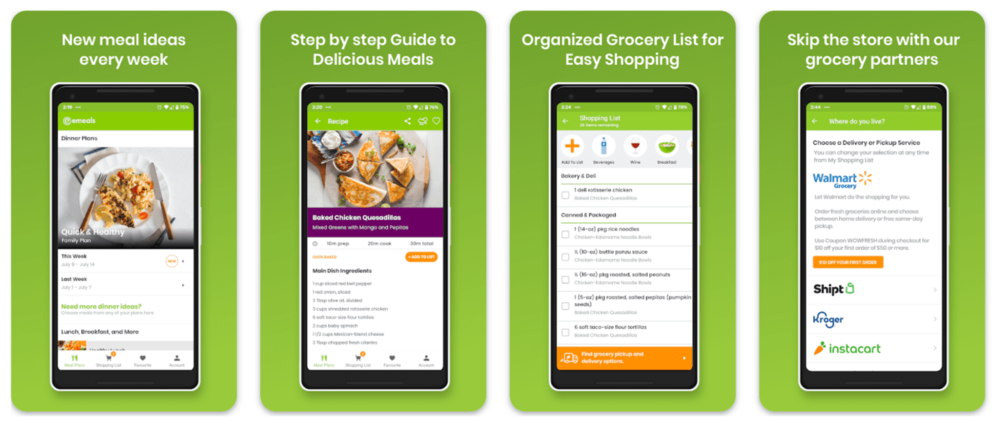
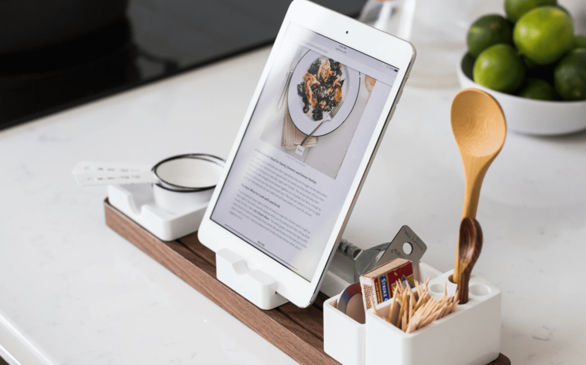
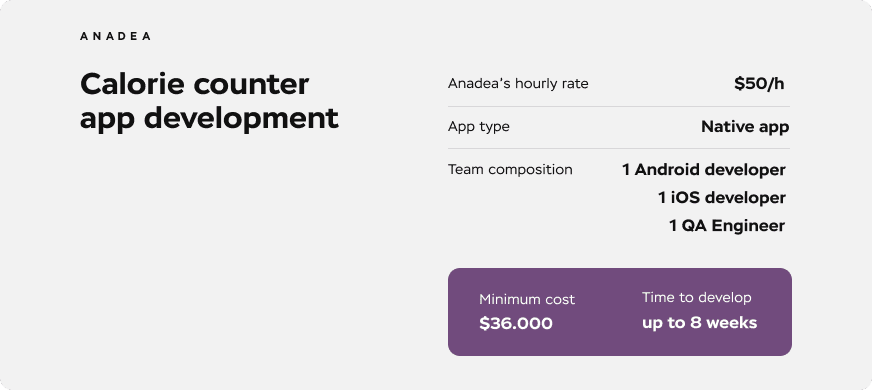

Walk more, work out, eat veggies. Anyone concerned about their weight or overall health has heard it at least onсe in a lifetime. And there’s nothing wrong with these pieces of advice, except for one small nuance: sometimes they are not enough. People may lack motivation or self-discipline.

Valued at over $2 million in 2021 and set to reach <a href="https://www.databridgemarketresearch.com/reports/us-diet-and-nutrition-apps-market" target="_blank" rel="nofollow">$15 million</a> by 2029, the diet and nutrition app market proves a high demand for this kind of software. Indeed, where appeals to simply eat less don’t work, a good app for learning healthier eating habits can be a game-changer.

Read on to find out about different types of nutrition apps and their features, reasons they fail, monetization strategies and cost to build one.

## Breaking down the types of nutrition apps

Millions of people who use nutrition apps have one thing in common: a goal. Is it to lose weight, to improve skin condition, to work out more efficiently or draw an individual diet plan if certain constraints like allergies or lent are present, a goal is there. Knowing the goal, we can elicit the major types of nutrition applications.

<table>
 <tr>
  <th><b>User goals</b></th>
  <th><b>App types</b></th>
 </tr>
 <tr>
  <td>To lose extra weight</td>
  <td>Weight loss diary</td>
 </tr>
 <tr>
  <td>To take control over eating habits & lose weight</td>
  <td>Calorie counter</td>
 </tr>
 <tr>
  <td>To get professional advice</td>
  <td>App for dietician consultations</td>
 </tr>
  <tr>
  <td>To discover food ingredients fast</td>
  <td>Food scanner</td>
 </tr>
  <tr>
  <td>To save time and/or lose weight</td>
  <td>Meal planner</td>
 </tr>
  <tr>
  <td>To learn new healthy recipes</td>
  <td>Recipe app</td>
 </tr>
  <tr>
  <td>All of the above mixed together</td>
  <td>Comprehensive app</td>
 </tr>
</table>

Each one of the goals suggests particular features that help fulfill them, so let’s dive in.

## Features for each nutrition app type

Instead of giving a list of all the possible features of diet tracking software, we decided to provide feature lists by app types. They can for sure be mixed freely, and you will find suggestions for the best mixes later on.

### Weight loss diary

* **Registration/Log in.**
* **Onboarding.** The app needs entry data about the user, like sex, age; current weight; desired weight; eating preferences; food allergies.
* **Food calendar.** Users enter everything they eat throughout the day, indicating calories/nutrition facts of a meal, as well as weigh every once in a while to see the weight loss dynamics.
* **Calorie calculator/Nutrition facts** for users to track the nutritional value of foods and control the proteins, carbs, and fats ratio.
* **Setting goals.** Milestones are important for losing weight, so allow users to set and beat goals to make their achievements visible to them.
* **External tracker support.** These small computers people are wearing on their wrists can say a lot about the lifestyle of their owners. Enable connection of your weight loss app with apps for wearable devices like Apple Watch, Samsung Galaxy Watch, Mi Band, Fitbit and others so that the amount of calories burnt is also considered when counting calories.

* Add **water tracking** as an extra feature. Sufficient water is essential to stay hydrated, have better skin, and lose weight thus can assist users in achieving their main goal.
* **Gamification elements.** Encourage users by notifying them about the progress they make, like ‘3 milestones achieved in a month’ or ‘a full week of advised water intake’.

> Don’t set too unrealistic milestones—these can be discouraging for users and not quite good for their health.

* **Reports/Analytics** for users to see their weight changing over time and analyzing the efficiency of their new eating habits. The ability to share results on social media will be a plus.

### Calorie counter

* **Registration/Log in.**
* **Onboarding.** User enters their current weight and desired weight. Based on these measurements, the app calculates BMI and optimal calorie intake for losing or gaining weight in a healthier way. Or, the user can set a desired calorie limit themselves.

  Text

> **Important note.** Given the incidence of eating disorders, which <a href="https://www.nationaleatingdisorders.org/statistics-research-eating-disorders" target="_blank" rel="nofollow">30 million Americans</a> struggle with, don’t allow for setting up extra low calorie limits per day without notifying users of the danger. Commonly, the <a href="https://www.nhs.uk/common-health-questions/food-and-diet/what-should-my-daily-intake-of-calories-be/" target="_blank" rel="nofollow">recommended daily calorie intake</a> is 2.000 calories for women and 2.500 for men, or slightly less for weight loss. Your goal is to help people, not support a harmful lifestyle.

* **Integration with food/ingredients database API** like <a href="https://spoonacular.com/food-api" target="_blank" rel="nofollow">Spoonacular</a> that comprises the most popular products and their nutritional value. Possibility to add new items to the catalog for custom meals or rare products.
* **Entering food amount** in grams for the app to calculate calorie intake.
* **Knowledge section** with fact-based information and advice from nutrition experts on compatibility of products, vitamin contents, what to substitute certain foods for—there’s no limit to creativity.
* **Reports/Analytics.** This can be depicted in the form of a calendar, a graph, or a table covering weeks, months, and years.

### App for live consultations with a dietician

* **Sign up** as a dietician/client.
* **For dieticians:** verify qualification, fill in personal information, list expert areas, set up rate per consultation. Approve or reject consultation requests. Calendar to manage appointments. Chat to communicate with clients.
* **For clients:** indicate problems that require professional advice. Based on the demand, the app suggests dieticians registered in the system. Possibility to filter dieticians based on hourly rate and reviews. Possibility to rate a dietician. Calendar depicting future appointments. Chat to communicate with the specialist during and after sessions.
* **Video call module.** Enable dieticians to hold live sessions through video calls, just like in the <a href="https://anadea.info/blog/best-healthcare-apps" target="_blank">best apps for healthcare</a>.
* **Payment module.** Integrate the app with payment systems so that users can attach their bank card and pay for consultations.

### Food scanner

* **Registration/Log in.**
* **Food products/ingredients database API**—there are dozens of them on the Internet.
* **Camera module** to scan barcodes at items’ packages and display nutritional information about the given product.

  An advanced feature to a food scanner would be an AI-driven model able to detect food products in front of the camera and highlight their nutritional value on the screen. Such a module would recognize a cheeseburger in a photo and break down all about it from fat and carbs count to net weight. To create a module like this one, you will need <a href="https://anadea.info/services/machine-learning-software-development" target="_blank">ML development services</a>. Alternatively, use a ready-made food AI like <a href="https://www.caloriemama.ai/" target="_blank" rel="nofollow">CalorieMama</a>.

Image source: <a href="https://www.oatsyapp.com/post/ai-smart-scanner-log-your-foods-5x-faster-with-ai" target="_blank">Oatsy</a>

* **Ability to compare products** for the user to choose the one richest in desired nutrients, based on their dietary regimen. Thus, of two products with the identical calorific value, the user will be able to choose the healthier one to get closer to their goal.

### Meal planner

* **Registration/Log in.**
* **Calendar and meal scheduler** so that no meal goes unnoticed. An important feature that people struggling with trying to lose weight will appreciate because it will allow them to be more conscious about eating and pay more attention to what they take when watching TV, on the go, on a coffee break—these food intakes are often overlooked when counting calories.
* **Recipe database.** To plan what to eat next, the user has to see the available options. Give them such an opportunity by integrating the app with a recipe base like <a href="https://developer.edamam.com/edamam-recipe-api" target="_blank">Edamam API</a> or <a href="https://app.mycookbook.io/" target="_blank">Mycookbook.io</a>.
* **Groceries list.** When plans are not in line with the fridge content, grocery shopping has to be done. Allow users to put up shopping lists of the necessary ingredients for meals or even have them delivered to their doorstep by partnering with stores. A living example of implementing such functionality is the <a href="https://play.google.com/store/apps/details?id=com.emeals&hl=en&gl=US" target="_blank">eMeals</a> diet plan app.

eMeals app promo screenshots

* **Suggestions.** For example, when the user hasn’t had fish in a while, an app can recommend them eating it for dinner for a more varied diet.
* **Logging meals** by taking pictures of them and attaching them to the calendar for more efficient diet tracking.

### Recipe app

* **Registration/Log in.**
* Categorized **catalog** of recipes: breakfasts, soups, desserts, vegan meals, etc.
* **Ability to add recipes to bookmarks** and categorize bookmarks, rate recipes and mark them cooked, and leave comments. Content management system to publish users’ own recipes, indicating the ingredient list, time to cook, nutritional value of the meal, number of servings, and cooking order.

Recipes in your app can be dedicated to a certain diet, such as for athletes, low carb, vegetarian/vegan/paleo, gluten/lactose-free diet, lent, etc.

* **Suggestion module.** Based on what the user added to bookmarks or cooked, the diet recipe app can suggest recipes of similar ingredients, calorie value, or other things in common.
* **Filter feature** to search for recipes with a particular ingredient or, contrarily, exclude the ingredients the user prefers to avoid from search results.
* Add a killer feature that will make your recipe app stand out, like a **‘recipe of the day’** module, **social elements** as competitions among those who followed the recipe best and of course enable social media sharing.

### All-in-one nutrition tracking app

The above-listed apps for dieting and their features can be mixed in any way you prefer depending on the idea you have. Of course, developing a comprehensive healthy eating app will take longer and cost more than an app focused on one side of dieting and nutrition, however, there’s no need to start big. If you start with an <a href="https://anadea.info/guides/what-is-mvp" target="_blank">MVP development</a> and launch the basic version first, you will be able to pile up new features step by step, release by release, and not spend much at a time. From our point of view, the best and most effective combinations to start with are:

* Weight loss diary + Calorie counter
* Calorie counter + Food scanner
* Meal planner + Recipe app
* <a href="https://anadea.info/blog/how-to-build-workout-fitness-app" target="_blank">Fitness workout app</a> + Calorie counter
* Dietician consultation app + Weight loss tracker

## What to avoid in diet and nutrition app development

An important thing to keep in mind when creating a weight loss or diet tracking app is that the app is nothing but a tool for a person moved by a goal. App effectiveness or ineffectiveness is only determined by how motivated the user is. However, there are things that can turn away practically anyone regardless of their commitment.

* **Inaccuracy.** Unfortunately, measuring calorific value of foods is approximate by definition. To this, add the fact that every person’s organism consumes a different amount of energy to digest food. So as it’s impossible to calculate daily calorie intake accurately to two decimal places, at least don’t round the known values up or down and make sure the app does all calculations faultlessly.
* **Tight restrictions.** Don’t put much pressure on users and communicate to them in a friendly manner, with no judgment. Dieting is a challenge for most people and overweight people can be vulnerable with fleeting motivation. You don’t want to push them away.
* **Unrelated ads.** It’s fine to advertise healthy food stores, fitness apps, cook blogs and sports equipment on nutrition-themed apps. Constant promotion of mobile games or stocks, however, can be infuriating for users.
* **Too expensive subscription.** Annual subscriptions to such popular apps like <a href="https://apps.apple.com/us/app/lifesum-healthy-eating/id286906691" target="_blank">Lifesum</a>, <a href="https://apps.apple.com/us/app/myfitnesspal-calorie-counter/id341232718" target="_blank">MyFitnessPal</a>, and <a href="https://apps.apple.com/us/app/calorie-counter-by-fatsecret/id347184248" target="_blank">Fatsecret</a> cost $45, $49.99 and $38.99, respectively, i.e. within the same range. Research pricing of apps similar to yours before setting up subscription plans. Prices much higher than the market average will raise questions if there are no compelling reasons for establishing them.

## Step-by-step guide to building a dieting app

To create a diet analysis app, you can either hire a freelancer, employ developers right at your company, or outsource development to a team of specialists. All options have the right to exist, and you can discover more about each at the <a href="https://anadea.info/guides/how-to-find-an-app-developer" target="_blank">How to Find an App Developer for Your Project</a> page. Here, we will only talk about what we can personally relate to—working with a <a href="https://anadea.info/services/mobile-development" target="_blank">mobile app development company</a>.

### Select a company and get in touch

From our experience, there are many ways clients decide which diet planner app development company to work with. Some see relevant case studies in its portfolio and ultimately make a decision, others put down a similar letter and send it over to several companies to judge on their professionalism and communication skills. Recommended ways to choose a contractor are listed in the above-mentioned article. If you’ve never worked with an outsourcing company before, here’s what usually happens after you leave a message in the contact form.



* Having received your request, the Sales Manager gets back to you to know more about your project.
* With the details you provide, Business Analysts and Software Engineers draw a request for proposal listing the work scope, team composition, as well as estimated duration and cost to make an application.
* A call is set up to coordinate between you and the company.
* Next, both sides sign an agreement, and work on the project begins.

### Discovery phase

Discovery is the initial research of your business objectives, in which Business Analyst is deeply involved. After the discovery, you as a client will have a more clear vision of the app and its features, in case you only had an idea, and a full product roadmap. A UX/UI designer prepares initial wireframes for all app screens based on your preferences and corporate style.

### UX/UI design

At this stage, you will get to know exactly what your app will look like. The UX/UI designer’s task is to make it equally easy-to-use and visually appealing as well as conforming to the modern design methodologies.

### Programming the app & Quality Assurance

Designer’s mockups are handed to developers who turn them into a working application. Programming and QA go hand in hand as every piece of functionality has to be checked right after it’s written in order not to multiply mistakes in the code. Building a food nutrition app goes in increments, usually the 2-week long sprints, and after each, there’s a demo when you are shown what has been done.

### Deployment and support

After all functionality is developed and the app is bug tested backwards and forwards, it’s finally time to release. The app development company can still modify the app upon your request and staff it with more features, as well as make fixes if something goes wrong—that’s what post-launch support stands for.

## How to monetize a healthy nutrition app?

Having spent a fortune, you want the app to pay off. See how you can earn money with your diet app.

* **In-app ads.** Again, be reasonable about ad banners as many users find them annoying, especially when ads mismatch the app theme or user interests.
* **Paid app.** This model suggests that you charge upfront money for using the app. However, this is a risky strategy because users prefer to know what they’re paying for in advance, so at least offer them a short trial period.
* **Freemium.** Make some features limited to a paid app version while the rest are free for everyone. For instance, the <a href="https://apps.apple.com/us/app/calory-calorie-macro-counter/id1441252752" target="_blank">Calory</a> app charges money for the water tracker feature, access to recipes and the ability to add custom foods to the catalog.
* **eCommerce.** You can partner with goods providers by sponsoring products in the similar industry and place offers in your application.
* **Commissions.** This monetization model is more applicable in <a href="https://anadea.info/solutions/sports-app-development/fitness-app-development" target="_blank">fitness app development</a> with training programs. When it comes to nutrition app development, commissions can be applied to dietician consultation apps—charge a certain percentage for each transaction, i.e. payments for sessions.

## How long does it take to create a nutrition tracker app and how much does it cost?

Let’s suppose you’re up to building a **native mobile calorie counter**. Given Anadea’s $50 hourly rate and the team of an iOS developer, an Android developer and a QA, the development of such an app integrated with an API like Spoonacular will take us up to **8 weeks** and cost you approximately **$36.000**. This number strongly depends on complexity of design, feature set and team composition. For a more precise estimation, <a href="https://anadea.info/free-project-estimate" target="_blank">request a free quote</a>.

Thank you for reaching this far through the page! Hope this read has helped you shape your idea and now you are one step closer to creating the <a href="https://anadea.info/solutions/sports-app-development" target="_blank">sport app</a> you’ve been dreaming of.

