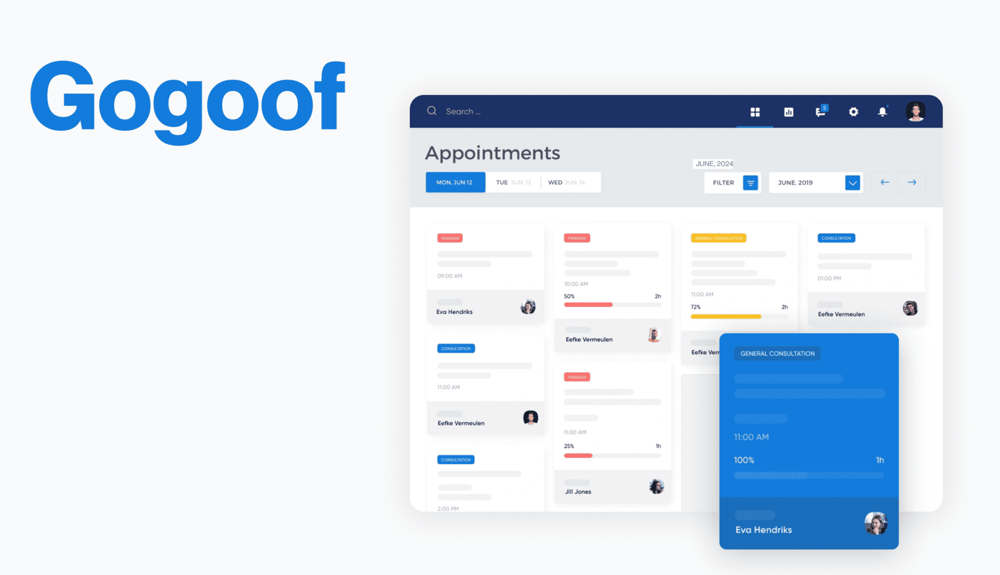

## Our experience in building solutions for the healthcare industry

At Anadea, we work with companies that work in different spheres, but healthcare is one of the domains that we focus on.

In our portfolio, there is a row of solutions built for this industry, including <a href="https://anadea.info/projects/gogoof" target="_blank">**Gogoof**</a>, which is an online doctor appointment booking system. It is a web-based SaaS product for the mental health sector. With this app, therapists can schedule appointments, create custom plans for individual patients or groups, and monitor their progress. Patients also get access to the portal, can connect with professionals, view their treatment plans, and track their progress. The core feature is a calendar. It shows appointments and treatment programs, and it is absolutely simple to reschedule the planned meetings.

Another project that you can read about is **My Medical Guide**. It is a solution for automating and digitizing the work of a medical institution. The platform has a wide range of tools, including but not limited to patient records management features, visit management functionality, and a staff calendar. To get more info about this project, please follow the <a href="https://anadea.info/projects/my-medical-guide" target="_blank">link</a>.
