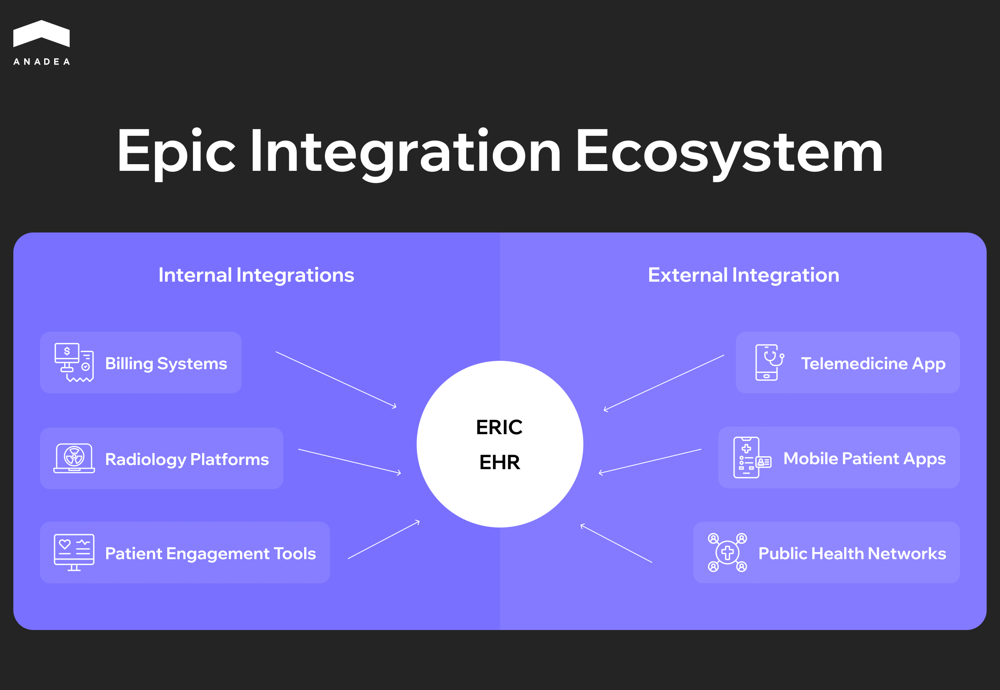
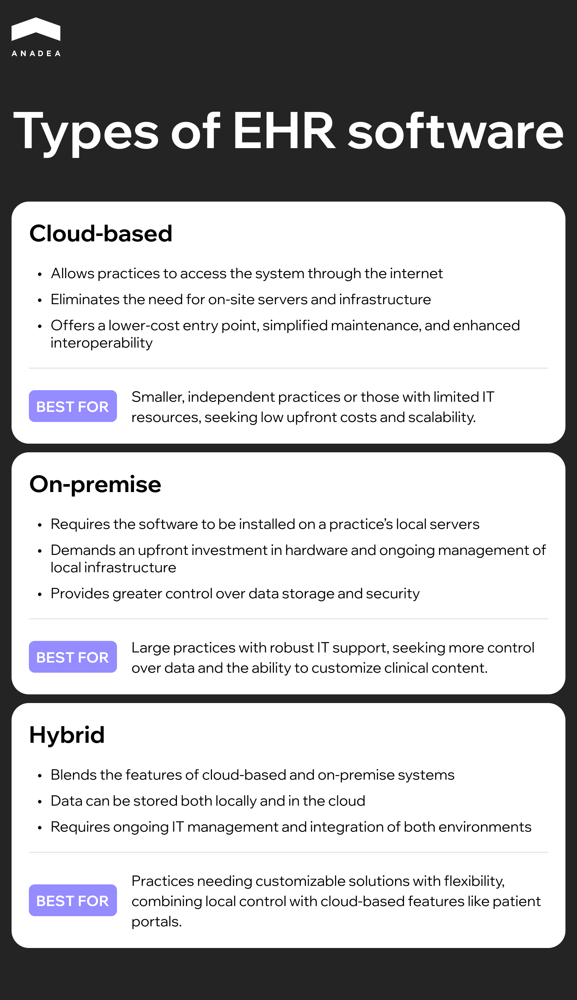

Problems with the implementation of the electronic health record (EHR) system at the VA can have critical consequences. In the United States, several cases of "catastrophic harm" associated with the new EHR system have been documented, including veteran deaths. For example, during Senate hearings, [officials reported that in recent years there have been six incidents of catastrophic harm](https://www.techtarget.com/searchhealthit/news/366578263/VA-Admits-Oracle-Cerner-EHRM-Issues-Contributed-to-4-Veteran-Deaths), four of which resulted in veteran deaths.

This is not an isolated case. About [70% of physicians with symptoms of burnout](https://pubmed.ncbi.nlm.nih.gov/30517663/) consider the EHR a primary source of stress. The technology that was supposed to free up time for patients has instead turned medical professionals into data entry clerks. For every eight hours scheduled for patient care, physicians spend [over five hours on the EHR](https://link.springer.com/article/10.1007/s11606-024-08930-4). Documentation, alerts, and endless mouse-clicking have become an integral part of medical practice.

But abandoning EHRs is no longer an option. Regulators require them, patients expect digital access to their records, and competition forces hospitals to modernize. In this article, we will examine the real[ challenges of EHR implementation](https://anadea.info/blog/technology-challenges-in-healthcare/) and offer practical solutions for those who recognize themselves in this situation.

## What is EHR?

Before diving into common challenges in EHR implementation, it's worth understanding what we're actually dealing with. An electronic health record is a digital version of a patient's medical history that a provider maintains over time, and it can include all the key administrative and clinical data. Demographics, progress notes, diagnoses, medications, vital signs, lab results – everything lives in one place.

The system handles eight core healthcare delivery functions: storing medical information, managing test results, ordering medications and procedures, enabling electronic communication between providers, supporting patients, handling administrative processes and reporting, and managing population health.

Here's where the key difference between EHR and EMR (Electronic Medical Record) comes in. An EMR is just a digital version of a paper chart that holds a patient's medical history within a single healthcare facility, while an EHR goes beyond those boundaries. Instead, an EHR allows any authorized provider to access a person's complete medical history, which theoretically should make treatment more coordinated and safer.

Sounds perfect on paper. But between concept and reality lies a chasm filled with technical, organizational, and financial challenges we're about to explore. For organizations considering[ custom EHR development](https://anadea.info/solutions/medical-app-development/emr-ehr-development), understanding these obstacles upfront is crucial.

## Technical Challenges of EHR Implementation

Organizations often underestimate the technical complexity of implementing EHR systems in the early stages of projects. They focus on functional capabilities while overlooking the infrastructure realities they will eventually face.

### Integration and Compatibility Issues

Modern medical organizations operate as complex software ecosystems. Laboratory information systems, pharmacy management platforms, billing modules, medical imaging systems (PACS), and electronic prescribing systems all need to integrate with the central EHR. Each vendor uses proprietary protocols and data exchange standards.

Legacy systems create particular difficulties. Most healthcare facilities rely on critical applications developed 10 to 15 years ago that still store years of patient data. Migrating this information into a new EHR requires careful data field mapping, validation, and testing. Data structures rarely align perfectly, leading to the need for custom integration layers.

Medical device integration adds another level of technical complexity. Patient monitoring equipment, infusion pumps, ventilators, and diagnostic devices generate data streams that need automatic transmission to the EHR. The lack of standardized protocols between different manufacturers means each integration demands an individual approach.

### Performance and Scalability Problems

EHR performance directly affects clinical process efficiency. The system must handle hundreds of simultaneous requests while maintaining acceptable response times.

Peak loads create special challenges. The start of the workday sees physicians logging in en masse to review appointments, while patient discharge periods require generating dozens of documents simultaneously. These moments expose architectural flaws. Poorly optimized database queries, absence of caching, and inefficient session management all lead to performance degradation exactly when the system is most needed.

Scalability becomes particularly acute for growing organizations. Solutions that worked well for a single clinic may prove inadequate when expanding to a network of facilities. Vertical scaling has its limits, while horizontal scaling requires architectural decisions at the design stage.

Choosing between cloud and on-premises deployment becomes a strategic decision. Cloud solutions offer scaling flexibility and reduce burden on internal IT teams but create dependence on internet connection quality. On-premises deployment provides greater control over performance and security but requires substantial infrastructure investment and qualified staff for maintenance. Hybrid models attempt to capture the best of both approaches but add management complexity.

### Security and Regulatory Compliance

Cybersecurity in healthcare has evolved from a technical problem into a category of critical business risks. The Change Healthcare attack in February 2024, which [affected data of approximately 190 million patients](https://techcrunch.com/2025/01/24/unitedhealth-confirms-190-million-americans-affected-by-change-healthcare-data-breach/), demonstrated the scale of potential consequences.

EHR systems become priority targets for cybercriminals precisely because of the value of medical data. On the black market, a complete medical record costs significantly more than credit card data.

Compliance adds another layer of complexity. HIPAA in the United States, GDPR in Europe, and local regulations in other jurisdictions all establish strict requirements for handling personal medical data.

Regular security updates and patches become critical, but deploying them in production environments requires careful planning. Medical systems operate around the clock, so any downtime must be minimized. At the same time, delays in installing critical patches can leave systems vulnerable to known exploits.

The average cost of a data breach in healthcare reached [$9.77 million in 2024](https://newsroom.ibm.com/2024-07-30-ibm-report-escalating-data-breach-disruption-pushes-costs-to-new-highs), the highest figure across all industries.

## Financial Challenges

The financial side of EHR implementation turns out to be significantly more complex than initial vendor proposals suggest. The numbers in presentations rarely reflect the real cost picture that organizations face after signing the contract. Understanding the[ full cost of EHR implementation](https://anadea.info/blog/cost-of-ehr-implementation/) helps organizations budget realistically from the start.

### Initial Investment

License costs usually represent just the tip of the iceberg. EHR vendors offer various licensing models, but the base software price always comes with additional expenses. The rest goes toward components that organizations often discover only during implementation.

Infrastructure needs prove particularly sensitive to budgets. Even when choosing a cloud solution, healthcare facilities still need to upgrade network equipment, increase internet bandwidth, and purchase new workstations and mobile devices. On-premises deployment multiplies these costs with servers, data storage systems, backup power, and cooling systems.

Customization and integration become the most unpredictable cost items. Standard EHR systems never fit perfectly with a specific organization's processes. Workflow configuration, custom form creation, reporting adaptation, and third-party system integration all add up. Each hour of vendor specialist work costs considerable money, and complex integrations can require hundreds of development hours. Organizations often find that actual customization needs exceed initial estimates by a factor of two.

### Operational Costs

After system launch, a new phase of financial commitments begins. Annual support typically runs around 15 to 20 percent of the initial EHR implementation cost, covering technical support, access to new versions, and basic consultations. But the reality is that most organizations need significantly more.

Internal IT teams must expand. EHR systems require specialized staff who understand both medical processes and technical aspects of the system. [According to HIMSS Analytics](https://www.researchgate.net/publication/23463501_What_Workforce_is_Needed_to_Implement_the_Health_Information_Technology_Agenda_An_Analysis_from_the_HIMSS_Analytics_Database), the average hospital adds 3 to 5 FTE positions after EHR implementation, not counting external consultants for specific tasks.

Downtime costs often remain outside financial calculations, though their impact can be dramatic. Unplanned outages happen, and organizations without proper disaster recovery plans bear not only direct financial losses but also risks to patient safety.

### ROI and Payback

Calculating return on investment for EHR resembles trying to weigh fog. Direct costs are easy to tally, but benefits are often scattered across different aspects of organizational operations and emerge gradually.

Financial benefits typically begin appearing during the first year after launch, but more complex operational improvements often require 2 to 3 years based on our experience. Comprehensive analysis usually shows a payback period of 5 to 7 years. These figures assume successful implementation without serious delays or the need for system rework. In reality, many organizations never reach a clear breakeven point because system needs evolve faster than benefits accumulate.



## Organizational and Human Challenges

The most sophisticated technical architecture becomes worthless if people refuse to use it. Organizational challenges in EHR implementation often prove more difficult than technical ones, since changing code is simpler than changing habits and work culture.

### Staff Resistance to Change

Physicians resist EHR implementation not because of technophobia or conservatism. Their reluctance to work with electronic systems has rational foundations. An experienced doctor who maintained paper records for decades can collect medical history, conduct an examination, and document a visit in 15 minutes. The same procedure in an EHR can take 25 to 30 minutes during the initial stages of system use.

The problem of screen time versus patient face time has become one of the most painful issues in medical practice. Doctors must break eye contact with patients to enter data into the system. This disrupts the natural flow of consultation and reduces communication quality. Patients complain that their doctor looks at the screen more than at them. Physicians feel like data entry operators instead of clinicians.

A doctor with 30 years of experience might be a brilliant diagnostician, but basic computer skills come hard. Fear of appearing incompetent in front of younger colleagues reinforces unwillingness to master the system. At the same time, these specialists hold the most authority in the collective, so their resistance can sabotage the entire implementation project.

### Changing Work Processes

EHR implementation is impossible without fundamental redesign of work processes. Attempts to simply transfer paper forms into electronic format lead to catastrophic results. Processes that worked with paper prove inefficient in a digital environment.

Documentation burden has become a real curse of modern medicine. EHR often complicates documentation instead of simplifying it through the need to fill mandatory fields, follow complex templates, and meet regulatory requirements.

Research shows that [primary care physicians click their mouse over 4,000 times](https://pubmed.ncbi.nlm.nih.gov/24060331/) during a workday. Such cognitive and physical load leads directly to professional burnout.

Clinician burnout has become an epidemic, and EHR systems play a significant role in this. When technology that was supposed to ease work instead takes away evenings and weekends for finishing documentation, doctors begin questioning their career choice.

## Data Quality and Information Management Challenges 

Even the most sophisticated EHR system becomes useless if the data inside it is inaccurate or incomplete. Organizations often focus heavily on the technical aspects of implementation while underestimating just how difficult it is to maintain the quality of the information itself.

### Data Migration 

Moving from one system to another feels like relocating to a new house after living in the same place for twenty years. You discover things you'd forgotten about, encounter clutter that's accumulated over the years, and realize that not everything can be transferred in its original form.

Data cleansing becomes the first step in this process. Legacy systems typically contain outdated records, duplicates, incomplete forms, and data in formats that fell out of use long ago. A single patient might be registered three times under different name variations.

Data validation uncovers inconsistencies that have existed unnoticed for years. Birth dates that would make a patient 150 years old. Lab results in formats the new system won't recognize. Connections between records that will break during transfer. Most organizations run into critical data quality issues during migration that delay go-live by weeks or even months.

### Data Quality and Accuracy 

Once migration is complete, a new set of challenges emerges. The system is running, data has been transferred, but then comes the daily struggle of maintaining quality.

Data entry errors are inevitable when people work under time pressure. A doctor quickly logs information between patient appointments, leading to potential typos.

Incomplete documentation remains a chronic problem even in the most modern systems. Clinicians don't finish records because they're short on time. Required fields stay empty because the information isn't available at the moment of entry. Consultation results don't make it into the system because the specialist was working offline. Each of these gaps can become critical down the line when that information is needed for clinical decision-making.

## Best Practices for Overcoming Challenges

EHR implementation challenges might seem insurmountable, but proven practices exist that significantly increase the chances of success. Years of experience across hundreds of healthcare organizations have shaped approaches that actually work. Let's examine specific steps worth taking at each stage of the project.

### Planning and Strategy

Successful EHR implementation begins long before installing the first system module. Comprehensive needs assessment must include not just leadership surveys but real analysis of how physicians, nurses, and administrators actually work. Spend several days in different departments, observe patient flows, documentation, places where delays occur. That's where genuine system requirements hide.

**Key planning elements:**

* Phased implementation approach justifies itself even with sufficient budget. Start with one department or clinic, refine processes, train first super users.
* Each phase should last long enough for stabilization but not so long that change momentum is lost.
* A realistic timeline for an average hospital runs 12 to 18 months from contract signing to full operation.
* Build in time for unexpected technical issues, additional training rounds, adaptation periods.

### Choosing the Right System

Vendor evaluation criteria must extend far beyond demonstration presentations. Request real implementation cases in similar organizations. Contact clients directly, talk not just with IT directors but with physicians who work in the system daily. Ask what went wrong, how long problems took to resolve, how the vendor responds to critical incidents.

**What to look for when choosing:**

* Scalability: can the system serve double the number of users without major infrastructure upgrade?
* Future-proofing: how does the system integrate with AI assistants, wearable devices, emerging technologies?[ AI agents for healthcare](https://anadea.info/blog/ai-agents-for-healthcare/) are becoming increasingly important for automation.
* Demand technical architecture documentation, API capabilities, three-year roadmap.
* Community and support ecosystem: active forums, integration libraries, third-party developers.
* If vendor doesn't allow external developers to build solutions on the platform, that's a red flag.

### Implementation Management

Creating a dedicated implementation team doesn't just mean appointing someone responsible. The team must include clinical leaders from various departments, IT specialists who understand medical processes, a project manager with healthcare project experience. These people need to be freed from part of their regular duties.

**Successful team structure:**

* Super users and champions program: select enthusiasts in each department who quickly adopt technology.
* Train them first, deeper and more thoroughly than the rest.
* They become the first line of support after go-live, offloading the helpdesk.
* Continuous feedback loops: weekly team meetings, brief daily surveys after go-live.
* Open communication channel where feedback leads to real changes.

### Human Factor

Early stakeholder involvement solves most change resistance problems before they arise. Involve physicians in system selection, let them test different options, voice opinions. When people feel their expertise is valued, they become system advocates rather than opponents.

**Training and support program:**

* Comprehensive training programs must accommodate different learning styles: online modules for quick independent learners, hands-on workshops for practitioners.
* Create a library of short videos covering typical operations, quick reference guides.
* Ongoing support after go-live is critically important: the first weeks of operation determine whether staff accept the system.
* Increase helpdesk capacity by 2 to 3 times for the first month.
* Optimization must be a continuous process: collect usage metrics, identify features being ignored or used incorrectly.
* Quarterly reviews with the team to optimize workflows, settings, and add new modules.

EHR implementation never ends on the go-live date. Successful organizations view it as the beginning of a lengthy adaptation and improvement process where the system evolves alongside clinic needs.

## Conclusion

EHR implementation challenges remain one of the most forefront yet rewarding transformations a healthcare organization can undertake. The technical complexities, regulatory requirements, and human factors we've explored demonstrate why careful planning and expert guidance matter so much. Organizations that approach implementation strategically, with realistic timelines and strong stakeholder involvement, see significantly better outcomes than those rushing to meet arbitrary deadlines.

The difference between a struggling EHR deployment and a successful one often comes down to having the right team and expertise at critical moments. Whether you're just beginning to evaluate systems or dealing with challenges of EHR implementation in an existing deployment, experienced guidance can save months of frustration and substantial costs.

Ready to discuss your EHR implementation challenges? Our team has guided dozens of healthcare organizations through successful deployments. [Contact us](https://anadea.info/free-project-estimate) to explore how we can support your specific situation.
