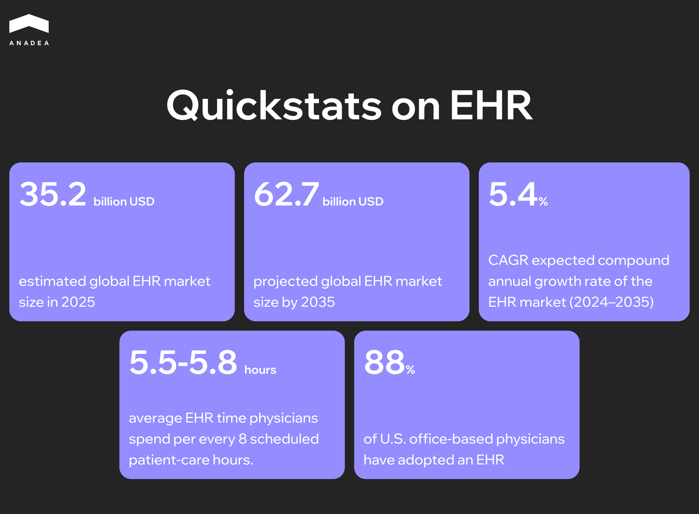

Problems with the implementation of the electronic health record (EHR) system at the VA can have critical consequences. In the United States, several cases of "catastrophic harm" associated with the new EHR system have been documented, including veteran deaths. For example, during Senate hearings, [officials reported that in recent years there have been six incidents of catastrophic harm](https://www.techtarget.com/searchhealthit/news/366578263/VA-Admits-Oracle-Cerner-EHRM-Issues-Contributed-to-4-Veteran-Deaths), four of which resulted in veteran deaths.

This is not an isolated case. About [70% of physicians with symptoms of burnout](https://pubmed.ncbi.nlm.nih.gov/30517663/) consider the EHR a primary source of stress. The technology that was supposed to free up time for patients has instead turned medical professionals into data entry clerks. For every eight hours scheduled for patient care, physicians spend [over five hours on the EHR](https://link.springer.com/article/10.1007/s11606-024-08930-4). Documentation, alerts, and endless mouse-clicking have become an integral part of medical practice.

But abandoning EHRs is no longer an option. Regulators require them, patients expect digital access to their records, and competition forces hospitals to modernize. In this article, we will examine the real[ challenges of EHR implementation](https://anadea.info/blog/technology-challenges-in-healthcare/) and offer practical solutions for those who recognize themselves in this situation.

## What is EHR?

Before diving into common challenges in EHR implementation, it's worth understanding what we're actually dealing with. An electronic health record is a digital version of a patient's medical history that a provider maintains over time, and it can include all the key administrative and clinical data. Demographics, progress notes, diagnoses, medications, vital signs, lab results – everything lives in one place.

