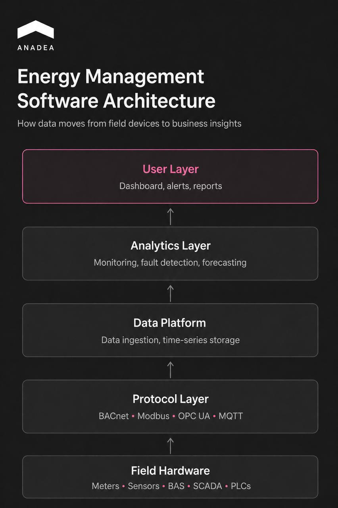

## TL;DR

* Energy management software helps facilities centralize utility, meter, and building-system data in one place.
* There are three main types of EMS platforms: HEMS, BEMS, and IEMS, each built for different scales and use cases.
* The most important features today are real-time monitoring, automated fault detection, and predictive analytics.
* Custom software offers more flexibility, deeper integrations, and full data ownership than off-the-shelf tools.
* Most commercial and industrial EMS deployments can pay back within two years through lower energy use, fewer billing errors, and reduced maintenance costs.

When utility bills are climbing, it can be not easy to find out the reasons behind this trend. Energy data is often lost in separate utility portals and spreadsheets. Without site-wide visibility, facility managers can’t track waste properly. As a result, when carbon reports are due, no one can confidently explain the numbers.

Energy management software (EMS) accumulates real-time data from meters and building systems into one place. Thanks to this, raw numbers are turned into clear reports and instant alerts that help cut costs.

In this guide, we will talk about the main types of energy software, mention the most demanded features, and explain what realistic energy management software ROI you can expect.

## What Types of Energy Management Software Exist? 

Energy management software generally falls into three categories: Home Energy Management Systems (HEMS), Building Energy Management Systems (BEMS), and Industrial Energy Management Systems (IEMS). All of them measure and optimize energy consumption. However, their operating scale, hardware dependencies, and integration complexity make them different.

* **Home Energy Management Systems (HEMS).** These are consumer-grade platforms. They are designed for single-family residences or residential units. Such systems connect to smart thermostats, IoT plugs, rooftop solar inverters, and home EV charging stations via simple wireless protocols like Wi-Fi or Zigbee. They are quick to set up, and they enable homeowners to automate their energy savings.
* **Building Energy Management Systems (BEMS)**. This commercial energy management software is intended for non-residential properties like office towers, hospitals, university campuses, and retail hubs. It relies on standard protocols, such as BACnet and Modbus, to connect to HVAC equipment, smart lighting, and central Building Automation Systems (BAS). As a result, facility managers have a single dashboard that they use to control heating and lighting schedules across an entire portfolio. 
* **Industrial Energy Management Systems (IEMS).** Systems of this type are used at heavy manufacturing, chemical processing, and industrial facilities. According to the study published by [Grand View Research](https://www.grandviewresearch.com/industry-analysis/energy-management-systems-market), this segment accounted for over 73% of the overall EMS market in 2025. These industrial energy management software systems interface with SCADA (Supervisory Control and Data Acquisition) setups, Programmable Logic Controllers (PLCs), and heavy equipment sub-meters. 

The US Department of Energy’s Federal Energy Management Program (FEMP) uses the umbrella term Energy Management Information System (EMIS). It encompasses the complete technology stack (including physical sensors, field controllers, cloud telemetry services, and analytical software) that powers modern deployments.

The data from Grand View Research shows that the global energy management system software market was valued at $60.6 billion in 2025. By 2033, it is projected to expand to $158.6 billion. 

The table below represents a brief comparison of the energy monitoring software categories.

<table>

<thead>

<tr>

<th>

<strong>Characteristics</strong>

</th>

<th>

<strong>HEMS</strong>

</th>

<th>

<strong>BEMS</strong>

</th>

<th>

<strong>IEMS</strong>

</th>

</tr>

</thead>

<tbody>

<tr>

<td>

Primary users

</td>

<td>

Homeowners, residential property operators

</td>

<td>

Facility managers, commercial engineers

</td>

<td>

Plant engineers, industrial operations directors

</td>

</tr>

<tr>

<td>

Integration protocols

</td>

<td>

Smart meters, solar inverters (Wi-Fi, Zigbee, Matter)

</td>

<td>

HVAC, lighting, BAS (BACnet/IP, Modbus RTU)

</td>

<td>

SCADA, PLCs, machine sub-meters (OPC UA, MQTT)

</td>

</tr>

<tr>

<td>

Core technical capabilities

</td>

<td>

Automated load scheduling, mobile alert push services

</td>

<td>

Peak demand shaving, load profiling, fault detection and diagnostics&nbsp;

</td>

<td>

Production-line efficiency tracking, dynamic load shifting, predictive maintenance

</td>

</tr>

<tr>

<td>

Deployment cost

</td>

<td>

Low

</td>

<td>

Average

</td>

<td>

High

</td>

</tr>

</tbody>

</table>

## What Features Should Energy Management Software Include?

Real-time monitoring, automated fault detection, and predictive analytics are the three must-have features in energy management software today. Every other capability serves as a secondary differentiator. Nevertheless, systems that lack these three core capabilities struggle to deliver measurable operational cost reductions.

Real-time monitoring engine unifies raw interval meter feeds, utility billing APIs, IoT environmental sensors, and legacy building automation protocols into a single operational interface. As a result, engineering teams do not need to rely on month-old paper invoices or delayed utility portal exports. They can inspect granular consumption profiles across every connected facility. This live data ingestion provides immediate operational context across multi-site portfolios.

Automated fault detection constantly compares real-time telemetry against normal usage patterns. Systems can instantly flag equipment anomalies, such as a commercial chiller running at full capacity overnight or an unexplained voltage spike. Such solutions can also be equipped with automated demand response software tools. In this case, they trigger targeted load-shedding protocols whenever utility providers signal peak grid demand. These automated control loops protect equipment lifespan and can prevent expensive peak demand surcharges.

Predictive analytics enables proactive system optimization through accurate consumption forecasting and automated setpoint recommendations. At Anadea, we provide professional [AI development services](https://anadea.info/services/ai-software-development) to teams that want to integrate custom machine learning models into the data pipeline. These models can take into account weather patterns, spot-market electricity pricing, occupancy schedules, and other parameters to identify micro-optimizations that standard rule-based algorithms miss.



System value correlates with protocol integration depth. Off-the-shelf tools provided by energy management software companies often fail when they hit older equipment or proprietary building controls. That can leave your data incomplete. Custom software fixes this by connecting to protocols like BACnet and Modbus and specific hardware APIs. As a result, you can get total control and ownership of your energy data.

The table below shows the key differences between using off-the-shelf software and building your custom solutions.

<table>

<thead>

<tr>

<th>

<strong>Evaluation Metric</strong>

</th>

<th>

<strong>Off-the-Shelf SaaS</strong>

</th>

<th>

<strong>Custom-Built Software</strong>

</th>

</tr>

</thead>

<tbody>

<tr>

<td>

Setup time

</td>

<td>

2-6 weeks (Standard protocols)

</td>

<td>

3-6 months or more for complex systems (Full production build)

</td>

</tr>

<tr>

<td>

Integration flexibility

</td>

<td>

Limited to pre-built API connectors

</td>

<td>

Native support for legacy BAS, SCADA, custom APIs

</td>

</tr>

<tr>

<td>

Cost structure

</td>

<td>

Recurring seat or device license fees

</td>

<td>

Upfront capital investment and maintenance fees

</td>

</tr>

<tr>

<td>

Data ownership

</td>

<td>

Vendor-hosted/vendor lock-in

</td>

<td>

100% proprietary data and code ownership

</td>

</tr>

<tr>

<td>

Scalability

</td>

<td>

Tier-restricted feature paywalls

</td>

<td>

Unlimited horizontal scaling across global facilities

</td>

</tr>

</tbody>

</table>

## What ROI Can You Expect from Energy Management Software?

Energy management software generates financial return through three primary operational levers. They are reduced baseline consumption, systematic correction of utility billing errors, and lower ongoing equipment maintenance costs. Across commercial and industrial facilities, most deployments achieve full [capital payback](https://betterbuildingssolutioncenter.energy.gov/smart-energy-analytics-campaign-toolkit) within two years.

* **Automated utility bill auditing**. Utility billing errors happen more often than most managers realize. Software automatically checks your invoices for wrong tariff rates, duplicate fees, and estimated meter reads. Catching these mistakes as early as possible is the fastest way to recover money and pay off your software investment early.
* **Load management.** Power companies can charge massive penalty fees based on your highest 15-minute power spike each month. Instead of just tracking total power use, smart software automatically smooths out those spikes. It briefly dims non-essential systems or staggers heavy machinery starts so you avoid high peak rates without slowing down operations.
* **Predictive asset maintenance.** A dirty filter or a worn motor belt forces equipment to work harder and draw more power. Predictive maintenance tracks equipment efficiency in real time. It alerts your team to fix minor mechanical problems before they turn into costly breakdowns or inflated energy bills.

Similar AI-powered forecasting is also used in [supply chain software development](https://anadea.info/solutions/supply-chain-software-development). In such systems, predictive models optimize inventory levels and logistics based on live operational data. 

Verified Capterra reviews illustrate the operational impact of adopting an EMS. An energy manager at a government administration [described](https://www.capterra.com/p/56928/EnergyCAP/#Capterra___2256831) their experience with one of the software solutions the following way: "I work for a large county government and school system with hundreds of buildings and over a thousand utility accounts. Energy usage and cost was being tracked on a limited basis through spreadsheets. This software has dramatically improved our ability to track and manage energy and water usage and cost \[...] Importing large amounts of data takes minutes. Bills are flagged if the software detects a possible issue (gap in billing, overlap in billing, spike in usage, spike in cost, etc.)."

## How to Start Building Custom Energy Management Software?

Before committing any engineering budget, the first step must be a structured[ discovery phase](https://anadea.info/guides/project-discovery-phase). It is aimed at defining existing telemetry feeds, hardware protocols, and data ownership boundaries. 

To build custom energy software, you need to conduct a clear inventory of existing facility hardware. Engineering teams must audit utility meter connectivity, IoT sensor capabilities, installed Building Automation Systems (BAS), and industrial SCADA nodes. It is also important to verify who owns that telemetry. Many proprietary building management platforms lock raw meter logs behind restricted vendor APIs. Due to this, custom protocol adaptors or secondary sub-metering are required to extract uncompressed interval data.

Accurate project scoping demands an honest assessment of deployment boundaries. If you attempt to architect a platform that simultaneously handles multi-site portfolio dashboards and high-frequency industrial plant controls, this inflates complexity. We strongly recommend focusing your initial release on your key facilities. This will help your teams validate data ingestion pipelines and user interface workflows before scaling horizontally across secondary sites.

Even if you are planning to introduce advanced machine learning models to subsequent releases, the core data architecture should be ready for them from the very beginning. 

When you try to add AI forecasting or automated controls to a database built only for monthly reports, you may face severe data bottlenecks. Your system should be prepared upfront to store high-frequency data. So you can introduce AI features later without a costly redesign. 

## Wrapping Up

Today, energy management software has become an operational cost-control necessity. When facilities grow, hardware becomes more complex. Due to this, off-the-shelf software quickly hits its limits. Custom energy management software development ensures your platform adapts to your infrastructure, as well as delivers the exact integrations and real-time control needed to maximize ROI. 

At Anadea, we can help you build custom platforms that scale with your physical operations and help you optimize your energy costs. Want to learn more about our expertise? [Contact us](https://anadea.info/contacts) to discuss details.
