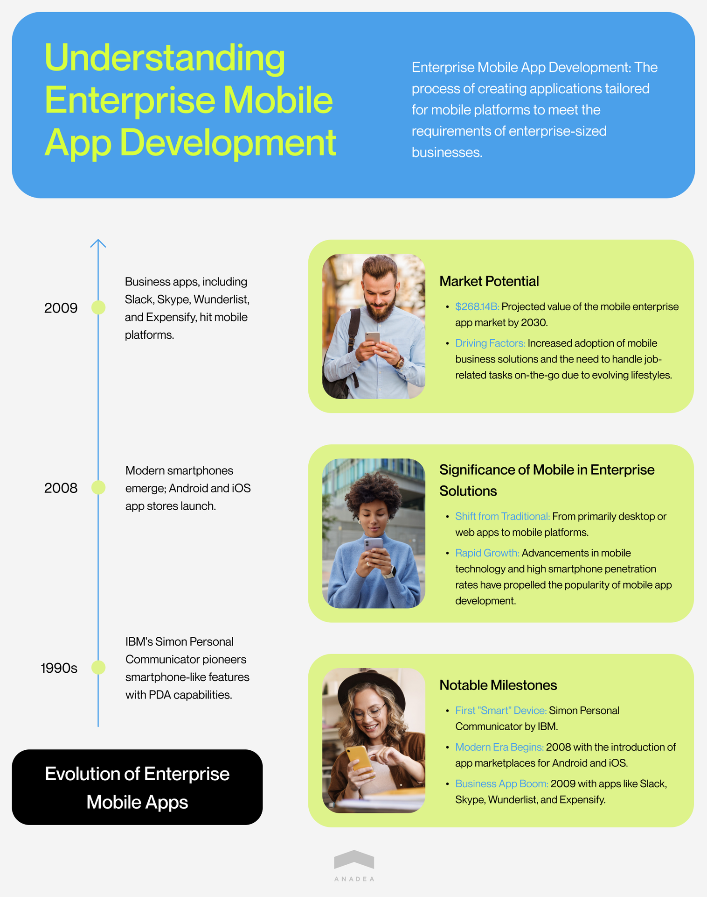
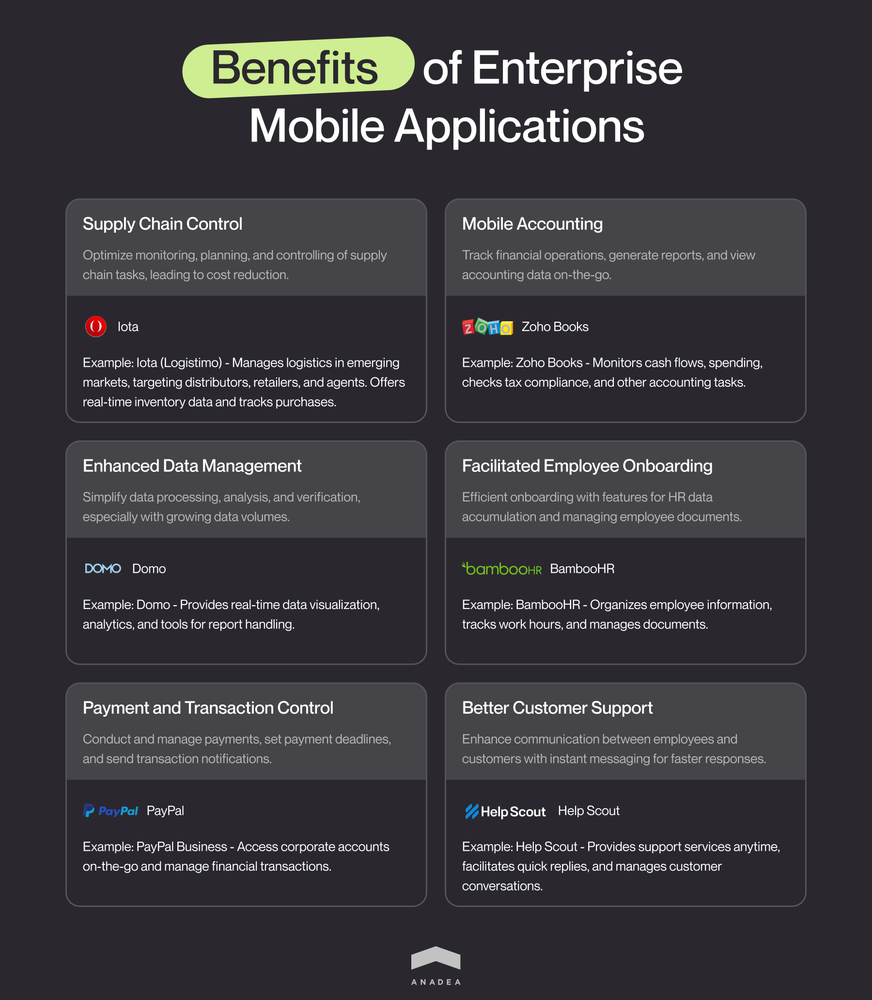
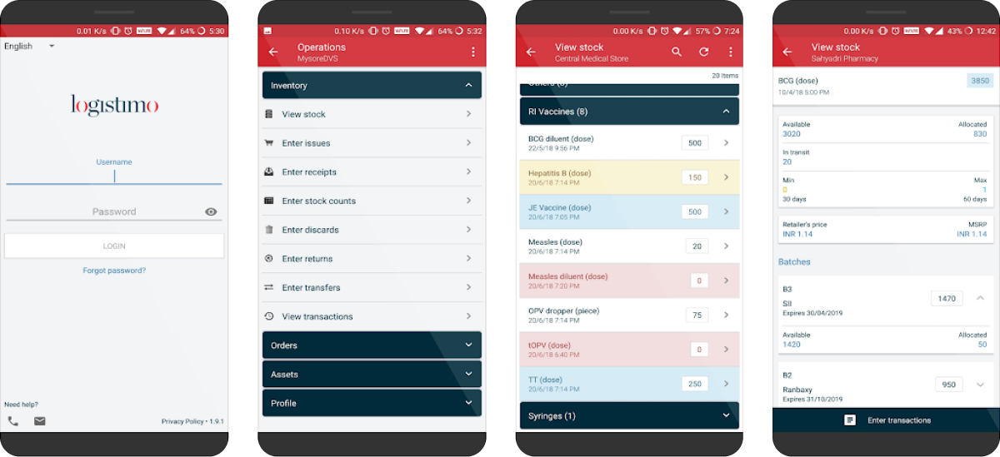
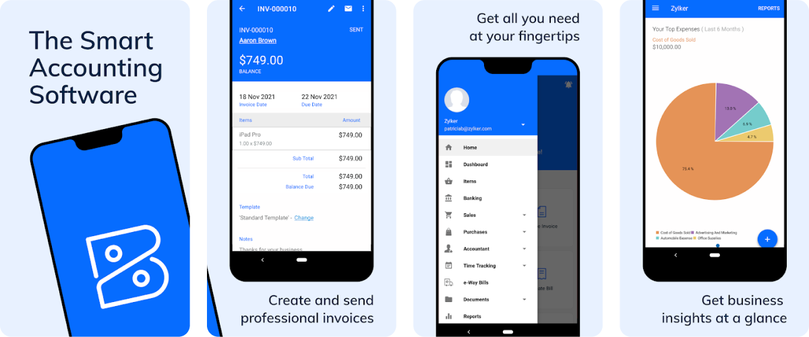
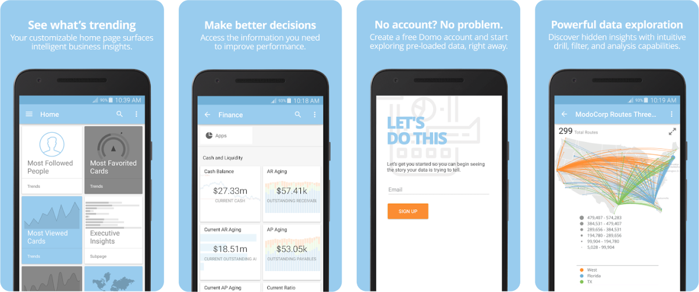
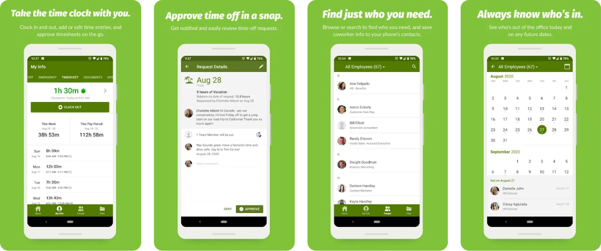
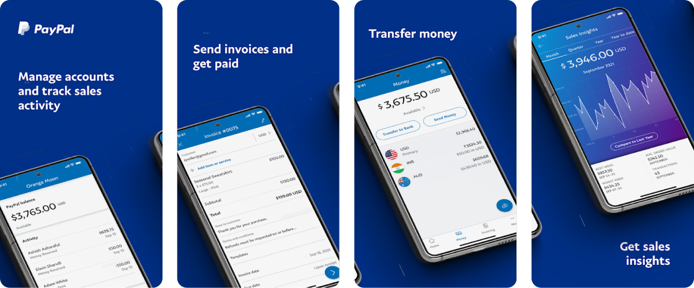
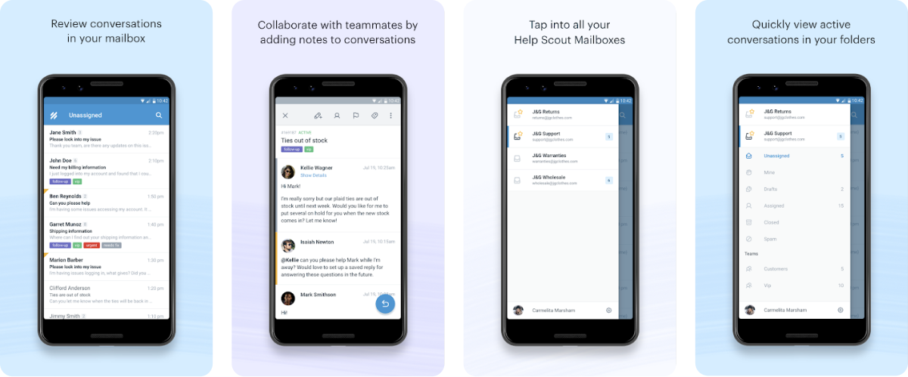

Consumer apps fight for attention. Enterprise apps fight for adoption in environments where nobody asked for another tool. A consumer app wins with downloads. An enterprise app wins when a logistics coordinator stops printing spreadsheets, or when a field technician no longer drives back to the office just to file a report.

We specialize in [mobile app development ](https://anadea.info/services/mobile-development)for exactly these scenarios. This guide shares what we've learned along the way.

## What is enterprise mobile app development?

Enterprise mobile apps are built for companies where software has to fit into something bigger. They connect to internal systems, follow security policies, and serve employees who use them as part of their job, not by choice.

Building them means thinking about ERP integrations, access controls, audit trails, and dozens of other requirements that never come up in typical app projects. The technical part is rarely the hardest. The real challenge is making everything work together without turning the app into something people avoid.

This market didn't appear overnight. It grew from early experiments with mobile devices in the 90s to a projected [$268 billion industry by 2030](https://www.verifiedmarketresearch.com/product/mobile-enterprise-application-market/). The timeline below shows how we got here.

## Trends in enterprise mobile app development

Every year mobile apps are becoming more and more advanced. The current tech trends in building enterprise solutions are the following:

* **AI and ML.** Machine learning and Artificial Intelligence help to take process automation to a new level. These technologies can be used for analyzing huge volumes of data, preparing reports, making predictions, and offering personalized recommendations.
* **IoT.** The Internet of Things makes it possible to unite a lot of real-life objects into a single network and collect real-time data. It can be done thanks to numerous sensors that can track various parameters and send the gathered info to a common server. And via mobile apps employees can get access to this data just immediately.
* **Cloud computing.** Cloud-based apps let users access data and files from anywhere. It means that all employees can work with the same docs and introduce their changes. Moreover, it is absolutely quick and easy to update such apps. They are reliable and secure.

## Types of enterprise mobile applications

If you are interested in mobile enterprise application development, first of all, you need to get at least the most general understanding of the classification of such solutions. It will help you to define the most appropriate type of app in your case.

* **Employee-level apps**. These mobile solutions are intended for internal purposes and are used exclusively by employees who hold a particular position. Such apps have the narrowest functionality in comparison to other app types on our lists. These applications are typically task-oriented, they are usually helpful for solving one problem only. It can be an app that helps managers quickly check the progress of the project realization or to see whether all employees have sent their reports.
* **Department-level apps.** These solutions already address the needs of the entire department. For example, it can be an app for marketing specialists or sales representatives. They are intended to help teams optimize, streamline, and facilitate the execution of various tasks. Moreover, these apps can have some features intended for being used by clients (for example, they can track the delivery process or just contact company employees directly via the app). There can be a lot of examples of applications of this type: supply chain management apps, customer service apps, financial apps, recruiting apps, sales process management apps, and others.
* **Company-level apps**. Such applications have functionality that can unite all the departments of one enterprise into a common network. They allow a company to organize efficient work with common documents, increase transparency and visibility, as well as facilitate communication between employees from different departments. It is possible to introduce several access levels that will depend on the position of each employee. This group of solutions includes collaboration and communication apps, general productivity apps, as well as [mLearning solutions](https://anadea.info/blog/5-surprising-ways-educational-apps-can-help-improve-students-performance) for corporate training.

## Benefits of mobile enterprise applications

The demand for mobile enterprise application development today is high and there are not any indicators that it is going to decline in the nearest future. It can be explained by the range of benefits that businesses can leverage thanks to the implementation of such solutions. We offer you to have a look at least at the most important of them.

### Supply chain control

Businesses that deal with supply chain processes can introduce various mobile applications for better monitoring, planning, and controlling of all the related tasks. Such apps can help to greatly optimize all these processes and reduce costs.

**Iota** (Logistimo) is one of the apps that can be used to demonstrate the benefits of this type of solution. It helps to manage logistics and supply chain processes in emerging markets. Namely, this app is targeted at all participants of supply chains, including distributors, retailers, and agents but your app can be developed specifically for the needs of your company. This mobile app helps to view real-time data related to inventory and track purchases and sales.

### Mobile accounting

Desktop accounting software was introduced several decades ago and quickly started to gain popularity. But now, there is a pressing need to allow managers and employees to track financial operations, generate reports, and view accounting data directly from their smartphones.

**Zoho Books** is one of the most well-known and widely used apps for mobile accounting. It helps to keep track of cash flows, monitor spending, check tax compliance, and perform other important accounting tasks.

### Enhanced data management

Data processing and management can be a very time-consuming and challenging task, especially when volumes of data are continuously growing. With mobile enterprise applications intended for editing data, its analysis, and verification, such tasks will be simplified.

If you want to find out how such apps can be helpful in your business processes, you can have a look at the example of the **Domo** application. It offers its users much more than traditional static reports. Instead of that, it is possible to get access to real-time data visualization, data analytics, and convenient tools for working with all the reports.

### Facilitated employee onboarding

Mobile apps can help to increase the efficiency of the onboarding process. Such applications can have all the required features for accumulating HR data and managing information related to employees' documents and certifications.

**BambooHR** is an app that has managed to gain high popularity among small and medium-sized companies. It helps to smartly organize all information about all the employees, track work hours and quickly edit or update any necessary documents. You can consider this app as an example for building your own solution for your enterprise.

### Payment and transaction control

Your app can be enriched with the functionality for conducting payments and managing them. It can control all the set deadlines for payments and notify users about the necessity to make a transaction.

**PayPal Business** is now widely used by companies for getting access to their corporate accounts just on the go and managing financial transactions.

### Better customer support

Enterprise mobile applications can become a convenient channel of communication between the company's employees and customers. An instant messaging feature will ensure the fastest reply to any inquiry.

**Help Scout** is a solution that allows companies to provide support services to their customers at any time. This app helps to quickly reply to clients, view conversations, and assign them to other employees.

## Enterprise mobile app development process

Enterprise app development is not the same as building a typical mobile product. More people are involved in decisions, security requirements are stricter, and approval cycles take longer. Below are the stages that most projects like this go through.

<table>

<tbody>

<tr>

<td>

<strong>Stage</strong>

</td>

<td>

<strong>Estimated duration</strong>

</td>

<td>

<strong>Who is involved on the client side</strong>

</td>

</tr>

<tr>

<td>

Discovery and analysis

</td>

<td>

2-4 weeks

</td>

<td>

Product owner, key users, department heads

</td>

</tr>

<tr>

<td>

Technical requirements

</td>

<td>

1-2 weeks

</td>

<td>

IT department, security team

</td>

</tr>

<tr>

<td>

Prototyping

</td>

<td>

2-3 weeks

</td>

<td>

Product owner, future users

</td>

</tr>

<tr>

<td>

MVP

</td>

<td>

6-12 weeks

</td>

<td>

Product owner, pilot user group

</td>

</tr>

<tr>

<td>

Design and development

</td>

<td>

3-6 months

</td>

<td>

Product owner, IT department

</td>

</tr>

<tr>

<td>

Testing

</td>

<td>

2-4 weeks

</td>

<td>

QA, security team, UAT group

</td>

</tr>

<tr>

<td>

Deployment

</td>

<td>

1-2 weeks

</td>

<td>

IT department, MDM administrators

</td>

</tr>

<tr>

<td>

Support

</td>

<td>

Ongoing

</td>

<td>

Product owner, IT department

</td>

</tr>

</tbody>

</table>

### 1. Discovery and business process analysis

Before writing code or designing interfaces, you need to understand how the company operates today. Who will use the app? What tasks do they perform daily? What systems are already in place?

At this stage, we interview future users and stakeholders. It often turns out that different departments see the product differently. Managers want dashboards and analytics. Field workers want fewer clicks. IT wants integration with existing systems and access control.

The output of this stage is a document that describes not the features of the app, but the problems it needs to solve. This matters because features may change, but the problems will remain.

### 2. Technical requirements and stack selection

Once we know what we are building, the team prepares a technical specification. For enterprise projects, this goes beyond a list of features.

You need to determine which systems the app will exchange data with. ERP, CRM, Active Directory, internal databases. Each integration adds complexity. Security decisions are also made at this stage. Data encryption, authentication methods, access levels for different roles.

Technology choices depend on these requirements. If the company already uses a particular stack, it often makes sense to stick with it so the internal team can maintain the product later.

### 3. Prototyping

A prototype is a way to test an idea before it becomes an expensive mistake. For enterprise apps, this is especially important because the cost of changes after launch is much higher.

We create interactive mockups that can be shown to future users. Not static images, but clickable prototypes where you can see how a person will move between screens, fill out forms, and receive notifications.

This stage often reveals things nobody thought about earlier. For example, that a field worker will use the app while wearing gloves. Or that the internet connection in the warehouse is unstable, and the app needs to work offline.

### 4. MVP

[Minimum viable product ](https://anadea.info/guides/what-is-mvp) for enterprise does not mean doing as little as possible. It means doing enough to test the main product hypothesis with real users.

If you are building an app for a warehouse team, the MVP might include only product scanning and inventory updates. No analytics, no accounting integration, no push notifications. You add those later, once you confirm that the basic scenario works.

The main advantage of an MVP is feedback. People who use the app every day see problems that are impossible to predict during planning.

### 5. Design and development

Once the MVP confirms the direction, the team moves to full-scale development. Designers and developers work in parallel, usually in two-week sprints.

For enterprise apps, design is not about aesthetics. It is about efficiency. How many clicks does a typical operation require? Is it clear what to do next? Can you use the app with one hand?

During development, it is important to show intermediate results to the client and future users regularly. The earlier you spot a problem, the cheaper it is to fix.

### 6. Testing

In enterprise projects, testing is not just about finding bugs. It is about verifying that the app works under real company conditions.

The QA team tests functionality, performance, and security. But that is not enough. You need UAT (User Acceptance Testing), where actual company employees try the app in their work. They will find problems that testers miss because they do not know the specifics of the business.

A security audit is also conducted at this stage. For enterprise apps, this is not optional. Especially if the app will handle personal data or financial information.

### 7. Deployment

Launching an enterprise app is different from publishing to the App Store. Companies often use MDM systems (Mobile Device Management) to distribute apps to corporate devices. Or internal enterprise app stores.

Before launch, you need to prepare infrastructure. Servers, databases, monitoring systems. You also need to think through your rollout strategy. Few companies launch an app to the entire organization at once. Usually, you start with one team or one office, collect feedback, fix issues, and only then scale.

### 8. Support and evolution

Launch is not the end of the project. Enterprise apps live for years, and they need support throughout.

Operating systems get updated, APIs change, new security requirements emerge. The team has to monitor performance, respond to incidents, and release updates.

It is also worth establishing a process for collecting user feedback. People who work with the app daily see opportunities for improvement. If you ignore that feedback, the app will gradually stop meeting business needs.



## Enterprise mobile app development platform and tools

For launching a highly efficient solution that will demonstrate excellent performance, it is important to choose the right development platform and tools.

What is an enterprise mobile app development platform? It is a suite of services and tech products that make it possible to build mobile software. For example, you may have already heard about Android Studio, Visual Studio, Xcode, or Ionic. But how to find the most suitable one? There are some parameters that you should bear in mind while making a choice.

* **Intuitive interaction**. You need to make the development process for your team as simple and clear as possible. That's why it is recommended to choose platforms that are comparatively easy to use.
* **Status updates in real-time.** You should have the possibility to track the development progress in order to implement any changes, if required, before it is too late to do it.
* **Easy integration**. Your mobile application should be compatible with your entire software infrastructure. That's why you should choose a platform that will ensure seamless integration of your app.
* **Security**. This feature should be taken as a top priority for any company. It is necessary to find out whether a platform under consideration is compliant with all modern security standards.
* **App management**. We recommend you check in advance what opportunities you will have for managing your app when it is ready. You should be able to track its performance and make adjustments.

As for development tools, there also won't be a single option that will suit everyone. You will need to opt for those that will allow you to create all desired features of your app. We've prepared a list of the best tools for enterprise mobile app development.

### React Native

This open-source framework is used for building native-like apps for both Android and iOS. It allows developers to rely on the native platform capabilities and the capabilities provided by the framework itself.

Pros:

* A rich library of ready-to-use components;
* Code reusability;
* Quick iteration cycles;
* Compatibility with third-party plugins.

Cons:

* Lower app's performance in comparison to native applications;
* Low efficiency for complex interfaces.

### Xamarin

It is one of the most popular tools among mobile app developers that allows them to create feature-rich apps for iOS and Android. As well as React Native, this tool is applied for building cross-platform solutions.

Pros:

* Simple maintenance;
* Complete development ecosystem;
* A wide range of available components;
* Full hardware support.

Cons:

* Heavy apps;
* Time-consuming UI creation.

### [Flutter](https://anadea.info/services/mobile-development/flutter-development-services)

It is a mobile software development framework that can be used for creating high-performance Android and iOS apps.

Pros:

* Beautiful designs;
* Lower costs;
* Faster time to market;
* Native-level performance.

Cons:

* A limited set of available libraries;
* A larger size of apps.

## Cost of mobile enterprise application development

When our clients come to us with a request to build a custom mobile app for them, one of the most popular questions that we get is related to the cost of such a project. And here, we should admit that we can't provide any precise answer just immediately.

All mobile enterprise applications that are built for the needs of specific businesses will be unique. They will have different functionalities, different capacities, and different technologies that will be used for their development. That's why the amount that businesses need to invest in such products can significantly vary.

To provide our clients with accurate estimates, we should analyze different factors, including:

* the type of software (while some companies prefer building native Android and iOS apps for their staff, some others opt for [cross-platform mobile development](https://anadea.info/blog/cross-platform-mobile-development/). This approach allows developers to write only one code that will be compatible with both platforms);
* features that will be built (the more feature-rich app you want to get, the higher the cost will be);
* the complexity of your future solution and the time that will be required for its development;
* tools that will be used and the necessary expertise;
* the size and composition of the development team and its location.

As you can understand the rate of developers will be one of the factors that will have the strongest impact on the final amount. The rates depend on the seniority level of specialists and the region where you are going to hire the team.

Below you can find average software development hourly rates in different regions in 2023:

* Western Europe: $75
* Eastern Europe: $58
* North America: $77
* Latin America: $61
* Africa: $28
* Asia Pacific: $33

When you are looking for a software development team, it is crucial to find a perfect price-quality ratio. Too low rates always look very suspicious which may be a sign of the poor quality of final products.

In general, the costs of the development of mobile enterprise applications may start at $50,000 and reach the mark of $500,000 and higher, depending on the project's requirements.

Based on our practical experience, we can say that there are some tricks and approaches that can be useful for optimizing development costs and better budget planning.

* Opt for cross-platform app development instead of building native applications.
* Test the viability of your app with an MVP instead of investing in a full-scale solution from the very beginning.
* Discuss all the financial terms with your team beforehand in order to avoid any possible hidden costs.
* Carefully prepare the requirements for the project so that the development team can provide accurate cost estimates.

## Security of enterprise mobile applications

Security has always been one of the most serious concerns in enterprise mobile apps development. Such solutions deal with huge volumes of highly sensitive information which attracts hackers. Security vulnerabilities pose a threat not only to mobile apps and data but also to the reputation of companies that use them. Cyberattacks and hacks can lead to data leaks and significant financial losses. But what is even more serious, such incidents can result in the loss of trust from the side of customers.

That's why professional developers always take the security of mobile enterprise applications and the protection of business data as their top priorities, alongside the functionality and performance of apps.

We have some practical tips that will help to ensure the desired level of protection for your apps.

* **Consider security aspects in advance.** You should think about the ways to protect your solutions already at the stage of planning. Otherwise, it will be very challenging to introduce any changes after the solution is already built.
* **Deeply analyze the security of the development framework that you will use.** In general, it is very important to choose the correct tech stack. We always recommend our customers opt for those technologies that have already proved their reliability. If you have any doubts, your development team should always help you to make the right choice.
* **Apply data encryption**. End-to-end encryption is one of the most commonly used and efficient methods of protecting data. Encryption algorithms and keys will prevent hackers from deciphering your data even if they get access to it.
* **Implement strong user authentication**. It is crucial to control access to your enterprise mobile apps. One of the most powerful ways to do it is to introduce two-factor authentication. Your employees will be able to open their apps only after entering a code that they will receive via SMS or phone call.
* **Continuously monitor the performance of your software.** It is necessary to track how your app is functioning. This approach will help you to detect all the vulnerabilities and bugs just in time. The sooner you fix them, the better protection will be ensured.
* **Regularly update your apps**. Timely updates help to guarantee the proper protection of your solution from any external attacks.

## How to choose an enterprise mobile app development company?

When it comes to building mobile enterprise applications, you need to make sure that you can fully rely on a vendor that will be responsible for such projects. Such solutions have their specificity and it is important to understand that the performance of the entire huge enterprise may greatly depend on their productivity, security, and efficiency.

Given the importance of enterprise mobile applications, the majority of businesses prefer not to cooperate with freelancers and to work only with professional software development companies, like Anadea, that are known for their high-quality [mobile development services](https://anadea.info/services/mobile-development).

Nevertheless, today the number of companies that have similar offers is continuously growing. They all promise that they will build an app that will be the best one for your business and that they will use only the most reliable tools for it. But how to make sure that the chosen company will be able to fulfill everything that was promised?

1. Always check the portfolio. It is crucial to establish cooperation with a team that has already worked on [enterprise-level projects](https://anadea.info/projects#enterprise) before.
2. Read the reviews written by customers. It is always sensible to have a look at the opinions of those businesses who have already got their solutions delivered. From these reviews, you can learn a lot of useful facts about the company.
3. Communicate with a team. We highly recommend you communicate with representatives of the vendor before making up your mind. You can ask a lot of questions not only about their expertise in mobile enterprise application development but also about the project management methodologies and approaches to project realization that they use.
4. Ask for estimates. You also should get project estimates in advance in order to understand whether your budget allows you to cooperate with the chosen team. But even if the provided amount is higher than you expected you can always share your concerns with the development team. Real professionals will be able to offer you a way to optimize costs without affecting the quality.

Do not hesitate to ask questions and explain your doubts! It is important to build trust with a development team from the very beginning. At Anadea, we highly appreciate such openness and are always ready to do our best to provide the most comfortable terms of cooperation.

Contact us

## Our experience in building mobile enterprise applications

We have been building enterprise software for over 20 years. During this time, we worked with companies across logistics, e-commerce, healthcare, and supply chain industries. Two recent projects show what enterprise mobile development looks like in practice.

[Visdeal](https://anadea.info/projects/visdeal) sells fishing gear across 8 European countries. The company manages 80,000+ products from a 5,000 m² warehouse in the Netherlands and serves over 3 million visitors per year. When we started working together, their warehouse team still used paper-based tracking. We built a mobile app connected to Picqer WMS. Staff now scan QR codes, see stock levels instantly, and match orders to physical inventory without switching between systems. Today Visdeal brings in over €21M annually and continues to grow across Europe.

The second project was for a[ major African holding company](https://anadea.info/projects/african-b2b-mineral-marketplace) that moves raw materials across borders. They needed a private B2B marketplace for mineral trading. The platform had to cover everything from supplier verification and quality testing to contracts, payments, and shipment tracking. We built a system with 6 user roles, an internal wallet, and full audit trails for ESG compliance. We also delivered a mobile version so that teams in the field could access inventory, approve transactions, and track logistics from anywhere.

Both projects required us to learn how the business operates before writing any code. That part takes longer than most clients expect. But it is also what makes the final product useful.

## Conclusion

The development of an enterprise mobile app for the needs of your business can be a very promising project that will be worth all the made investments. Such apps help to streamline and optimize a lot of processes, including those that typically require a lot of time and effort from the side of your staff. As a result, thanks to the introduction of such solutions, you can let your employees quickly solve routine tasks and focus on more creative aspects.

However, to make sure that enterprise mobile applications will bring the desired results, you need to work with seasoned developers who have relevant knowledge and qualifications. At Anadea, we will be always ready to offer you our help. Just contact us to discuss what we can do to transform all your ideas into real enterprise solutions.

Get in touch
