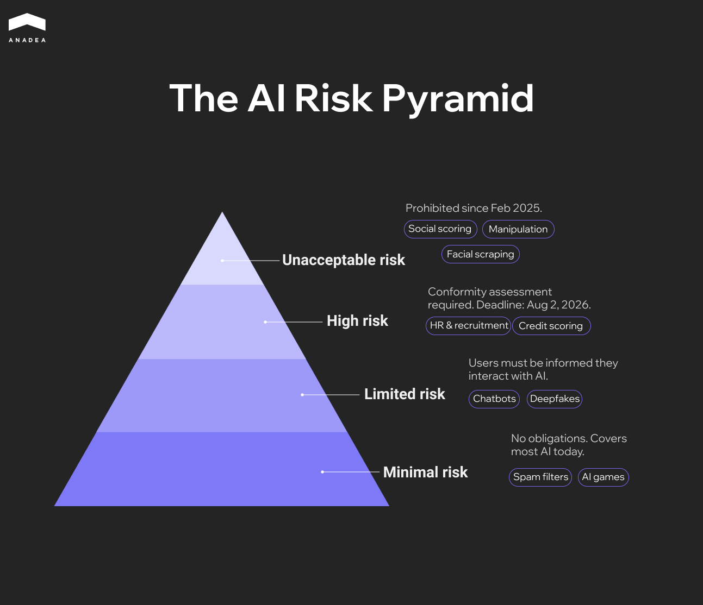
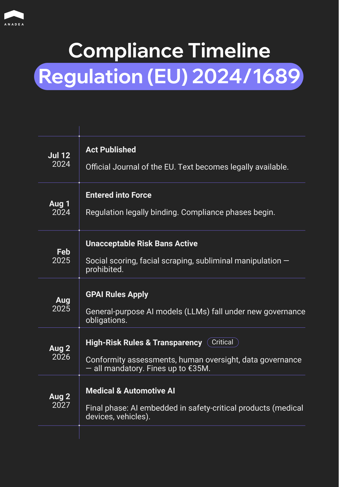

According to the[ KPMG 2025 Global CEO Outlook](https://kpmg.com/xx/en/our-insights/value-creation/global-ceo-outlook-survey.html), more than 70% of CEOs now rank AI above all other capital expenditures. 69% of companies allocate between 10% and 20% of their budgets to AI initiatives. Such a high level of interest in AI development and deployment of this technology requires proper regulation of its use. The EU AI Act is the first legally binding, comprehensive framework for AI regulation in the European Union.

Meanwhile, the [Littler 2025 European Employer Survey](https://www.littler.com/news-analysis/littler-report/littler-european-employer-survey-report-2025), published in November 2025, revealed that only 18% of respondents believe their companies are prepared to comply with the new rules. 20% said that they are not at all prepared.

As the main EU AI Act compliance deadlines are approaching, this article explores the key requirements and provides practical recommendations for organizations that build and use AI systems.

## What the EU AI Act Is and Why It Matters

The [EU AI Act](https://artificialintelligenceact.eu/) is designed to encourage responsible innovation. Its main goal is to ensure that AI is developed and deployed in ways that support human rights.

### Core Pillars

 Its mission is built on three main pillars:

1. **Safety**. AI systems must be accurate and secure. Vulnerabilities can have serious real-world consequences, especially in domains like healthcare, finance, transportation, and public safety. High-risk systems (like those used in surgery or credit scoring) must undergo rigorous testing to ensure they don't malfunction or cause physical or psychological harm.
2. **Transparency**. Users must know when they are interacting with AI. This includes a wide range of steps, such as labelling deepfakes, informing users they are interacting with an AI system, providing explainability, etc.
3. **Accountability**. Responsibility related to decisions made by AI used to be diffuse. Now, the AI Act establishes clear roles for providers (those who build the AI) and deployers (those who use it professionally). As a result, there must always be a human in the loop. This person takes responsibility for the system's outcomes.

### What Makes It Different

Sometimes, the AI Act is confused with the GDPR, which is the EU’s landmark data privacy law. Both documents are aimed at protecting citizens. But they operate very differently:

* GDPR is about the input. It regulates how your personal information is collected and shared.
* The AI Act is about the output. It regulates what the machine does with information and how it arrives at a conclusion.

Previous digital regulations were often reactive. They introduced punishments for companies after a data breach occurred. The AI Act is pre-emptive. For high-risk systems, companies must prove their AI is safe before it is allowed on the market. 

## AI Risk Categories 

The Act doesn't regulate AI as a standalone concept. Instead, it uses a risk-based approach, where the level of regulation depends on how much harm the AI could potentially cause.

According to this framework, all AI use cases range from minimal risk (like spam filters) to unacceptable risk (like social scoring systems). 

Let's examine each category in detail.

### Unacceptable Risk

Certain AI practices are considered so harmful to human dignity and democracy that they are strictly banned in the EU. These prohibitions have been in full effect since February 2025. Here are the use cases included in this group:

* Social scoring (AI is used by governments or companies to rank individuals based on social behavior or personality traits);
* behavioral manipulation (subliminal techniques or exploitation of psychological vulnerabilities are used to distort a person’s behavior in a way that causes harm);
* biometric categorization (biometric data is used to infer sensitive traits like race, political opinions, or sexual orientation);
* untargeted facial scraping (facial recognition databases are created or expanded by scraping the internet or CCTV footage).

### High-Risk AI

This category covers AI systems that aren't banned but have a significant potential for harm. This is where the key EU AI Act compliance requirements are focused.

These regulated use cases include:

* Critical infrastructure (management of road traffic or water and electricity supplies);
* employment and HR (tools for recruiting, screening resumes, or evaluating employees);
* education (systems used to grade exams or determine admissions to schools);
* essential services (for instance, credit scoring for loans);
* law enforcement (tools for assessing the risk of a person offending or evaluating asylum applications).

### Limited and Minimal Risk

The majority of AI systems that are currently in use fall into these lower categories.

Systems with limited risk are allowed. But they must follow transparency obligations. It means that users must be informed that they are interacting with an AI. Examples of such systems are chatbots and deepfake generators.

Minimal-risk systems are unregulated. This group includes the majority of software that has a negligible impact on rights. Among such solutions are AI-powered video games, spam filters, and inventory management tools.

## EU AI Act Compliance: Who Does It Concern?

The regulation identifies several key actors in the AI supply chain.

The table below presents the key obligations of organizations from different categories.

<table>

<tbody>

<tr>

<td>

<strong>Role</strong>

</td>

<td>

<strong>Definition</strong>

</td>

<td>

<strong>Typical Compliance Burden</strong>

</td>

</tr>

<tr>

<td>

Providers

</td>

<td>

Organizations that develop an AI system (or have it developed) and brand it as their own

</td>

<td>

Must ensure technical safety, data governance, and registration

</td>

</tr>

<tr>

<td>

Deployers

</td>

<td>

Businesses or public bodies that use an AI system in a professional context

</td>

<td>

Must monitor the system's performance and ensure human oversight

</td>

</tr>

<tr>

<td>

Importers and Distributors

</td>

<td>

Entities that bring non-EU AI systems into the European market

</td>

<td>

Must verify that the system is already compliant and properly labeled

</td>

</tr>

</tbody>

</table>

The Act applies to non-EU companies if:

* They offer an AI system for sale or use on the EU market.
* They make an AI system available for the first time in the EU.
* The output produced by their system is used within the European Union.

This means a US-based recruiting firm that uses AI to screen French candidates must follow the same rules as a local EU company.

### Who Is Exempt?

There are a few notable exceptions for EU AI Act compliance. This framework does not apply to:

* AI systems used exclusively for military, defense, or national security purposes;
* AI used solely for scientific research and development;
* individuals using AI for purely personal activities (for example, for writing a personal letter).

## Key EU AI Act Compliance Requirements

For high-risk systems, there are five primary technical and operational standards that they must comply with to enter the EU market.

### Data Governance and Quality Standards

The "garbage in, garbage out" principle is one of the most serious concerns about the use of AI. To address this issue, the AI Act requires that training, validation, and testing datasets meet strict quality criteria:

* **Representativeness.** Data must be relevant and sufficiently diverse to prevent discriminatory biases.
* **Error scrubbing.** Datasets should be error-free and checked for logical inconsistencies.
* **Bias mitigation.** Providers must implement active measures to detect and correct bias throughout the [AI software development](https://anadea.info/services/ai-software-development) process.

### Documentation and Record-Keeping 

Organizations must maintain a living technical document that explains the system's architecture and intended purpose.

High-risk systems must be designed to automatically record events (logs) throughout their lifecycle. This ensures that if something goes wrong, investigators can see exactly what happened and why.

### Transparency and User Disclosure

According to EU legislation, AI brings the biggest danger when it is hidden. That’s why deployers must get access to concise manuals that explain the system’s capabilities and limitations.

Users must be informed when they are interacting with an AI or viewing synthetic content.

In certain cases, individuals have the right to an explanation of how an AI-driven decision affected them.

### Human Oversight and Control

The Act explicitly forbids autonomous high-risk systems that cannot be overridden.

Every high-risk system must include a mechanism that allows a human to intervene or shut the system down in a safe state.

Systems must be designed to help humans avoid the autopilot trap, where they stop questioning the AI’s output and just follow its lead blindly.

### Accuracy, Robustness, and Cybersecurity

AI systems must perform within declared performance parameters**.** Developers must declare the expected level of accuracy and how it’s measured.

The system must be robust against attempts to manipulate the AI with poisoned data and technical faults.

Security must be implemented by design to prevent unauthorized parties from altering the system’s behavior or outputs.



## EU AI Act Penalties for Non-compliance

The EU has established a tiered fine structure based on the severity of the violation. These fines are calculated as a percentage of a company’s total worldwide annual turnover or a fixed amount, depending on whichever is higher.

For SMEs and startups, the Act specifies that fines should be the lower of the two amounts. Thanks to this approach, a single misstep won’t automatically lead to bankruptcy for smaller innovators.

<td>

Using prohibited AI

</td>

<td>

€35,000,000

</td>

<td>

7%

</td>

</tr>

<tr>

<td>

Non-compliance with high-risk rules

</td>

<td>

€15,000,000

</td>

<td>

3%

</td>

</tr>

<tr>

<td>

Providing misleading info to regulators

</td>

<td>

€7,500,000

</td>

<td>

1%

</td>

</tr>

</tbody>

</table>

There is a two-tier system for enforcement. At the EU level, the AI Office oversees general-purpose AI models like LLMs. At the local level, each EU Member State has designated its own Market Surveillance Authorities to handle day-to-day inspections and issue fines.

## EU AI Act Timeline Compliance Dates

The text of the Act was published in the EU Official Journal on July 12, 2024. 

August 1, 2024, was the date when it entered into force. But at that time, none of its requirements applied. 

To facilitate the process of adaptation to new rules, the AI Act is being rolled out in phases. At the time of writing this article (February 2026), we are currently in the most critical preparation phase before the key EU AI Act compliance deadlines.

You can find the [most important dates](https://artificialintelligenceact.eu/implementation-timeline/) in the infographic below.

## How Organizations Can Prepare for EU AI Act Compliance 

Preparation for the AI Act compliance requires a cross-functional effort that unites legal, IT, and product teams. Here is a four-step plan to ensure your organization is ready before the August 2026 deadline.

### Step 1. Conduct an AI Inventory and Risk Audit

You cannot regulate what you haven’t mapped. Your first step should be to create a comprehensive registry of every AI system your organization uses, builds, or buys. The implementation of EU AI Act compliance software can significantly reduce your reliance on spreadsheets and streamline technical documentation.

Identify potentially high-risk systems. These can be HR tools, credit scoring, or biometric ID tools.

Uncover the tools used by your employees and detect those that can inadvertently trigger transparency or data privacy violations.

### Step 2. Modernize Internal Governance and Policies

The AI Act requires clear lines of responsibility. Appoint a dedicated compliance officer responsible for AI governance.

Ensure that employees know which AI behaviors are prohibited and which require transparency disclosures.

### Step 3. Embed Compliance into the Development Lifecycle (AI-SDLC)

This step is crucial for [companies that build AI](https://anadea.info/blog/top-ai-agent-development-companies/).

* Implement automated testing for bias and representativeness in your training datasets early in the pipeline.
* Build automated logging into your architecture so that every decision the AI makes can be traced back to its inputs.
* Design your UI/UX so that a human supervisor can easily monitor outputs and, if necessary, override the system.

### Step 4. Manage the Supply Chain

As a rule, when companies create and implement AI tools, they rely on third-party APIs or software providers.

Even if you use someone else’s AI, you are still legally responsible for its deployment and outcomes within your organization. You should request conformity certificates or detailed technical documentation from your vendors to ensure their systems meet EU standards.

Apart from this, we recommend working with specialized AI auditing firms now to help identify compliance gaps in any high-risk systems you use.

## Final Word

Some organizations see the AI Act as a hurdle. However, forward-thinking companies use it as a competitive differentiator. Compliance is the ultimate signal to investors and customers that your innovation is sustainable. That’s why, by embracing new transparency standards, you can build a strong brand adapted to the needs of a global economy.

At Anadea, we have been focused on [creating custom AI solutions](https://anadea.info/blog/how-to-create-ai-software/) since 2019. Our engineering and legal teams actively track regulatory developments across the EU AI Act’s implementation phases, including the evolving standards for high-risk classification. Thanks to this, our developers embed transparency and bias avoidance into your project from day one.

Whether you are building an AI solution from scratch or need experts to audit an existing system, we can help you. [Contact us](https://anadea.info/contacts) to tailor your AI strategy to be fully compliant with EU AI Act requirements.
