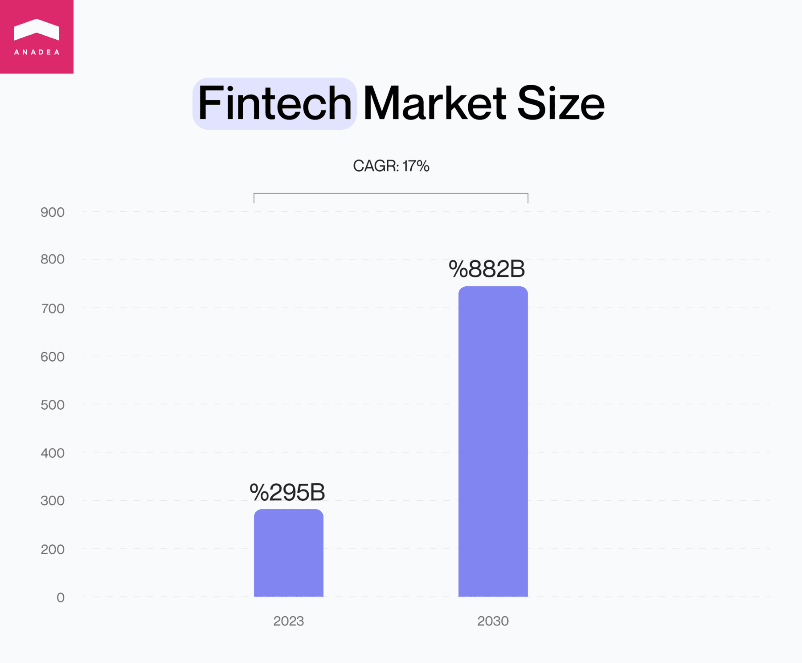
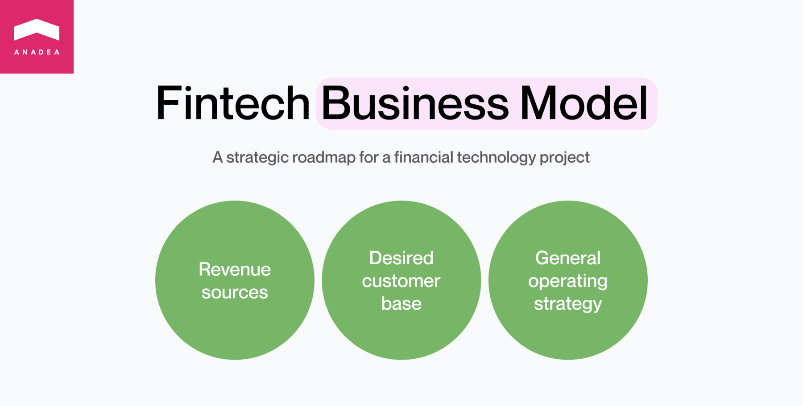
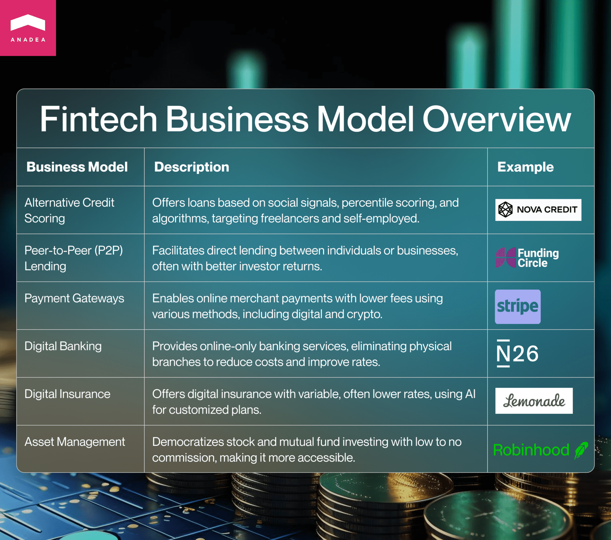
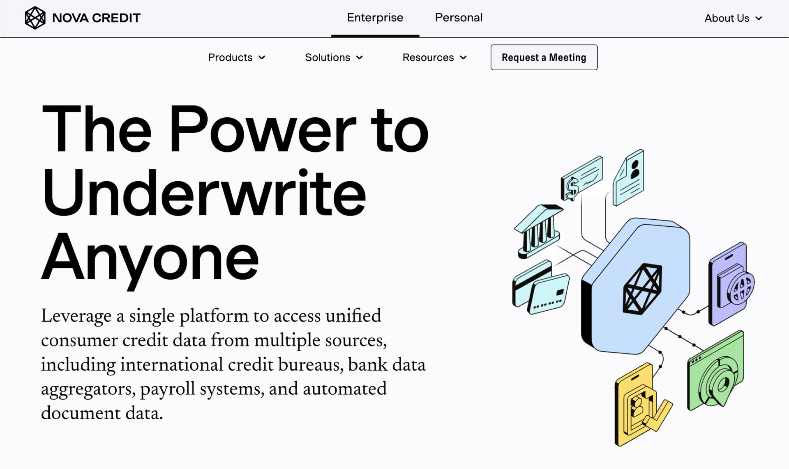
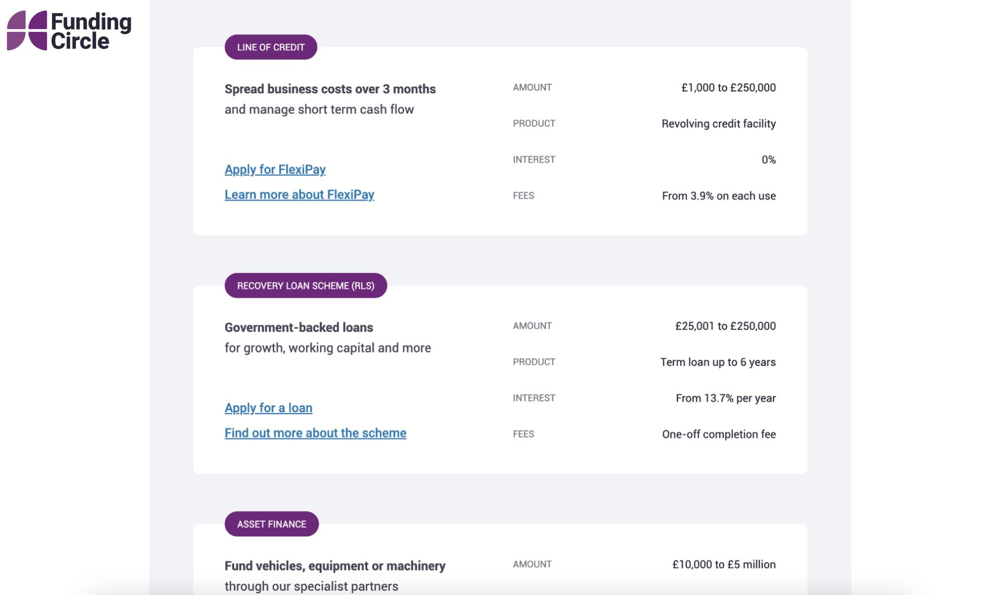
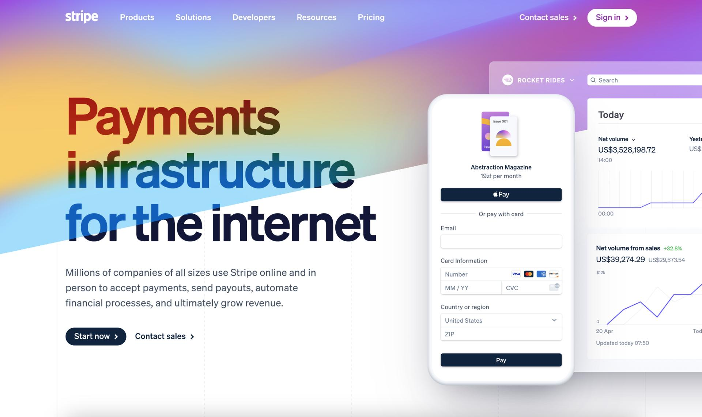
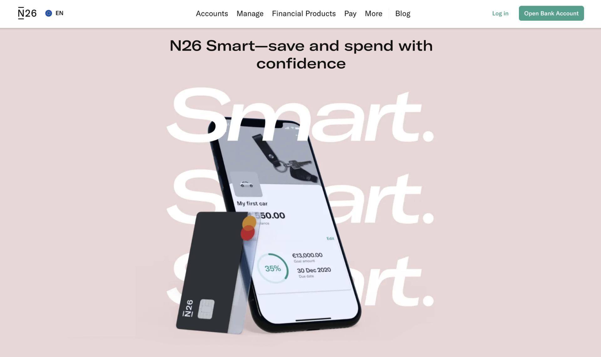

Traditional banking and financial services and products are continuously losing their efficiency in the modern world. Due to their inflexibility, they can’t fully address all the existing needs of markets. As a result, customers do not have any other choice but to start looking for alternative options. Here is when fintech solutions enter the arena to change the landscape of financial services once and for all.

In this article, we are going to talk about different fintech business models. If you are considering the launch of your own project, it will be highly useful for you to think about the approach to building your business in advance.

## What is a fintech business model?

To begin with, let us remind you what <a href="https://anadea.info/solutions/financial-software-development" target="_blank">fintech</a> (or financial technology) is. This term is used to describe new tech solutions that are aimed at enhancing, facilitating, and automating the process of provision and use of financial services.

By simplifying financial services for both businesses and consumers, fintech can make this space much more accessible for everyone. Thanks to technology, financial products and services become more affordable and understandable.

Boosted by the demand for such solutions, the fintech market is quickly expanding. According to <a href="https://www.fortunebusinessinsights.com/fintech-market-108641" target="_blank">analysts</a>, the market size can reach the mark of over $882 billion by 2030 while in 2023 it was under $295 billion. These figures indicate that a CAGR for the forecast period is expected to be at the level of 17%.

While the interest in fintech services from the side of users is high, it is quite clear why a lot of startups and well-established companies decide to invest in fintech. However, a good idea for the project is only one component of success. It is also important to make the right decisions when it comes to building the business itself.

A fintech business model can be defined as a plan or a **strategic roadmap for a financial technology project**. As a rule, it should include the description of such aspects as revenue sources, desired customer base, as well as a general operating strategy.

In a very broad meaning, we can say that to a large extent namely a business model fintech companies opt for will determine their future success and will guide them through their market journey.

Talk to fintech experts

## How to choose the best fintech business model for your project

Some teams, while considering different options, try to choose the most innovative fintech business model. They strongly believe that the newer model they have, the more relevant in the ongoing conditions it will be. Nevertheless, it doesn’t always work this way.

Here is a list of key practical recommendations that will help you decide on a model that you should implement.

1. **Clearly define the goals** that you want to reach with your project.
2. **Identify your target audience.** Study the needs, expectations, and interests of this group of people. Try to find out how your potential customers prefer to interact with financial products. For example, today the majority of successful solutions launched for a wide audience have their <a href="https://anadea.info/blog/fintech-mobile-app-development" target="_blank">fintech mobile apps</a>. Namely, this type of software ensures the best flexibility in the aspect of access to financial services.
3. **Explore the regulatory environment.** Consider national and international rules and laws that may have an impact on your business operations in the chosen jurisdiction. Due to existing differences, a fintech business model that is a perfect one for one country may be a very bad choice in another region.
4. **Analyze the tech infrastructure** that you have or plan to implement. It should be relevant to the chosen business model. You may also study the peculiarities of fintech <a href="https://anadea.info/guides/how-to-build-a-personal-finance-app" target="_blank">app development process</a> to better understand what tech resources will be required.
5. **Estimate your budget and funding.** For launching different products and introducing different models, you will need various upfront investments. It means that you need to define whether you have enough capital for the chosen model or whether it is possible to raise the required amount from investors.
6. **Think about the unique offering** of your product and elaborate key business processes. Given the progress achieved in the tech industry today, it will be sensible to consider the possibility of integrating advanced functionality, like <a href="https://anadea.info/blog/ai-in-fintech" target="_blank">AI-powered tools</a>.
7. **Plan potential partnerships and collaborations.** You should understand what collaboration options are available for you. For example, thanks to working with banks you may get access to valuable real-time data, while your cooperation with tech companies will provide new opportunities for product enhancement. Such partnerships can also greatly affect your business model.
8. **Discuss your thoughts with your partners**, co-founders, investors, and external experts who have a profound understanding of new fintech business models.

In general, the choice of a business model is a very responsible task, and not only in the fintech space. We recommend you read an <a href="https://anadea.info/client-interviews/the-electric-car-scheme" target="_blank">interview</a> with our client who shared his insights into building his project in the electric car industry.

Get consultation

## Top 6 fintech business models

Let’s consider the most popular fintech business models that deserve your attention today.

### Alternative credit scoring

These days there are quite a lot of people who work as freelancers or self-employed, they have a good source of income but they can’t take loans at traditional banks due to the existing credit scoring criteria. But already today there are fintech companies that can offer an alternative approach to scoring. To rate their potential borrowers and make the right decision regarding credit amounts that can be provided to them, such projects take into account social signals and rely on percentile scoring methods, as well as intelligent and self-learning algorithms.

**Nova Credit** is one of the companies that provide such services. It functions as an international credit bureau and can provide lenders with customers’ overseas credit history data.

### Peer-to-peer (P2P) lending

This fintech business model presupposes that individuals can borrow money directly from other individuals. This model provides investors with pre-approved borrowers and can ensure better returns than traditional debt markets. Moreover, there are similar peer-to-business (P2B) lending platforms that let businesses borrow money from individuals.

One of the examples of such platforms is **Funding Circle**. It was established in 2010 and since then has been helping thousands of small and medium-sized enterprises reach their goals. The platform acts as a bridge between lenders and borrowers and gets a fee from repayment amounts.

### Payment gateways

These platforms allow users to pay for various items on merchant’s websites employing different available methods, including debit or credit cards, crypto assets, digital wallets, etc. As a rule, traditional banks charge really high fees for processing transactions made in one of the above-mentioned methods. However, fintech companies have the possibility of reducing these fees. Of course, they do take fees but they are much more appealing for merchants.

For example, many fintech firms take so-called interchange fees. This approach presupposes that a merchant’s bank (acquiring bank) pays a set fee to a cardholder’s bank (issuing bank) when a credit or debit card is accepted by a merchant as a form of payment. The size of these charges can vary in different regions. Moreover, they can be determined by other factors. For instance, interchange rates for debit cards are usually lower than those for credit cards. Corporate-linked cards are typically associated with higher charges than personal cards. Other factors that have an impact are network partner programs, the size of an issuing bank, reward programs, etc.

Well-known fintech firms like **Stripe** often apply such charges in combination with their service <a href="https://stripe.com/en-pl/pricing" target="_blank">fees</a> and take them from businesses that use the offered solutions.

### Digital banking

It can be very annoying to visit a bank office each time when you need to make a payment, get a new credit card, open a new account, or just update your personal details. But what if we say that there are fully digital banks that go completely online?

With neobanks like **N26**, this is real. Such banks have fully digital infrastructure but they offer practically the same possibilities that are available at brick-and-mortar banks. However, there is one very significant difference. Neobanks do not need to invest in their physical offices and can reduce manpower which allows them to decrease their costs and offer optimized rates.

### Digital insurance

Fintech companies can also efficiently work in the insurance sector and help to transfer traditional services to the digital space. Fintech firms can offer different types of insurance plans and combine them with the best underwriting practices. They provide variable rates that are calculated based on various factors, nevertheless, as a rule, these rates turn out to be much lower compared to what traditional insurance companies offer.

**Lemonade** is a top-rated insurance company in the US that is fully transforming the insurance industry by making all the processes much faster, easier, and cheaper for all the participants of this market. The website is powered by an AI bot that can create unique offerings for clients that will be perfectly tailored to their needs.

### Asset management

Investing in stocks and mutual funds has become much more accessible and affordable today. Now, thanks to fintech projects, to buy stock, you do not need to pay high commissions to trading platforms. Such companies, as Robinhood Markets, believe that the world of finance should be open to everyone and try to democratize the existing services.

**Robinhood** is a commission-free investing app. However, it doesn’t mean that it doesn’t make money. There is a wide range of possibilities to do it, including margin interest, stock loans, cash management, and uninvested cash among others.

## Conclusion

Today the launch of a fintech business can become a very promising initiative. That’s why if you are thinking about such an opportunity, right now, it can be a very appropriate time for your project realization.

If you are looking for a reliable tech partner who will be able to transform your ideas into user-friendly solutions with advanced features and clear navigation, do not hesitate to contact us. At Anadea, we have impressive experience in building digital solutions of different types and we will be happy to help your business thrive. Your ideas and our tech expertise can become a perfect duo for a successful fintech project. Send us an inquiry to get a free quote!

Request estimate
