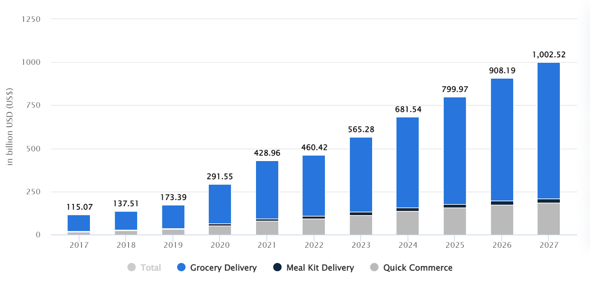
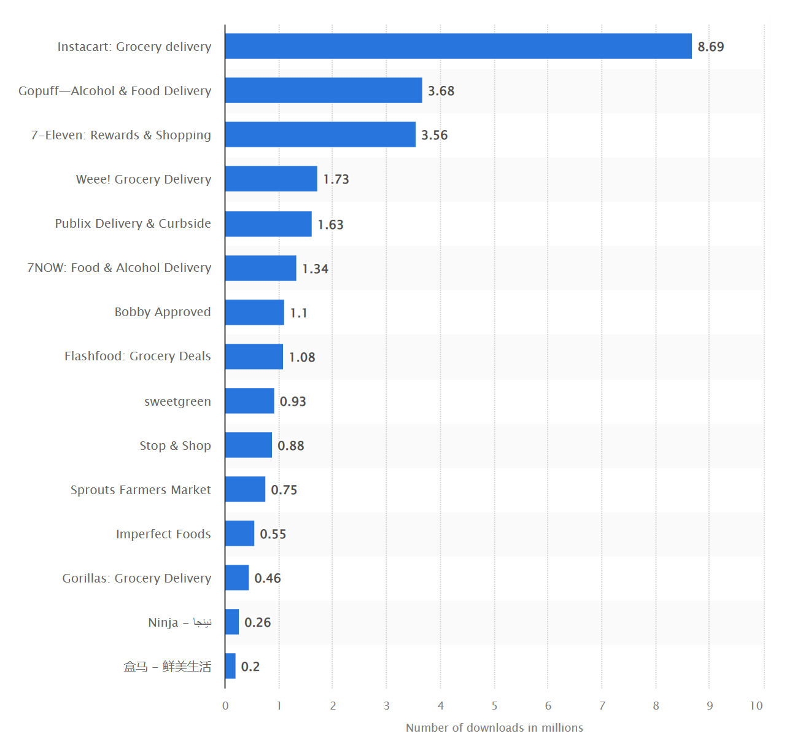
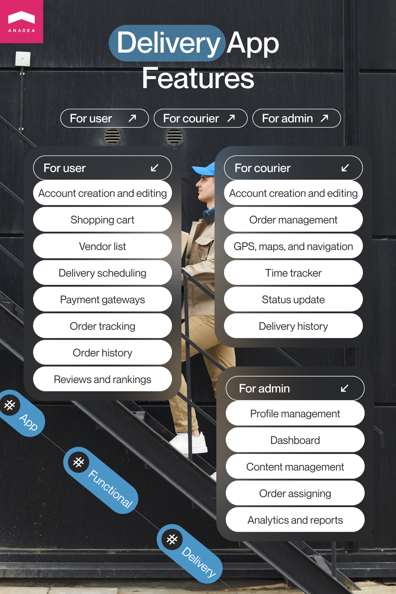
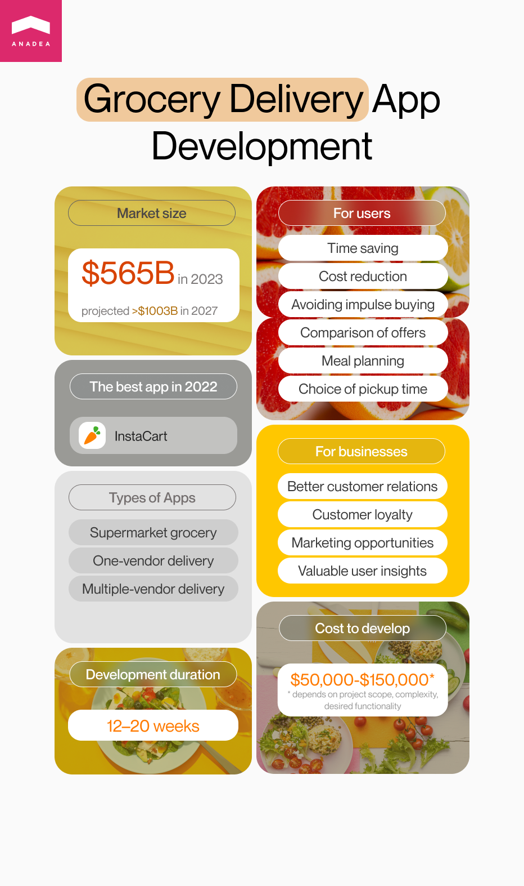
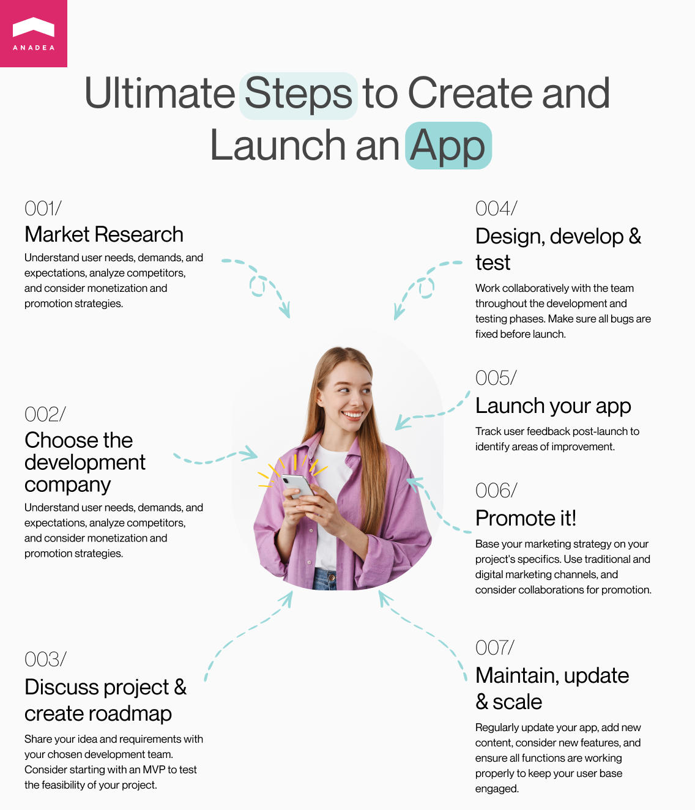

Every person knows that grocery shopping can be very exhausting and time-consuming. Moreover, you can't go and buy products at any moment that is convenient to you, an absolute majority of supermarkets do not work in a 24/7 regime. But modern technologies are here to change the game. Thanks to the new opportunities that grocery delivery app development can open to us today, the way we do shopping can be fully revolutionized. In our blog post, we want to tell you more about the peculiarities of this type of solution, mention the most popular features that you need to add to your application and share some important practical tips.

That's why if you have plans to create a grocery ordering app, this article is for you.

## Grocery delivery app market overview

To begin with, it is worth highlighting that grocery delivery services are continuously gaining popularity these days. And one of the strongest factors that had an influence on this tendency was the COVID-19 pandemic. When in 2020 a lot of governments all over the world decided to introduce lockdown measures, the majority of people in those countries had to stay at home and the only way to get products was to order delivery services.

Some people admit that the first time when they ordered food online was during the first wave of the coronavirus pandemic. Though earlier they had heard about such services, they simply hadn't had such a necessity (at least they hadn't thought that it could be comfortable for them). Though today a lot of us have already returned to traditional stores, many consumers have already gotten accustomed to online delivery services and actively use them even now, when all the pandemic restrictions are already in the past. And the recent statistics data brightly demonstrates it. The user penetration that can be observed in the segment of grocery delivery is around 18% in 2023.

As for the financial aspect, it is projected that in 2023 the <a href="https://www.statista.com/outlook/dmo/online-food-delivery/grocery-delivery/worldwide" target="_blank">revenue</a> in the grocery delivery segment worldwide will hit the mark of $565.3 billion. Though this figure already looks rather impressive, it is definitely not the highest peak. According to the estimates provided by experts, the revenue in this segment can reach $1003 billion in 2027. It means that the CAGR over the period from 2023 to 2027 will be more than 15%.

When it comes to on demand grocery delivery, we need to note that despite the fact that today a lot of companies offer their web solutions for online shopping that allow users to place orders, make payments, and track the delivery process, mobile apps are a more preferable choice for many people. The reasons for the extreme popularity of <a href="https://anadea.info/services/mobile-development" target="_blank">mobile app development</a> are very simple. It is much quicker to make an order from your smartphone than to go to your computer or laptop and switch it on. Your smartphone is always somewhere close to you. And moreover, you can make online purchases from everywhere. Even if you are stuck in a traffic jam on your way home, you can take your mobile device out of your pocket and choose the products that will soon be delivered to your place.

That's why the majority of startups and well-established companies that are interested in grocery app development prefer to launch mobile solutions. And given the level of smartphone penetration all over the world, such solutions can be targeted at a very wide audience.

To make sure that mobile on demand grocery delivery solutions boast high popularity we offer you to have a look at the data that show the number of downloads of such products in the United States in 2022.

In 2022, with more than eight million downloads, the most popular grocery ordering app in the US was InstaCart. Gopuff and 7-Eleven that followed it had 3.7 million and 3.6 million downloads respectively. At the same time, InstaCart is stably one of the most visited online grocery shopping websites in the country.

## Benefits of grocery delivery application development

The popularity of such apps becomes absolutely clear after consideration of the advantages that consumers and businesses can enjoy with them.

### Advantages of on demand grocery delivery for users

- You can save your time and can do shopping at any convenient moment.
- You can reduce your expenses as there is no need to go to the supermarket by car or use public transport.
- You can avoid impulse buying.
- You have the possibility to conveniently compare various offers and choose the best deal.
- You can better plan your meals. Moreover, as today <a href="https://anadea.info/blog/diet-and-nutrition-app-development/" target="_blank">nutrition app development</a> is also highly demanded, it is possible to use it for creating your menu or finding the right diet. Thanks to the combination of such solutions, you can get a very comfortable and easy way to keep a healthy diet and organize your nutrition.
- You can choose the most appropriate time and way of picking up your order.

### Advantages of grocery app development for businesses

- You can build better relations with your customers and boost their satisfaction.
- You can increase customer loyalty, attract new clients and retain existing ones.
- You can introduce various marketing campaigns and bonus programs via your app.
- You can get a lot of valuable information about users' needs and preferences. As a result, these insights can help you to adjust your services to users' expectations.
- Thanks to providing online services, you have the possibility to work with clients who usually avoid going to traditional supermarkets due to their busy schedules or untypical working hours.

In other words, in spite of the fact that when businesses use the services of a grocery delivery app development company or develop their software solution in-house they need to allocate a budget for such projects, such investments will definitely pay off. Grocery delivery software solutions open new opportunities for businesses and consumers and can fully reshape their traditional way of interacting with each other.

Create your app

## Types of grocery delivery apps

If you are thinking about on demand grocery delivery app development, you need to have a good understanding of the types of apps that you can choose from based on your business model.

- **Supermarket grocery app**. If you manage a supermarket or you want to offer a software product to a supermarket chain, you will need to build an app of this type. As you can understand from the name of this type of app, these products are operated by one supermarket and offer items that can be found in these stores. Very often supermarkets launch loyalty programs that unite their online and offline businesses and offer pleasant bonuses like free delivery for the participants of such programs. Walmart, Whole Foods, as well as many other supermarkets all over the world, have such applications.

- **One-vendor delivery app**. As a rule, operators of such applications do not have physical shopping facilities and they sell their products only online. Nevertheless, the idea is the same as in the first case. Users get access to an online catalog of products offered by one vendor and can order deliveries. Barakat or HappyFresh can be named among other apps in this group.

- **Multiple-vendor delivery app**. Such apps are a typical example of traditional marketplaces where users can get access to offers from multiple participants. A well-known InstaCart represents this category.

## Core features of a grocery delivery app

Below you can find a list of the key features that should be created for a grocery delivery app. Though they can have different designs and offer different ways of interacting with them, without such features an app can't be used at all.

- User's personal account creation and editing;
- Registration and login feature;
- Shopping cart;
- List of groceries;
- Delivery scheduling;
- Payment gateways;
- Order tracking;
- Order history;
- Reviews and rankings.

### Features to enhance user experience

Today the competition in the grocery delivery segment is already rather high and it is growing further. That's why you need to make sure that your application stands out from the row of similar options. To do that, you can offer unique features and various attractive deals to potential users.

- **Shopping list**. You can allow users to create their shopping lists and add items to them during a day (or week). This feature will help people to better manage their shopping process.

- **Chatbot**. Tech support is very important for shaping the right user experience. But it can be rather challenging to organize such a service in a 24/7 format and avoid long waiting times. However, a chatbot can solve the problem. Though there are some issues that can be handled only by managers, the majority of general questions can be easily answered by a chatbot. As a result, a person will quickly get all the required information and will have the possibility to continue shopping without serious interruptions.

- **AI-powered recommendations**. Such functionality can analyze users' purchase history, their preferences, and typical cart. Based on this information, a grocery ordering app can create personalized recommendations.

- **Coupons and bonuses**. People like special offers and, of course, they like when they can save money thanks to different deals and discounts. For example, you can offer a free delivery for every 5th order or a coupon for a 50% discount on some products for ordering complimentary items.

- **Push notifications**. You can notify users about upcoming special deals or remind them about their traditional time for shopping. Nevertheless, we highly recommend allowing users to customize this feature and even switch it off. Sometimes such notifications are very irritating and not all users want to receive them. But for many people, they can be helpful. And when you use them smartly, you can significantly improve user experience.

### Admin (vendor) panel features

It is vital to bear in mind that the functionality provided to admins and vendors may differ in accordance with the type of app that we are talking about (single- or multiple-vendor app). But the general set of features looks the following way:

- Profile management;
- Dashboard;
- Content management;
- Order management and assigning;
- Analytics and reports.

### Features of a delivery person app

Very often with a view to helping business to organize the delivery process in the most efficient way, a grocery app development company offers to build an app (or functionality) that will be used by delivery persons. As a rule, such apps need to include the following functionality:

- Profile registration and editing;
- Order management;
- GPS features, maps, and navigation;
- Time tracker;
- Status update;
- Delivery history.

Depending on the business model chosen by a company, delivery guys may get their payments directly via the app. In such a case, it is also required to create a digital wallet.

## Tech stack for on demand grocery delivery app development

Before we proceed to the list of tools and technologies that may be required for grocery app development, we'd like to highlight that it is a very approximate set that can vary in accordance with your app idea, functionality, and features that you will decide to add. That's why you will choose all the necessary tools already together with your grocery app development company after the team analyzes your project.

Based on our experience we can say that sometimes the chosen tech stack can be greatly changed after the market analysis. For example, it may happen that initially, a client wants to build an Android app but after market research, it can be found out that a lot of potential users have iOS devices. In this case, it will be much more sensible to create a cross-platform app. And as a result, a tech stack that was initially defined by the client will be updated.

- **Mobile development:** Swift, Kotlin, Objective C, Java
- **Frontend development:** React, Angular
- **Backend development:** Node JS, PHP
- **Database:** MySQL, MongoDB, Redis
- **Payment gateways:** Paypal, Stripe
- **Cloud Platforms:** Microsoft Azure, Google Cloud, AWS
- **Geolocation:** Google Maps, Mapbox, OpenStreetMap
- **Analytics:** Google Analytics, Keen.io, Mixpanel
- **Delivery time:** Google Matrix
- **Push notifications:** Firebase, Onesignal

## Grocery delivery app development: how much does it cost?

The development cost of any software product depends on a huge range of factors. Among them, we should mention:

- The complexity of your solution;
- The required tech stack;
- The number of integrations;
- The size of the team.

Based on our experience and general market trends, we can say that as a rule, such projects can cost around $50,000-$150,000 and their development can take from 3 to 5 months. Nevertheless, such figures are very approximate. If you choose Anadea as your grocery app development company, we will provide you with free estimates based on your project requirements. It means that you will get a full understanding of the size of your investments from the very beginning and will be able to smartly allocate your budget.

Moreover, do not forget to include marketing expenses in your budget. Your application will be intended for a wide audience and your task will be to let as many people as possible know about your solution.

## How should you organize the process of grocery app development?

One of the factors of project success is a wisely organized process of its realization. That's why, we'd like to provide you with a step-by-step guide that will help you not to miss some important points.

1. **Research the market.** When you decide to launch your own software solution, you need to analyze the market and define users' needs, demands, and expectations. It can be very helpful to analyze competitors and their products in order to understand what is done perfectly and what can be improved. Already at this step, you should start thinking about the approaches to monetization and your app promotion as they may also greatly influence the functionality of your future solution.

2. **Choose the right grocery app development company**. If you do not have in-house developers, you will need to find external experts who can build a software solution for you. It will be a good idea to establish cooperation with a company with an outstanding reputation and good history. For checking reviews and rankings, you can use such repositories as Clutch and GoodFirms. Moreover, it is highly recommended to communicate with the company's representatives before making any decisions regarding future cooperation. At Anadea, our team is always ready to answer all your questions and tell you more about our approaches and business model.

3. **Discuss your project with the team and create a roadmap**. When the team is chosen, you need to provide developers with as much information about your idea as possible. They will analyze your requirements and offer their solution. It's highly likely that after the discussion of the project with the development team, you will decide to add new functionality or, vice versa, exclude some features. Moreover, quite often we offer our clients not to build a full-scale solution from the very beginning and start with an <a href="https://anadea.info/for-clients/before-you-start/what-is-a-minimum-viable-product-and-how-to-build-an-mvp" target="_blank">MVP</a>. A minimum viable product includes only the basic features that will be enough for users to understand the idea of your solution. MVP development is an excellent way to define whether your project is worth further investments or not.

4. **Design, develop, and test your app.** After all these points are discussed, designers and programmers can start their work. Nevertheless, it doesn't mean that you as a client can't participate in this process. You can monitor the progress and share your vision. It is always easier to introduce changes as soon as such a necessity appears than to do it when everything is ready. Testing usually starts in parallel with development and also takes place when all features are built. It is important to fix all the bugs before the launch of your solution.

5. **Launch your app**. When the application is ready, you can present it to the audience. It is very important to track the feedback and analyze users' opinions in order to understand whether your solution needs any improvements.

6. **Find the best ways to promote your solution**. Your marketing strategy should be based on the peculiarities of your project. If you launch a supermarket grocery app delivery, it is obvious that you can use your existing channels and tools for promoting your app. If you launch a standalone delivery service you need to be more creative. You can establish collaboration with bloggers, rely on ads on social media, and even use some old-school tools like printed materials and TV ads.

7. **Do not ignore the necessity to maintain, update and scale your app**. Even if you see that your app was positively welcomed by customers and your user base is actively expanding, it doesn't mean that you do not need to work on it anymore. It is required to regularly update it, add new content and products, think about new features, and carefully track the correctness of their functioning.

## How to monetize your grocery ordering app?

While it is obvious that with an on demand grocery delivery service, your business already gets a new revenue source that will help you to increase your total profits, you still need to bear in mind that all your software solutions will require investments during their lifecycle. When you are planning your budget, you need to remember that you will bear expenses on support, maintenance, and regular updates of your app. That's why already at the stage of grocery delivery app development, you need to think about additional ways of making money on it.

Below you can find a couple of monetization ideas that will help your business to earn money on such a solution.

- **Advertising**. That's certainly the most well-known way to get money via a mobile or web app. The more popular your app becomes, the more brands will have the desire to promote their products via your solution.

- **Delivery fees.** Before introducing such fees, you need to deeply analyze your business model in order to understand whether you can charge customers for delivery without any damage to your reputation. Without any doubt, free delivery can be a huge competitive advantage. Nevertheless, delivery fees are a common thing. Moreover, free options can be offered as a bonus for inviting friends or buying some particular groups of products.

- **Paid functionality.** Though it is highly recommended to provide such apps to customers for free without any download fees, it doesn't mean that you can't introduce paid premium features that will enhance user experience.

- **Fees for vendors**. If you launch an app that unites multiple vendors, you can take fees from them for placing their offers on your platform.

- **Smart pricing**. This pricing strategy is based on the idea of increasing prices for products or delivery during peak hours when you can observe the highest demand. This approach can also motivate users to place orders all day long, not only at the time when the majority of users prefer to make purchases online. As a result, it will ensure an even load for your business during the day.

## Final word

Grocery delivery application development can become a very promising project for your business. Such solutions can help you not only to get a good revenue source but also to establish better relations with your customers and reach a higher level of loyalty and satisfaction.

Nevertheless, given the continuously growing competition in this segment, you need to take care not only about the idea of your app itself but also about the technical aspect. And for this reason, cooperation with a trustworthy grocery delivery app development company is a must.

At Anadea, we are always open to new projects. With our skills, knowledge, and expertise, you can be sure that you will get a solution that will go far beyond your expectations. Do not hesitate to [contact us](https://anadea.info/contacts), share your ideas, and get a project estimate!

Request a free quote

## Frequently Asked Questions

### What is a grocery delivery app?

It is a mobile (or web) application intended for purchasing and ordering groceries online. Such apps can be launched by one supermarket or vendor, as well as startups and other companies that want to unite a lot of vendors on a single platform for offering users access to multiple offers at the same time. In other words, such solutions allow people to buy products online and get them delivered without the necessity to leave home and go to traditional stores.

### Who can develop a grocery ordering app for me?

Though grocery delivery app development has its peculiarities, in general, such projects require basic mobile app development skills, which means that given the current state of the labor market, it won't be a problem to find specialists. If you do not have experts with relevant qualifications in-house, you have several options. You can either cooperate with freelancers or hire a grocery app development company. Though the rates of freelancers quite often may look rather attractive, you need to understand that this option has some disadvantages. For example, if you need to modernize your app in the future, it is possible that the person who built the application won't be available. When you work with a reliable company, there are guarantees that you will get the required services. At Anadea, we are always open to cooperation and, as a rule, our work with clients doesn't stop after the project release. We can also maintain and update your app on a regular basis.

