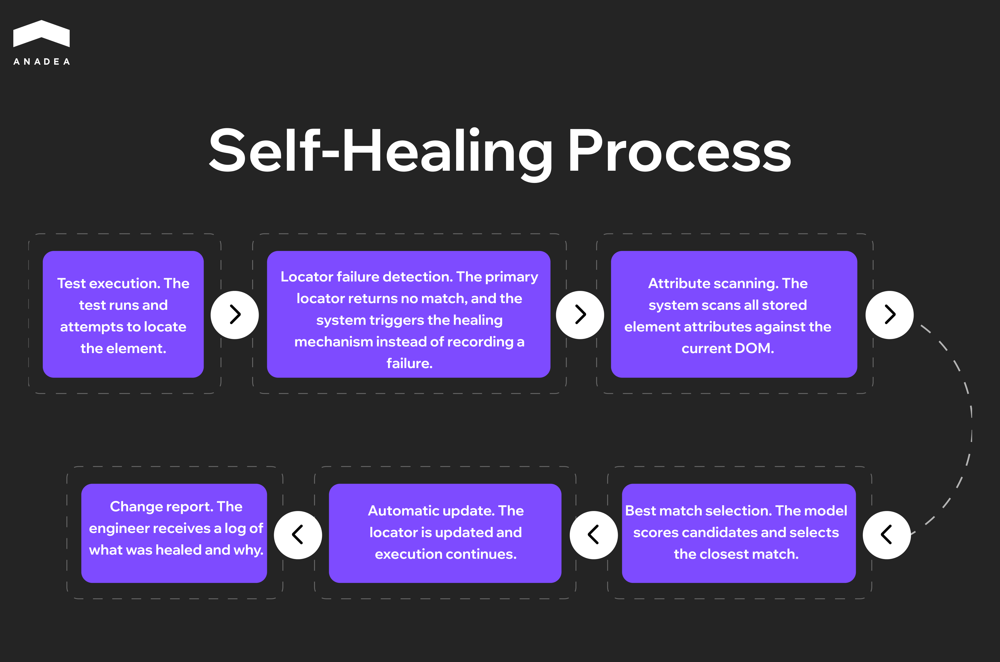
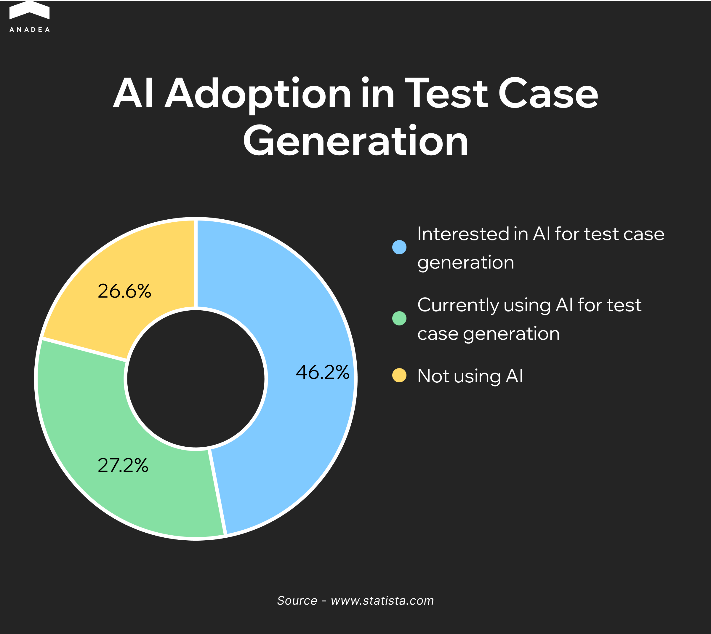
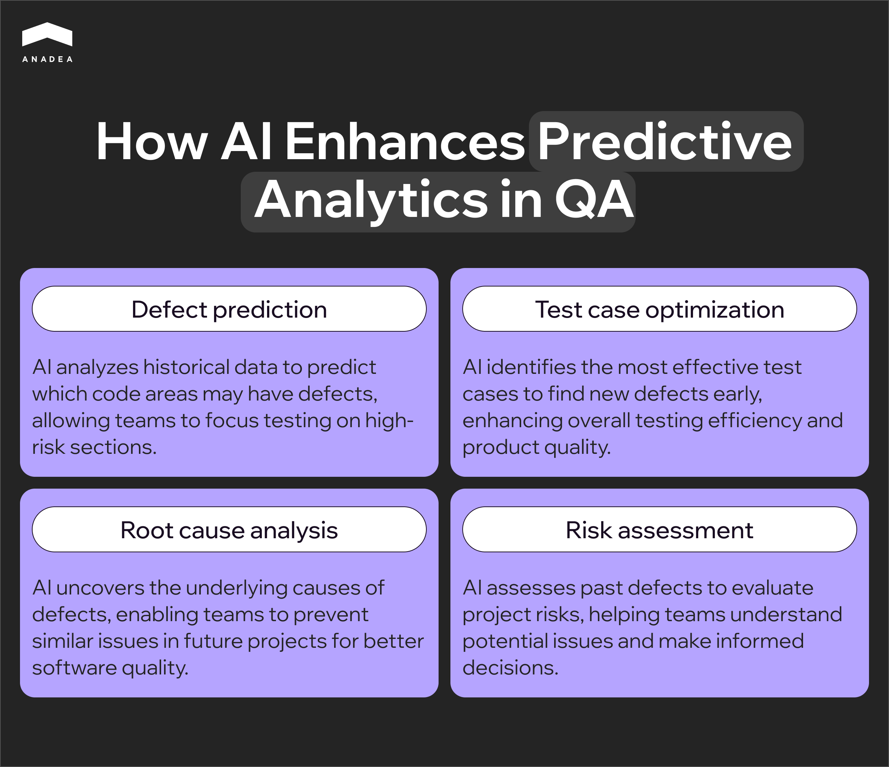
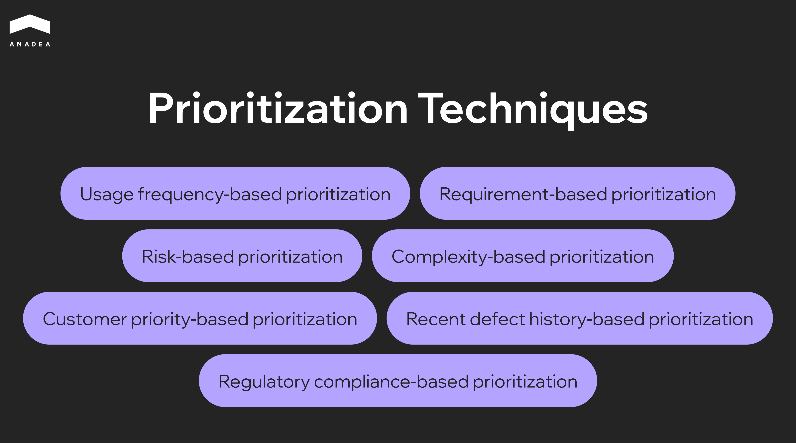

The [State of Quality Report 2025](https://katalon.com/resources-center/blog/test-automation-statistics-for-2025) surveyed more than 1,400 QA professionals and found that 72% of them already use AI for test generation and script optimization. At that scale, AI in test automation is no longer a decision teams are weighing. It is a shift that has already happened across the industry.

AI automation testing gives engineering teams the capacity to cover more ground without expanding headcount. ML-based models analyze code changes, update test cases autonomously, and determine execution priority based on risk. The practical result is faster release cycles and fewer defects reaching production. For teams looking to build that capability from the ground up,[ Anadea's AI software development services](https://anadea.info/services/ai-software-development) provide the technical foundation to implement it at scale.

This article covers how AI testing automation works in real development environments, where it delivers the most value, and how teams can approach implementation within their existing workflows.

## What Is AI Testing and How Did We Get Here?

Scripted automation traces its roots back to 2004, when Jason Huggins of ThoughtWorks released Selenium as an open-source tool. Within a few years it became the industry standard, and teams began replacing manual regression testing with automated scripts. As products grew more complex, though, a different kind of burden emerged. Scripts broke with every interface change, and engineers were spending more time repairing tests than finding actual bugs. [Capgemini found](https://pie.inc/blog/test-maintenance-cost-calculator/) that up to 50% of automation budgets go toward maintenance alone.

Data-driven and keyword-driven frameworks lowered the barrier to entry but did not change the underlying logic. A test did exactly what it was told, and only what an engineer had thought to write. Anything outside those boundaries went uncovered.

Understanding what is AI testing means recognizing that it addresses both problems at once. [Machine learning models](https://anadea.info/services/machine-learning-software-development) analyze code changes, update test cases autonomously, and identify which parts of the product carry the highest regression risk — without requiring manual input at every step. AI in software test automation brings a fundamentally different paradigm: instead of maintaining brittle scripts, teams work with systems that adapt, learn, and improve across every release cycle. According to [Rainforest QA](https://www.rainforestqa.com/blog/test-automation-maintenance), teams running Selenium and Cypress spend at least 20 hours per week on test maintenance. That is the time AI-powered tools give back to engineering.

## Core Capabilities of AI in Software Test Automation

AI in qa automation is not a single technology but a set of distinct mechanisms, each solving a specific problem. Understanding how they work individually helps teams decide where to start and where to expect the fastest results.

### Self-Healing Tests

When an engineer writes an automated test, it gets tied to a specific element on the page through a locator such as an XPath expression, a CSS selector, or an ID attribute. That binding is rigid, and it breaks whenever a developer changes the DOM structure, renames a class, or moves a component during refactoring. The test fails not because there is a defect in the product, but because the element's address has changed. On a large suite with thousands of such bindings, every sprint that includes UI changes turns into a manual repair session. According to the [Capgemini World Quality Report](https://www.quinnox.com/blogs/self-healing-test-automation/), up to 70% of QA effort can go toward exactly this.

A self-healing system stores a full profile of each element rather than a single identifier. It captures the DOM position, text content, CSS class, visual coordinates, ARIA attributes, and the element's relationship to its neighbors. When the primary locator stops working, the model does not record a failure. It cycles through the alternative signals, finds the closest match, and continues execution. The engineer receives a report of what changed rather than a wall of red tests at the start of the day.

### Intelligent Test Generation

A test case is a hypothesis about how a system might break. The broader the coverage, the higher the quality of the product at release. But people build hypotheses based on their own understanding of the product, and that understanding is always incomplete. The happy path gets covered first, obvious edge cases second, and everything else is left to chance.

AI-driven generation approaches the problem from risk rather than intuition. The model analyzes source code, API specifications, data schemas, and the history of previous defects. When it sees that a function accepts a numeric parameter, it automatically generates boundary values including zero, negative numbers, the maximum value of the type, and an invalid format. When it notices that a module has broken repeatedly after changes to a specific area, it adds the corresponding scenarios without being asked. Coverage grows alongside the product rather than falling behind it.

### Visual Testing

A functional test checks whether the logic works correctly. It does not check whether the product looks correct, and that is a separate category of defects with its own consequences. A checkout form can pass every assertion and still have a confirmation button that falls outside the viewport on small devices. Text on labels can get clipped in one browser after a font update. A dark theme can break contrast in a specific component so that text becomes unreadable against the background. No assertion catches this because the logic is intact.

Visual AI testing captures screenshots at each step of a scenario and compares them against a baseline. Unlike pixel-by-pixel comparison, which generates false positives from antialiasing and font rendering differences, an AI model understands context. It distinguishes a planned redesign from an unintended layout shift and focuses on what actually affects the user.

### Predictive Defect Analysis

Every product has modules that break more often than others. These are typically the areas with the highest rate of change, the most dependencies, or the greatest cyclomatic complexity. An experienced engineer knows these zones intuitively, but intuition does not scale across large codebases and cannot process dozens of variables simultaneously.

Predictive defect analysis formalizes that intuition. The model reads the git history, tracking which files change most frequently, how many different developers have touched a single module, and how large the most recent commit was. It then maps that data against previous defects, identifying where they appeared and what changes preceded them. Before a release, the team receives a risk score for each module showing where to concentrate testing and where a smoke suite is sufficient.

### Smart Test Prioritization

A full regression suite on a mature product takes hours to run. Running it entirely after every commit is not realistic, and selecting a subset manually is unreliable because it depends on whoever happens to remember the dependencies between modules.

Smart prioritization builds a dependency graph across components and overlays it with the map of current changes. If a developer modifies a function in the authentication module, the system identifies every component that depends on it and places the relevant tests at the front of the queue. Tests that statistically rarely surface bugs under those conditions are deferred to a scheduled overnight run. The team gets meaningful feedback within minutes of a commit and full coverage by morning.



## Key Benefits of AI-Driven Test Automation for QA Teams

The benefits of AI for QA testing and AI in test automation rarely show up all at once. They accumulate across releases and become visible at the point when the team stops fighting its tools and starts focusing on the product itself.

A regression cycle that previously took hours is now completed in minutes. Teams shipping multiple times a day get feedback before the next developer has finished opening a pull request.

The test suite stops degrading after every refactoring. Instead of accumulating technical debt in the form of broken scripts, it adapts alongside the product.

Coverage expands into the areas engineers rarely reach manually. Boundary values, unusual input combinations, system behavior under load – all of it appears in the suite without a separate backlog item.

Defects get caught at the point where fixing them costs almost nothing. Predictive analysis moves the moment of discovery from production into the development phase.

Smaller teams achieve the level of coverage that previously required a much larger QA headcount. Scale is no longer determined by the number of people on the team.

## Top Use Cases: Where AI for Test Automation Delivers the Most Value

The effectiveness of AI automation testing depends on where it is applied. Some problems respond to it almost immediately, and some workflows simply cannot scale without it. Below are four areas where the impact is most visible.

### Web and Mobile UI Regression Testing

UI regression is the part of QA that grows faster than everything else. Every new feature adds scenarios, every redesign breaks locators, and every new device or browser multiplies the volume of checks. Teams maintaining a web application and a mobile client simultaneously know how quickly this becomes the largest cost center in the entire testing process.

AI addresses two problems at once. Self-healing keeps tests stable through interface changes without requiring manual locator updates after every sprint. Visual testing catches what functional tests physically cannot see:

* Layout shifts on specific screen sizes
* Rendering differences across browsers
* Incorrect component display after design system updates

Both mechanisms run in parallel, covering different quality layers at the same time.

### API Testing

In a microservices architecture, every service depends on a contract with others — specifically what it expects to receive and what it is obligated to return. When there are only a few services, these contracts can be tracked manually. When there are dozens of them and each evolves independently, even a small change in one service's response can silently break another, and that tends to surface in production rather than before it.

AI tools analyze OpenAPI specifications and automatically generate test cases for every endpoint:

* Boundary values for parameters
* Missing required fields
* Incorrect data types
* Behavior when dependent services return unexpected responses

At the same time, they monitor real traffic between services and detect deviations from the specification before they become incidents.

### Performance Testing

Traditional load testing is built around assumptions about how many users will be active, what behavior patterns they will follow, and which endpoints to target. Those assumptions rarely match reality, and a test that passes on synthetic traffic may leave the system unprepared for how a real audience behaves during peak load.

AI tools build load profiles from production logs, drawing on actual click paths, session durations, geographic traffic distribution, and device types. Alongside that, anomaly detection tracks deviations from the baseline profile in real time, catching a slow memory leak developing during an endurance test or latency on a specific endpoint that starts climbing past a certain load threshold.

### Continuous Testing in CI/CD

Without AI in qa automation, testing and CI/CD are in constant competition for time. The more frequently a team deploys, the shorter the window between commit and release, and running a full regression suite simply does not fit. The common workaround of reducing coverage before each deployment addresses the symptom while leaving the underlying risk in place.

Smart prioritization changes the mechanics. The system builds a dependency graph across components, overlays it with the current diff, and runs only the tests that relate to the changed modules and their dependencies. The team gets meaningful feedback within minutes of a commit. The remaining tests execute asynchronously during a scheduled overnight window without blocking the pipeline. Testing becomes part of the delivery process rather than a gate that slows it down.



## How To Get Started With AI Test Automation

Most teams start with the question of which tool to choose and spend weeks stuck there. That is actually the second question. The first is always a diagnostic one — where exactly in the current process will AI deliver a measurable result within the first month, rather than a year after a full suite rewrite.

### Diagnosing by pain type

If the team spends a significant part of every sprint figuring out why tests failed after the latest UI release, the problem is not a lack of resources but fragility in the test suite itself. The entry point here is self-healing applied to the most unstable portion of existing coverage. There is no need to migrate the entire suite. Taking the 20 to 30 tests that fail most frequently and running them through an ai for test automation tool is enough to see within two weeks whether maintenance overhead is actually shrinking.

If functional tests pass cleanly but production keeps surfacing regressions after every design review, the problem is a coverage gap. Functional assertions validate logic but cannot see a layout shift on a specific viewport, a button disappearing on iOS Safari, or a CTA color change after a design system update. The right entry point is visual testing added as a layer on top of the existing framework, with no migration of the base stack required.

If the team deploys frequently but the regression suite physically does not fit inside the delivery window, forcing either reduced coverage or delayed releases, the entry point is smart test prioritization and a shift to risk-based test selection on each commit.

If writing new test cases consistently takes longer than building the feature itself and the team is always trailing behind the product pace, the entry point is AI-generated test cases from specifications or Jira tickets, with human review rather than authoring from scratch. This is precisely where using ai for automation creates the most immediate impact on team velocity.

### What to understand about the AI models under the hood

Different tools approach the self-healing problem in fundamentally different ways, and that directly determines how reliable the system will be in a given technology stack. The[ machine learning models](https://anadea.info/services/machine-learning-software-development) powering these tools vary significantly in architecture, and that architecture determines the ceiling of what the tool can actually do for your team.

The classic approach is multi-attribute scoring. When a test is recorded, the tool stores not a single element identifier but a set of attributes covering XPath, CSS selector, text content, ARIA role, relative DOM position, and visual coordinates. On the next run, the model weights all stored attributes and finds the closest match even when some of them have changed. The limitation of this approach is that the model is static. It does not learn from experience and cannot distinguish whether a change was intentional or a bug.

Mabl went further by building an adaptive feedback loop. Their agentic tester runs multiple AI models in parallel, with an ML model handling element identification and a GenAI model understanding test context and intent. When the system applies an automatic fix and the test continues catching bugs, that interaction becomes training data. When a fix causes a test to miss a regression, the system flags similar scenarios for human review in the future. One limitation Mabl is open about is worth noting here. Current systems still cannot reliably distinguish cosmetic changes from functional violations. A renamed button is cosmetic. A removed form validation is a potential bug. No system today resolves this fully without human oversight.

Applitools solves a different problem through a different method. Their Visual AI is not pixel diffing but computer vision trained on more than four billion application screens over a decade. The model does not compare pixels. It understands interface semantics, recognizing what constitutes dynamic content such as ad banners, timestamps, and personalized data, versus what should remain stable. That is precisely why the system reaches accuracy of 99.9999% in detecting genuine regressions without false positives, a result that is not achievable through pure pixel matching.

### Tool comparison by AI mechanism

<table>

<tbody>

<tr>

<td>

<strong>Tool</strong>

</td>

<td>

<strong>AI model type</strong>

</td>

<td>

<strong>What it solves</strong>

</td>

<td>

<strong>Where it excels and where it has limits</strong>

</td>

</tr>

<tr>

<td>

Mabl

</td>

<td>

Multi-model: ML for locators + GenAI for intent

</td>

<td>

Self-healing, test generation, failure triage

</td>

<td>

Strongest in autonomy; improves with experience. Enterprise pricing

</td>

</tr>

<tr>

<td>

Applitools

</td>

<td>

Computer vision trained on 4B screens

</td>

<td>

Visual regression, cross-browser and device

</td>

<td>

Most accurate for UI quality. Complements an existing framework rather than replacing it

</td>

</tr>

<tr>

<td>

Katalon

</td>

<td>

AI-assisted: self-healing locators + GPT-based generation from requirements

</td>

<td>

All-in-one across web, mobile, API, and desktop

</td>

<td>

Broadest platform coverage. AI is assistive rather than autonomous

</td>

</tr>

<tr>

<td>

Testim (Tricentis)

</td>

<td>

ML smart locators with weighted attribute scoring

</td>

<td>

Fast stabilization of UI tests

</td>

<td>

Fastest to get started with for UI. Limited flexibility for complex scenarios

</td>

</tr>

</tbody>

</table>

The fundamental difference between Mabl and Testim is not in their feature lists but in their underlying philosophy. Testim stabilizes existing tests by adapting locators. Mabl builds a system that learns alongside the application and requires progressively less intervention over time. For teams where the product is actively evolving and the UI changes every month, that distinction becomes critical somewhere between six and nine months after initial rollout.

Applitools and Katalon rarely compete directly because they solve different problems. Katalon is the right choice for teams that need a single environment without assembling a stack from separate tools. Applitools fits teams that already have automation running on Selenium or Cypress and want to add a visual validation layer without rewriting anything.

Regardless of which tool the team selects, the rollout should start with the single module carrying the highest maintenance overhead rather than a full migration. The real impact is visible within the first release cycle, and that result is what justifies expanding ai in test automation across the rest of the coverage.

## Conclusion

Teams that shifted to ai driven test automation and adopted ai for qa testing are running the same regression coverage in a fraction of the time it took a year ago, with smaller QA teams and fewer production incidents. The technology is mature enough to deliver results in the first sprint, not after a multi-month migration. If you are weighing where to start,[ our team](https://anadea.info/services/software-testing) can help you map the right entry point to your current stack.
