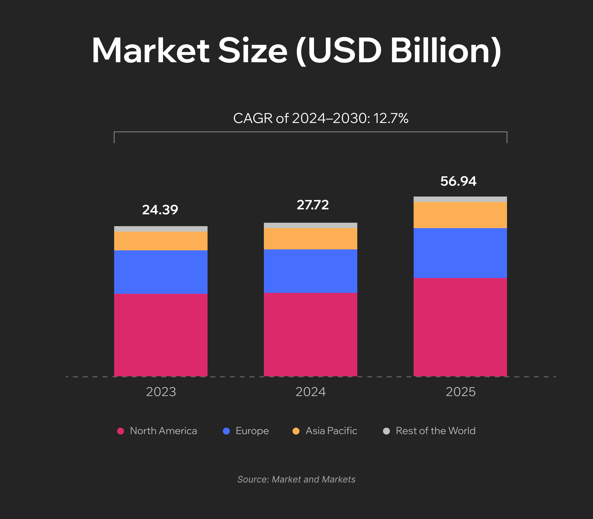

Shortages of medical staff and unequal access to healthcare leave many rural patients without timely diagnostics. These gaps can be fatal when conditions like heart failure, diabetes complications, or COPD exacerbations go unrecognized.

Remote patient monitoring is an efficient way to address these issues. Such systems enable continuous observation and early risk detection.

A [2021 study of COVID-19 patients ](https://www.valueinhealthjournal.com/article/S1098-3015(21)01749-6/fulltext)supports this finding, showing that among those monitored remotely, hospitalizations and deaths were 87% and 77% lower, respectively.

In this article, we will answer the question “How is AI used in remote patient monitoring?” and explain what you should focus on to ensure safe use of this technology. 

## Remote Healthcare Monitoring: Market Overview

Remote patient monitoring (RPM) is evolving from a niche tool into a foundation of modern care delivery.

According to the Markets and Markets report, the value of the[ remote patient monitoring market in 2024 was estimated at $27.72 billion](https://www.marketsandmarkets.com/Market-Reports/remote-patient-monitoring-market-77155492.html). It is projected to reach $56.94 billion by 2030. The increasing number of chronic disease cases and the demand for telehealth services are among the key market drivers.

Today, RPM systems can integrate multiple flows of medical data, including physical, physiologic, behavioral, and contextual parameters. Real-time data collection and processing help medical professionals efficiently manage chronic conditions and support recovery.

### What Diseases and Conditions Can Be Managed via RPM Solutions?

Modern remote healthcare monitoring systems cover a wide range of use cases:

* **Hypertension**. Continuous blood pressure monitoring helps clinicians adjust therapy to the ongoing patients' conditions and reduce the need for in-office visits.
* **Heart failure.** Remote patient monitoring devices can track daily weight, blood pressure, and developing symptoms to ensure early risk detection. 
* **Diabetes.** Connected glucometers and continuous glucose monitors (CGM) send data to centralized platforms for personalized feedback and medication adjustments.
* **Chronic obstructive pulmonary disease (COPD).** Pulse oximetry, spirometry, and symptom reports allow doctors not to miss the earlier signs of exacerbations.
* **Post-surgery rehabilitation**. Temperature patches, wound images, and activity tracking help detect complications and reduce readmissions.
* **Maternal health**. RPM can also support prenatal and postpartum care. Such patient monitoring solutions help track blood pressure, weight, and glucose levels, especially in high-risk pregnancies.
* **Behavioral health**. Digital tools can capture mood, sleep, medication adherence, and self-reported symptoms so that patients can get timely support.

### Data Sources: Where Does the Data Come From?

Thanks to the advancements made in sensor technology, connectivity, and interoperability standards, remote patient monitoring systems can accumulate data from various devices and sources.

* **Wearable devices.** Photoplethysmography (PPG) and electrocardiography (ECG) sensors track heart rate, rhythm, and activity.
* **Connected remote health monitoring devices.** Smart blood pressure cuffs, weight scales, glucometers, CGMs, pulse oximeters, and spirometers provide real-time physiologic data.
* **Temperature and medication sensors**. Temperature patches and adherence trackers efficiently enhance clinical visibility.
* **Patient-reported outcomes**. Digital questionnaires can capture symptoms, mood, pain, and functional status. This helps to add clinical context, which goes beyond sensor data.

## How Does AI Assist in Remote Patient Monitoring?	

Artificial intelligence now plays an important role in making remote patient monitoring more efficient and scalable. AI transforms raw sensor data into real-time clinical insights. This technology can also be applied to automate data processing and personalize engagement.

Let's take a closer look at the use cases of AI in remote patient monitoring.

### AI-Driven Data Pipelines

AI and advanced signal processing are the foundation of modern RPM systems. Algorithms perform signal cleaning and artifact removal. They filter out noise from movement, sensor misplacement, or environmental interference in PPG, ECG, and other health data. Machine learning also supports calibration of remote patient monitoring devices.

Nevertheless, data gaps are inevitable, even in the most advanced patient monitoring solutions. For instance, a device might lose connectivity, or patients may forget to wear their sensors. AI powers missing data handling methods, such as imputation and interpolation. It means that gaps are filled based on estimated values based on available information or known data points.

### Accurate Anomaly and Pattern Detection

When data is clean and standardized, AI models continuously track the appearance of clinically meaningful changes. Anomaly detection algorithms can identify data that deviates from a patient's normal baseline. Quite often, it can happen even before any parameters reach critical thresholds. 

Trend change analysis enables early recognition of gradual physiological shifts (like a rising resting heart rate or declining activity level) that may indicate deterioration. 

Thanks to processing multiple signals, AI monitoring tools can generate a reliable picture of a patient's health status.

For example, [AliveCor](https://alivecor.com/products) offers a mobile hardware and software system that allows patients to record ECGs at home and share them with clinicians. Data collection is performed using portable Kardia devices that are even lighter than a smartphone. AI algorithms analyze the ECG trace to detect arrhythmias and allow rapid remote cardiac monitoring.

### AI-Driven Predictions

AI-driven predictive analytics drives the shift from reactive to proactive care.

Predictive models estimate short-term deterioration risk and alert medical teams about early signs of decompensation in chronic conditions. They also calculate exacerbation and readmission risks and help healthcare organizations allocate resources efficiently.

In diabetes management, glycemic forecasting algorithms predict future glucose levels, empowering patients and clinicians to make timely adjustments to therapy and diet.

A good example is [Control-IQ+](https://www.tandemdiabetes.com/products/automated-insulin-delivery/control-iq-plus) by Tandem Diabetes. It leverages a predictive control algorithm to dynamically adjust insulin delivery. This functionality helps maintain stable glucose levels and makes diabetes management easier.

### Patient Triage

A single healthcare organization can collect thousands of patient data points daily. These volumes are impossible to process manually. Due to this, some really serious cases that require immediate intervention can be overlooked. AI addresses such issues. It helps medical staff prioritize cases effectively.

Risk stratification models categorize patients by near-term risk level. As a result, high-risk cases receive immediate attention. Automated triage dashboards organize these insights into prioritization queues.

Workflow intelligence automates escalation and routes urgent cases directly to nurses, physicians, or emergency teams when thresholds are crossed.

One of the companies that offers such technology is KangarooHealth. It develops an AI-powered remote patient monitoring platform and early health risk detection functionality solutions. Two tools, ChannelFlow and HOP, were [launched](https://www.nurseregistry.com/blog/kangaroohealth-covid-19-monitoring-solutions/) in 2020 amid the COVID-19 outbreak. They were intended for remote coronavirus risk monitoring and early virtual triage. The key goal behind their introduction was the identification of critical moments for care escalation and the reduction of unnecessary emergency room visits.

### Patient Engagement

The role of patient participation in their own treatment can't be underestimated. And AI facilitates this.

Adaptive nudging algorithms adjust reminders and feedback based on individual behavior patterns.  

Educational content is dynamically tailored to each patient's literacy level, age, condition stage, and motivation.

Conversational chatbots handle routine questions, collect symptom updates, and provide continuous touchpoints between visits. At the same time, motivational prompts and empathy-driven interactions help patients sustain adherence and remain active participants in their own care.

### Clinician Enablement

Despite concerns of some medical specialists that AI can replace them, this scenario is highly unlikely in our reality now. AI patient monitoring aims to support clinicians and automate many time-consuming processes. 

AI models can successfully extract key information from datasets to create structured summaries. Natural language processing is used to convert unstructured notes into standardized documentation. At the same time, visualization tools help highlight trends and treatment outcomes.

### Impact Measurement

Measuring the impact of patient monitoring solutions is essential for further enhancements of such systems. AI plays a central role in outcome attribution.

Cohorting algorithms group patients with similar characteristics, which enables fair comparisons and performance analysis. At the same time, benchmarking tools track performance across time and against external standards.



## Safe Use of AI in Remote Patient Monitoring

The use of AI technologies is associated with increased risks of bias, data breaches, and a lack of liability for wrong decisions. When it comes to healthcare, the consequences of unethical or irresponsible use of AI can lead to serious consequences, from loss of sensitive patient data to threats to people's lives.

AI-driven RPM systems combine advanced technologies, such as LLMs, NLP, and computer vision. Here are some practical recommendations on how to ensure that they are deployed and used safely.

### Summarization of Multi-Sensor Data with Guardrails

Remote patient monitoring devices, like blood pressure cuffs, glucose monitors, and wearables, collect data of different types. AI tools can turn all this information into short summaries for clinicians. This helps medical teams focus on what matters most.

To keep this process safe, guardrails are critical. AI should only use verified data to prepare these summaries. But apart from this, all AI outputs must always be reviewed by a human before being added to the medical record. Clinicians must remain the final decision-makers.

### Helping Patients with Questions and Self-Care

Conversational AI can play a valuable role in patient engagement. It can answer common questions about device setup or symptom tracking. AI can also deliver gentle coaching, remind patients about daily monitoring tasks, and reinforce positive habits.

However, you should set clear limits for such a system. For example, when a patient's question touches on diagnosis or medication adjustment, AI must immediately refer this person to a doctor or nurse. 

### Document Automation for Administrative Efficiency

Many RPM processes are related to documentation. AI solutions can automate various repetitive text-based tasks, such as generating prior authorization requests. For instance, after a clinician approves an insulin dose change, the system can automatically update related documentation and notify the caregivers.

This augmented documentation accelerates administrative workflows. But clinicians should stay in control of content and approvals. Every auto-generated document should be reviewed.

### Data Privacy and Hallucination Mitigation

As AI tools deal with sensitive information, it is crucial to make sure that they handle it in a proper way. Solutions used in healthcare must comply with HIPAA (or equivalent privacy frameworks in a particular region). Patient data must be anonymized and securely stored. Apart from this, it can't be used for unauthorized model training.

Equally important is minimizing the cases of hallucinations, when AI produces information that isn't true or isn't supported by real data. This risk is mitigated through fine-tuning on validated medical data. Nevertheless, human review for all clinical-facing communications is still a must.

## Anadea's Expertise in AI Development 

When you are planning to launch an AI-driven RPM system, it is crucial to make sure that your development team has the required skills and knowledge. In this case, the team should have not only technical strength but also a deep understanding of the healthcare domain.

At Anadea, we have both. Our company started its journey in the software development industry more than 25 years ago. Since that time, we have worked with customers from different sectors, including highly regulated ones, such as healthcare.

For more than 6 years, our team has focused on AI development, which has allowed us to accumulate unique expertise in this field. Our [medical app development ](https://anadea.info/solutions/medical-app-development)team creates advanced solutions that help healthcare organizations transform their processes and deliver quality care to patients.

We offer flexible collaboration models and can help you with healthcare projects of any complexity, from simple appointment scheduling apps to [EHR systems](https://anadea.info/solutions/medical-app-development/emr-ehr-development) and AI-powered RPM solutions.

## Final Word

Artificial intelligence is transforming practically every step of remote patient monitoring, from data collection to report generation. Once, the functionality of patient monitoring tools was limited to tracking vitals. Now, thanks to AI, such systems can detect subtle health changes and predict deterioration. AI-driven insights support clinicians in making more accurate decisions and offering more efficient treatment plans.

As a result, an AI monitoring system can deliver significantly better outcomes and help to build a new, patient-centered model of healthcare.

Have any questions about the development of AI medical solutions, or already have an idea for your next project? Don't hesitate to [contact us](https://anadea.info/free-project-estimate)! Our experts will attentively review your request and offer the best way to address your needs.
