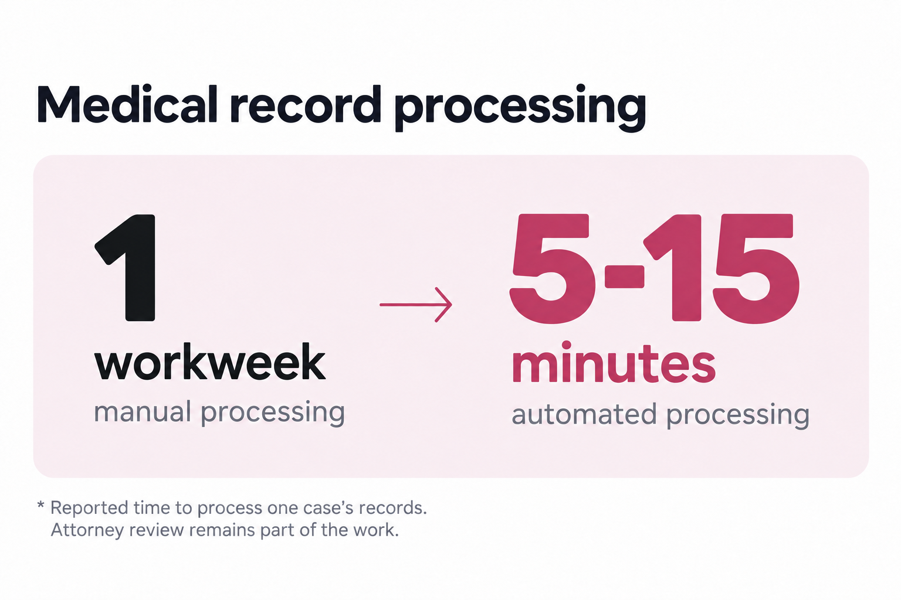
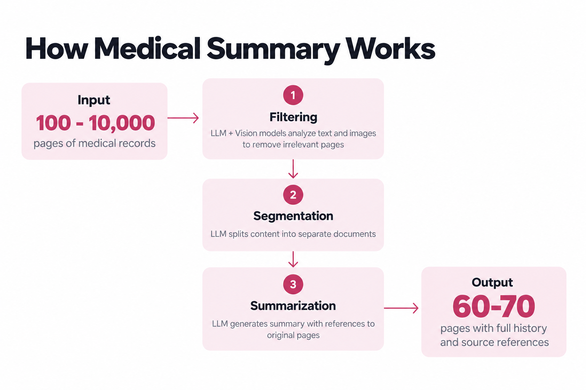
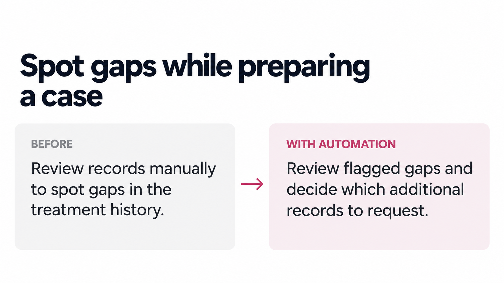
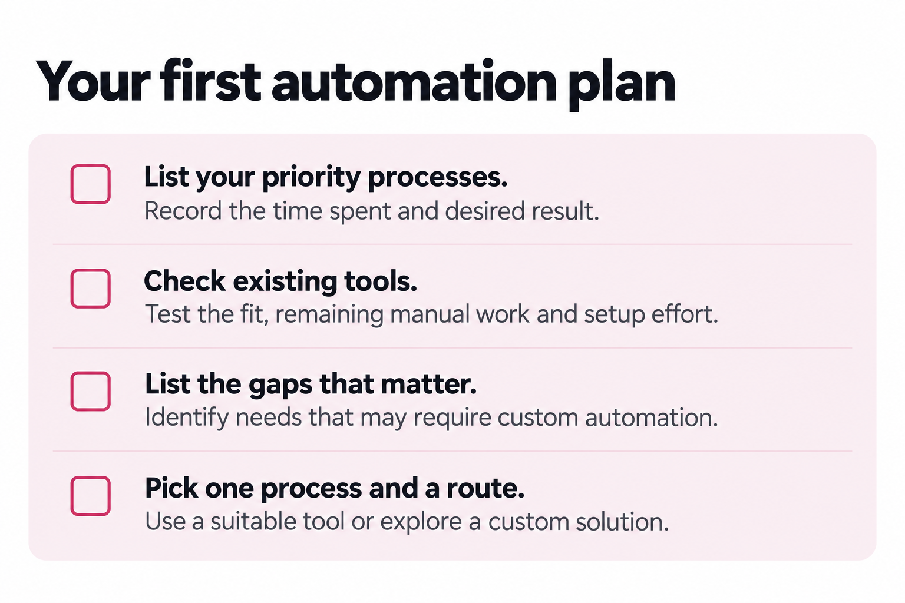

  <svg xmlns="http://www.w3.org/2000/svg" viewBox="0 0 24 24"

\    fill="none" stroke="currentColor" stroke-width="1.7"

\    stroke-linecap="round" stroke-linejoin="round"

\    aria-hidden="true" focusable="false">

\    <circle cx="12" cy="12" r="9" />

\    <path d="M12 7v5l3 2" />

  </svg>

  4 min read

AI is changing what law firms can get done with the time and people they have. That’s an opportunity worth acting on.

A new case brings a familiar round of work. Documents need to be reviewed, missing records requested, dates checked and the latest details entered into the right systems. Each task has a purpose. But across a busy caseload, keeping all that information in order can take hours out of the day before your team gets to the questions that need their judgment. 

AI and automation are opening up new ways to handle repetitive work. For your firm, that is a chance to move cases forward faster and spend more time with clients. 

Here are three examples already in use in legal practice. 

## 1. Process large document sets faster

At Liner Legal, a US law firm specializing in disability benefits, a client’s medical records often run to more than 1,000 pages. Reviewing them manually could take a full workweek.

The system reads scanned documents and handwritten notes, then organizes the information by date, diagnosis, doctor, and facility. Attorneys start with a structured Medical Summary. Every fact links back to the source so they can verify it.

## 2. Track case statuses and hearing dates

To keep a case up to date, someone has to check the government portal, copy changes into the firm's CRM systems, email the people involved with the details each person needs, and set calendar reminders. If a hearing is rescheduled, the records, messages and reminders all need attention again. A mistyped date or missed notification can leave people working with outdated information.

The automation handles this sequence: it checks the Social Security Administration (SSA) portal for changes to case statuses and hearing schedules, updates the relevant CRM records, sends email notifications and adds calendar reminders. This means **less information to re-enter and fewer opportunities for a manual error or forgotten notification** as updates move between systems and people.

## 3. Spot gaps while preparing a case

A medical history may mention an injury but lack treatment records for the relevant period. Those gaps need to be spotted while the team is gathering evidence for the hearing.

The Exhibits module extracts information about physicians and treatment periods, then flags gaps in the timeline. The team can see **what information may be missing and decide which additional records to request**.

Your practice may work with different documents. Look for tasks where people repeatedly review files to pull together the same information: automation can prepare it for review.

Read the full case study with the client's testimonial

## Find your firm's best starting point

**You are the expert in your business.** You and your team know these processes best. List the recurring work that matters most, the time it takes and the result you want.

Research your current software and **off-the-shelf tools**. Test a real task: how much manual work remains, and how does the time saved compare with setup cost and effort?

Put important needs those tools cannot meet on a separate list. Consider **custom automation** for these: a solution built around your process. Then choose one worthwhile improvement, using an existing tool or exploring a custom solution.

You don't need a technical background to take the next step. We can help you shorten the search: identify what existing tools can cover, where custom automation may help and a practical place to start. 


