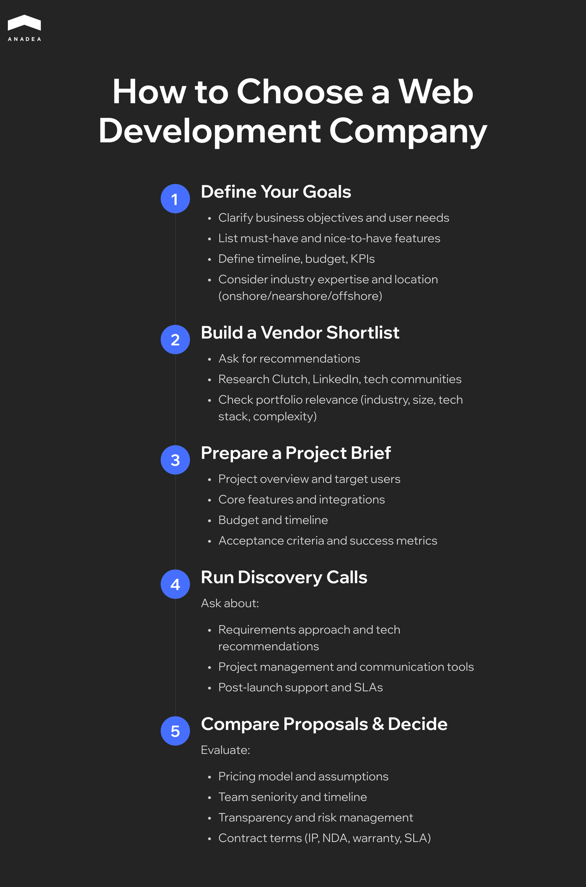

As of November 2025, the number of web development companies listed on [Clutch](https://clutch.co/web-developers) has reached 85,053. The majority of them focus on web design (41,522), custom software development (28,583), and e-commerce solutions (23,064). Meanwhile, amid the growing demand, there are also companies that specialize in AI development and consulting. Many firms highlight cross-industry expertise as they work with clients in sectors such as fintech, healthcare, education, and others. 

Thanks to this diversification, it is possible to select a development partner that will be able to perfectly address your needs. But how to find a good web development company and make the right choice? That's what we will talk about in this article.

## How to Choose a Web Development Company: Key Steps

Whether you are building a custom web solution or need to upgrade an existing one, finding the right tech partner is one of the most critical decisions for your business. The best web development team should understand your goals and have the required technical expertise to bring your vision to life. 

A structured evaluation of potential candidates is a must. To facilitate this process, we have prepared a step-by-step plan that you can rely on.

### Step 1. Define Your Goals and Constraints

Even before thinking about how to choose a website developer or a partner to build another type of web solution, you need to define your business objectives and project scope:

* What specific outcomes do you expect your website or app to achieve?
* What is your target audience?
* What metrics will help you measure success (conversion rates, engagement, lead quality, etc.)?
* What must-have and nice-to-have features will your product have?
* Do you have any specific timeframes? Do you need to align your project with a marketing campaign, seasonal demand, or other events?
* What is your budget?

The answers to these questions will help you understand what kind of partner best fits your needs. For instance, if you just need to refresh the UI on your existing website, you can cooperate with a web design studio. However, for complex products, unique [frontend solutions](https://anadea.info/services/web-development/front-end), or custom backend systems, you will need to hire a web development agency. In this case, your partner should be able to cover all the steps of the project delivery, from strategic planning to maintenance.

Look for teams with experience in your industry. Domain knowledge often speeds up decision-making and improves outcomes.

In addition to all this, you should think about geographical fit. When you hire a local (onshore) team, it can be easier to communicate with your developers as you will have the same time zone. At the same time, cooperation with offshore or nearshore partners can help you reduce costs.

### Step 2. Create a List of Potential Candidates

Once you define your goals and the vendor type you need, you should prepare a list of potential candidates. You can start with referrals and personal recommendations that you can get from your colleagues or business partners. Apart from this, you can explore LinkedIn, GitHub, and Clutch. These platforms will help you identify companies with strong client feedback and verified project histories. 

You should examine each company's portfolio relevance. It is recommended to look for projects that are similar to yours in several aspects, like complexity and technology stack.

### Step 3. Prepare a Structured Project Brief

Before contacting your potential partners, you need to create a clear project brief. Based on it, vendors will prepare their proposals. 

What should your brief include?

* **Project overview**. Outline the project scope, target users, key user flows, and essential features. 
* **Integrations**. Specify your systems and platforms that your solutions must be connected to (like CRM tools, marketing automation, payment gateways, ERP systems, etc.).
* **Non-functional requirements**. The list of these requirements should cover performance benchmarks, security standards, scalability expectations, compliance obligations, and accessibility guidelines.
* **SEO, analytics, and content**. Define your SEO needs (website structure, redirects, schema markup, and any content migration requirements) and analytics tracking goals.
* **Budget and timeline**. Provide budget guidance and outline timeline constraints, including key milestones or seasonal launch windows.
* **Acceptance criteria and success metrics**. Explain acceptance criteria for deliverables, KPIs, and other metrics that will help evaluate whether the project meets your objectives. This will help you avoid misunderstandings and set a foundation for accountability.

### Step 4. Schedule Discovery Calls

Once you shortlist vendors and formulate project requirements, it's necessary to schedule discovery calls with teams. Such calls provide a good opportunity to validate their expertise and approach to web development. Here are some of the questions that you should ask to get important information for consideration: 

* How do different teams work with project requirements? Do they challenge assumptions?
* Can they recommend a particular technical stack for your project? What are the reasons behind this choice? Does it align with your needs?
* How are project management processes organized? What tools are used for communication with clients? How does the team report the progress?
* What is their QA process? Do they use automated testing, staging environments, CI/CD pipelines, and user acceptance testing (UAT)? 
* Are SEO and accessibility considerations (architecture, metadata, semantic HTML, and compliance with WCAG standards) integrated into development?
* What security measures (code reviews, dependency scanning, etc.) are implemented?
* Is post-launch support provided? Discuss service-level agreements (SLAs), warranty periods, and ongoing maintenance.
* Who will be the owner of the code, intellectual property, design files, and cloud accounts?

Full transparency in these aspects will ensure successful cooperation at all stages of project realization and help avoid misunderstandings with your development team.

### Step 5. Analyze Proposals and Make Your Choice

To make up your mind, you should compare the received proposals. It's crucial to take into account all the factors and aspects (price, expertise, etc.) not separately, but in combination, and find the best balance between them.

Pay attention to:

* **Pricing models**. Fixed price is a good option for well-defined scopes, but this model is less flexible for changes. The time and materials model is less predictable. But at the same time, it ensures agility for evolving projects where priorities shift.
* **Payments and milestones**. Review payment schedules and any retention policies. When payments are tied to deliverables, it is easier to ensure accountability and progress tracking.
  **Transparency**. It’s vital to get estimates that clearly outline assumptions, exclusions, and risk buffers. 
* **Team and timeline**. Examine team composition and seniority levels, as well as the set timelines.
* **Contract essentials.** Review the contract carefully. It should clearly define intellectual property ownership, confidentiality (NDA), warranty, service-level agreements (SLAs), acceptance criteria, termination rights, and data protection terms.

To minimize your risks, you can start with a small paid discovery phase or pilot sprint. This will help you assess collaboration style and technical skills before signing a full contract.



## Red Flags in Choosing a Web Software Development Partner

When thinking about how to find a good web developer, businesses are often too concentrated on some fundamental factors like prices or engagement models, but ignore a lot of alarming signs. That's why we'd like to share a list of the so-called "red flags" that, if detected, should encourage you to consider another company.

### Vague or Unrealistic Promises

If a company that you want to work with provides only generic proposals with unclear cost estimates, this cooperation may turn out to be inefficient. A reliable team should attentively analyze your requirements and clearly outline the project scope, timelines, pricing model, and measurable goals. Ambiguity often indicates a lack of expertise or hidden costs.

### No Quality Assurance and SEO Considerations

A professional website developers company should not limit its expertise to design and coding. Apart from this, its experts should also have strong skills in testing, accessibility practices, as well as website analytics integration. If these steps are skipped, this can result in performance issues and limited visibility.

### Overpromised Timelines

If your potential tech partner claims that your advanced web solution can be fully ready for release in two to three weeks, it's a warning sign. When it comes to feature-rich web software with complex integrations, timelines of 6-8 months are much more realistic. A credible company will never try to deceive its clients with overly ambitious scheduling that can further lead to serious delays. 

### Limited Transparency around Ownership and Hosting

Some software development agencies can restrict access to your own codebase or insist on hosting under their control. This situation creates vendor lock-in and seriously limits your flexibility in managing your software. When choosing a development partner, make sure that you will retain full ownership of your software code and data, and that you won't have any problems migrating to another hosting if needed.

### Poorly Structured Project Management

If the company under consideration doesn't have dedicated project managers and any coordination practices in force, this can result in budget overruns, software delivery delays, and misalignment with your vision. Professional teams always maintain clear workflows and accountability checkpoints. 

## Anadea's Expertise in Custom Web Development

If you are looking for a reliable [custom web development partner](https://anadea.info/services/web-development), at Anadea, we are always ready to provide you with our professional help. Our company was founded more than 25 years ago. And over this period of time, the total number of successfully delivered projects has already exceeded 600. 

The team has solid expertise in working with web solutions of different complexity, from simple websites to advanced products like a real estate marketplace, an invoice financing platform, and a custom web platform for fraud detection.

We always pay a lot of attention to aspects such as quality assurance and web accessibility. For us, it is crucial to make sure that your web solutions will be secure, highly performant, and accessible to a wide audience.

In case you have any questions about our services or experience, do not hesitate to [contact us](https://anadea.info/contacts). Our experts will provide all the necessary information and explain our approaches to custom web development.

## Final Word

The selection of the right vendor is the first step that will shape the success of your project. Define your project goals, review portfolios, and assess technical expertise. This will help you find a team that matches your vision and business needs.

The best tech partner for you is not just a company that can deliver a functional web solution. This team should also understand your audience and support your growth with a future-ready strategy. Take the time to research and compare the available options. With a reliable web development company by your side, you will achieve your goals faster and build a strong digital presence.
