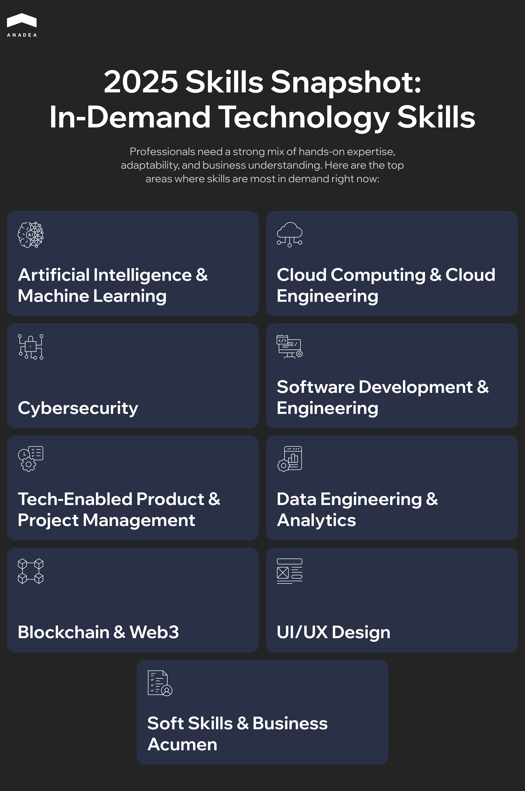

According to the [Morgan McKinley Global Workplace Trends 2025](https://www.morganmckinley.com/article/top-technology-skills-in-demand) report, 77% of businesses struggled to find skilled candidates over the last year. And technology is one of the sectors where the largest number of employers face difficulties, particularly when it comes to in-demand skills, including AI and ML, blockchain, and cybersecurity.

Are you also struggling to meet tight deadlines due to insufficient in-house resources? Or do you need to postpone your projects powered by emerging technologies like artificial intelligence because of the lack of relevant expertise? In such situations, cooperation with a professional software development partner can be a feasible option.

In this article, we will share practical tips on how to choose a software development partner and build a collaboration that will deliver value in the long term.

## Step 1. Define Your Goals

Even before you start considering your potential product development partners, you should clearly formulate the project goals and the outcomes that you want to achieve.

Define your success metrics and operational constraints, such as timeline, budget, compliance requirements, supported platforms, and integration dependencies. This will ensure that all technical decisions made in this software development partnership will be tied to measurable business value.

If you already have a good understanding of the functionality of your future product, prioritize must-have features and nice-to-have enhancements that will be added in later releases. Establishing clear scope guardrails helps prevent uncontrolled growth or unnecessary complexity during the initial development cycles.

Based on our 25-year practical experience in [custom software development](https://anadea.info/services/custom-software-development), we recommend that you document a precise problem statement and identify your target users at this step. It is vital to include not only functional, but also non-functional requirements such as performance, scalability, resilience, availability, and data security standards. These criteria will influence your technology choices.

## Step 2. Choose the Most Appropriate Engagement Model

Your engagement model should be chosen in alignment with your internal capabilities and time-to-market expectations. There are several models that you can choose from: 

* IT staff augmentation is a suitable model for rapid talent scaling and filling skill gaps within your in-house team. You can hire individual developers or a dedicated team of experts who will help you speed up software creation. While these experts are employed by your software development partner, you will fully manage and control their work.
* Project-based outsourcing allows you to delegate the entire project delivery to a vendor. In this model, your software engineering partner manages every stage of software development and ensures the project achieves its intended outcomes.

Each model offers unique advantages. Only your operational priorities will determine the best fit.

Apart from this, you need to evaluate outsourcing jurisdictions to decide on whether you will work with an onshore, nearshore, or offshore partner. Consider such factors as:

* Time zone overlap;
* communication convenience;
* cultural alignment;
* budget constraints.

Onshore teams offer great convenience in communication, but rates are usually higher. The offshore model can be cost-effective. But this approach to cooperation may require stronger management and more structured communication. At the same time, nearshore teams provide a balance of proximity and pricing. 

## Step 3. Build a High-Quality Vendor Shortlist

We recommend using only verifiable sources when searching for vendors. You can use the following sources:

* Referrals from industry peers who have executed similar projects;
* detailed case studies that showcase measurable results and problem-solving depth;
* open-source contributions that indicate engineering expertise and community involvement;
* developer communities, tech meetups, and knowledge-sharing platforms;
* industry-specific events, panels, conferences, and hackathons;
* directories (for example, Clutch or G2), which provide reviews and client testimonials.

You should filter vendors based on various factors, such as company stability, the range of offered services, tech stack, and the availability of particular skills. It is also vital to pay attention to domain expertise and vendors' track record with comparable projects. For example, if you are looking for a vendor that will help you [start a SaaS business](https://anadea.info/blog/start-a-saas-business/), this company should have relevant experience.

## Step 4. Prepare a Clear Brief for Vendors

When you contact your potential software development partners, you should have a well-formulated brief. It should contain enough details for vendors to evaluate your project and offer the right technical approach. A clear brief includes all the key information about your project, such as business goals, expected outcomes, compliance requirements, integration points, constraints, etc.

Based on this data, companies will create their proposals, with budget and timeline estimations. Moreover, the detailed description of your needs and expectations will help vendors offer the most appropriate pricing model for this app development partnership.

## Step 5. Compare the Received Proposals

When choosing a software product development partner, a lot of businesses focus mainly on the financial side of the question. Though the budget aspect is crucial, overconcentration on it may cause you to skip other critical factors.

Here's what you should also pay attention to:

* The team's understanding of your business context;
* product thinking;
* technical depth and architectural competence;
* delivery process;
* project management approaches (vital for project-based outsourcing);
* communication quality;
* cultural fit;
* security and compliance maturity.
* flexibility.

In addition to project estimates, you can also ask candidates to share some artifacts that will help you better understand whether chosen vendors can provide the expected quality of work.

Here's what you can ask for:

* Sample code;
* high-level architecture sketch;
* test strategy and QA flow;
* CI/CD overview;
* security controls.

With such artifacts, your in-house tech experts can evaluate not only the software's functionality. They can also analyze its security, stability, and maintainability, which are vital for future product growth and development.

A software development partner should be chosen based on a range of factors and parameters that should represent a reasonable price-quality ratio.



## How to Minimize Risks in Establishing Cooperation with a Software Development Partner

Once you choose the best partner for your project, there are still some things to do before you proceed to the active phase of your collaboration.

1. To avoid wasting your time and money on inefficient cooperation, we recommend you begin your partnership with a new vendor with small-scale engagement to validate technical capabilities and communication with the team. Even for a small task, closely monitor delivery quality and risk management.
2. If you want to ensure seamless interaction with the vendor's developers, you need to define clear reporting formats and escalation paths. You can use tools like Jira, Confluence, GitHub/GitLab, Slack, or Teams for transparent project tracking.
3. Always think about legal protection in advance. Sign NDAs and IP agreements to protect intellectual property. SLAs and warranties should be included in contracts. Don't forget to specify exit clauses and knowledge transfer requirements in case of disengagement.

## Potential Software Development Partners: Warning Signs

It's vital to identify red flags of a software development partnership as soon as possible. This will minimize the risks of wasting your time and money due to making the wrong choice. Let's closely consider the warning signs that you can detect at the stage of vendor evaluation.

* **Overly generic proposals**. High-level proposals that don't address your specific problem space are often a sign of a limited domain understanding.
* **No access to real-life case studies and references**. Trustworthy partners can provide verifiable client stories and direct references so that you can verify their expertise.
* **No involvement of technical leadership in communication.** If the team refuses to bring technical experts into conversations, it's a potential red flag. Project discussions shouldn't be handled only by sales representatives. You should have the possibility to communicate directly with development team members or managers.
* **Unrealistic timelines**. Overpromising early deadlines is a typical sign of inexperience. Such timelines are often set when teams skip discovery and ignore technical complexity or potential risks.
* **Security or compliance gaps**. An underdeveloped security framework is a major risk, especially when you are building a product that will operate in a regulated sector. Lack of industry-recognized certifications, such as ISO 27001, SOC 2, HIPAA, or GDPR compliance, should discourage you from partnering with a vendor. Similarly, missing or poorly defined data security policies and inadequate access controls are strong indicators to reconsider the partnership.
* **Poor communication structure**. Communication is the backbone of cooperation in software development. When you can't get answers to your questions and your inquiries are processed with delays, even during the evaluation stage, this poses serious threats to your project's success. Moreover, poor English proficiency, especially in offshore teams, can become a serious issue.
* **No transparency**. A credible software development partner is always ready to demonstrate structured delivery processes and tools that are used. If a vendor refuses to share coding or QA standards or doesn't provide you with Git access, it's a very alarming sign.

## Wrapping Up: How to Choose a Software Development Partner

The right choice of a software engineering partner is a strategic task. The team that works on your project determines the success of your software, its speed to market, as well as long-term scalability. 

That's why you should be well-prepared for this selection process. You need to have clear outcomes, requirements, and expectations. Based on them, you will be able to opt for the right engagement model and conduct structured evaluations of potential candidates.

A trustworthy partner not only has all the required tech skills and domain expertise but also demonstrates consistent communication and strong engineering discipline.

At Anadea, we respect our customers and value honesty. That's why transparency and a client-centered approach are among our top priorities. When our customers come to us with their requests, we always carefully review all the provided requirements to offer the most efficient solutions tailored to the business needs. Want to learn more about our approaches to software development? Do not hesitate to [contact us](https://anadea.info/contacts).
