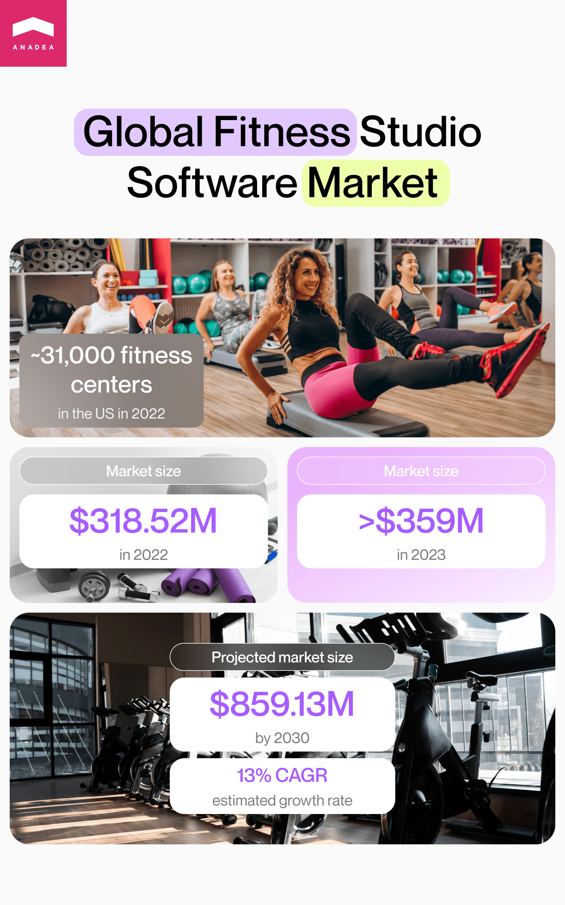
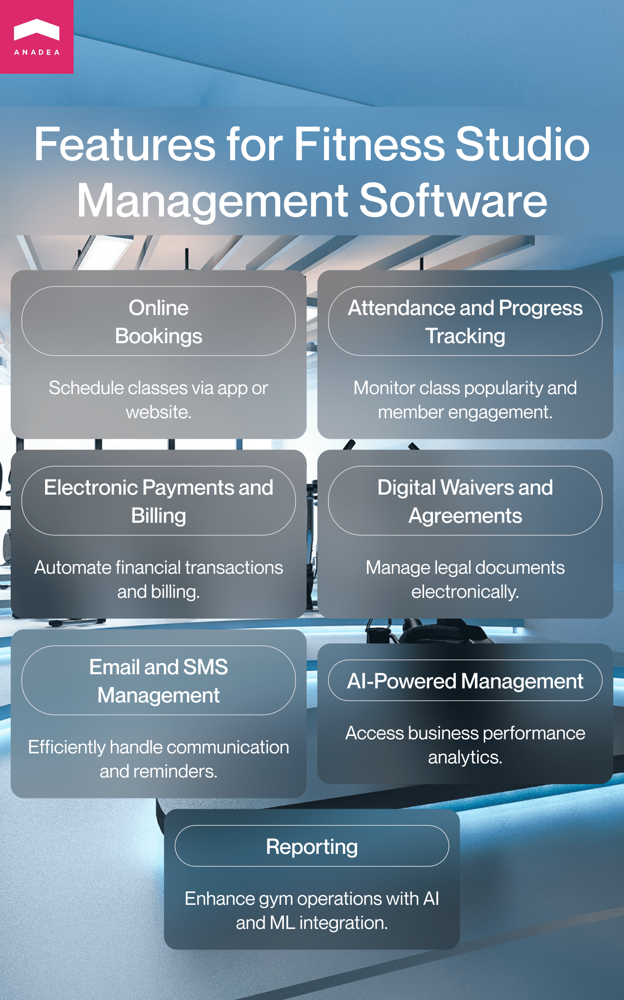
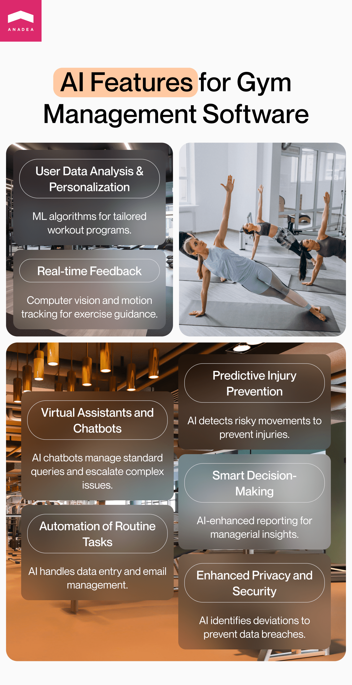
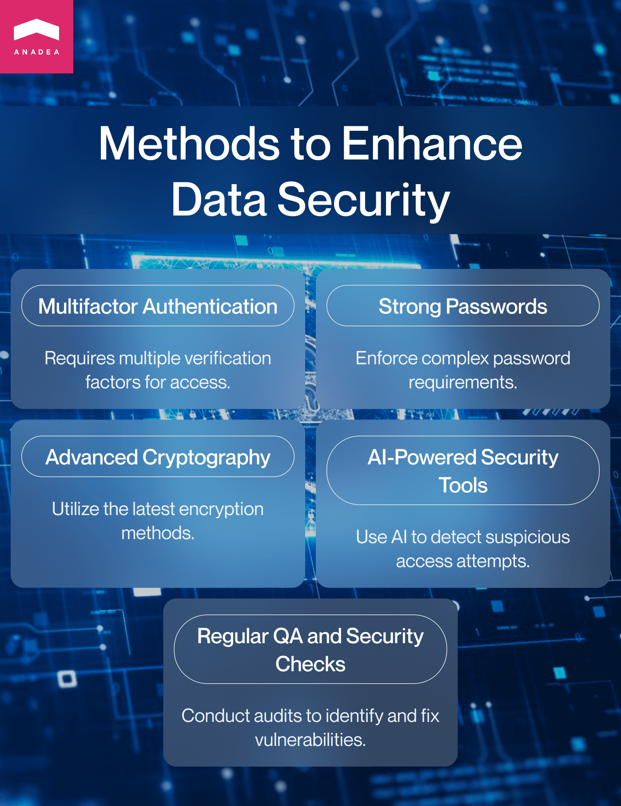

Today we can see that many industries and markets are experiencing a stage of active digitalization that is boosted by the progress made in the tech world. The fitness industry is also one of those that are open to technologies and are ready to welcome innovations that can bring benefits to market participants. The range of solutions for this industry is rather wide. For example, on our blog, we have already shared our insights into the development of [fitness workout apps](https://anadea.info/blog/how-to-build-workout-fitness-app) and now we'd like to provide you with practical tips on how to build management software for gyms that will be bound to succeed.

## Benefits of using a fitness club management system

A gym management system can be defined as a software product that allows fitness businesses to efficiently optimize the working processes at their studios. Such platforms typically unite under one roof a lot of aspects related to gym management, including but not limited to new member onboarding, schedule management, and financial transaction processing.

The global market for fitness studio management software is gradually growing. To make sure that it is really so and to track the dynamics, it will be necessary to have a look at the figures. For example, according to the recently published industry [study](https://www.globenewswire.com/en/news-release/2023/09/14/2743053/28124/en/Global-Gym-Management-Software-Market-Forecast-2023-2030-Smart-Gym-Operations-Solutions-for-Managing-Expenses-and-Efficiency.html), the market size was around $318.52 million in 2022 while in 2023, it managed to hit the mark of over $359 million. As the projected CAGR for this market over the next years is around 13%, we can expect to see it achieve a volume of $859.13 million by 2030.

Among the key factors that drive the development of this segment, we should name the growing number of gyms and fitness studios worldwide. Of course, some of them had no other choice but to close their doors forever amid the coronavirus pandemic. Just compare: in 2019, there were more than 41,000 [fitness centers and health clubs](https://www.statista.com/statistics/244922/us-fitness-centers-und-health-clubs) in the US only but in 2022, their number dropped to around 31,000.

However, now all the lockdowns seem to be in the past and we can see that the growth of the industry is gaining momentum again. More and more people all over the globe are ready to pay for their gym memberships. As a result, gyms need to have a reliable system for managing and optimizing their processes. And of course, the progress in cloud computing and in the successful adoption of other emerging technologies greatly contribute to the expansion of the market for management software for gyms.

Of course, businesses have to realize that custom fitness club and gym management software development, as well as the implementation of one of the ready-made solutions, requires investments. Nevertheless, all investments pay off given all the new opportunities that businesses can leverage thanks to the use of a modern platform for fitness studio management.

Let's consider the key perks of using a gym software system.

* **Facilitation of processes**. A modern fitness club management system provides all employees with simultaneous access to huge volumes of data, lets them collaborate in a more convenient manner, and helps to eliminate a lot of paperwork and routine repetitive tasks.
* **Schedule management.** Thanks to software solutions, it is possible to manage timeslots of different classes and individual sessions faster and more easily. As a result, it is also possible to avoid a lot of mistakes that can appear as a result of a human factor. Moreover, with a gym management system, you can allow members to book fitness classes and introduce changes to their schedules on their own.
* **Staff management.** With a good system built for your needs, you can also better manage the staff of your studio, including not only trainers but also receptionists, administrators, and other specialists. You can track their activities, tasks, and schedules without any paperwork.
* **Optimization of billing and payment processes.** You can enrich your fitness studio management software with features for making and processing payments as well as taking care of billing. As a result, you will greatly save the time that should be allocated for managing finances. Moreover, a lot of gym members will be satisfied with the possibility of making payments online and tracking the history of payments in their personal accounts.
* **Advanced analytics and better-informed business decisions.** Your fitness studio management platform can also generate reports on the purchased memberships, changes in the number of members, the busiest hours, the most popular classes, the rankings of trainers, etc. All this will help you make more valuable strategic decisions and ensure the higher satisfaction of your clients.

In general, the implementation of such software is mainly aimed at making customers and employees happier by optimizing processing and offering the best quality of services.


  Discuss your idea


## Key features of a gym management system

With custom fitness club and gym management software development, you can get a solution that will fully reflect all your business needs and address them in the best possible way. For example, while some platforms have special functionality for automatic report generation, some others don't. However, there is a set of tools and features that is typically built for solutions of this kind.

### A member's app

While talking about management software for gyms, the majority of people usually think about platforms that are targeted at gyms' teams. But it is also important to think about how members will interact with your team. And a mobile application that will allow users to make appointments, look through their schedules, get access to the latest updates, view your offers, manage their memberships, etc. will be a good option. Moreover, a lot of gyms today organize the security systems at their facilities in such a way that without a mobile app (or it's better to say that without a generated QR code) people can't open the doors and come inside.

### An app for staff

There also can be a separate application for your employees who will get access to all the information that is required for work, including their own schedules, personal data of participants of different classes, availability of equipment for personal sessions, etc.

### Online bookings

Members should be able to schedule their classes directly via their mobile apps or via your fitness studio's website.

### Attendance and progress tracking

Such features can help people to stay motivated (and consequently, not to skip classes or even attend more). On the other hand, attendance monitoring is important for efficient fitness studio management as well. You can see what classes are the most popular among members, as well as define members who are losing interest in attending classes. After doing that, you can try to make individual offers for such people which may have a positive impact on member retention.

### Electronic payments and billing tools

With these features, you can automate all the related procedures, minimize risks of errors, and save the resources and time that are typically required for fulfilling such tasks.

### Digital waivers and agreements

Instead of printing out a lot of documents and then asking people to sign them, you can electronically produce, process, and manage all legal papers related to your interaction with members. As a result, the process of onboarding new members will take less time.

### Email and SMS management

Very often gyms communicate with members via emails and text messages. However, handling them manually may be not only a very challenging but even impossible task. With an advanced gym software system, you can deal with email marketing campaigns, personalized messages, and automated reminders with ease.

### Reporting

As we've already mentioned, automatically generated reports and analytics have a significant value for businesses. That's why, it is highly recommended to enrich your platform with such features that will provide you with insights into your gym's business performance.


  Request for proposal


## AI-powered fitness studio management

Today when Artificial Intelligence and the scope of new possibilities that it offers to business owners is so widely discussed and explored, it is impossible to ignore this technology in the context of [sports app development](https://anadea.info/solutions/sports-app-development) regardless of the exact type of your solution.

AI and ML tools can be integrated into all processes related to gym management from scheduling and onboarding to billing and membership management.

To understand whether it's worth considering the implementation of AI-powered functionality, it is necessary to have a closer look at this emerging technology and its role in fitness studio management software.

### User data analysis and personalized recommendations

Machine learning algorithms can gain insights into the interests, preferences, and needs of all gym members who use your app, help them set their individual goals, and create personalized workout programs for them.

### Real-time feedback

Thanks to the integration of computer vision and motion tracking technologies, your AI-powered application can help users understand whether they perform different exercises correctly and what they should change to achieve the highest efficiency.

### Predictive injury prevention

Gym management systems powered by AI can also detect risky movement patterns and notify people about existing threats.

### Smart decision-making

Reporting features can be also enriched with AI tools. As a result, based on historical data and ongoing trends, a system can provide managers with recommendations and insights.

### Enhanced privacy and security

AI is really good at detecting patterns and then identifying any deviations from them. This allows it to indicate any suspicious behavior and activities to prevent breaches and protect sensitive data.

### Automation of tasks

Automation of gym tasks through AI-powered systems can help admins get rid of routine tasks like data entry or email management. Additionally, these systems can streamline appointment scheduling and member tracking, making gym operations more efficient and less labor-intensive.

### Virtual assistants and chatbots

The quality of customer support services is one of the main parameters that many people take into account when they communicate with different companies, However, it is quite difficult to make sure that agents will be able to process all inquiries practically immediately in a 24/7 regime. But you can rely on AI in this task. An [AI chatbot](https://anadea.info/blog/different-types-of-chatbots) on your gym management website or app can be available at any time of the day and can easily handle the majority of standard questions that can be asked about classes, memberships, and onboarding. In those cases, when an issue can't be solved without the participation of a human, a chatbot will re-direct the question to a manager.


  Hire AI Experts


## Process of building a gym management system

The process of creating such a platform includes a row of steps that are typical for building a software solution of any other type. All the steps play a crucial role in general success that's why none of them can be skipped. Though these stages may slightly differ depending on the processes established at each software development company, at Anadea, the entire project realization is organized the following way.

1. **Concept and idea generation.** First of all, you need to understand what solution you want to get. We have a couple of core questions that you can ask yourself and that will help you get a common vision of your future product. What tasks should it address? Who will use it? For some inspiration, you can also analyze similar products launched by other gyms.
2. **Discussion of requirements.** When you already know what you want to get, you can start discussing your idea with your development team (either your in-house team or an external one that you will hire to work on your project). Here it will be necessary to choose a tech stack and define the exact set of features that will be built for your fitness studio management software.
3. **Planning.** Then it is necessary to plan the working process and set realistic deadlines. However, you should be ready for some flexibility as sometimes it is a little bit difficult to predict whether you won't need to introduce any changes in your solution just on the go.
4. **MVP development.** Though this step is included not always, we usually recommend our clients not to skip it. The development of a minimum valuable product, which is a version of your solution with a limited set of basic features, allows you to test your idea without significant financial risks. Based on the feedback that you will receive from the first users who will get familiarized with the functionality of your MVP, you will be able to adjust your product to their needs to achieve the best results after the launch.
5. **Design and development of a full-scale solution.** This is a core stage of the entire project. It includes a lot of tasks for developers and designers who need to create the required features and interfaces of your fitness club management system.
6. **Testing.** Your software should be properly tested. While tests of various types are conducted in parallel with development, it is also required to check whether all components function as they are expected to, when the whole solution is ready.
7. **Release.** When you are satisfied with the results of the development team's work, your product can be launched.
8. **Post-launch support and maintenance.** But even after the release, there are still a lot of things to do. It is necessary to monitor the performance of your solution in order to detect any issues and vulnerabilities that may appear. Moreover, it is necessary to update your product on a regular base to make sure that it fully meets the continuously changing tech and business requirements.


  Get started


## How to secure sensitive gym data?

There are a lot of concerns related to the protection of sensitive data when it comes to fitness club and gym management software development. These software products typically deal with huge volumes of personal data that always attract hackers. That's why it is highly important to take care of your software security already at the stage of its development.

There are different methods that can help you increase the level of data security.

* **Multifactor authentication.** This method of authentication presupposes the necessity for users to provide two or more verification factors to get access to an app (for example, a code sent as a text message to the indicated phone number, face scan, or fingerprint).
* **Strong passwords.** It is required to set requirements for strong passwords which will make it more challenging just to guess them.
* **The strongest cryptography algorithms.** Your team should use the latest encryption methods and stay updated with all modern trends in security algorithm technology.
* **AI-powered tools.** Such tools can analyze all the attempts to access a system and define all suspicious behaviors.
* **Regular QA and security checks.** Pay attention to the necessity to conduct audits of your software on a regular basis in order to timely find any vulnerabilities and address them as soon as possible.

## How much does it cost to develop a gym software system?

The questions related to the project's costs are the most crucial for businesses. However, it is impossible to provide any accurate amounts without a deep analysis of your requirements.

To calculate costs we should understand the level of complexity of your solution, the type of features that you want to have, and the required tech stack.

Typically, investments in the development start at **$30,000.** But you should bear in mind that if you want to power your platform with AI or other advanced tools, the required amount will go higher.

If you choose Anadea as your software development partner, we will help you find the best approaches to cost optimization without sacrificing the quality of your solution.


  Get estimate


## Conclusion

The demand for fitness studio management software is growing as these solutions are gradually moving from the category of innovations to the category of industry standards. While large fitness centers were among the early adopters of such software products, today even small clubs are joining the game. The benefits for both gyms and their members encourage companies to invest in projects of this type in order to increase their revenues already in the near future.

If you want to know more about our services and expertise in building advanced solutions for the sports industry, do not hesitate to contact us - our inbox is always open!


  Reach out


