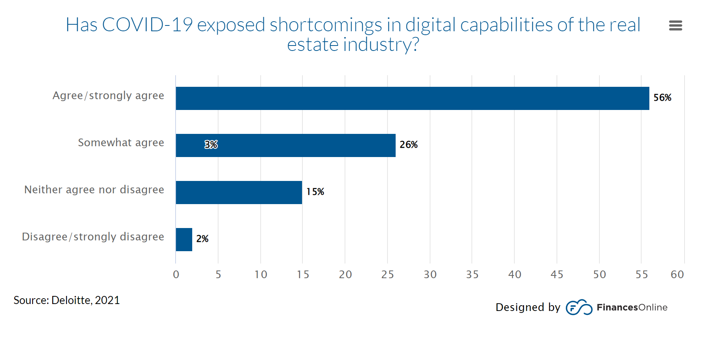
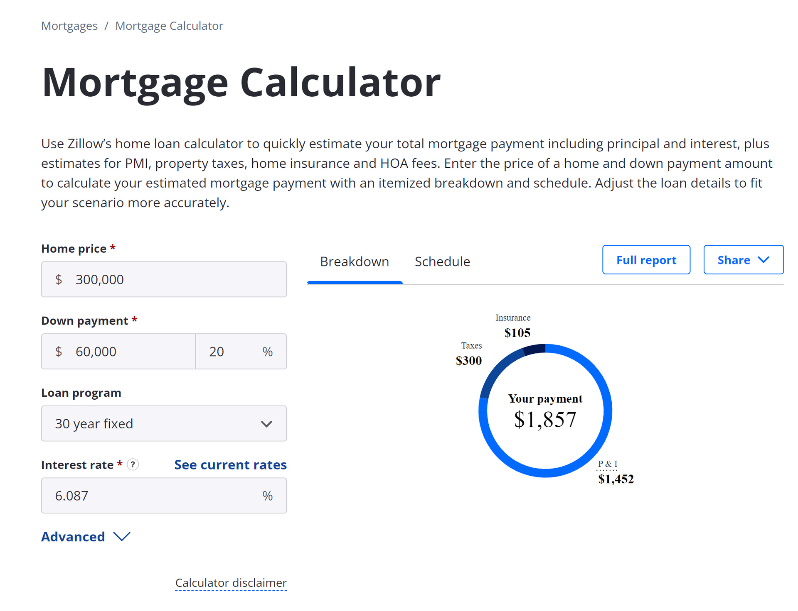
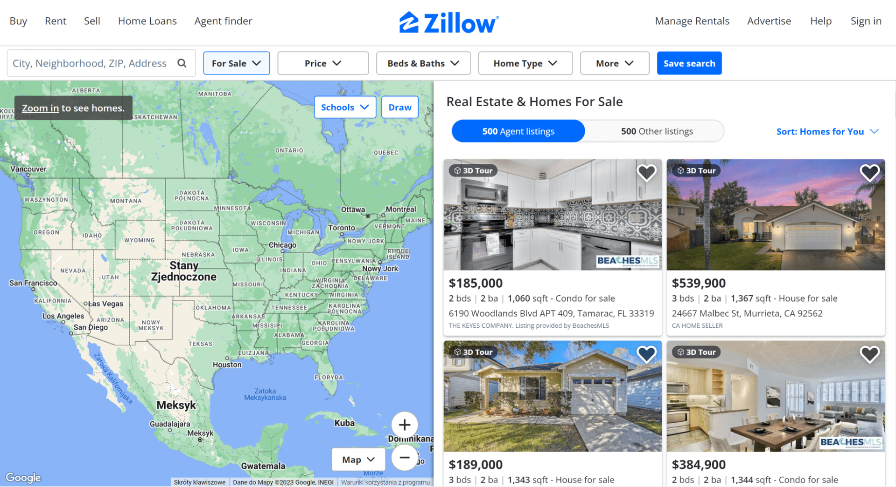
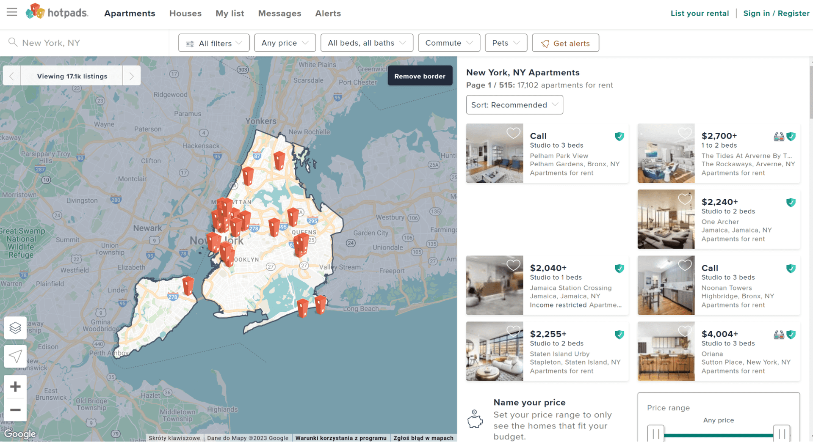
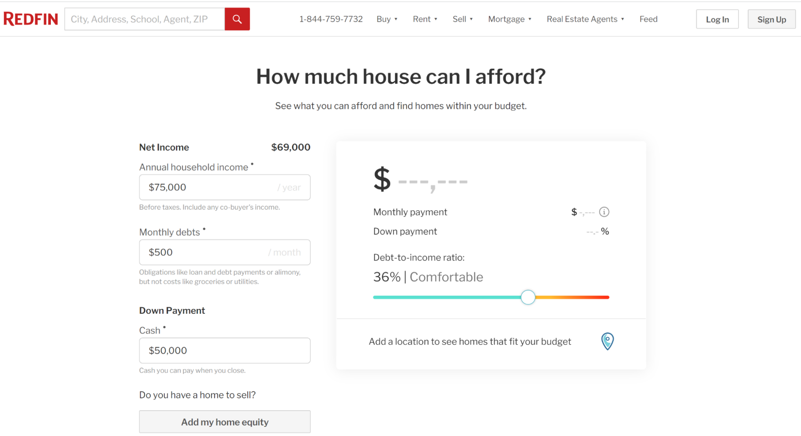
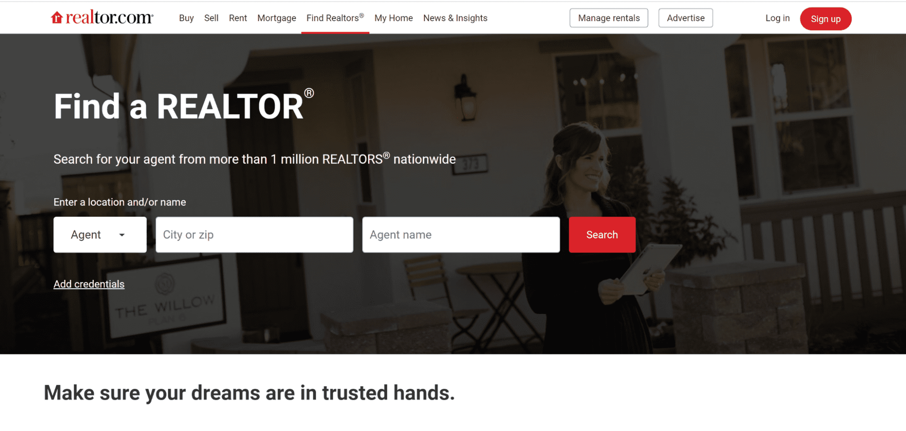
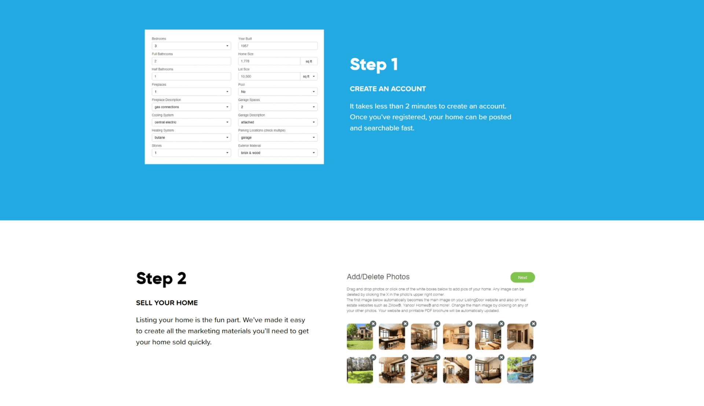

With an idea to start a <a href="https://anadea.info/solutions/real-estate-software" target="_blank">real estate app development</a> project, you want the resulting product to bring real value to people. Especially with <a href="https://www.nar.realtor/research-and-statistics/research-reports/real-estate-in-a-digital-age" rel="nofollow">97%</a> of home buyers using the internet in their search. And you surely want your project to make profit. How to do it when there are such huge real estate apps like Zillow and Trulia out in the market?

The success of the market leaders is not something that stops ambitious entrepreneurs. There are always options to make a product that will be your audience’s best choice. To find out how to build a real estate app that will conquer the hearts of users, how much it will cost, and how to monetize it, read on.

## Why are real estate apps so popular?
People are constantly moving out from their places and looking for new ones to move in - that’s how it is and how it’s always been. And COVID-19 is no longer a deal-breaker. Of course, the pandemic highlighted the weaknesses of the industry when it comes to digital solutions. Nevertheless, this situation became a booster that pushed the real estate app market growth.

The main difference between, say, 20 years back and now is that people don’t quite need real estate agents and brokers assisting in their search __in real life__ anymore. These are replaced by mobile applications available at any moment with no third parties involved. No wonder that people choose instant access to a huge base of houses over scheduling viewings all over the town.

Thus, the traditional brokerage is experiencing <a href="https://www.forbes.com/sites/forbesrealestatecouncil/2019/04/04/the-decline-of-the-traditional-brokerage-where-is-real-estate-heading/?sh=a744dcc78ee7" rel="nofollow">a decline</a> in our digital era, which is the reason experts in real estate <a href="https://financesonline.com/real-estate-statistics/" rel="nofollow">anticipate</a> an increase in technological investments in the nearest future.

## Why does a real estate business need an app?
Considering the above, it appears that if you own an agency and are planning to grow in a real estate domain, having an app would be a huge advantage for you. Customers appreciate when the business cares about their time, so you should make the most to help them solve problems with no effort on their part. It’s a win-win case: you as a business gain competitiveness by going digital, and customers have their needs satisfied with your mobile solution.

Hire Real Estate App Developers

### Who uses real estate apps?
To answer this question, it’s important to see people behind usernames and identify their types. Real estate is a very broad industry, and still, it involves very specific categories of people.

* __Buyers/tenants__ or people who are looking for accommodation. For them, mobile apps are an accessible source of up-to-date information on what’s open to buy or rent. Customizable filters allow for very specific search queries which is time-saving, not to mention the ability to evaluate a house/apartment without actually going there.

* __Sellers__ are those willing to sell a house/apartment. When approaching to property selling with enough responsibility and creativity, they have much better chances to find the right buyer fast using an app. Firstly, real estate applications allow sellers to show the inside and outside of a place at its best. The power of the right photos in terms of marketing can’t be underestimated. Secondly, in-app messaging allows sellers to be in touch with multiple potential buyers at a time, which adds to faster deal closure.

* __Realtors (brokers)__ are intermediaries between the two. Although they seem to have lost in popularity, the U.S. buyers still work with agents 87% of the time even when the search process starts online, the National Association of Realtors <a href="https://financesonline.com/real-estate-statistics/" rel="nofollow">stated</a>. People still need professional assistance in making serious financial decisions, in which realtors are of much help. Specialized apps help these specialists automate their routine tasks and get fast and easy access to their clients.

* __Property managers__ - landlords and people working at hotels. Their duties can include setting rental rates, property maintenance, paying bills, attracting new tenants, managing complaints, and much more. Special mobile apps help them optimize their routine and communicate with tenants faster.

* __Construction and development specialists__, including engineers, architects, technicians, contractors, and other construction specialists. This category of users opts for specialized apps to simplify their routine processes, get a centralized tool for managing projects, and have all the information on construction in one place.

### Benefits of real estate applications for business
Benefits for users are very clear, but what about business? How can a real estate app add value to your company?

Going online is no longer a privilege for a business but a necessity. What does a person do once they hear a company name? They google - or sometimes search it in an app store, and if they don’t find you, they find someone else. Thus an app adds to the company’s visibility and brand awareness. More visibility means you can reach more people, which, in its turn, provides for a durable business.

## Types of real estate apps
In addition to the buying/selling and renting solutions that come to mind first, there are many field-specific types of real estate apps. Our list may help you better formulate the idea of your future project - or maybe give you an idea of one.

### Buying/selling apps
This is the most common category of real estate apps, which name explains itself. Most of them are <a href="https://anadea.info/solutions/real-estate-software/mls" target="_blank">multiple listing services</a>, or multiple listing systems, that compile databases of various real estate agencies. This way, agencies and homeowners get a channel for promoting their offers, and homebuyers get easy access to all of the available ones. Search by location, adding neighborhood description, uploading photos, and other less common features help them find each other. With or without real estate agents, the two sides meet and tie up a deal.

__Examples:__ Zillow, Trulia.

### Rental mobile apps
A rental mobile app is an instrument that helps people find accommodation for rent for a long period or shorter periods - weekend, vacation, or business trip. The more filters the app has - by location, price, amenities - the easier it is for users to find the desired accommodation.

__Examples:__ Airbnb, Booking.com, Zillow Rentals.

### <a href="https://anadea.info/solutions/real-estate-software/property-management" target="_blank">Property management systems</a> (PMS)
To automate routine procedures and save time, apps for property management offer landlords tools to control rent payments, utility payment collection, move-ins and move-outs, as well as provide a channel to communicate with tenants.

__Examples:__ Buildium, InnQuest.

### Vacation rental management apps
The vacation rental apps, or hotel property management systems, are designed for owners and hosts aiming to provide a better experience for their short-term guests. These tools allow owners to manage hotel reservations and services, communicate with guests, and automate other day-to-day activities.

__Examples:__ Guesty, Lodgify.

### CRM apps for real estate
Customer relationship management (CRM) apps for real estate are tools for solving business issues between real estate agencies and their clients - homebuyers or renters. The purpose of CRM apps is to improve clients’ experience with business, which is achieved via constant communication with them, answering their feedback, and responding to their requests.

__Examples:__ LionDesk, Contactually.

### Home appraisal tools
Tools for home valuation, or home appraisal apps, allow suggesting the value of housing. They come useful when the owner decides to sell their property and needs to calculate how much they can sell it for. The result is based on the house’s size, year built, location, and other data. The calculations can be made with the help of Artificial Intelligence (AI) and <a href="https://www.geekwire.com/2021/zillow-group-uses-machine-learning-improve-zestimate-algorithm-dynamic-market-conditions/" rel="nofollow">Machine Learning</a> (ML) technologies.

__Examples:__ PriceHubble, Zillow, Trulia.

### Investment apps
Investing in real estate is a common source of passive income, and apps for real estate investment provide users with an easy start. Just in several minutes, users can be investing in actual land parcels. An investment mobile app assists them in decision making, helps calculate risks and determine future taxes. Auctions, trusts, crowdfunding projects - there are so many things to implement in your app.

__Examples:__ DiversyFund, EquityMultiple.

### Construction apps
Construction and real estate development apps are designed for construction firms and include a broad scope of features, from bidding and cost estimates to time tracking, property management tools, and financial control. From project planning to closeout, a real estate construction app accompanies the firm in all of the significant real estate development steps.

__Examples:__ Procore, Box.

## Must-have features in a real estate app
If you’re planning on creating a platform for buyers and agents, consider including the features below in it.

### Listing feature
The most common and easily perceived way of displaying databases to users is via listings. What users expect from your app is a list of housings with information about their price, location, and amenities. Longer lists assure users’ maximum retention and increase their chances to find a living on their needs.

### Map & geolocation feature
A built-in map allows users to see all of the available accommodations in the area while driving around or sitting on the couch. Commercial real estate apps and multiple listing services like Trulia and Zillow use GPS-based search to show you what properties are for sale or sold in a certain area.

### 3D virtual tour
Visual tours, or immersive tours, recently started gaining much popularity in the real estate industry. An app user can see the inside of a house in 3D and even walk through it as if they’ve actually been there. It’s enabled thanks to photos of rooms merged together to form a seamless picture.

### Signing documents online
When it comes to getting documents signed, which realtors have to do constantly, the electronic signature feature is the fastest way to do it on the go. It is also great to have an app that can connect with cloud services like Dropbox, Evernote, Google Drive to import and save documents, track their status, and send reminders.

### Using the smartphone’s camera
Access to the phone’s camera allows users to quickly make floor plans by moving their phone around the room. Viewing space in 3D, editing floor plans in a single tap, adding objects, furnishing home - this is a goldmine for real estate agents. Another way to use the camera in apps for real estate agents and buyers is for the search option, e.g. like in Homesnap where a user can take a photo of any house with their smartphone and find out the estimated value, the number of rooms, interior photos, and other details.

### Mortgage calculator
A realtors app that can give the exact info about mortgage rates and payments is the perfect tool when a real estate agent needs to figure the cost of the home or to determine which loan is more suitable for the client. A <a href="https://www.zillow.com/z/buying/app-download/" rel="nofollow">mortgage calculator</a> by Zillow is a nice example of how this feature may work.

### Value calculator
Earlier we identified tools for property cost evaluation as a separate category. Still, the value calculation feature can be found in a number of popular real estate apps like Zillow and Trulia. Since people mainly use apps for one particular feature, separate apps for property valuation are still in demand. However, adding a value estimator to your app makes sense - unless the app is at the <a href="https://anadea.info/guides/what-is-mvp" target="_blank">MVP</a> stage.

### Keeping real estate team organized
CRM and task management apps for realtors can boost the productivity of your real estate team. With such an app, you can see what each agent is working on, send notifications about new leads to each team member's phone, set to-do's, and schedule reminders.

## Additional features to win users’ hearts
All apps are unique and it is absolutely clear that each app that is being built today can’t include absolutely all features that we’ve provided in this article. Nevertheless, we hope that our list can inspire you to create something very special for your potential user and that when you turn to a real estate mobile app development company or a company that will build a web app for you, you will already have a good understanding of your future product concept.

Below you can find some extra features that today are highly demanded in the sphere of real estate mobile application development.

### What is around a property?
Very often startups and project owners pay attention only to the necessity to show potential buyers the properties from the inside. But what is happening outdoors? What can a person find in the neighborhood? What houses do neighbors have? Are there any shops nearby? This feature can include not only information about the district but also some photos, videos, news, links to the local community's website or social network, etc.

### List of favorites
This feature is very popular on eCommerce websites. But let’s not forget that it can be of great use in real estate mobile app development. It is obvious that people usually can’t buy a property as soon as they find it. They need to think about its benefits, compare it with others, etc. But later it can be rather challenging to find it again. Wishlists can solve this problem. Moreover, AI-powered tools can analyze the objects that users have marked as something interesting to them and further provide personalized recommendations.

### Chats and chatbots
It will be a good idea to provide users with the possibility to get any desired information in a quick and simple way. Users may have a necessity to find out some facts about mortgages or real estate listings and a chance to do it via a chat will significantly improve their user experience.

## Trends in real estate app development
The world of technologies is changing so quickly that it is becoming more and more complicated to track all the changes. That’s why we’ve decided to share with you some hints on some emerging technologies that you can use to power your app.

### Blockchain
Blockchain can be used in real estate apps development in a couple of different ways. First of all, it can help you turn traditional contracts into smart contracts to increase the simplicity and security of real estate transactions. Secondly, pay attention to tokenization. Thanks to this feature, you can convert the real estate value into tokens that are stored on a blockchain network. As a result, secure digital ownership and transfer are possible. What’s more, this technology has other use cases in real estate. For example, it is also used for building decentralized rental platforms, avoiding mortgage fraud, and crowdfunded investing.

### AI/ML
<a href="https://anadea.info/services/machine-learning-software-development" target="_blank">Artificial intelligence and machine learning</a> are widely used in real estate software solutions for analyzing users’ preferences and creating personalized offers. But their role is not limited only to this sphere. Moreover, they can be used for smart pricing and price forecasts based on ongoing and future market trends.

### AR
Augmented reality is applied for creating virtual tours for prospective buyers. Using AR, people can visit the property in 3D without leaving their coaches. Thanks to such features, both customers and real estate agents can save their time and money.

### Big data
Traditional approaches to processing data don’t work in a proper way when it comes to huge volumes of data. But when we are talking about real estate marketplaces or rental apps, these solutions need to process really large amounts of data. And that’s when bid data tools enter the game. These technologies help not only to accumulate a lot of information but also to efficiently analyze it and to get the necessary data from a huge set. The processed information helps to detect patterns in buyers’ behavior, identify trends in the decision-making process, as well as predict changes in people’s preferences.

## How to create a real estate app

### Identify the idea & target audience
Think through the idea and features you’d like to see in the app. What kind of solution will it be: a rental mobile app, a property management app, a real estate investment app, or some other one? The needs of which group of users should it fulfill: homebuyers, home sellers, realtors, property managers, or maybe constructors?

### Conduct a market research
Go through listings and app stores and check out projects with an idea similar to yours. Think over their strengths and weaknesses and figure out what will highlight your app among them. How will your app be better than anybody else’s is the question.

### Find a developer
Hire specialists with expertise in real estate app development. On choosing the right team of engineers to create an application, see our article: <a href="https://anadea.info/guides/how-to-find-an-app-developer" target="_blank">How to Find an App Developer for Your Project</a>. Also see the list of Anadea’s <a href="https://anadea.info/projects#real-estate" target="_blank">real estate projects</a>.

When the product is developed, you’ll need to fill it with proposals right away. Empty real estate platform is useless: a user that downloads it and sees no houses for sale or lease will never come back. What we want to say is __you will need a database__ from somewhere. You can get one or several from the nearby real estate agencies on their terms. As a result of such cooperation, you will fill the app with offers, and agencies can get additional advertising.

### Think out monetization models
Think over the monetization model of your project - the point of a mobile app for real estate company is still bringing profit to the business. There are several revenue models most apps use.

* __Advertising__ 
Good old ads banners are the most common way of making money with an app. You can charge money from businesses offering services related to real estate, such as: building supplies stores, cleaning services, interior designers, home security systems installation services, etc.

* __Premium plans__ 
Another common practice is giving users access to a limited set of free functions and making the rest available by subscription or after a single payment. If you offer users several subscription plans, they will choose one to suit them best and avoid unnecessary functions. For users to know what they will pay for, consider a short free trial period.

* __Fees__ 
For mediation services, the app can charge a fee, or a commission, from users once the deal between a buyer and a seller is closed.

* __Featured lists__ 
A property owner can request the platform administrator to promote one or several of their announcements so that more people can see them. For some money, home sellers and landlords can reach out to a wider audience.

### Promote your project
Databases integrated, the app uploaded to the stores - at this point, it’s time to market it to the target audience.

A typical marketing strategy for app promotion includes:

* __App Store Optimization__ (ASO) - making the app more visible in App Store and Play Market.
* __Search Engine Optimization__ (SEO) - making adjustments to your project’s website in a way that your target audience sees it in their search results.
* __Pay-per-click__ (PPC) advertising - a type of advertising which implies that each click on the ad’s banner is paid for.
* __Social Media Marketing__ (SMM) - marketing the app on the project’s pages on social media by posting all kinds of content (text posts, videos, giveaways) and, most importantly, communicating with followers.
* __Influencer Marketing__ - outreaching to the app’s users via bloggers (influencers) on different platforms: Instagram, YouTube, Facebook.

Professional marketers and <a href="https://anadea.info/services/seo-service" target="_blank">SEO/ASO specialists</a> will help you with implementing these strategies.

## Team composition for real estate app development
As we’ve already mentioned above, when you are thinking about how to build a real estate business app, you need to find a reliable team that will create a software product based on your requirements. If you already have an in-house development team, it will be easier to make a solution. Probably you will need to find just a couple of external specialists who have specific expertise for consultations.

But if you do not have in-house programmers and if software development is not your core business activity, it will be sensible to opt for IT outsourcing services. We’d like to advise you to conduct careful market research and find a vendor that has won a reputation of a reliable real estate app development company that already has relevant experience and a row of successfully launched software projects built for this industry. A deep understanding of market trends and pressing demands will greatly help you to improve the quality of your real estate app and to make sure that it will be able to bring the highest real value to your business and end-users.

We recommend you the following team composition to work on your application:

* __Business analyst.__ This specialist will analyze the market and the viability of your idea, and will help to come up with a solution that will perfectly address the set needs. This person will communicate with stakeholders, and study business requirements and processes to make sure that you are moving in the right direction in building your solution. 
* __Project manager.__ Project managers are responsible for organizing and planning all the processes, allocating resources, and setting tasks so that the goals of the project can be successfully achieved. 
* __Back-end developers.__ These developers build and maintain that part of a web solution that is hidden from the eyes of end users. They deal with technologies involved in data processing and storage, ensure security, and support server-side web application logic. 
* __Front-end developer(s).__ For a web solution, it is also necessary to create a part that users will interact with. This part should be not only attractive but also intuitively clear and comfortable to work with. Usually, these programmers work with such languages as HTML, CSS, and JavaScript. 
* __Android or/and iOS developer(s).__ When you are planning to create a mobile real estate app, it is vital to have developers who work with mobile platforms and have enough expertise in building feature-rich solutions for mobile devices. 
* __UX/UI designer(s).__ These specialists help real estate app developers to create user-friendly interfaces that will not only look good but also feel the same. The main task of designers is to make it pleasant and easy to interact with the solution. 
* __QA engineer(s).__ These engineers play an important role in creating real estate app development solutions as they are responsible for finding and fixing bugs in applications before they are launched. They also closely cooperate with programmers when it is necessary to introduce serious changes to the solutions.

## Top real estate app market players
Those are the names others look up to. See the examples of successful real estate apps that people use worldwide.

### Zillow
This real estate marketplace is considered the best in the market for a reason, thus the demand for developing real estate apps like Zillow is so high. Zillow is a one-stop shop for buying and selling houses, valuating their cost, and taking control of budgeting.

### Trulia
Another leading real estate database for homebuyers and landlords, Trulia has a more simple interface compared to that of Zillow but still offers users comprehensive information on the neighborhood and even has crime map data in it.

### HotPads
The HotPads app is a map-based tool that shows the user houses and apartments near them. Advanced filters allow users to narrow their search. Highly usable and efficient, this app has become very popular among users in the U.S.

### Redfin
One of the largest real estate MLS with homes listings that refresh every 5 minutes. With this app, users can instantly schedule video and in-person tours and plan visits to open houses.

### Realtor.com
Need to find a realtor, calculate mortgage payments, or estimate your home’s value - Realtor.com has an answer to all of these problems. Less popular and innovative than Zillow, it still has many loyal users.

## How much does it cost to develop a real estate app?
Pretty much like with any other type of apps, real estate app development cost depends on the complexity of the solution, the selection of features, and hours of work. Here's a couple of examples from our experience with real estate application development:

* A real estate __listing portal__ that enabled communication between property searchers and realtors cost our client __$56.000__. The project duration was __12 weeks__.

* The development of a platform for __property cost prediction__ cost one other client __$18.000__ and took us approximately __5 weeks__.

## Our expertise in real estate app development
At Anadea, we provide a wide range of custom software development services, including but not limited to web and mobile app development for real estate. Let us mention a couple of software solutions built by our team.

### <a href="https://anadea.info/projects/agentfolio" target="_blank">Agentfolio</a>
One of these projects is Agentfolio. It is a collaboration tool intended for helping real estate agents and their clients to establish and maintain efficient cooperation. This project required our team’s skills in real estate mobile application development as well as in creating web products as the platform has two versions. Using either a web workspace or a mobile app, all people who are interested in finding some property or those who work in this industry can get access to property listings and discuss offers in real time.

<picture>
 <source srcset="agentfolio.png">
 
</picture>

Initially, the app was dubbed Buyfolio. But after it was noticed and acquired by the leading US-based real estate marketplace Zillow, the project got a new name. Now it is known as Agentfolio. This acquisition was a huge milestone not only for our clients who were founders of the startup but also for us. The attention and interest from the side of the industry giant prove the tech quality and advanced functionality of this product.

Agentfolio has a long history. Once created as just a small NY-based app, it has turned into a huge nationwide solution. Despite all the changes, the Anadea team still participates in this project by proving the required technical support. And we believe that we will have the possibility to observe how this product will conquer new peaks already in the near future.

### <a href="https://anadea.info/projects/listingdoor" target="_blank">ListingDoor</a>
Another project that we’d like to tell you about in this article is ListingDoor. It’s interesting to note that the founder of this startup chose Anadea as a real estate mobile app development company as he was impressed by the quality and success of our project that was mentioned above - Agentfolio.

The idea of ListingDoor was to provide users with a new web service for selling houses without using the help of real estate agents. The platform allows people to do it just in two steps. It is enough just to create an account and then sell their properties via listings. The solution also offers access to a collection of marketing materials for the real estate industry. Users can also use the platform to create their own brochures and sale signs using photos of their houses and apartments.

Already now this project stands out from the row of similar products. But we also know the founder of the startup is always open to different cutting-edge and really bold ideas. That’s why we are always ready to enrich the solution with new innovative features that will help it to attract new users and absolutely wow the audience.

Thanks to our experience in real estate app development solutions and a row of successfully launched projects, today our customers can stay confident that our developers will be able to create a fully innovative and feature-rich product.

## Bottom line
To stay on the wave of new technologies, a real estate business should respond to the innovations and best practices in the industry. While websites have become the norm for home searching, a real estate app opens huge opportunities and can move your business to a new level.

Looking for a company to create an efficient and profitable app for your business? At Anadea, we gladly take on new real estate mobile app development projects. <c href="https://anadea.info/contacts" target="_blank">Contact us</a>, and our specialists will answer all of your questions.

## Frequently Asked Questions
### What is a real estate app?
A real estate app can be described as a software product intended for automating a lot of different tasks related to property sales, rental, modernization, construction, and promotions. There are a lot of solutions that can be included in this group: from marketplaces to advanced CRMs platforms. Given the fact that such apps can be built for both internal and external target groups and that they can be designed to address different needs, the range of possible features is very rich. If you do not know exactly what your future real estate app should look like, you can contact a professional development team that will help you to build the best solution tailored to your needs.

### How are technologies changing the real estate industry?
Technologies are used to facilitate different processes. And the same happens when we are talking about the real estate market. Thanks to modern real estate web and mobile apps, it has become absolutely simple and fast to find an agent or a property in your region based on your requirements and budget. A lot of tasks can now be solved remotely including visiting properties as 3D tours have made it possible.

### How to choose the best real estate app development company?
As today there are a lot of companies that provide real estate app development services, you should start your search with a throughout market analysis. Pay attention not only to the rates of developers but also to the company’s expertise, previous experience, and portfolio. It will be also useful to read the reviews on external platforms and communicate with the company’s team before making a decision. At Anadea, we have a row of successfully launched real estate app solutions and we offer you to have a look at them in our <a href="https://anadea.info/projects#real-estate" target="_blank">portfolio</a>.

