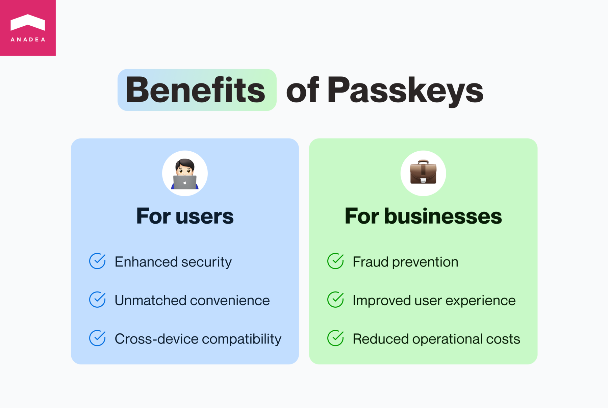
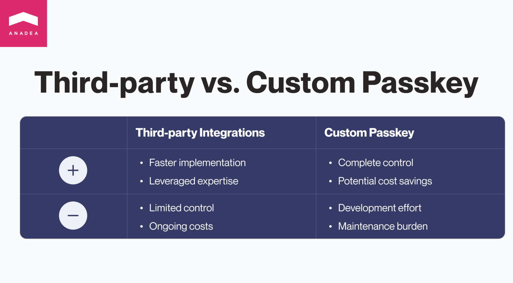
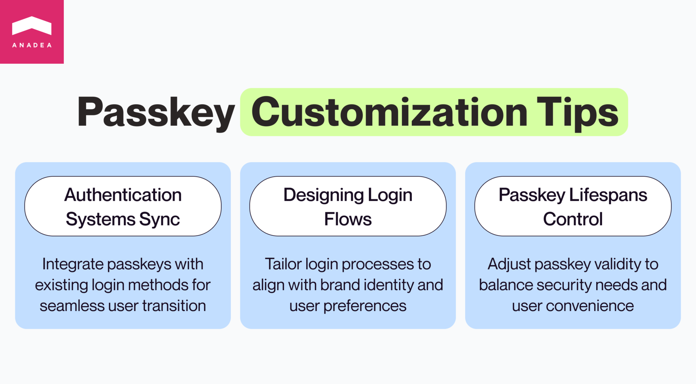

Imagine a world where users no longer need to remember countless passwords or worry about phishing scams. That's exactly what passkey promises. Let's dive into how it works, its benefits, and how to <a href="https://anadea.info/services/passkey">implement passkey</a> seamlessly into your software.

## Effortless logins with biometric security

Passkey replaces traditional passwords with a more secure and convenient approach. Instead of entering a complex combination of characters, just use your fingerprint or facial recognition (Touch ID, Face ID) to log in across various devices and platforms. Passkey eliminates the risk of forgetting passwords and makes users less susceptible to phishing attacks, as there's nothing to steal.

<small style="font-size: 14px">Image source: arstechnica.com</small>

## A win-win for users and businesses

For **users**, passkey offers:

- **Enhanced security:** Passkeys eliminate the risk of password breaches and phishing attacks, as there's no password to steal and they rely on strong cryptography.
- **Unmatched convenience:** Users can ditch complex passwords and simply use their fingerprint or facial recognition for effortless logins across different devices.
- **Seamless cross-device compatibility:** Accessing accounts from any device becomes a breeze with passkeys.

Meanwhile, **businesses** benefit from:

- **Fraud prevention:** Stronger authentication with passkeys reduces the risk of unauthorized access and fraudulent activities on your platform.
- **Improved user experience:** Faster and easier logins lead to a happier user base, potentially increasing recommendations and user satisfaction.
- **Reduced operational costs:** Businesses can save resources by eliminating password management and focusing on scaling passkey storage instead.

Go passwordless

## Implementing passkeys: Choosing the right approach

Businesses have two main options for implementing passkey technology:

### Option 1: Third-party integrations

This involves using established providers to integrate passkeys with your existing systems.

#### Advantages

- **Faster implementation:** Utilizing established third-party providers allows for quicker integration and deployment of passkey technology.
- **Leveraged expertise:** Businesses benefit from the expertise and infrastructure of experienced providers, potentially reducing development risks.

#### Considerations

- **Limited control:** Businesses may have less control over the user experience and overall design compared to a custom solution.
- **Ongoing costs:** Third-party integrations often involve recurring costs such as annual fees or per-user charges.

### Option 2: Custom passkeys

This approach means building your own solution for integrating passkey functionality into your systems.

#### Advantages

- **Complete control:** Businesses have full control over the design and user experience of the authentication process, ensuring it aligns perfectly with their specific needs.
- **Potential cost savings:** Developing a custom solution can be cost-effective in the long run, with expenses primarily associated with scaling the application.

#### Considerations

- **Development effort:** Building a custom solution requires significant time and technical expertise, potentially delaying implementation timelines.
- **Maintenance burden:** Developers are responsible for ongoing maintenance and updates to ensure the security and functionality of the custom solution.

### We support your choice

Regardless of the chosen approach, we are here to help your business implement a secure and user-friendly passkey solution. We offer:

- Integration of specific frameworks with third-party providers.
- A simple and compatible solution developed at Anadea that integrates seamlessly with popular frameworks like Python and Django.

Let’s take a look at what exactly we’re talking about.

## Third-party showcase

Due to passkey being a high-demand feature, many third-party services were introduced to fit the purpose of handling passkeys. Some of the examples of such services might be:

### WebAuthn.js

JavaScript library for implementing WebAuthn API. A core standard for passwordless authentication. Enables developers to add biometric authentication options like fingerprint or facial recognition. Supports cross-platform compatibility for seamless user experience across different devices.

### Microsoft Authenticator SDKs

Microsoft offers SDKs for Android, iOS, and other platforms to integrate with their authenticator app. Allows developers to leverage the existing user base and functionalities of Microsoft Authenticator. Simplifies adding secure multi-factor authentication options to applications.

### Passwordless.dev

Acquired by Bitwarden, this framework simplifies integrating passwordless options into applications. It offers open-source libraries and tools for WebAuthn and FIDO2 implementation and provides developer-friendly documentation and tutorials for a smooth integration process.

<small style="font-size: 14px">Image source: docs.passwordless.dev</small>

Although these resources are popular solutions for passkey implementation, they often appear platform-specific. Other than that, third-party services often increase spending on the development due to their own cost—it might be the cost for a month of usage for enterprise solutions, cost-per-user, or a single-time fee.

> **Related read:** <a href="https://anadea.info/blog/passkey-vs-password" target="_blank">Passkey vs Password: Which Is Better?</a>

## Anadea’s passkey solution

Our team at Anadea has gone beyond simply acknowledging the potential of passkeys. We've developed a unique Python-based solution for seamless implementation on Django websites.

Who is it for?

- Businesses of all sizes looking to implement secure and user-friendly passwordless authentication on their Django websites.
- Organizations seeking a cost-effective and scalable solution for passkey integration.
- Companies who value fast implementation and expert guidance from experienced Python developers.

Our solution leverages **FIDO (Fast Identity Online)**, a set of industry-standard security specifications championed by the FIDO Alliance. By adhering to FIDO data schemas and employing robust encryption libraries, we guarantee a secure and reliable means of generating passkeys for your user accounts.

But the benefits don't stop there. Our solution boasts exceptional scalability, incurring minimal costs beyond database expenses. This makes it an economically viable choice for businesses of all sizes.

Furthermore, our team of highly skilled Python developers will ensure a swift and efficient setup tailored to your specific business needs. Within just **one week**, we can equip your Django website with all the necessary tools to embrace the future of passwordless authentication.

Get started with passkeys

## How businesses can further customize passkey

If you’re seeking to leverage the full potential of passkey technology, you have several customization options at your disposal, enabling a more personalized and secure user experience. Here's how:

### Authentication systems sync

The integration of passkey with existing authentication mechanisms is crucial for businesses looking to offer a seamless transition from traditional password systems. By syncing passkeys with current login methods, companies ensure that users experience no disruption in service. This integration enhances and maintains the familiarity of the login process, easing users into the new system without confusion or inconvenience.

### Designing login flows

Customization extends to the start of the user experience by correcting the login flow. Businesses can design these flows to reflect their brand's identity and user interface guidelines, creating a unique login experience. Whether it's simplifying steps to access services or introducing additional security checks in critical areas, the flexibility in designing user flows allows businesses to cater to their specific audience's needs and preferences, enhancing overall satisfaction.

### Passkey lifespans control

Balancing security with convenience is a delicate task, and one of the ways businesses can achieve this is by controlling the lifespans of passkeys. Deciding on a passkey's validity period involves assessing the service's security requirements and the user's convenience. Shorter lifespans may offer higher security by requiring frequent reauthentication, while longer lifespans prioritize user convenience at the potential cost of increased risk. By customizing this aspect, businesses can strike an optimal balance that suits their operational model and user expectations.

## Entering passwordless future

Now we can all agree that passkey is the future of authentication. It utilizes cutting-edge biometric technology, allowing users to log in with their fingerprint or facial recognition. This not only eliminates the hassle of passwords but also dramatically enhances security by removing the vulnerability of password breaches.

Working with businesses for over 20 years, we at Anadea understand that integrating new technology can be challenging. That's why our team of expert developers is here to ensure a quick and smooth transition of your systems to passkeys, whether it’s a third-party solution or a custom one made by our team.

Excited about the passwordless future? Contact us and let’s approach it together, prioritizing digital convenience and security!

Implement passkeys

## Frequently Asked Questions

### How can I implement passkey in my business software?

At Anadea, we offer two main options:

- **Seamless third-party integration:** Leverage our expertise to integrate established solutions like Passwordless.dev or WebAuthn.js, minimizing development effort and ensuring a smooth integration.
- **Custom passkey solution:** For complete control and customization, we offer to implement Anadea’s custom passkey solution for Django websites.

### What are the popular passkey solution providers?

The passkey landscape is evolving, with numerous passkey providers emerging each month. We recommend exploring options like **Passwordless.dev**, **WebAuthn.js**, and **Microsoft Authenticator SDKs** among others.

### Who can implement passkey functionality for me?

Several options are available for integrating new technologies like passkey. You could utilize your development team if you have the necessary in-house skills and resources. Alternatively, software development companies like Anadea can provide both integration and customization of passkey solutions.

