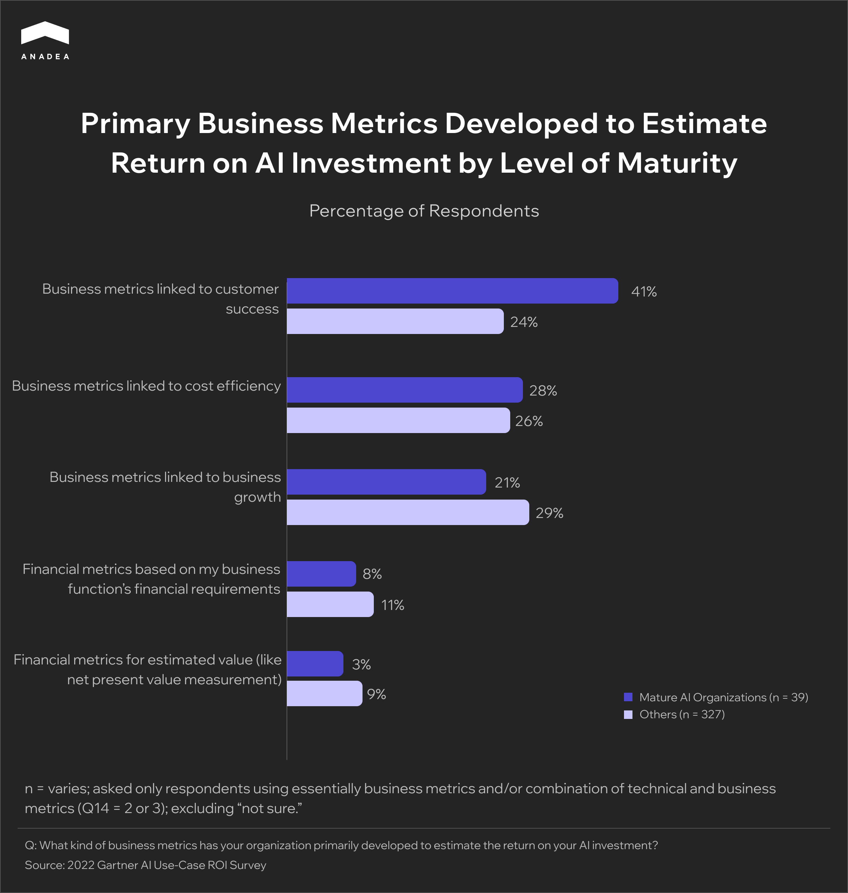
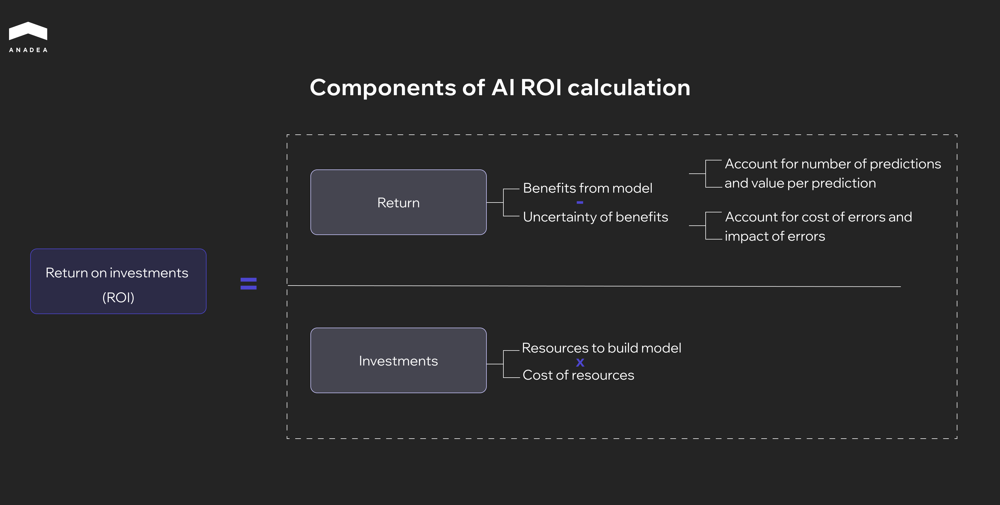

[Seventy-five percent of business leaders](https://www.ibm.com/thought-leadership/institute-business-value/en-us/report/2023-ceo) believe their competitive advantage will depend on AI. Companies of every size and sector are moving to integrate AI into their operations, and the pressure to act is coming from boards, investors, and competitors simultaneously.

But turning an AI initiative into a real competitive edge takes more than a promising use case and a motivated team. It requires knowing whether the investment is producing measurable AI business value and being able to defend that number in front of a board or an investor committee.

This article walks through the AI ROI metrics that reflect real business impact, how to set them before you build, and what a practical measurement framework looks like when the goal is not just to adopt AI but to profit from it.

## Why Most Teams Struggle to Calculate AI Business Value

Companies rarely struggle to find a use case for AI. The difficulty starts when the initiative needs to justify its own budget. A working pilot and a profitable AI deployment are two very different things, and the distance between them is almost always a measurement problem, not an engineering one.

### Baseline Before Build

The most common mistake is launching a pilot without documenting what the current process costs. How many hours does a task take today? What is the error rate? What does each error cost downstream? Without these numbers, any improvement stays anecdotal and falls apart in a board conversation.

When Anadea built an [AI agent for a US law firm](https://anadea.info/projects/ai-legal-automation) handling disability benefits cases, the baseline was specific: each case required roughly a week of manual review across hundreds of pages of medical documents. After deployment, that review took five minutes at 90% accuracy. The ROI conversation was straightforward because the starting point had been measured before anyone touched a model.

### Culture, Governance, Workflow

[IBM's Q4 2025 Think Circle report](https://www.ibm.com/downloads/documents/us-en/1550f7e8f4d0d257) concluded that culture, governance, workflow design and data strategy are the main constraints on realizing AI ROI. Not model architecture. Not compute. The same research found that 79% of executives see productivity gains from AI, but only 29% can express that productivity in financial terms.

This gap persists because most companies run AI out of the IT department. IT teams optimize for technical performance. Product teams optimize for business outcomes. When nobody owns the connection between AI performance metrics and revenue impact, the value gets created but never captured in a metric that matters to a CFO or an investor committee.

### Measuring too Early, Cutting too Soon

Nvidia CEO Jensen Huang has argued the opposite extreme, saying that demanding ROI from early AI work is like asking a child for a business plan on a hobby. For a research lab with unlimited runway, maybe. For a product team reporting to a board every quarter, that is not a realistic position. The goal is not to avoid measurement. It is to pick the right metrics for the right stage of maturity.

### What Your Infrastructure Costs Your AI

One factor that rarely appears in AI business cases is the cost of the infrastructure AI has to operate within. When a model has to work around outdated APIs, fragmented data sources and manual handoffs between systems, every integration point adds friction. The model performs well in isolation. The system it lives inside erodes the returns. Teams that address technical debt and invest in[ proper AI automation infrastructure](https://anadea.info/services/ai-automation) before deploying AI consistently see better ROI, sometimes by a significant margin, simply because the AI spends less time fighting the architecture.

## What Is AI Adoption ROI and Why It Is Hard to Measure

AI adoption ROI measures the financial and operational return a company gets from its AI investment relative to the total AI implementation cost of building, deploying and maintaining that system. The formula is familiar to anyone who has evaluated a technology investment before. But applying it to AI is harder than it appears.

Traditional IT projects have a defined scope, a fixed timeline and predictable outcomes. AI projects rarely work this way. A model that automates document review saves analyst hours immediately, but it also improves decision quality, frees capacity for higher-value work and changes how an entire team operates over the following quarters. Some of these effects are easy to quantify. Others take months to become visible and even longer to attribute to a specific investment.

This is why companies at different levels of AI maturity measure ROI differently. A Gartner AI Use-Case ROI Survey found that 41% of mature AI organizations track returns through customer success metrics, while less experienced companies spread their measurement across cost efficiency, financial models and growth indicators without a clear focus.

The implication is practical. Companies that have been through several AI deployments stop measuring purely in terms of cost savings and start measuring in terms of business outcomes. Getting the measurement approach right from the start saves months of internal debate later, when the project needs to justify its next round of funding.



## Key AI Performance Metrics That Reflect Business Value

Much of what AI produces is indirect and takes time to materialize. The most reliable AI performance metrics are the ones that connect a model's output to a business outcome a CFO can track on a quarterly basis. If a company uses AI to speed up data analysis so that leadership can make better decisions, the financial result of those decisions may not show up for months. And short-term gains can be misleading. A company that announces AI-driven workforce cuts may see a stock price bump, but that says nothing about how customers and employees will respond over the next two years.

This is why financial analysts split AI ROI into two categories: hard and soft.

### Hard ROI

Hard ROI covers tangible effects directly tied to profitability. These are concrete financial outcomes that show up on a P&L statement, can be reported to a board or an investor committee, and tracked quarter over quarter. Hard ROI answers the question that every CFO eventually asks: how much money did this save us, or how much new revenue did it generate? The calculation is usually straightforward once the right data is in place, and this is the category that determines whether an AI project gets continued funding or gets cut. Hard metrics fall into two groups: cost savings and revenue gains.

Primary metrics:

* **Labor cost reduction.** Hours saved through automation multiplied by hourly cost.
* **Operational efficiency.** Fewer manual handoffs, less rework, reduced downtime through AI-optimized operations.
* **Error and rework reduction.** The financial cost of wrong predictions or missed flags, measured before and after deployment.
* **Infrastructure optimization.** AI-driven resource allocation that reduces cloud spend, energy consumption and storage costs.
* **Lead generation and conversion rates.** Pipeline growth driven by personalization, better engagement and AI-powered recommendations.
* **New revenue streams.** AI-enabled products or services that were not viable before the deployment.
* **Faster time to market.** Shorter development and testing cycles that close the gap between investment and first revenue.

### Soft ROI

Soft ROI includes benefits that do not appear as a line item on the income statement but affect the long-term competitiveness and health of the organization. These outcomes are real, executives experience them daily, but they resist simple quantification. They are typically measured through surveys, trend analysis and qualitative assessments over longer periods. Soft ROI rarely justifies an AI investment on its own, but it often determines whether the organization captures the full value of what hard ROI alone would understate. Ignoring soft ROI means undervaluing projects that strengthen the company's ability to compete, retain talent and make better decisions over time.

Primary metrics:

* **Employee satisfaction and retention.** Higher engagement and lower turnover when AI removes repetitive, low-value tasks.
* **Decision-making quality.** More accurate and faster decisions driven by AI-powered analytics, with cumulative impact over quarters.
* **Customer satisfaction and loyalty.** Reduced churn and higher lifetime value through AI-driven personalization and support quality.
* **Organizational agility.** Faster response to market changes, regulatory shifts and competitive moves.
* **Brand perception and talent attraction.** Stronger employer brand and client trust in industries where AI maturity is becoming a selection criterion.

## How to Measure AI ROI

The PwC framework below breaks AI ROI into two components that mirror any investment calculation: return divided by investment. But each side has variables specific to AI that most teams either miss or underestimate.

