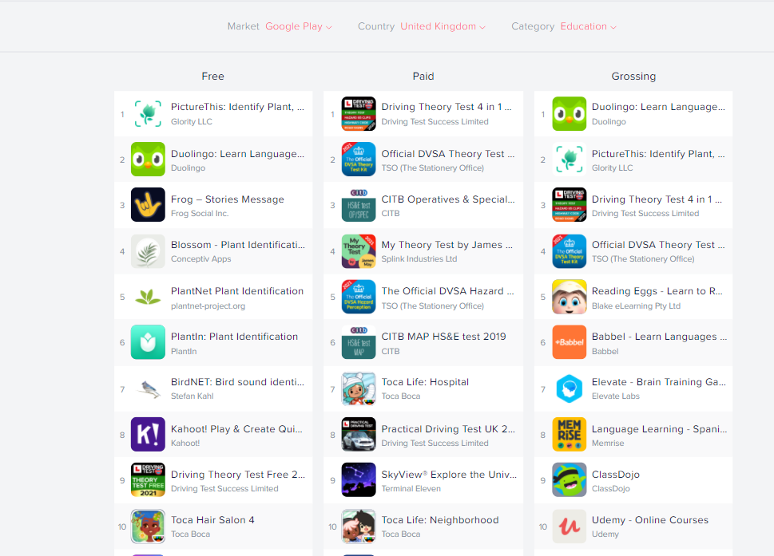
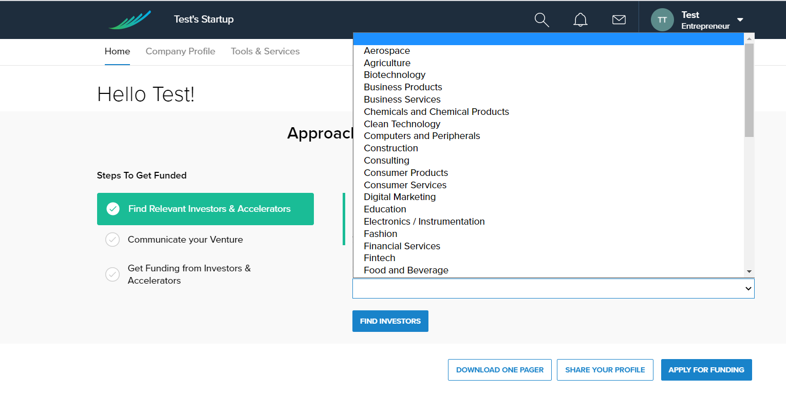
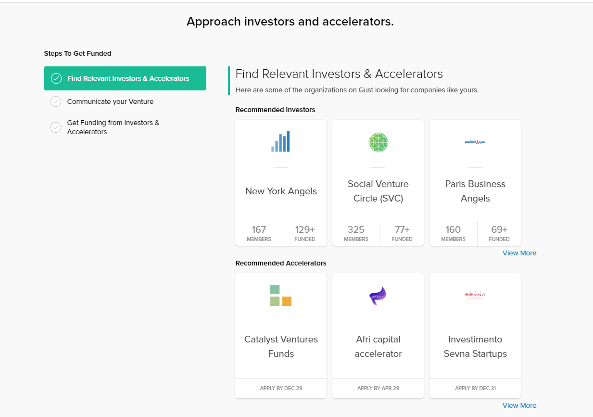

_Updated on August 11, 2022._

<h2>Table of contents</h2>
<ul>
 <li><a href="#why-edtech-startup">Why start edtech startup now</a></li>
 <li><a href="#set-direction">Step 1: Set yourself a direction where to move with the idea</a></li>
 <li><a href="#market-research">Step 2: Do market research</a></li>
 <li><a href="#product-concept">Step 3: Specify a product concept</a></li>
 <li><a href="#killer-feature">Step 4: Find a killer feature for your app</a></li>
 <li><a href="#monetization">Step 5: Think about monetization</a></li>
 <li><a href="#funding">Step 6: Get education startup funding</a></li>
 <li><a href="#elearning-developer">Step 7: Find an e-Learning development company</a></li>
 <li><a href="#metrics">Step 8: Set up measurable metrics</a></li>
 <li><a href="#fin">Conclusions</a></li>
</ul>

## Why start edtech startup now

If you are searching for the answer to 'how to start an ed tech startup', most probably you have the feeling that there was no better time for this than now. Educational institutions - private and public - are actively introducing distance learning, the number of online schools is growing, people care for self-education for building their career and promotion.

To prove it with figures, in 2019, the market size of e-learning surpassed USD 200 billion, with the industry share of e-learning (online e-learning, LMS, mobile e-learning, rapid e-learning, virtual classroom, and much more) is anticipated to grow at 8% CAGR between 2020 to 2026. The majority of the market belongs to key industry players, but there’s always space for self-made entrepreneurs and edtech startups Unicorns.

Even if you have no plans to go globally and you just have an idea for your local market, there are millions of great opportunities to find your niche and succeed. Let’s learn how to do it step by step.

## Step 1: Set yourself a direction where to move with the idea

Let’s start with who you are and what you want, as all the other steps depend on this. Answer in writing a scope of questions to set yourself a direction.

__What problem is your edtech business/solution solving?__ 
Describe why your solution will be helpful.

__What will you have that the competitors don’t?__ 
Define what’s the main reason why people should use it.

__Who will use it?__ 
Define the profile of the user your app targets. They call it ‘user persona’. To start understanding your users first you need to describe them in bulk. How to do it? One of the ways is to search for real people on social media and study their profiles, writing out what they’ve got in common. Pay attention to such characteristics as country, language, gender, age, background, education level, interests and hobbies, family composition, social background, knowledge area, or maybe even a specific education institution they belong to. Try to make it as detailed as you can.

__How to make it profitable?__ 
What will make users interested in the app? What exactly do they pay for? What’s your killer feature?

__What kind of solution do you need - web or mobile?__ 
And here you are at the crossroad of deciding whether to start with a web application or a mobile application. If your goals are to deliver content and establish a broad presence that can be easily maintained, shared between users, and found on search engines, then a mobile-friendly responsive website is a fine choice.

If your goal is to provide a user experience that needs access to a user's phone storage and native functions (GPS, camera, push notifications, offline access, etc.) you’d better opt for a mobile app.
All these technical aspects may be complicated for perception and to decide for sure it can be helpful to consult with an <a href="https://anadea.info/free-project-estimate" target="_blank">elearning app development company</a>.

## Step 2: Do market research

The first step of starting an elearning business is to find the niche in your market, investigate what’s popular in it and what it lacks.

One of the ways is to do competitive research. Look at the competitors in your region and analyze their apps: what they’ve got in common, what distinguishes them from each other, how they implement their ideas, what’s their hook for users (a unique thing you give), what’s the monetization models.

<table><tr><td width="25%"> </td><td width="25%">
Competitor 1

</td><td width="25%">
Competitor 2

</td><td width="25%">
You

</td>
</tr><tr><td>The purpose of the app
</td><td> </td><td> </td><td> </td>
</tr><tr><td>Unique features  
</td><td> </td><td> </td><td> </td>
</tr><tr><td>Monetization model
</td><td> </td><td> </td><td> </td>
</tr>
</table>

Where to find edtech companies for analysis? If your choice is to build a web solution (website, portal, progressive web apps, etc.), then go and Google it! In case you’ve decided to start with a mobile app, play with the <a href="https://www.appannie.com/en/apps/google-play/top/united-kingdom/education/" rel="nofollow" target="_blank">table, adjusting your country</a>.

After you filled the comparative table and saw the picture, you can move further to the product concept creation.

## Step 3: Specify a product concept

The main idea of building a product concept is to create a structured answer to the question: 'what solution do I want exactly' and send it to app developers who will help you with the tech part of building your app.

The product concept __must contain the core idea of your app__ without which it can’t execute its functions. In the startup world, it is called a minimum viable product (MVP). After you also decide on the features that will make your app special among others. Include these things in your product concept doc before rushing to elearning app developers:

1. Specify, describe, expand in more detail the purpose of your app;
2. Describe the target audience of the app (who is your user, how old is he or she, what is his/her background);
3. How users are going to utilize the application (do they need a permanent Internet connection, camera, GPS, etc.);
4. Specify the ways you are going to monetize your product.

> Related article: <a href="https://anadea.info/guides/what-is-mvp" target="_blank">What Is MVP and How to Build an App MVP</a>

## Step 4: Find a killer feature for your app
Building a successful education app is always about providing value to users. It’s obvious that the main purpose of education is giving the opportunity to learn something new, build new skills, or master existing ones. But __what’s the real goal of the audience__? Why do they put so much effort into it? Do they want to study a new language to get a promotion? Do they want to go to another country? Maybe they want to pass an exam to go to university? Or change a career path? What goals do they set for themselves? As soon as you formulate the real goal of their study, think of a way they will try to reach it.

It’s great when you know what is lacking to achieve the goal or you can judge about it from your previous experience. Here’s a true example of how our client, Giuseppe Ferrara, a founder of the <a href="https://anadea.info/client-interviews/promed" target="_blank">Pro-Med online education platform</a>, found a killer feature, which is a _community_ of those who want to pass a test to enter a medical university in Italy. The Pro-Med platform is designed to train applicants to pass the entry exam. Sure, there are good materials and statistics (which is by the way one more killer feature), and training tests themselves. But every student needs to find study mates and tutors to share their journey with. This possibility was lacking when Guiseppe and other co-founders of the project were preparing for the test themselves. With Pro-Med, they decided to put a lot of effort into creating a community that is really welcoming. The community feature contains a lot of advanced features like live lessons and polls.

But in the case if there’s no such previous experience you can rely on, it’s a great idea to search in forums where people give each other advice about materials, underwater rocks and difficulties they faced, how they overcame them, provide tips on learning, and share materials. Pay special attention to those questions that are frequent but remain unanswered. This may be your killer feature idea.

## Step 5: Think about monetization

Here’s the list of the most common of them depending on the solution type.

__For apps__ 
* Purchase app from the app store - users pay for a download;
* In-app advertising - earn revenue for showing third-party ads within their mobile applications;
* Freemium - open extra features for those who want them;
* In-app purchases - encourage users to buy additional content, in-app currencies, customization options, etc.;
* Subscriptions - provide access for prepaid conditions- time, amount of users, etc.;
* Data licensing - sell users behavior aggregated non-personalized data;
* Sponsorships - find sponsors and gain revenue from advertising them in your app.

__For online learning platforms, course marketplaces, SaaS, etc.__ 
* Subscriptions
* Payment per a course
* Freemium
* Advertising
* Sponsorship

Mind that you can combine them and test what works better.

## Step 6: Get education startup funding

Some startuppers have their own project start budget, others have it only partially or lack some amounts. There can be different ways to bring your project to life, from a bank loan to getting an additional job to support your startup activities. By the way, about half of startup founders have a full-time job or a part-time job and combine both. Many of them even study. For instance, Pascal Klein, a customer of Anadea and a founder of <a href="https://anadea.info/projects/ham-nat-coach" target="_blank">Ham-Nat Coach</a> continued to study at the medical university and dedicated time to his startup, working for 10-12 hours a day!

These are 5 great possibilities to find the money for your beginning:

* Angel Investors
* Government grants
* Entrepreneur support programs
* Corporate spin-offs
* Venture Capitalists
* Crowdfunding
* Bootstrapping
* Accelerators and incubators

__Government grants and entrepreneur suppose programs__ 
This is a real chance to get funding for your startup, especially in countries that actively develop the IT sector. For instance, Israel is well known for its intensive support of entrepreneurs.

__Corporate spin-offs__ 
In case you are working at a company that practices spin-offs and welcomes initiative, you can try to lead a new beginning. It’s a good option, especially since the parent company provides you not only with funds but also with human resources.

__Accelerators and incubators__ 
These kinds of institutions aim at early-stage startups with an MVP at their hands. They help to speed up the growth, establish processes and a business model, and sometimes connect founders with venture funds.

__Crowdfunding__ 
Take your chances on platforms like <a href="https://www.indiegogo.com/" target="_blank" rel="nofollow">Indiegogo</a>, <a href="https://www.kickstarter.com/" target="_blank" rel="nofollow">Kickstarter</a>, and <a href="https://www.seedinvest.com/" target="_blank" rel="nofollow">SeedInvest Technology</a>. It’s not rare when a startup with an elegant and thought-through pitch attracts attention and gets funding, especially when the sum you ask is not astronomical.

__Bootstrapping__ 
It’s a situation when you rely on your personal finances while building the company. Still, many bootstrappers turn to business bank loans or any other way to get funding.

__Angel investors and venture funds__ 
In case you need fundraising for your education startup, you can consider the option of finding an e learning business angel or venture fund online through investment platforms like:

* AngelList
* Gust
* Wefunder
* SeedInvest
* StartEngine
* Republic and many other options

## Step 7: Find an <a href="https://anadea.info/solutions/e-learning-software-development" target="_blank">e-Learning development company</a>

Finding a development company for your startup is not a big deal today, as there are lots of them in the market - just open a listing like <a href="https://www.goodfirms.co/app-development/education" rel="nofollow" target="_blank">GoodFirms</a>, for example. The main part is to make the right choice. Find the good tips and points to check:

* Company’s portfolio in education domain - check the variety, the size of projects, the number of projects, do they still exist or gone, have they ever appeared in the market).
* Company’s awards and achievements in edtech development.
* Using Linkedin Free Premium Version you can spy on how’s company feeling - for instance, preliminary assess the senioritis of the team.

You can also investigate <a href="https://clutch.co/profile/anadea" rel="nofollow" target="_blank">reviews on Clutch</a>, paying special attention to what the clients admit about the process of collaboration - communication, command of English, team availability, speed of problem solving and things like that.

When you’ve decided on the education app development company, send a project estimate request containing your initial Product Concept. It will help the development team assess the preliminary budget more accurately.

Sometimes, a vendor can suggest you start with a __Discovery Phase__ for big-scale projects. It’s short-term activities that are fulfilled by a Business Analyst and the development team to investigate the requirements and details of the project.

The Discovery Phase runs before development and its deliverables are:

* Elaborated, finalized, and confirmed project __Vision and Scope Document__ (the document identifies the project as the result - ultimate purpose and form of the system as well as what’s in and what’s out for the project);
* __MVP scope__ (what features will be included in the first priority and what will go to the next releases) and __backlog__ (is the list of epics - functional parts of the system- and user stories - detailed requirements for developing functionality with business value);
* __UX/UI concept__ (what your solution will look like and feel like);
* __Project Roadmap and release plan__ (project stages, key dates, deadlines, list of system documentation, etc.);
* __Plan of communication and collaboration__ with all the involved parties, taking into account their availability, importance, and responsibility;
* __Backlog__ (including user stories, with acceptance criteria and designs, based on clear and confirmed; requirements) is built for the very first sprints. Sprint is a time interval in which a piece of functionality is developed, ready for production.

Requirements that won't be elaborated and finalized will be worked on after development is started. In other words, the discovery phase will continue, while the team is building a solution. Backlog is ongoingly prepared for further development.

## Step 8: Set up measurable metrics

There are a number of universal metrics to start measuring. Understanding them, gathering and measuring will provide you an opportunity to make competent decisions and navigate in the sea of suspense. They are:

* Number of new users and dynamics.
* Number of active users and dynamics.
* Number of bounced users and dynamics.
* User retention rate. User Retention Rate refers to the percentage of customers who continue paying for a product over a given timeframe.
* Churn rate. It’s the rate at which customers stop buying from your startup over a given period of time.
* Users to customers conversion rate. The rate that reflects a share of users who become customers.
* Average check per customer. Revenue is divided by the number of customers.
* Customer acquisition cost. It shows how much it costs you to attract 1 customer on average. Expenses on acquisition divided by number of customers.
* Monthly expenses.
* Monthly revenue.
* Net income. It reflects all income minus expenses and taxes.

You can use Google Analytics to gather metrics that are related to users. Others should be gathered and calculated, especially those connected to finances.

## Conclusions

After the successful launch, a startup needs to struggle for success really hard. What you’ll need further are activities to develop your product, business, and service.

In the case of an education mobile app, you’ll need to work hard on the <a href="https://anadea.info/guides/app-store-ranking-factors" target="_blank">app store optimization</a> (ASO) and app user satisfaction by adding new features and altering your app after A/B tests.

In case you decide to create a web solution, you’ll need to create or buy qualitative courses, partner with universities and lectors, spend on marketing, online promotion, and SEO.

Anyway, at least now you’ve got an overall notion of how to start an education startup.

Let's discuss your idea

