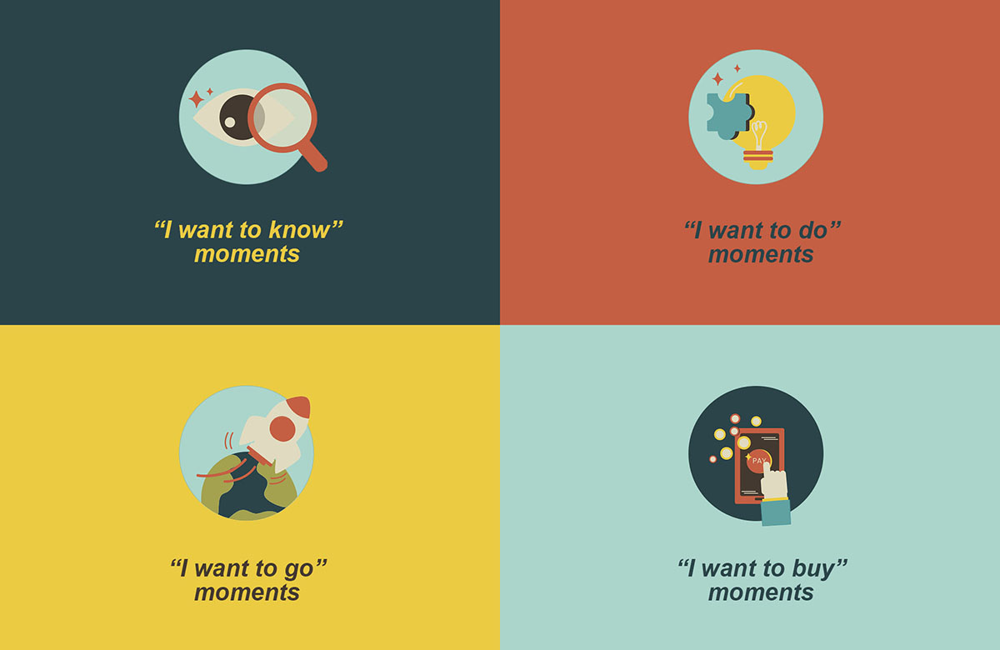
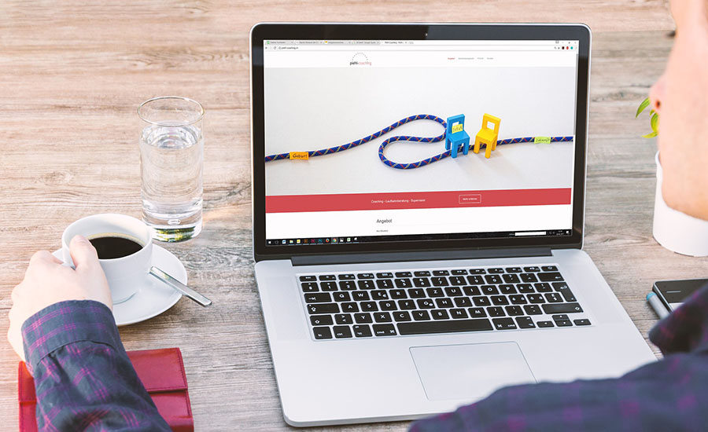

What are micro moments? To put it simply, a micro-moment, <a href="https://www.thinkwithgoogle.com/marketing-strategies/micro-moments/" target="_blank">as Google defines it</a>, occurs when people turn to their devices in order to act on a need they have. These needs can include wanting to learn, do, buy or watch something.

Micro-moments have become a big marketing trend precisely because smart devices, such as phones and tablets, have become an important part of people’s lives. As consumers increasingly get tired of emails, notifications, and ads, the market reaches a sort of saturation. People can’t be fed more information than they already receive, because they simply don’t have any more time left to absorb it. This means that marketers have to come up with new ways to capture consumers’ attention. But how can you efficiently include micro-moments in your website design?

## Start by categorizing micro-moments

Micro-moments have been sorted out into four main categories, based on the overall consumer needs:

* **I want to know** - This refers to the moment when a customer is researching something online, but not with the intention to necessarily make a purchase. They want to get information on a certain topic.
* **I want to do** - When they want to do something, consumers look for websites that can help them complete a certain task or try out a new experience.
* **I want to go** - When a customer has the need to do something, they go online to find a local business to meet those needs, such as restaurants, stores or movie theatres.
* **I want to buy** - This handles the consumers’ need to buy something. They want assistance in deciding what to purchase and how to do it.

In order to take advantage of micro-moments and build more effective, persuasive UX, you need to understand that they are not brand-related, but rather consumer-related.

---

*Related read:* ***[Emotionally Intelligent Design: Why You Need It in Your App](https://anadea.info/blog/emotionally-intelligent-design-why-you-need-it-in-your-mobile-app)***

---

## Understand the needs of your visitors

It is possible for you to satisfy all the four needs customers have, but in order to determine this, you need to first identify why they come to your website. To do so, you need to <a href="https://blog.hubspot.com/service/customer-behavior-analysis" target="_blank">analyze the customers’ behavior</a> and see what needs your website satisfies best.

One way to identify the micro-moments that your website should focus on is to have a look at the 5 Ws:

* **Who** - Identify your target audience based on their demographics and their pain points. Determine who are the people visiting your website the most and their common traits.
* **What** - Look at what your visitors search for before stumbling upon your website, based on the keywords they use. Keep in mind that people often look for similar things, but the way they phrase it is different.
* **When** - This focuses more on the “I want to go” micro-moments. When people are interested in a particular place, they will be looking for opening hours or certain events. You need to be aware of this, in order to determine when it’s best to launch a campaign or promote an event.
* **Where** - By finding out where people are when searching for your website, you will be able to determine the profile of your visitors. For example, you might find out that people look for your restaurant from the office building nearby and most of your clients come from there.
* **Why** - The reason a consumer looks on your website should be answered by the results to the other 4 Ws above. When you find out why people go to your website, you can focus on personalizing it to their needs.

## Design based on those specific needs

Once you have identified the most common reasons people reach your website, it’s time to design based on them. *“People need immediate answers when they look for something online, so in order to make sure they keep coming back to your website, you need to satisfy those needs in the fastest and easiest way possible,”* explains Mark Reed, web designer at <a href="https://www.topwritersreview.com/top-10-essay-writing-services/" target="_blank">Top Writers Review</a>.

If a visitor has reached your website in order to learn something, you need to focus on feeding them that information right away. Whether you have a very good topics page on your blog, which categorizes your content, a detailed FAQ section, or a search bar, make sure you have those featured on the landing page. Make sure these sections are easy to spot and use.

To handle the need to do something or go somewhere, make sure your opening hours are listed somewhere where they can be visible to the customers. If you have any events going on, list them on the landing page as well. You can also choose to have a separate page for events, but have it available on the home page too.

When customers want to purchase something, they will be looking for products straight away. Feature your best products on the home page or use content personalization to show items the customer might be interested in based on their previous interactions. Split your products into categories and make sure you have optimized the search features well enough for them to easily find what they are looking for.

---

*Related read:* ***[Retail Business Goes Mobile: How to Create a Good Retail App?](https://anadea.info/blog/retail-business-goes-mobile-how-to-create-a-good-retail-app)***

---

## Focus on personalization

In order to form a relationship with your visitors, you need to focus on creating personalized interaction. This means displaying products or content they might be interested in on the first page of your website. When a customer decides to make a purchase, there is an 80% chance they have already been on your website at least once before. This means that the next time they access it, you have to give them the feeling that you already know them.

Keep in mind that most people use tablets or mobile devices to access web pages, so make sure your website is responsive enough to meet those needs and has been optimized for small devices. Focus on user experience when working on the <a href="https://anadea.info/services/ui-ux-design">website design</a> and make sure you provide the same type of high-quality experience for every type of device.

When choosing headlines or titles for your articles, make sure to keep them short, but interesting. You want to attract viewers’ attention and you won’t be able to do so with long lines of text. You can also make use of images and infographics, but make sure they have been optimized well enough to look good on both small and large screens.

---

*Related read:* ***[How to Build a Travel App That Wins Customer Loyalty](https://anadea.info/blog/how-to-build-a-travel-app-that-wins-customer-loyalty)***

---

## Take advantage of micro-moments

Micro-moments marketing is a way to turn the experience users have on your website towards a more consumer-focused one and improve your visitors’ number, as well as conversion rates. In today’s fast-paced world, this should be an indispensable marketing strategy, in order to satisfy the customers’ need for fast-delivered information.

 

---
*This is a guest post by **<a href="https://twitter.com/JamesScottEsp" target="_blank">James Scott</a>.** James is an independent blogger and professional marketer. He is passionate about professional and agile team management. Even the smallest member of the team can change everything, so a wise manager should do their best to deliver the best working experience for everyone.*
