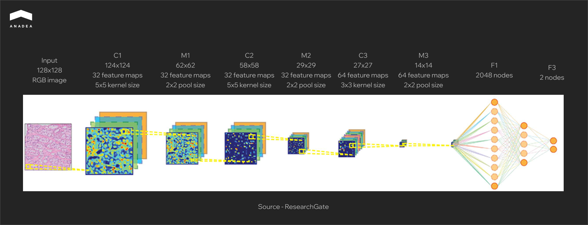
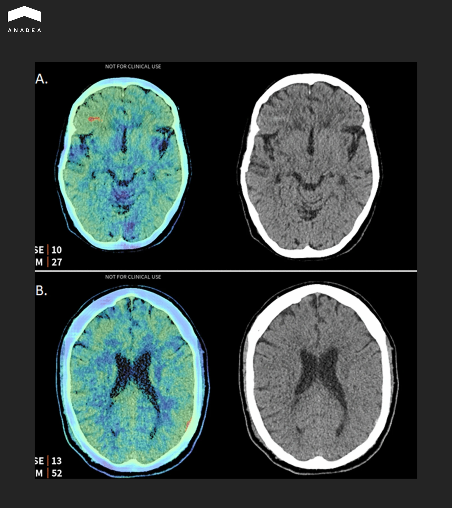
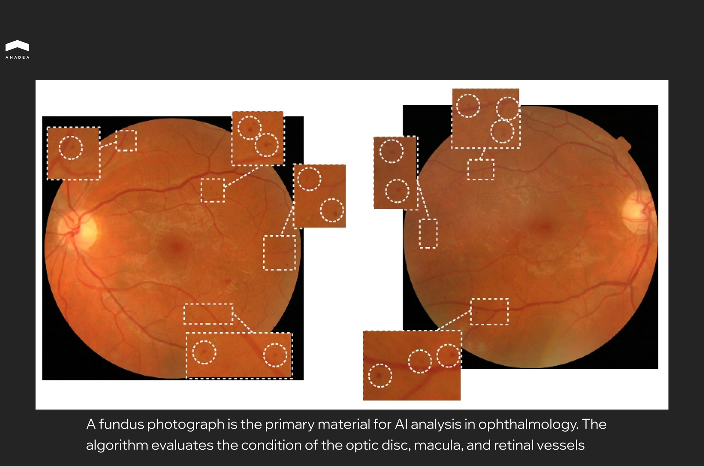

Every year, medical facilities worldwide generate billions of diagnostic images – X-rays, CT scans, MRIs, mammograms. Behind each one is a patient awaiting an accurate diagnosis. Research shows that [10 to 15 percent of medical diagnoses contain errors](https://www.mondaq.com/unitedstates/healthcare/1585356/missed-diagnosis-in-the-medical-field-how-often-does-it-happen-what-are-the-outcomes), and approximately [795,000 Americans](https://www.insideprecisionmedicine.com/news-and-features/795000-americans-die-or-are-disabled-each-year-due-to-diagnostic-errors) annually suffer serious harm or die due to misdiagnosis.

AI-powered image recognition in healthcare is gradually changing this landscape. Machine learning algorithms can detect pathologies that the human eye might miss due to fatigue or excessive workload. As of late 2024, the [FDA had approved over a thousand AI-enabled medical devices](https://www.fda.gov/medical-devices/software-medical-device-samd/artificial-intelligence-enabled-medical-devices), with roughly 80 percent dedicated specifically to radiology and medical imaging.

In this article, we'll explore how image recognition technologies are transforming diagnostics, where they're already delivering real results, and what companies planning to implement such solutions in their products or processes need to consider.

## How Image Recognition in Healthcare Works

Behind every AI solution for medical image analysis lies deep learning technology. At its core are convolutional neural networks, or CNNs, an architecture specifically designed for working with visual data.

The principle behind how such a network operates can be explained quite simply. The algorithm receives an image as input, say a chest X-ray, and passes it through dozens of sequential processing layers. Each layer performs a specific task. The first layers recognize basic elements such as lines and contours, the next ones form more complex patterns, and the deeper layers identify specific anatomical structures or abnormalities. At the output, the network delivers a result: the probability of a pathology being present, its localization, or classification by type.

The key advantage of deep learning is its ability to independently determine which features in an image are important for diagnosis. CNNs learn from examples and form their own internal recognition rules.

The diagram below shows a typical CNN architecture for analyzing histological images. An input tissue sample measuring 128×128 pixels passes sequentially through convolutional layers (labeled C), where the algorithm extracts local features such as cell boundaries, textures, and characteristic staining patterns. Pooling layers (M) reduce data dimensionality while preserving the most important information. In the final stage, fully connected layers (F) aggregate all detected features and produce a classification result. The two output nodes correspond to two possible states: normal or pathology.

### Types of Medical Images

Modern systems analyze virtually the entire spectrum of diagnostic imaging:

* Radiography and fluorography represent the most common type of examination, ideal for screening lung diseases and detecting fractures. 
* Computed tomography (CT) provides layered images with high detail for oncology, cardiology, and traumatology. 
* Magnetic resonance imaging (MRI) offers the best visualization of soft tissues and is indispensable in neurology and orthopedics.
* Ultrasound examinations are a safe method for obstetrics, cardiology, and abdominal organ studies. 
* Mammography is a specialized screening method for breast tissue. 
* Histopathology involves microscopic images of tissue sections for oncological diagnosis. 
* Ophthalmoscopy produces retinal images for detecting diabetic retinopathy and other conditions.

Each modality has its own specifics, including different resolution, contrast, and typical artifacts. Accordingly, separate models are developed and trained for each type of image.

## Key Areas of Image Recognition in Healthcare

Image recognition technologies are already actively working in clinical practice. Let us examine the areas where AI demonstrates the most compelling results.

### Radiology and Diagnostic Imaging

Radiology became the first medical specialty where AI gained widespread clinical adoption. The reasons include the enormous volumes of visual data, standardized examination protocols, and a chronic shortage of specialists.

* Pathology detection. Algorithms analyze X-rays, CT scans, and MRI images to identify tumors, fractures, focal lung changes, and other abnormalities. The model does not replace the radiologist. Instead, it marks areas requiring attention, reducing interpretation time and lowering the risk of missed findings.
* Lung cancer screening. Low-dose CT remains the primary tool for early lung cancer detection in high-risk patients. AI systems automatically segment lung tissue, detect nodules, and classify them according to the Lung-RADS scale. This allows for standardized assessment and reduces variability between different specialists.
* Prioritization of critical cases. A separate class of solutions involves automatic triage systems. Products from [Aidoc](https://www.aidoc.com/eu/), [Viz.ai](http://viz.ai), and [RapidAI](https://www.rapidai.com/) integrate with PACS, analyze studies in real time, and send notifications when urgent conditions are detected, such as intracranial hemorrhages, large vessel occlusions, or pulmonary embolism.

The image below shows an example of such a system in action. The Aidoc algorithm analyzed a brain CT study and detected two hemorrhages that were missed during the initial reading by the radiologist. The left side of each pair shows a saliency map indicating the areas where the algorithm focused its attention. The right side shows the original CT slice.

### Ophthalmology

In 2018, the [IDx-DR system](https://www.healthvisors.com/en/idx-dr/) became the first AI device that the FDA approved for autonomous use without mandatory confirmation by a physician. Since then, ophthalmology has remained one of the leading fields in the clinical adoption of such technologies.

These algorithms work with fundus images, detecting signs of diabetic retinopathy, glaucoma, and age related macular degeneration. These are conditions that show no symptoms in their early stages but lead to blindness if left untreated.

The practical value lies in the ability to bring screening beyond the walls of specialized ophthalmology clinics. A fundus camera in a family physician's office, a photograph, and a result within a minute. Patients with suspected pathology receive a referral to a specialist, while the rest continue with routine monitoring. For regions with a shortage of specialists, this is a game changer. The platform works with standard images and does not require expensive equipment.

### Dermatology

Dermatology has a natural advantage when it comes to AI diagnostics. Skin lesions are visible to the naked eye and easy to photograph. This simplifies data collection for training models and opens the door to mass screening via smartphones.

The main focus is the early detection of melanoma. This type of skin cancer responds well to treatment in its initial stages but progresses rapidly without intervention. At the same time, visually distinguishing melanoma from a common mole is difficult even for experienced physicians.

AI systems analyze dermoscopic images, which are photographs taken through a specialized lens with illumination that reveals structures beneath the skin's surface. Algorithms assess the shape, color, symmetry, and texture of the lesion, comparing them against patterns in a reference database.

In 2024, Swedish researchers tested the [mobile application Dermalyser](https://pubmed.ncbi.nlm.nih.gov/38234043/) under real world conditions in primary care settings. Family physicians used it to evaluate suspicious lesions following their own clinical examination. The system detected all invasive melanomas in the sample, and its negative predictive value reached 99.5 percent. In other words, a low risk assessment from the algorithm almost certainly meant the absence of melanoma.

### Pathology

A cancer diagnosis almost always passes through a pathologist, a specialist who examines tissue sections under a microscope. This is painstaking work. A single specimen can contain millions of cells, and the task is to identify those that are malignant.

Digital pathology makes it possible to scan glass slides into ultra high resolution images. AI analyzes these files and flags areas that warrant closer inspection. Rather than reviewing the entire surface of the section manually, the pathologist immediately sees the zones with the highest likelihood of pathology.

[Paige Prostate](https://www.businesswire.com/news/home/20210922005369/en/Paige-Receives-First-Ever-FDA-Approval-for-AI-Product-in-Digital-Pathology) became the first AI tool in digital pathology to receive FDA approval in 2021. In clinical studies, its use helped pathologists reduce the number of missed positive prostate cancer cases [by approximately 70 percent](https://www.paige.ai/press-releases/paige-publishes-data-supporting-first-fda-authorized-ai-software-for-digital-pathology) compared to assessment without AI support. At the same time, the final diagnostic decision always remains with the physician. The algorithm merely highlights suspicious areas and narrows the search field.

For laboratories operating at capacity, this offers a way to process more samples without hiring additional staff. The shortage of pathologists is a real problem in many countries, and AI helps to partially address it.

### Surgery

Unlike diagnostic applications, AI in surgery currently operates primarily in an assistant mode rather than as an independent performer. Algorithms analyze video feeds from laparoscopic cameras or surgical robots and provide the surgeon with additional information in real time.

Typical tasks include recognizing anatomical structures, tracking instruments, and identifying surgical phases. The system can highlight critical zones where vessels or nerves are located and warn when instruments approach them. This is particularly valuable in minimally invasive surgery, where the surgeon views the operative field only through a camera.

Medtronic has integrated such capabilities into its [Touch Surgery system](https://www.medtronic.com/en-us/healthcare-professionals/specialties/touch-surgery.html). The platform records surgical videos, analyzes them using AI, and generates reports on technique execution. Surgeons can review their own procedures, compare them against benchmark cases, and identify areas for improvement.

Autonomous surgery, in which a robot performs manipulations without direct human control, remains experimental. Current systems such as [da Vinci](https://acibademinternational.com/medical-technology/da-vinci/) and [Hugo](https://www.medtronic.com/en-us/healthcare-professionals/specialties/surgical-robotics/hugo-robotic-assisted-surgery.html) operate in a master and slave configuration. The surgeon controls every movement while the robot provides precision and tremor filtration. AI currently augments this process with analytics but does not replace the operator.

Beyond image recognition, AI is entering other areas of clinical practice. [Autonomous AI agents](https://anadea.info/blog/ai-agents-for-healthcare/) are beginning to handle routine tasks like appointment scheduling, patient triage, and documentation – freeing physicians to focus on diagnosis and treatment.



## Custom Development or Off the Shelf Solution

There are relatively few commercial AI products for image recognition in healthcare on the market. Most of them are narrow tools designed for a specific task, such as retinopathy screening, fracture detection, or mammogram analysis. A universal solution that can be adapted to the needs of a particular clinic essentially does not exist.

And even when a product technically fits, it remains a black box. The algorithm was trained on someone else's data, with different equipment and a different patient population. Retraining it to match your own specifics or extending it to new image types is simply not possible.

A custom image recognition model is built on an organization's internal data. It accounts for the characteristics of the equipment, image quality, and the pathologies most common in the region. Over time, accuracy improves because the model continues to learn from new cases.

Most importantly, it is an asset that stays in house. A competitor can purchase the same commercial product within a week. Replicating a model trained on five years of unique clinical data is another matter entirely.

This does not require building an AI team from scratch. Companies that specialize in [healthcare software development](https://anadea.info/solutions/healthcare-software-development) already have experience in computer vision, working with medical data formats, and navigating regulatory requirements. Partnering with such a vendor allows you to obtain a proprietary product without years of accumulating expertise internally.

Choosing the right partner is critical. If you are evaluating options, this overview of [top healthcare software development companies](https://anadea.info/blog/top-healthcare-software-development-companies/) can help narrow the search.

## ​​Conclusion

Over a thousand FDA approved devices, tens of thousands of clinics around the world are already using these tools on a daily basis. Radiologists work with systems that automatically prioritize critical cases. Family physicians screen for diabetic retinopathy without referring patients to an ophthalmologist. Pathologists process more samples because the algorithm handles the initial review.

The technology has matured, but the market is far from saturated. Commercial products cover only a portion of use cases, and most of them cannot be adapted to the specifics of a particular organization. This creates an opportunity for those willing to invest in custom solutions built on internal data, integrated with existing workflows, and capable of evolving alongside business needs.

If you are considering image recognition as part of your product or want to understand whether such an investment makes sense for your situation,[ reach out to us](https://anadea.info/contacts). We can discuss where to start.
