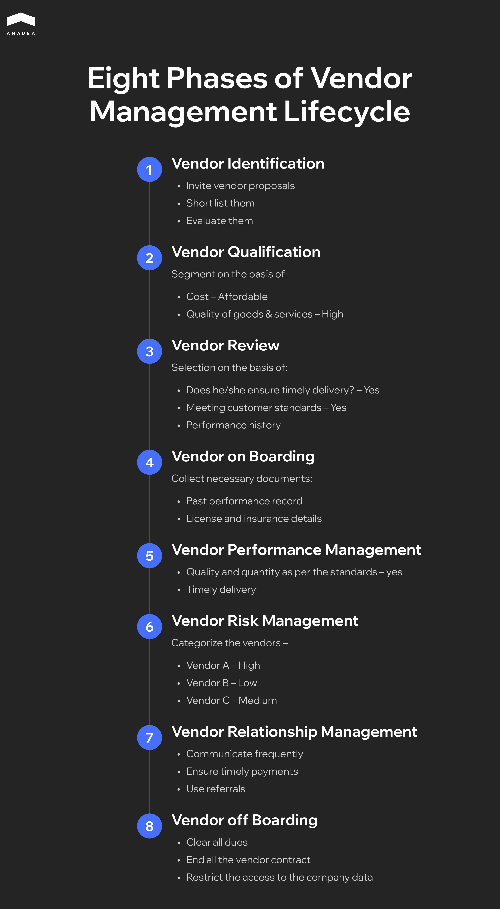
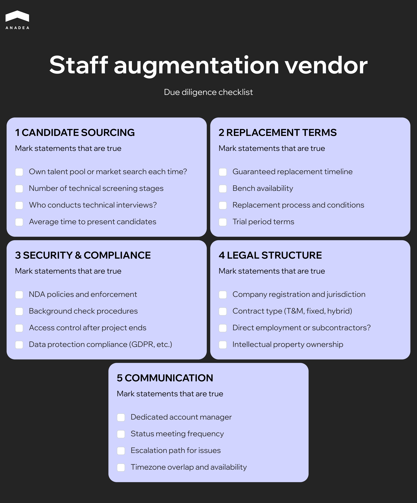

In 2024, [30% of all data breaches originated from third-party vendors](https://www.verizon.com/business/resources/reports/dbir/) – double the figure from the year before.

Companies spend months building their own security systems, hire expensive specialists, implement complex processes and then hand over repository access to a team they found in a week on Clutch. No proper SLA, no clear understanding of who's responsible for what, no plan for when things go sideways.

[Staff augmentation](https://anadea.info/services/staff-augmentation) is particularly vulnerable here. External developers sit inside your systems, see your code, work with your data. They're part of the team, yet legally and operationally they remain outsiders. And if your IT vendor management comes down to a signed NDA and a monthly invoice, problems are just a matter of time.

This guide is about IT vendor management strategy that makes staff augmentation deliver results.

## What is IT Vendor Management

What is IT vendor management? It is a system of processes aimed at selecting, evaluating, controlling, and developing relationships with external suppliers of technology products and services. It encompasses contract management, performance monitoring, IT vendor risk management, and cost optimization across all stages of collaboration.

You can get by without formalized IT vendor management. As long as you have two or three vendors, everyone knows each other, and the scope is small. But companies grow. New projects appear, new tools, new teams. And suddenly it turns out that nobody really knows how many vendors the company actually has. That licenses are purchased chaotically and often duplicate each other. That system access is still held by people who left the project six months ago. That contract terms haven't been reviewed since signing, even though the business has changed completely.

IT vendor management exists so that these situations don't come as a surprise. So that it's clear who is responsible for what, what the company is getting for its money, and what risks it takes on when working with each specific supplier.

### Types of Vendors

**Product vendors** supply ready-made solutions. Cloud platforms, CRMs, analytics tools, development environments. The key questions here are about licensing, compatibility with existing infrastructure, and dependency on a particular provider. 

**Service vendors** deliver work.[ Custom software development](https://anadea.info/services/custom-software-development), technical support, consulting, audits. The company receives the outcome, while the process stays on the vendor's side.

**Staff augmentation providers** supply specialists who work as part of the client's internal team. Formally, these are external people, but in practice they are integrated into daily workflows, have access to systems and code, and report to internal management. This format requires special attention to IT vendor risk management: candidate vetting, data security, and the terms for rapid scaling or replacing specialists.

## Vendor Selection: How to Choose the Right Partner

Vendor selection often comes down to two things: who offered the better price and who made a nicer impression during the meeting. Both criteria have their place, but relying on them alone is a gamble. Especially when it comes to staff augmentation, where a wrong choice means strangers in your code.

### Evaluation Criteria

1. **Technical expertise** is verified through specifics, not slide decks. What projects have they done in your domain. What tech stack they use. How their development process is organized. Ask to speak directly with engineers, not just sales. The level of that conversation will immediately reveal the real level of the team.
2. **Cultural fit** sounds abstract, but it's really about daily communication. How quickly they respond. How they react to changing requirements. Whether they're willing to push back and explain why, or just nod along to everything.
3. **Financial stability** of a vendor is rarely checked, which is a mistake. A company on the edge of profitability can lose key specialists or shut down entirely. Ask about headcount, growth trajectory, major clients.
4. **References** should not just be requested but actually called. Polished testimonials on a website won't tell you much. A conversation with someone who worked with this vendor for a year or two will give you a picture that no presentation ever could. Ask about problems, not just successes.

### Due Diligence Checklist for Staff Augmentation Providers

Beyond standard criteria, staff augmentation has its own specifics. Here's what to look at before signing a contract:

* **Candidate sourcing process.** How exactly the vendor finds people. Whether they have their own talent pool or search from scratch every time. How many stages of technical screening candidates go through. Who conducts technical interviews and what's their level.
* **Specialist replacement.** What happens if someone doesn't work out or decides to leave. What replacement timeline the vendor guarantees. Whether there's a bench of available specialists or you'll be waiting a month for a new candidate.
* **Security and compliance.** How the vendor handles NDAs. What security policies exist at the company level. Whether specialists undergo background checks. How access to client systems is controlled after a project ends.
* **Legal structure.** Where the company is registered. What type of contract they offer. Who employs the specialists: the vendor itself or subcontractors. How intellectual property matters are handled.
* **Communication and management.** Whether there will be a dedicated account manager. How often status meetings happen. Where to escalate issues when something goes wrong.

### Red Flags to Watch For

Certain signals should raise concerns before collaboration even begins.

1. Certain signals should raise concerns before collaboration even begins.
2. The vendor promises to fill any position within a week. Either speed comes at the cost of quality, or they're simply telling you what you want to hear.
3. All technical questions are answered by the sales manager, and speaking with engineers isn't possible at the moment. Usually this means there's no one worth showing.
4. References are only available under NDA or are confidential. If a company has been operating for years, there should definitely be clients willing to confirm that publicly.
5. Pricing is significantly below market with no clear explanation why. A low rate almost always means either low qualifications, high turnover, or hidden additional charges.
6. The contract is written so that all risks fall on your side. No replacement guarantees, vague SLAs, unclear termination terms.

### Pilot Project as a Validation Tool

The best way to verify a vendor is to work with them on a limited scope before making long-term commitments. A pilot project lasting one to two months will show more than a dozen meetings and presentations.

Choose a task that is representative enough but not critical to the business. Let the team work in conditions as close to real as possible. Evaluate not just the outcome but also the process: how they communicate, how they respond to feedback, how they handle unexpected changes.



## Contract Terms and SLA

Contracts with staff augmentation providers are often signed using the vendor's template. A quick glance at the main points, a signature, and off you go. Problems come later, when it turns out that replacement conditions are vague, code ownership isn't specified, and exiting the contract without losses is nearly impossible. A clear IT vendor management policy helps avoid these situations.

### Key Contract Points

1. **Scope of services.** What exactly the vendor commits to providing. Not just developers of a certain level, but specific requirements for skills, experience, availability. The more detailed the expectations, the less room for misunderstanding.
2. **Pricing model.** Hourly payment, fixed monthly rate, or a hybrid model. What's included in the rate and what costs extra. How overtime, vacations, and sick leave are calculated. Conditions and frequency for rate revisions.
3. **Intellectual property.** Who owns the code written by external specialists. By default this should be the client, but not all contracts reflect that. It's also important to include confidentiality obligations and prohibit using the work for other clients.
4. **Exit clauses.** Termination conditions for both parties. Notice period required. Whether there are penalties for early termination. What happens with knowledge transfer and access rights after the collaboration ends.

A contract without clear exit clauses turns you into a hostage of the vendor relationship. Even if the collaboration isn't working, leaving becomes so expensive and painful that it's easier to put up with the situation.

### SLA for Augmented Teams

SLA (Service Level Agreement) is a formalized agreement between a client and a service provider that defines the expected level of service. The document captures specific quality metrics, timelines for meeting obligations, problem resolution procedures, and each party's liability in case of breaches. An SLA turns abstract promises into measurable indicators with clear consequences.

With staff augmentation, SLAs differ from standard technical service agreements. Here you're not buying uptime or system response speed. You're buying people and their work.

* **Response time.** How quickly the vendor responds to requests. How long it takes to find a replacement. Maximum response time for escalated issues.
* **Quality metrics.** Developer work quality is hard to formalize. But you can agree on specific things: percentage of pull requests accepted without rework, adherence to code review standards, participation in team processes.
* **Availability.** Minimum percentage of working hours when the specialist must be available. Rules for vacations and client approval. Timezone overlap with the client.
* **Retention commitments.** Some vendors are willing to commit to keeping specialists on a project for a defined period. This reduces the risk of constant rotation and knowledge loss.

## Operational Vendor Management

Signing a contract and agreeing on SLAs is not enough. The real work starts after, and this is where most companies lose control. One vendor gradually becomes a black box that only a single manager communicates with. Another grows to ten specialists, but nobody tracks their productivity systematically. A third quietly invoices for people who have barely done anything for a month.

Operational management is a core part of IT vendor management best practices. It exists to keep vendor collaboration manageable, transparent, and beneficial over the long haul, not just the first two months.

### Governance Model

It should be clear who is responsible for what. On the client side and on the vendor side.

**Vendor manager** on your side oversees the relationship with the provider, monitors contract compliance, initiates reviews of terms. This can be a dedicated role or part of a procurement or delivery manager's responsibilities.

**Account manager** on the vendor side is your entry point for all organizational matters: replacements, team expansion, escalations, contract revisions.

**Technical lead** or **team lead** from both sides ensures quality of daily work: code, processes, communication within the team.

Without clear role distribution, issues hang in limbo, problems escalate slowly, and accountability gets diluted among people who assume it's not their responsibility.

### Regular Reviews and Performance Tracking

Vendor evaluation cannot be sporadic or based on gut feelings. You need a system that works continuously.

**Weekly syncs** between tech leads from both sides keep a pulse on current work: blockers, quality, velocity.

**Monthly reviews** at management level provide a broader picture: whether SLAs are being met, productivity trends, systemic issues.

**Quarterly business reviews** allow for strategic evaluation: whether both parties are satisfied, whether the team needs to scale, whether contract terms need revisiting.

Track what actually impacts results, not everything: team velocity, bug count and severity, deadline adherence, ramp-up time for new specialists. IT vendor management software like Gatekeeper, Onspring, or Venminder can automate data collection and reporting.

### One Vendor or Several

When there's more than one external team, a question arises: how to organize management across them.

**Centralized approach** means a single point of control. One vendor manager or department handles all providers, uses standardized evaluation processes, unified contract templates, a shared monitoring system. This brings consistency and makes it easier to compare vendors against each other.

**Decentralized approach** leaves vendor management at the level of individual teams or departments. Each product team chooses their own providers and builds relationships with them. This offers flexibility but complicates oversight at the company level and often leads to duplicated spending.

Most mid-sized companies arrive at a hybrid model: strategic decisions and contract terms are centralized, while day-to-day management stays with the teams.

<table>

<tbody>

<tr>

<td>

<strong>Criteria</strong>

</td>

<td>

<strong>Centralized</strong>

</td>

<td>

<strong>Decentralized</strong>

</td>

</tr>

<tr>

<td>

Budget control

</td>

<td>

Full visibility of spending across all vendors. Easier to spot duplication and negotiate volume discounts

</td>

<td>

Costs scattered across departments. Hard to get a complete picture and optimize

</td>

</tr>

<tr>

<td>

Decision speed

</td>

<td>

Requires approvals and procedures. Can slow down urgent team needs

</td>

<td>

Teams decide independently who to engage and when. Fast reaction to changes

</td>

</tr>

<tr>

<td>

Processes and documentation

</td>

<td>

Standardized contracts, SLAs, onboarding procedures. Fewer legal risks

</td>

<td>

Each team invents their own approaches. Different contract terms with different vendors

</td>

</tr>

<tr>

<td>

Flexibility

</td>

<td>

Limited to choosing from an approved pool. New vendors require time for approval

</td>

<td>

Full freedom to choose based on specific project needs

</td>

</tr>

<tr>

<td>

Scaling

</td>

<td>

Easier to scale proven vendors to new projects

</td>

<td>

Each new project starts the search from scratch

</td>

</tr>

<tr>

<td>

People dependency

</td>

<td>

Process works regardless of who manages it

</td>

<td>

Vendor knowledge concentrated in specific individuals. Their departure creates problems

</td>

</tr>

</tbody>

</table>

The right model depends on company size, number of vendors, and internal maturity. What matters most is having a conscious IT vendor management strategy rather than chaos that formed on its own.

## Risk Management and Compliance

External specialists work with your code, see the architecture, and have access to client data. At the same time, they are not your employees and don't automatically fall under internal policies. IT vendor risk management addresses exactly these concerns.

### Security

Each external specialist should receive the minimum necessary level of access. Not full access to all repositories because it's more convenient, but only what's needed for specific tasks. Access should be reviewed regularly and revoked immediately after work completion.

### Data Protection

NDAs are signed at both the vendor company level and each specialist individually. If you're working with personal data, the vendor must meet the same compliance requirements as you: GDPR, HIPAA, SOC 2. Clearly define which data the external team can see and which they cannot.

### Business Continuity

What do you do if a key specialist quits and there's no replacement for three weeks? Or if work quality drops sharply? Or if the vendor is experiencing financial difficulties?

The contract must include escalation and compensation procedures. Critical knowledge cannot reside with a single person. Documentation must allow another team to continue work without months of context immersion. And most importantly: if your entire development depends on one vendor, you're vulnerable.

## Conclusion

What is vendor management and why is it important? It's the difference between controlled partnership and constant firefighting. Working with external specialists can accelerate development and bring valuable expertise to your team. However, success depends on properly managing risks: from security and data protection to business continuity planning. The key is finding the balance between flexibility and control, between trust and verification.

If you're looking for a reliable technology partner who understands the importance of security, compliance, and transparent processes, [contact us](https://anadea.info/free-project-estimate). We'll help you build an effective collaboration model that protects your business while delivering results.
