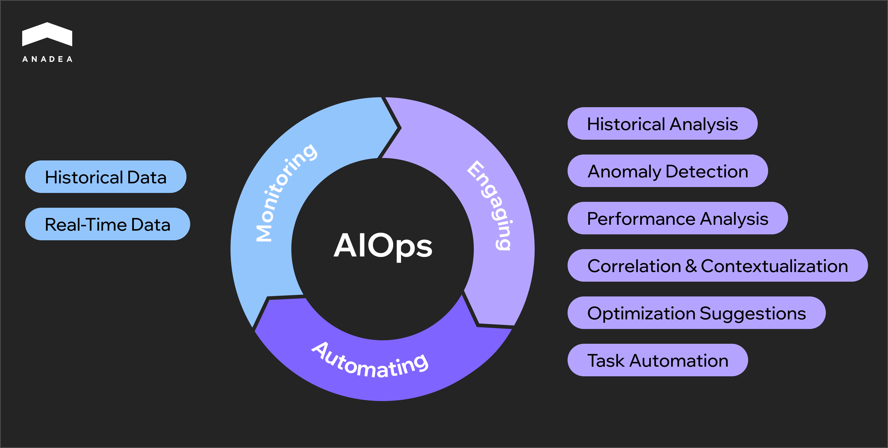
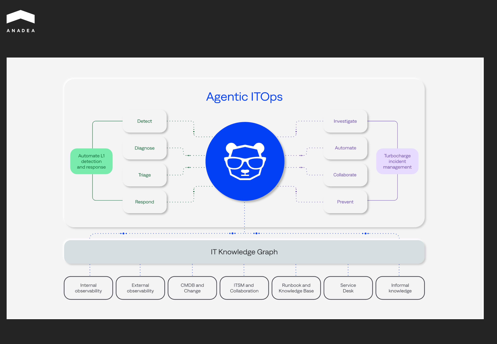
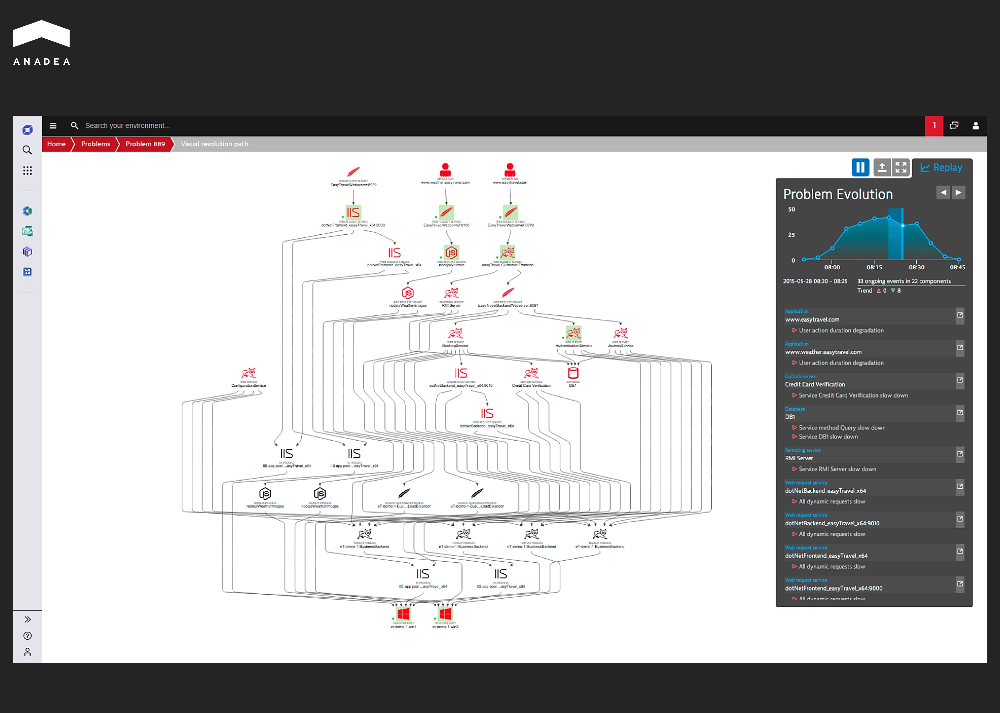

Over the past decade, the [DevOps methodology](https://anadea.info/guides/why-devops-is-vital-for-saas) has fully revolutionized how companies build, test, and deploy digital solutions. The correct implementation of its principles ensures much faster delivery cycles, greater collaboration between teams, and more reliable software releases. That’s exactly what modern businesses are striving for. With all the benefits that DevOps approaches bring, it is quite natural that the global DevOps market is quickly expanding. From $13.16 billion in 2024, its size is expected to hit the mark of over [$81 billion](https://www.imarcgroup.com/devops-market) by 2033. These numbers reflect a CAGR of 19.95% for the period from 2025 to 2033.

The tech world is highly dynamic. With cloud-native architectures, microservices, and multi-cloud environments, systems are becoming more and more complex. Amid such shifts, traditional DevOps tooling and methods are losing their positions. Instead of addressing operational challenges, they introduce extra risks and bottlenecks. All this has led to the introduction of such paradigms as AIOps, GitOps, and NoOps that are currently gaining traction. 

In this article, we are going to talk about the future of [DevOps](https://anadea.info/services/server-administration-and-maintenance) and explain how new DevOps trends are changing the software development space today.

## AIOps: How AI and ML Can Power IT Operations

AIOps is also known as artificial intelligence for IT operations. This concept presupposes using AI capabilities, including ML and NLP models, to optimize and automate IT operational workflows.

AIOps processes data and delivers intelligent automation and insights in the following way:

* AIOps collects and analyzes both historical and real-time data from various IT systems. This phase is foundational for anomaly detection and trend recognition.
* It relies on AI and ML capabilities to automate various tasks (like incident remediation or system optimization).
* It also focuses on seamless interaction with IT teams and analytical tools to provide contextual insights and recommended actions to enhance decision-making and system performance.

### DevOps vs. AIOps

DevOps and AIOps are both intended to improve IT operations. However, they focus on different areas. **DevOps** principles are mainly concentrated on increasing the efficiency of the software development process. At the same time, **AIOps** relies on emerging technologies to enhance the performance of IT environments. It means that **both methodologies complement each other** and can be efficiently combined in a comprehensive approach to software lifecycle management.

### Key AIOps Functions

* **Anomaly detection and failure prediction.** [AI tools](https://anadea.info/services/ai-software-development) are highly helpful for finding unusual patterns and predicting potential system failures before users notice their impact.
* **Automated incident resolution.** AIOps platforms can automatically address and resolve incidents of certain severity, providing AI-driven insights.
* **Performance optimization.** Such tools can continuously analyze system performance. The collected data can be applied to optimize resource utilization and increase the efficiency of system functioning.
* **Root cause analysis.** AI models can pinpoint the underlying causes of technical issues, ensuring faster remediation.

### Why Implement AIOps: Main Benefits

* **Higher operational efficiency.** AIOps plays a vital role in automating routine tasks, which enables IT teams to focus more on strategic tasks.
* **Minimized business disruptions.** Thanks to accurate predictions, teams can proactively prevent potential issues, thus improving operational resilience.
* **Faster and more efficient decision-making.** Artificial intelligence provides real-time insights that are essential for informed and timely decisions.
* **Reduced mean time to repair (MTTR).** The use of advanced ML models significantly speeds up incident detection and issue troubleshooting.
* **Scalability.** AIOps platforms can successfully manage ever-growing IT complexities and data volumes.

### Examples of AIOps Platforms and Their Capabilities

With the skyrocketing popularity of this approach, the number of AIOps tools is growing as well. Here are a couple of the most popular platforms today.

#### BigPanda

This AIOps platform helps teams accumulate and process the events collected from different tools. It relies on artificial intelligence to identify incidents in real time and transform the collected data into actionable insights.

Among the features provided by this platform, we should mention:

* Incident progression visualization, 
* Root cause analysis, 
* Identification of changes in infrastructure and services.

#### Dynatrace

It provides automatic observability for enterprise systems and cloud-native workloads. Dynatrace can analyze app data, monitor infrastructure performance, and detect underperforming functions.

The list of its key features includes but is not limited to:

Autonomous performance management, 

Full-stack observability, 

Issue identification, 

Automated remediation.

GitOps: How It Works

GitOps is an approach to managing infrastructure and app configurations by relying on the distributed version control system Git as the single source of truth. As all configuration files and source code are stored in Git repositories, this method helps teams track and work with all changes to the desired state of the system.

GitOps workflows are designed as follows:

All the code files are stored and managed in Git.

When a change is made to the codebase, this triggers an automated CI/CD pipeline.

The CI/CD loop performs a series of predefined tasks (building, testing, and deploying).

These tasks update the runtime environment to reflect the latest state stored in Git.
