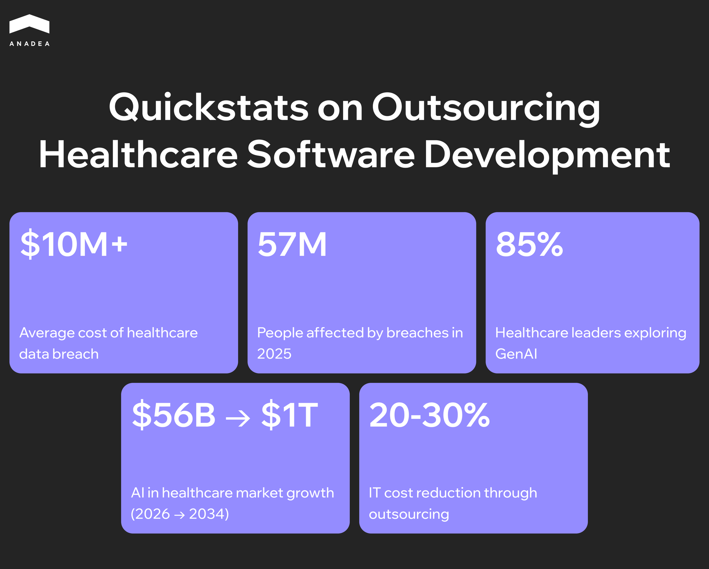
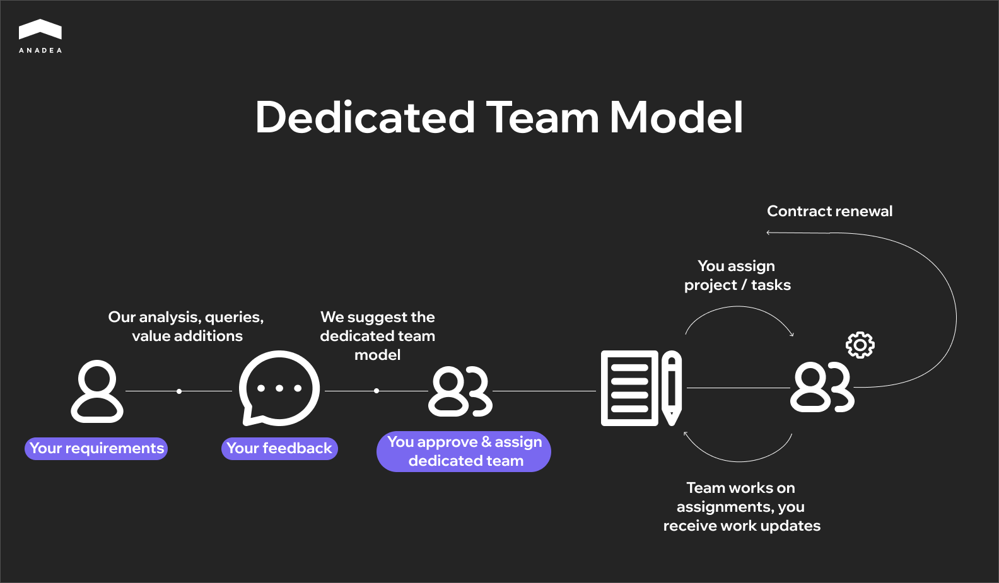

Decades ago, outsourcing began as a simple way to cut operational costs. Today, it has transformed into a high-stakes strategic partnership. Healthcare organizations cooperate with external teams to get the ability to innovate at a high pace required by the modern market. It is not enough to have a functional app. Solutions must now integrate sophisticated AI-powered functionality and adhere to the latest security and interoperability standards. Most in-house teams lack the specialized expertise to address these needs. 

In this article, we will talk about the value of [healthcare software development](https://anadea.info/solutions/healthcare-software-development) outsourcing and share practical tips on how to find a partner that will protect you from regulatory and security risks.

## Why Companies Outsource Healthcare Software Development

Outsourcing has evolved into a strategic necessity for hospitals and healthtech startups amid increased digital demands.

Here's why healthcare organizations partner with external development teams.

### Cost Optimization 

When building an in-house engineering team, consider recruitment fees, salaries, benefits, and infrastructure. In outsourcing, these fixed costs become variables and allow for more flexible budgeting.

The study by Market Research Future indicates that thanks to IT outsourcing, healthcare organizations can reduce IT costs by approximately [20% to 30%](https://www.marketresearchfuture.com/reports/healthcare-it-outsourcing-market-42610).

### Faster Time-to-Market for Healthcare Solutions

Outsourcing allows companies to skip the ramp-up period associated with internal hiring. External teams often have well-established agile workflows and ready-to-deploy code libraries. As a result, they can significantly accelerate their development process.

Moreover, a study by Clutch revealed that [37%](https://www.cshark.com/8-reasons-why-you-should-outsource-software-development-in-2023/) of businesses outsource with a view to accessing specialized skills they cannot find locally. Quick access to the required talent also helps to speed up hiring and project implementation.

### Ability to Scale Development Teams

Healthcare software needs are rarely static. They fluctuate based on various factors, such as regulatory deadlines, funding rounds, etc. In-house teams are quite rigid due to slow hiring.

Outsourcing offers on-demand scalability. You can hire a team of 50 developers to meet a HIPAA compliance deadline or launch a new EHR module. Once the task is completed, you can scale down. This elasticity ensures resources are not wasted during downtime.

### Focus on Core Healthcare Operations

Every hour a healthcare executive spends overseeing software delivery is an hour taken away from optimizing care pathways and operational efficiency. Delegating technical execution lets leadership focus on the core tasks, like improving population health and enhancing the patient experience.

### Access to Modern Technologies 

The complexity of modern tech stacks (especially GenAI and cloud-native infrastructure) often exceeds the capabilities of in-house IT teams. To stay competitive,[ healthcare software outsourcing partners](https://anadea.info/blog/top-healthcare-software-development-companies/) invest in mastering these niche technologies.

According to the [Q4 2024 survey](https://www.techtarget.com/healthtechanalytics/news/366622076/Survey-Gen-AI-in-healthcare-gains-momentum-across-sectors), 85% of healthcare leaders were exploring or intending to explore the capabilities of GenAI. Outsourcing provides access to experts who know how to implement these AI models safely.

## Outsourcing Models in Healthcare Software Development

There are several models of software development outsourcing. Each of them has its own specifics and can effectively address different business needs. A model that works for a short-term telehealth prototype will likely fail for a multi-year EHR migration.

Let’s consider the frameworks used in healthcare IT and analyze the cases when to deploy each.

### Dedicated Development Teams

In this model, the vendor builds a team that works exclusively on your project full-time. These developers become a remote extension of your internal staff. They attend your daily stand-ups and use your tools. But they remain on the vendor's payroll.

Best for: 

* Long-term product development;
* continuous maintenance of legacy systems;
* projects when organizations want to retain technical leadership while scaling execution.

### Staff Augmentation

You hire specialists from a vendor to temporarily join your existing in-house team. You manage them directly. This model offers maximum speed and flexibility. Best for: 

* Handling temporary spikes in workload;
* filling specific skill gaps;
* projects where you have strong internal project management and just need extra hands.

### End-to-End Project Outsourcing

This is the most hands-off model. You need to provide the specifications and business goals. And the vendor takes full responsibility for the execution (development, testing, and delivery).

Best for: 

* MVPs;
* non-core projects (for instance, a hospital marketing website);
* healthcare companies that lack internal engineering resources and tech capabilities.

### Onshore, Nearshore, Offshore, and Hybrid Models

How you hire is only one of the decisions you should make. You also need to decide where to hire.

* **Onshore** (same country). It ensures minimal compliance friction. The vendor operates under the same legal framework and speaks the same clinical and business language.
* **Nearshore** (same or similar time zone). This approach ensures real-time collaboration. You can have Slack conversations and video calls during regular business hours. It is critical for Agile development.
* **Offshore** (distant time zone). This is a "follow-the-sun" model. It allows you to organize 24-hour development. Your in-house team can hand off code at 5 PM to an offshore team that works while you sleep. This approach can potentially double development speed and help you reduce costs, as offshore developers often have lower rates.
* **Hybrid**. This model offers a mix where key roles (product managers, lead architects) are onshore or nearshore for communication, while execution teams (QA, coding) are offshore for cost efficiency.

## Key Risks in Healthcare Software Development Outsourcing and Ways to Address Them

The healthcare sector faces unique issues that are not typical for non-domain-specific software projects. Even a single vulnerability can lead to negative consequences.

### Regulatory Compliance and Data Privacy Requirements

Violations of regulations like HIPAA can be financially devastating. Fines can range from [$145 to $73,011](https://www.hipaajournal.com/hipaa-violation-fines/) per violation. The annual penalty cap is $2,190,294.

If your vendor is in a different region, you may need to manage conflicting data sovereignty laws. Data residency requirements may strictly prohibit patient data from leaving the country of origin. This forces complex hybrid-cloud architectures.

### Security and Data Protection

Medical records fetch a higher price on the black market than credit card numbers. Given this, healthcare is a common target for cybercriminals. According to the data published by [The HIPAA Journal](https://www.hipaajournal.com/largest-healthcare-data-breaches-of-2025/), nearly 57 million people became victims of healthcare data breaches in 2025. 

Outsourcing introduces third-party risk. If your vendor has weak security practices, their breach can affect the security of your systems.

### Coordination Challenges

In healthcare software, miscommunication can be dangerous. The gap between clinical terminology and engineering logic is serious. In addition, language barriers and time zone differences can widen it further.

While 24/7 development cycles can be viewed as a benefit, they can result in delayed feedback loops. If a critical bug is found in a patient monitoring app during US business hours, a 12-hour wait for an offshore fix can be unacceptable.

### Quality Assurance and Long-Term Maintainability

Vendors do their best to meet a launch deadline. As a result, they may pay less attention to documentation or code structure. Such situations create technical debt.

If a vendor doesn’t deliver comprehensive documentation, your healthcare organization becomes dependent on the vendor for all future updates.

### Ways to Manage Outsourcing Healthcare Software Development Risks

Mitigating these risks requires well-defined vendor management practices.

1. Sign a business associate agreement (BAA). This legally binds them to the same liability standards as your internal team regarding data protection.
2. Implement a least privilege access model. Do not give vendors access to live patient data. Use synthetic data instead. Production access should be strictly monitored.
3. Request security certifications. Your vendor must adhere to frameworks like ISO 27001 or SOC 2 Type II.
4. Introduce third-party audits. Independent penetration testing and code reviews will help verify that security protocols are being followed.

## Healthcare Software Development Outsourcing Trends in 2026

In 2026, the focus of software development in healthcare is on solving complex clinical and operational problems with the latest tech stacks.

### Trend 1. AI and Data-Driven Solutions

The global AI in healthcare market is projected to reach $56.01 billion in 2026 and to grow to [$1,033.27 billion](https://www.fortunebusinessinsights.com/industry-reports/artificial-intelligence-in-healthcare-market-100534) by 2034,

Providers are outsourcing the [development of AI software](https://anadea.info/blog/ai-driven-software-development-guide/) that can automate clinical documentation. Studies show that AI-driven documentation can save clinicians [20% to 30%](https://pmc.ncbi.nlm.nih.gov/articles/PMC12460601/) of their time.

Additionally, healthcare organizations can implement predictive models for patient risk profiling. This helps them move their processes from reactive to proactive care management.

### Trend 2. Focus on Interoperability and Standards

Today, regulatory requirements place system interoperability among the top priorities for healthcare providers.

Adherence to the [FHIR](https://ecqi.healthit.gov/fhir/about) standard has become a must. Outsourcing teams need to build APIs that comply with new rules related to patient access and prior authorization.

### Trend 3. Emphasis on Cybersecurity

According to the [IBM data](https://www.ibm.com/think/insights/cost-of-a-data-breach-healthcare-industry), the average cost of a healthcare data breach has climbed to over $10 million, which is the highest of any industry.

Outsourcing contracts now often require zero trust security models, which means no user or system is trusted by default. Vendors are expected to provide continuous security monitoring and automated threat detection as part of their service package.



## How to Choose the Right Partner to Outsource Healthcare Software Development

Selecting a healthcare software partner is often much more consequential than hiring a generic web development agency. If a generic agency’s code fails, a website goes down. If a healthcare partner’s code fails, patient data can be exposed, or clinical decisions can be compromised.

Here are the key steps that will help you make the correct choice.

### Step 1. Define Your Must-Haves and Nice-to-Haves

Before you interview vendors, clarify your internal needs. This will help you avoid paying for extra services.

Identify your must-haves: 

* Regulatory compliance (HIPAA, GDPR);
* interoperability standards (FHIR); 
* security expectations;
* critical workflows.

These are the foundations your solution can’t function without.

Next, outline features that add value but are not essential for launch. Examples might include:

* Advanced analytics;
* AI-powered recommendations;
* specific UI enhancements. 

### Step 2. Prepare a Healthcare Vendor Vetting Checklist

Use this checklist during your Request for Proposal process to filter out unqualified candidates.

* **Willingness to sign a BAA.** Will they sign a Business Associate Agreement before seeing any data? If they hesitate, there is no point in continuing to consider them.
* **Certifications.** Do they hold ISO 27001 (information security) or ISO 13485 (medical device quality) certifications?
* **Data residency.** Can they guarantee that patient data will never leave your required legal jurisdiction?
* **Interoperability.** Do they have proven experience with HL7 V2, FHIR, and DICOM standards? Ask to see a case study of a past integration.
* **QA maturity.** Do they use automated testing for regression? 
* **Transparency tools.** Will you have direct access to their Jira/Trello boards and daily stand-ups?
* **Talent retention.** What is their employee attrition rate? High turnover is risky for long-term healthcare projects.

### Step 3. Check for  Red Flags

If you detect any of these alarming signs during the interview process, it’s better to walk away.

<table>

<tbody>

<tr>

<td>

<strong>Red Flag</strong>

</td>

<td>

<strong>Why It Is Dangerous for Your Project</strong>

</td>

</tr>

<tr>

<td>

Yes approach

</td>

<td>

If a vendor agrees to every feature without mentioning regulatory hurdles or clinical safety, they don't understand the complexity of the industry.

</td>

</tr>

<tr>

<td>

No reference checks

</td>

<td>

Refusal to let you speak to their healthcare clients usually means they have a history of failed implementations or data mishandling.

</td>

</tr>

<tr>

<td>

Too low rates (under $30/hour)

</td>

<td>

Quality healthcare engineering requires senior talent. Low rates often mean junior spaghetti code and massive technical debt.

</td>

</tr>

<tr>

<td>

Data export trap

</td>

<td>

Vague contract language regarding data portability can lead to vendor lock-in. In this case, you may be charged enormous fees to access your own patient records.

</td>

</tr>

<tr>

<td>

No clinical context

</td>

<td>

A vendor focused only on UI/UX ignores clinician workflows. This leads to alert fatigue and high provider burnout.

</td>

</tr>

<tr>

<td>

AI washing

</td>

<td>

Promoting AI without clear policies for governance and bias control can significantly increase medical malpractice liability.

</td>

</tr>

</tbody>

</table>

## Final Word

Outsourcing is a strategic necessity for many healthcare organizations. Thanks to partnering with external experts, they can bypass the local talent shortage and access specialized skills in the global markets.

However, the success of such projects significantly depends on selecting a partner who prioritizes compliance and interoperability. A partnership with the right development company drives innovation. When technical execution is handled by a trusted team, healthcare leaders are empowered to refocus on something that truly matters. And in healthcare, it is improving patient outcomes.

At Anadea, we have provided software development services since 2000. And healthcare is one of the domains where our team has the strongest expertise. We help healthcare providers and startups to shift from legacy systems to cutting-edge digital solutions. [Contact us](https://anadea.info/contacts) to discuss how we can support your business growth.
